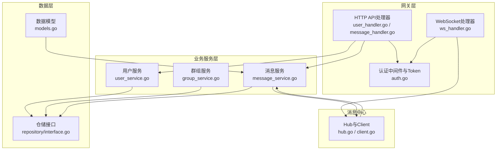
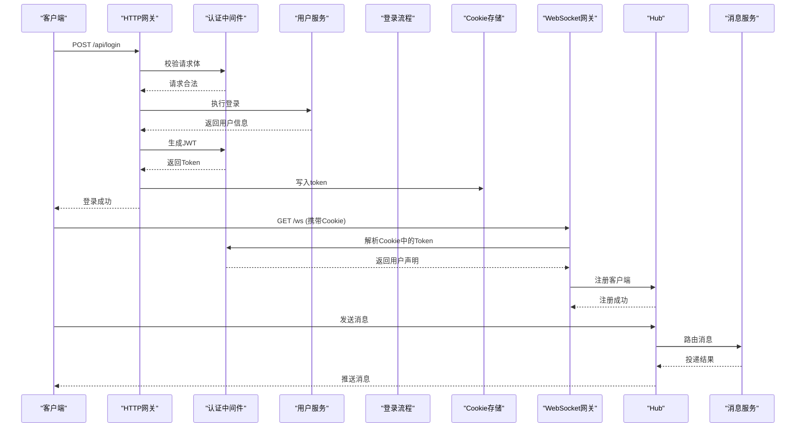
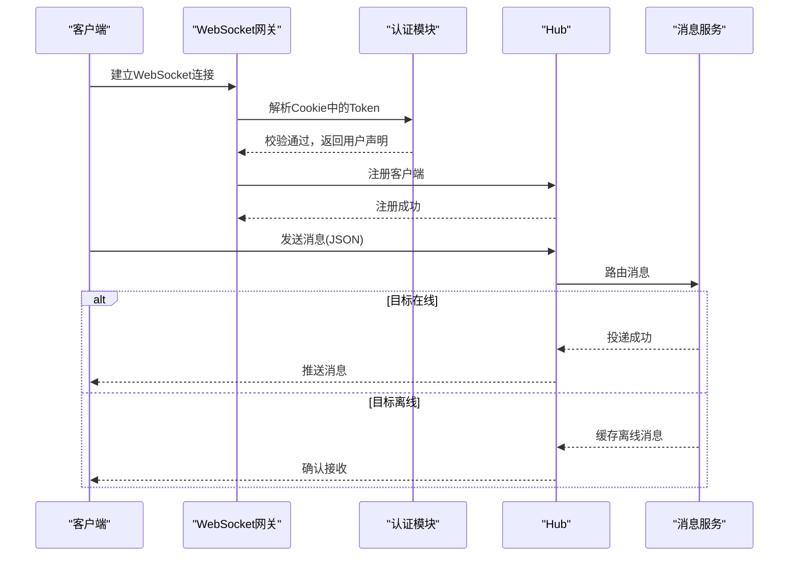
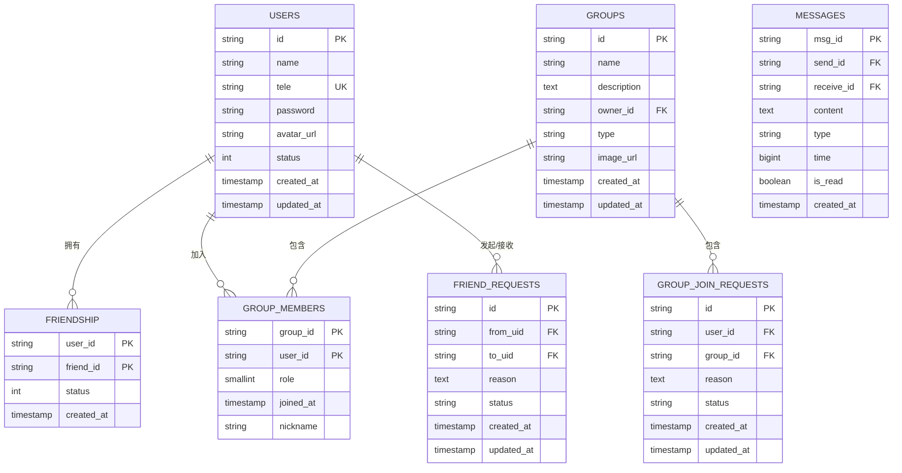
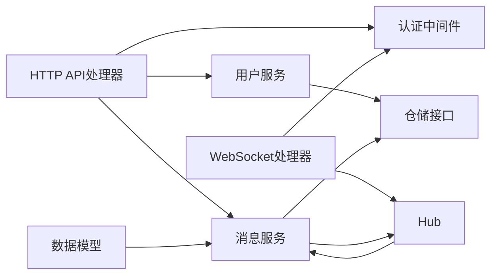

# API接口文档

<cite>
**本文档引用的文件**
- [server/gateway/api/user_handler.go](file://server/gateway/api/user_handler.go)
- [server/gateway/api/message_handler.go](file://server/gateway/api/message_handler.go)
- [server/gateway/api/ws_handler.go](file://server/gateway/api/ws_handler.go)
- [server/gateway/auth/auth.go](file://server/gateway/auth/auth.go)
- [server/model/models.go](file://server/model/models.go)
- [server/msgservice/message_service.go](file://server/msgservice/message_service.go)
- [server/msgservice/hub/hub.go](file://server/msgservice/hub/hub.go)
- [server/msgservice/hub/client.go](file://server/msgservice/hub/client.go)
- [server/userservice/user_service.go](file://server/userservice/user_service.go)
- [server/userservice/group_service.go](file://server/userservice/group_service.go)
- [server/repository/interface.go](file://server/repository/interface.go)
- [go.mod](file://go.mod)
</cite>

## 目录
1. [简介](#简介)
2. [项目结构](#项目结构)
3. [核心组件](#核心组件)
4. [架构总览](#架构总览)
5. [详细组件分析](#详细组件分析)
6. [依赖关系分析](#依赖关系分析)
7. [性能考虑](#性能考虑)
8. [故障排除指南](#故障排除指南)
9. [结论](#结论)
10. [附录](#附录)

## 简介
本项目是一个基于Go语言的即时通讯系统，采用RESTful API与WebSocket相结合的方式提供用户管理、消息收发、群组管理与在线状态查询能力。本文档面向开发者与测试人员，系统性地梳理了所有API接口（含REST与WebSocket）、认证与授权机制、错误处理策略、安全与性能注意事项，并给出常见使用场景与客户端实现建议。

## 项目结构
- 后端服务以网关层（gateway）对外暴露HTTP与WebSocket接口，内部通过业务服务层（userservice、msgservice）协调数据访问与消息路由。
- 数据模型定义在model包中，仓储接口在repository包中，便于替换具体存储实现。
- WebSocket连接由网关层升级，消息通过消息服务进行路由与离线缓存。

图表来源
- [server/gateway/api/user_handler.go:1-206](file://server/gateway/api/user_handler.go#L1-L206)
- [server/gateway/api/message_handler.go:1-66](file://server/gateway/api/message_handler.go#L1-L66)
- [server/gateway/api/ws_handler.go:1-69](file://server/gateway/api/ws_handler.go#L1-L69)
- [server/gateway/auth/auth.go:1-91](file://server/gateway/auth/auth.go#L1-L91)
- [server/msgservice/message_service.go:1-168](file://server/msgservice/message_service.go#L1-L168)
- [server/msgservice/hub/hub.go:1-61](file://server/msgservice/hub/hub.go#L1-L61)
- [server/msgservice/hub/client.go:1-88](file://server/msgservice/hub/client.go#L1-L88)
- [server/model/models.go:1-146](file://server/model/models.go#L1-L146)
- [server/repository/interface.go:1-74](file://server/repository/interface.go#L1-L74)

章节来源
- [server/gateway/api/user_handler.go:1-206](file://server/gateway/api/user_handler.go#L1-L206)
- [server/gateway/api/message_handler.go:1-66](file://server/gateway/api/message_handler.go#L1-L66)
- [server/gateway/api/ws_handler.go:1-69](file://server/gateway/api/ws_handler.go#L1-L69)
- [server/gateway/auth/auth.go:1-91](file://server/gateway/auth/auth.go#L1-L91)
- [server/msgservice/message_service.go:1-168](file://server/msgservice/message_service.go#L1-L168)
- [server/msgservice/hub/hub.go:1-61](file://server/msgservice/hub/hub.go#L1-L61)
- [server/msgservice/hub/client.go:1-88](file://server/msgservice/hub/client.go#L1-L88)
- [server/model/models.go:1-146](file://server/model/models.go#L1-L146)
- [server/repository/interface.go:1-74](file://server/repository/interface.go#L1-L74)

## 核心组件
- 认证与授权：基于JWT的Bearer Token认证，支持中间件注入用户上下文；登录成功后通过Cookie下发Token供WebSocket使用。
- 用户服务：负责用户注册、登录、好友关系与请求管理。
- 群组服务：负责群组创建、成员管理与入群请求处理。
- 消息服务：负责消息路由（私聊/群聊）、在线投递、离线缓存与已读标记。
- WebSocket Hub：维护在线客户端集合，负责消息广播与心跳保活。

章节来源
- [server/gateway/auth/auth.go:1-91](file://server/gateway/auth/auth.go#L1-L91)
- [server/userservice/user_service.go:1-187](file://server/userservice/user_service.go#L1-L187)
- [server/userservice/group_service.go:1-217](file://server/userservice/group_service.go#L1-L217)
- [server/msgservice/message_service.go:1-168](file://server/msgservice/message_service.go#L1-L168)
- [server/msgservice/hub/hub.go:1-61](file://server/msgservice/hub/hub.go#L1-L61)
- [server/msgservice/hub/client.go:1-88](file://server/msgservice/hub/client.go#L1-L88)

## 架构总览
下图展示了从HTTP到WebSocket的完整调用链路与消息流转：

图表来源
- [server/gateway/api/user_handler.go:39-61](file://server/gateway/api/user_handler.go#L39-L61)
- [server/gateway/api/ws_handler.go:39-68](file://server/gateway/api/ws_handler.go#L39-L68)
- [server/gateway/auth/auth.go:22-61](file://server/gateway/auth/auth.go#L22-L61)
- [server/msgservice/hub/hub.go:44-51](file://server/msgservice/hub/hub.go#L44-L51)
- [server/msgservice/message_service.go:27-44](file://server/msgservice/message_service.go#L27-L44)

## 详细组件分析

### REST API接口清单

- 基础路径
  - HTTP基础路径：/api
  - WebSocket路径：/ws

- 认证方式
  - REST：Authorization: Bearer <token>
  - WebSocket：Cookie: token=<token>

- 错误码约定
  - 400：请求参数错误或业务校验失败
  - 401：未授权或Token无效
  - 500：服务器内部错误

- 公共响应字段
  - 成功：返回业务相关字段
  - 失败：返回{"error": "<message>"}

#### 用户相关接口

- 注册
  - 方法与路径：POST /api/register
  - 请求头：Content-Type: application/json
  - 请求体字段：
    - tele: string, 必填
    - name: string, 必填
    - password: string, 必填
  - 成功响应：{"message": "<用户名>"}
  - 失败响应：{"error": "<错误信息>"}

- 登录
  - 方法与路径：POST /api/login
  - 请求头：Content-Type: application/json
  - 请求体字段：
    - tele: string, 必填
    - password: string, 必填
  - 成功响应：{"message": "login success", "name": "<用户名>"}
  - 失败响应：{"error": "<错误信息>"}
  - 安全提示：登录成功后服务端设置Cookie: token，用于后续WebSocket连接

- 获取好友列表
  - 方法与路径：GET /api/friends
  - 认证：Bearer Token
  - 成功响应：{"friends": [<用户对象列表>]}

- 添加好友
  - 方法与路径：POST /api/friends/add
  - 认证：Bearer Token
  - 请求体字段：
    - target_id: string, 必填
    - reason: string, 可选
  - 成功响应：{"message": "success"}

- 删除好友
  - 方法与路径：POST /api/friends/remove
  - 认证：Bearer Token
  - 请求体字段：
    - target_id: string, 必填
  - 成功响应：{"message": "success"}

- 回复好友申请
  - 方法与路径：POST /api/friends/reply
  - 认证：Bearer Token
  - 请求体字段：
    - target_id: string, 必填
    - reply: string, "agree" 或其他值
  - 成功响应：{"message": "success"}

- 创建群组
  - 方法与路径：POST /api/groups/create
  - 认证：Bearer Token
  - 请求体字段：
    - name: string, 必填
    - description: string, 可选
  - 成功响应：{"group_id": "<群组ID>", "group_name": "<群组名>"}

- 加入群组
  - 方法与路径：POST /api/groups/join
  - 认证：Bearer Token
  - 请求体字段：
    - group_id: string, 必填
    - reason: string, 可选
  - 成功响应：{"message": "already post"}

- 退出群组
  - 方法与路径：POST /api/groups/leave
  - 认证：Bearer Token
  - 请求体字段：
    - group_id: string, 必填
  - 成功响应：{"message": "already leave"}

- 群组申请回复
  - 方法与路径：POST /api/groups/reply
  - 认证：Bearer Token
  - 请求体字段：
    - group_id: string, 必填
    - reply: string, "agree" 或其他值
  - 成功响应：{"message": "already post"}

章节来源
- [server/gateway/api/user_handler.go:21-206](file://server/gateway/api/user_handler.go#L21-L206)
- [server/gateway/auth/auth.go:37-61](file://server/gateway/auth/auth.go#L37-L61)

#### 消息相关接口

- 发送消息
  - 方法与路径：POST /api/messages/send
  - 认证：Bearer Token
  - 请求体字段：
    - receive_id: string, 必填
    - content: string, 必填
    - type: string, "private" 或 "group", 必填
    - time: number, 时间戳（毫秒），可选
  - 成功响应：{"message": "sent"}
  - 失败响应：{"error": "<错误信息>"}

- 获取离线消息
  - 方法与路径：GET /api/messages/offline
  - 认证：Bearer Token
  - 成功响应：{"messages": [<消息对象列表>]}

- 查询在线状态
  - 方法与路径：GET /api/messages/online
  - 认证：Bearer Token
  - 成功响应：{"online": ["<好友ID列表>"]}

章节来源
- [server/gateway/api/message_handler.go:19-65](file://server/gateway/api/message_handler.go#L19-L65)
- [server/msgservice/message_service.go:128-167](file://server/msgservice/message_service.go#L128-L167)

#### WebSocket接口

- 连接建立
  - 路径：GET /ws
  - 认证：Cookie: token=<JWT>
  - 升级规则：仅允许特定来源（开发环境默认允许 http://localhost:8080）
  - 成功后：服务端将用户ID与用户名注入上下文，注册到Hub

- 消息格式
  - 客户端发送：JSON对象，至少包含以下字段
    - receive_id: string, 接收方ID（私聊为用户ID，群聊为群组ID）
    - content: string, 消息内容
    - type: string, "private" 或 "group"
    - time: number, 时间戳（毫秒），可选
  - 服务端推送：与上述结构一致的消息对象

- 事件类型与实时交互
  - 事件类型：消息事件（发送/接收）
  - 交互模式：客户端连接后持续接收服务端推送；客户端可向Hub发送消息，由消息服务路由至目标用户或群组成员

- 心跳与保活
  - 服务端每55秒发送一次Ping，客户端需在60秒内响应Pong
  - 超时将被断开连接

- 断线重连
  - 建议客户端在断线后携带最新时间戳或游标，配合离线消息接口补齐历史

图表来源
- [server/gateway/api/ws_handler.go:39-68](file://server/gateway/api/ws_handler.go#L39-L68)
- [server/gateway/auth/auth.go:64-90](file://server/gateway/auth/auth.go#L64-L90)
- [server/msgservice/hub/hub.go:44-51](file://server/msgservice/hub/hub.go#L44-L51)
- [server/msgservice/message_service.go:27-108](file://server/msgservice/message_service.go#L27-L108)

章节来源
- [server/gateway/api/ws_handler.go:1-69](file://server/gateway/api/ws_handler.go#L1-L69)
- [server/msgservice/hub/client.go:27-87](file://server/msgservice/hub/client.go#L27-L87)

### 数据模型与仓储接口

- 数据模型
  - 用户：包含ID、电话、密码、昵称、头像、状态等
  - 好友关系：多对多关联，支持状态（如拉黑）
  - 群组：包含ID、名称、描述、所有者、类型、图片等
  - 群成员：多对多关联，包含角色（普通成员/管理员/群主）
  - 好友申请、群组入群申请：包含发起方、接收方、原因、状态
  - 消息：包含发送方、接收方、内容、类型、时间、是否已读

- 仓储接口
  - 用户、好友关系、群组、群成员、消息、各类申请的增删改查与统计接口

图表来源
- [server/model/models.go:23-146](file://server/model/models.go#L23-L146)
- [server/repository/interface.go:8-74](file://server/repository/interface.go#L8-L74)

章节来源
- [server/model/models.go:1-146](file://server/model/models.go#L1-L146)
- [server/repository/interface.go:1-74](file://server/repository/interface.go#L1-L74)

## 依赖关系分析

图表来源
- [server/gateway/api/user_handler.go:1-206](file://server/gateway/api/user_handler.go#L1-L206)
- [server/gateway/api/message_handler.go:1-66](file://server/gateway/api/message_handler.go#L1-L66)
- [server/gateway/api/ws_handler.go:1-69](file://server/gateway/api/ws_handler.go#L1-L69)
- [server/gateway/auth/auth.go:1-91](file://server/gateway/auth/auth.go#L1-L91)
- [server/msgservice/message_service.go:1-168](file://server/msgservice/message_service.go#L1-L168)
- [server/msgservice/hub/hub.go:1-61](file://server/msgservice/hub/hub.go#L1-L61)
- [server/model/models.go:1-146](file://server/model/models.go#L1-L146)
- [server/repository/interface.go:1-74](file://server/repository/interface.go#L1-L74)

章节来源
- [go.mod:5-12](file://go.mod#L5-L12)

## 性能考虑
- 消息投递
  - 在线用户直接通过Hub通道投递，避免网络延迟；离线用户统一写入消息仓库，降低瞬时压力。
- 缓冲区大小
  - Hub与Client均设置通道容量（默认256），建议根据并发量调整。
- 心跳与保活
  - Ping/Pong周期与超时阈值已内置，建议保持默认值以平衡资源占用与稳定性。
- 并发控制
  - Hub内部使用读写锁保护客户端映射，减少锁竞争。
- 存储与索引
  - 模型中对常用查询字段建立索引（如消息的发送方/接收方、时间等），提升查询效率。
- 限流与熔断
  - 当前未实现全局限流，建议在网关层引入令牌桶或漏桶算法，按IP/用户维度限速。

[本节为通用性能建议，不涉及具体文件分析]

## 故障排除指南
- 认证失败
  - REST：检查Authorization头格式是否为Bearer Token且未过期。
  - WebSocket：确认Cookie中token存在且有效。
- 消息发送失败
  - 私聊需满足好友关系；群聊需为群成员。
  - 检查消息类型与必填字段是否正确。
- 离线消息未拉取
  - 使用离线消息接口拉取；注意服务端会将消息标记为已读。
- 连接被拒绝
  - 检查WebSocket来源域名是否在白名单中（开发环境默认允许本地地址）。
- 心跳异常
  - 确保客户端及时响应Pong；网络波动可能导致断开，建议实现指数退避重连。

章节来源
- [server/gateway/auth/auth.go:37-90](file://server/gateway/auth/auth.go#L37-L90)
- [server/msgservice/message_service.go:27-108](file://server/msgservice/message_service.go#L27-L108)
- [server/gateway/api/ws_handler.go:14-28](file://server/gateway/api/ws_handler.go#L14-L28)
- [server/msgservice/hub/client.go:20-25](file://server/msgservice/hub/client.go#L20-L25)

## 结论
本项目提供了完善的REST与WebSocket接口，结合JWT认证、Hub消息路由与离线缓存机制，能够支撑私聊、群聊与在线状态查询等核心功能。建议在生产环境中补充限流、熔断与可观测性方案，并完善错误码与日志体系以提升可维护性。

[本节为总结性内容，不涉及具体文件分析]

## 附录

### 版本管理与向后兼容
- 当前未见显式的API版本号（如/v1），建议在路径中增加版本前缀（如/api/v1），以便未来演进。
- 新增字段建议保持可选，避免破坏现有客户端。

[本节为通用建议，不涉及具体文件分析]

### 常见使用场景
- 用户注册与登录后，先调用离线消息接口补齐历史，再建立WebSocket连接接收实时消息。
- 发送私聊消息前确保双方为好友；发送群聊消息前确保为群成员。
- 群主批量处理入群申请，同意后自动成为成员。

[本节为通用场景说明，不涉及具体文件分析]

### 客户端实现要点
- 认证：登录成功后保存Cookie中的token；WebSocket连接时自动携带。
- 消息：发送前校验类型与接收方；接收后更新UI并上报已读。
- 连接：实现断线重连与心跳保活；支持离线消息补拉。

[本节为通用实现建议，不涉及具体文件分析]

### 调试工具与监控
- 调试工具：Postman或curl验证REST接口；websocat或浏览器开发者工具调试WebSocket。
- 监控指标：请求QPS/错误率、消息投递时延、Hub在线人数、离线消息积压量。
- 日志：记录认证失败、消息路由异常、WebSocket读写错误等关键事件。

[本节为通用运维建议，不涉及具体文件分析]