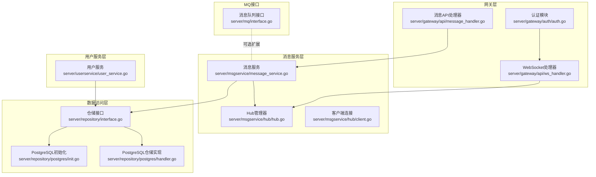
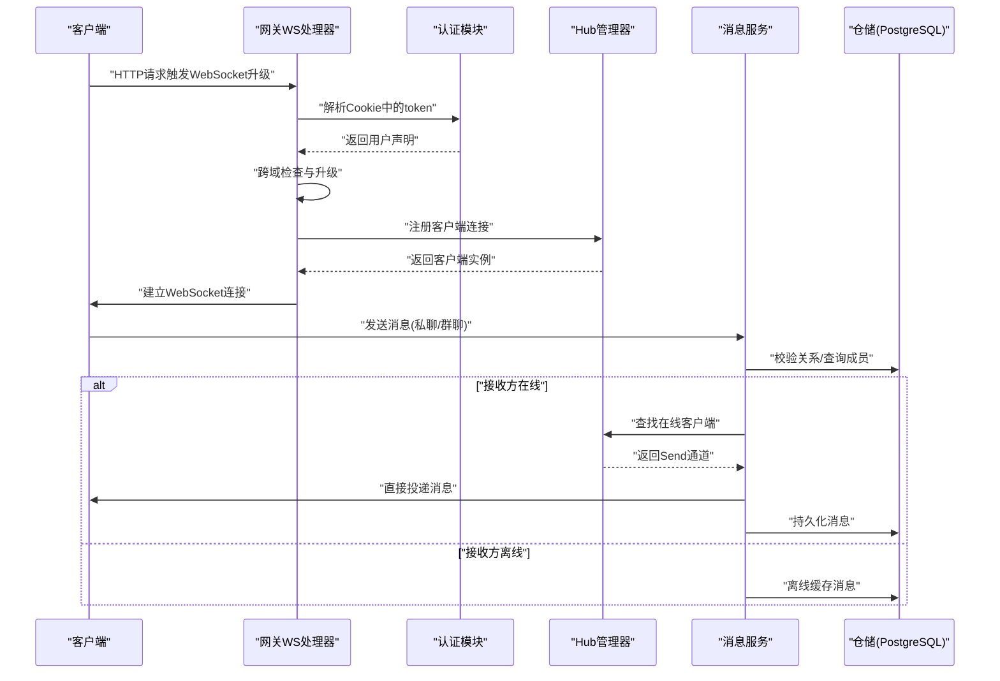
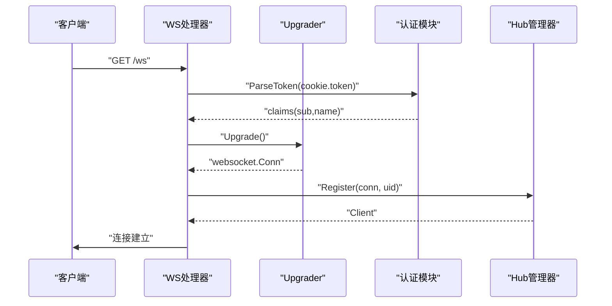
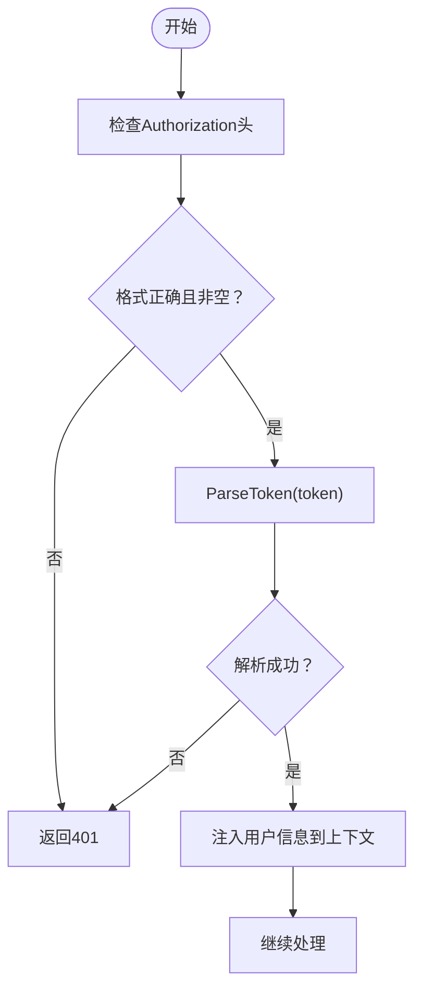
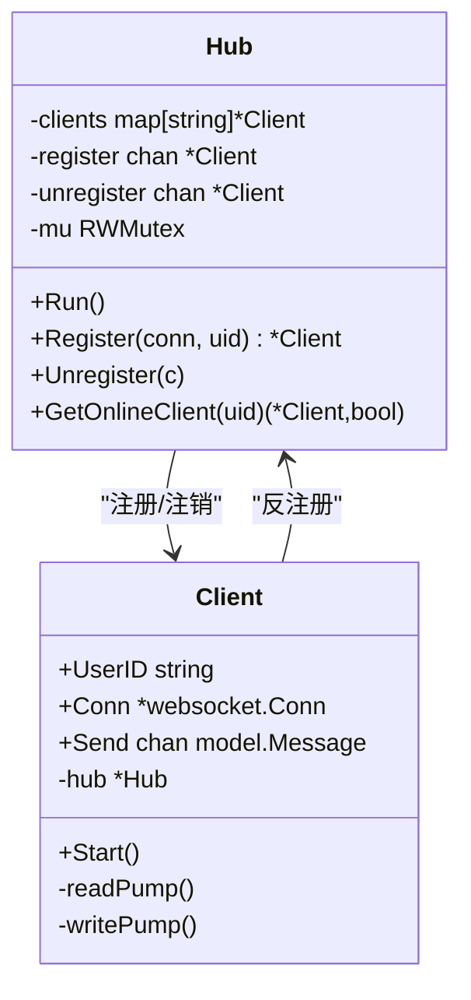
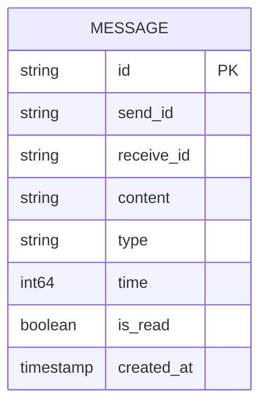
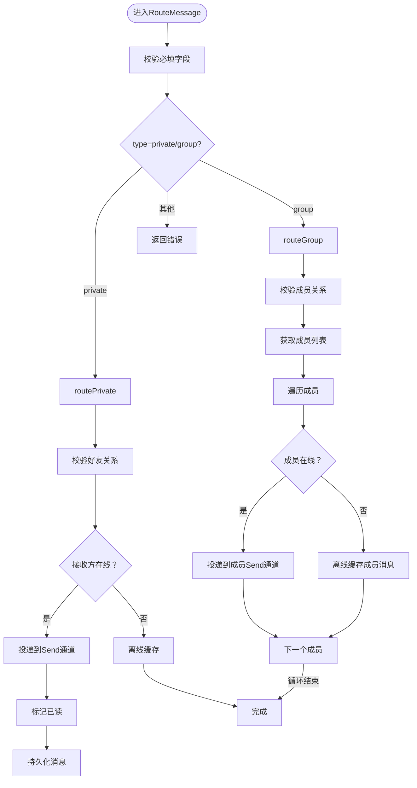
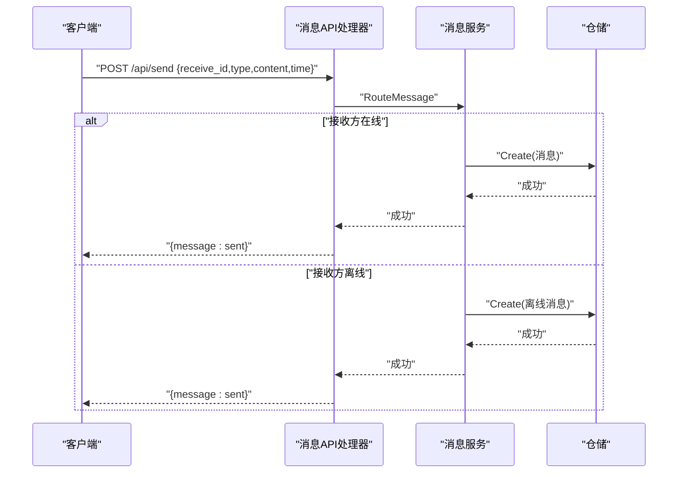
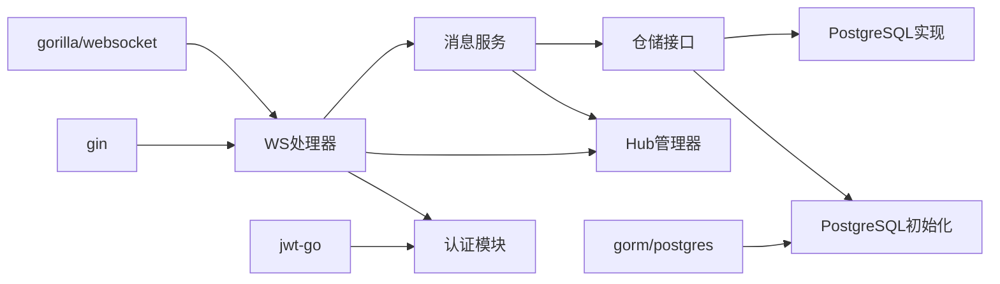

# WebSocket实时通信接口

<cite>
**本文档引用的文件**
- [server/gateway/api/ws_handler.go](file://server/gateway/api/ws_handler.go)
- [server/gateway/api/message_handler.go](file://server/gateway/api/message_handler.go)
- [server/gateway/auth/auth.go](file://server/gateway/auth/auth.go)
- [server/msgservice/hub/hub.go](file://server/msgservice/hub/hub.go)
- [server/msgservice/hub/client.go](file://server/msgservice/hub/client.go)
- [server/msgservice/message_service.go](file://server/msgservice/message_service.go)
- [server/model/models.go](file://server/model/models.go)
- [server/repository/interface.go](file://server/repository/interface.go)
- [server/repository/postgres/init.go](file://server/repository/postgres/init.go)
- [server/repository/postgres/handler.go](file://server/repository/postgres/handler.go)
- [server/userservice/user_service.go](file://server/userservice/user_service.go)
- [server/mq/interface.go](file://server/mq/interface.go)
- [go.mod](file://go.mod)
- [main.txt](file://main.txt)
</cite>

## 目录
1. [简介](#简介)
2. [项目结构](#项目结构)
3. [核心组件](#核心组件)
4. [架构总览](#架构总览)
5. [详细组件分析](#详细组件分析)
6. [依赖关系分析](#依赖关系分析)
7. [性能考虑](#性能考虑)
8. [故障排查指南](#故障排查指南)
9. [结论](#结论)
10. [附录](#附录)

## 简介
本文件面向WebSocket实时通信接口，系统性阐述连接建立、握手协议、认证机制与连接管理；明确消息格式规范（类型、数据结构、字段含义与编码）；说明Hub管理器的消息广播机制、客户端连接状态管理与断线重连策略；给出从连接建立到消息发送与接收确认的完整流程；提供客户端实现要点与最佳实践；涵盖连接池管理、内存优化与并发处理的技术细节；并提供故障排查与性能监控方法。

## 项目结构
该仓库采用分层+领域驱动的组织方式：
- 网关层：HTTP路由与WebSocket升级、认证中间件
- 消息服务层：消息路由、离线缓存、在线状态查询
- Hub层：客户端注册、广播与心跳保活
- 数据访问层：PostgreSQL适配器与仓储接口
- 用户服务层：用户、好友、群组相关业务
- MQ接口：消息队列抽象（可扩展）

**图表来源**
- [server/gateway/api/ws_handler.go:1-69](file://server/gateway/api/ws_handler.go#L1-L69)
- [server/gateway/api/message_handler.go:1-66](file://server/gateway/api/message_handler.go#L1-L66)
- [server/gateway/auth/auth.go:1-91](file://server/gateway/auth/auth.go#L1-L91)
- [server/msgservice/hub/hub.go:1-61](file://server/msgservice/hub/hub.go#L1-L61)
- [server/msgservice/hub/client.go:1-88](file://server/msgservice/hub/client.go#L1-L88)
- [server/msgservice/message_service.go:1-168](file://server/msgservice/message_service.go#L1-L168)
- [server/repository/interface.go:1-74](file://server/repository/interface.go#L1-L74)
- [server/repository/postgres/init.go:1-75](file://server/repository/postgres/init.go#L1-L75)
- [server/repository/postgres/handler.go:1-585](file://server/repository/postgres/handler.go#L1-L585)
- [server/userservice/user_service.go:1-187](file://server/userservice/user_service.go#L1-L187)
- [server/mq/interface.go:1-7](file://server/mq/interface.go#L1-L7)

**章节来源**
- [server/gateway/api/ws_handler.go:1-69](file://server/gateway/api/ws_handler.go#L1-L69)
- [server/gateway/api/message_handler.go:1-66](file://server/gateway/api/message_handler.go#L1-L66)
- [server/gateway/auth/auth.go:1-91](file://server/gateway/auth/auth.go#L1-L91)
- [server/msgservice/hub/hub.go:1-61](file://server/msgservice/hub/hub.go#L1-L61)
- [server/msgservice/hub/client.go:1-88](file://server/msgservice/hub/client.go#L1-L88)
- [server/msgservice/message_service.go:1-168](file://server/msgservice/message_service.go#L1-L168)
- [server/repository/interface.go:1-74](file://server/repository/interface.go#L1-L74)
- [server/repository/postgres/init.go:1-75](file://server/repository/postgres/init.go#L1-L75)
- [server/repository/postgres/handler.go:1-585](file://server/repository/postgres/handler.go#L1-L585)
- [server/userservice/user_service.go:1-187](file://server/userservice/user_service.go#L1-L187)
- [server/mq/interface.go:1-7](file://server/mq/interface.go#L1-L7)

## 核心组件
- WebSocket处理器：负责HTTP到WebSocket的升级、跨域校验、基于Cookie的JWT解析与授权、连接注册与启动
- Hub管理器：维护在线客户端映射、注册/注销通道、运行循环
- 客户端连接：读写泵分离、心跳保活、消息编解码、断开清理
- 消息服务：消息路由（私聊/群聊）、离线缓存、在线状态查询
- 认证模块：JWT生成与解析、中间件校验
- 仓储层：统一接口与PostgreSQL实现，含连接池配置
- 用户服务：用户、好友、群组相关业务逻辑

**章节来源**
- [server/gateway/api/ws_handler.go:14-68](file://server/gateway/api/ws_handler.go#L14-L68)
- [server/msgservice/hub/hub.go:10-60](file://server/msgservice/hub/hub.go#L10-L60)
- [server/msgservice/hub/client.go:12-87](file://server/msgservice/hub/client.go#L12-L87)
- [server/msgservice/message_service.go:12-167](file://server/msgservice/message_service.go#L12-L167)
- [server/gateway/auth/auth.go:22-90](file://server/gateway/auth/auth.go#L22-L90)
- [server/repository/postgres/init.go:42-65](file://server/repository/postgres/init.go#L42-L65)

## 架构总览
系统采用“网关-服务-存储”的分层架构，WebSocket连接在网关层完成升级与认证后，进入消息服务层进行路由与投递，最终通过仓储层持久化或离线缓存。

**图表来源**
- [server/gateway/api/ws_handler.go:39-66](file://server/gateway/api/ws_handler.go#L39-L66)
- [server/gateway/auth/auth.go:48-58](file://server/gateway/auth/auth.go#L48-L58)
- [server/msgservice/hub/hub.go:44-54](file://server/msgservice/hub/hub.go#L44-L54)
- [server/msgservice/message_service.go:27-108](file://server/msgservice/message_service.go#L27-L108)
- [server/repository/postgres/handler.go:335-340](file://server/repository/postgres/handler.go#L335-L340)

## 详细组件分析

### WebSocket连接与握手
- 升级与跨域：使用gorilla/websocket Upgrader，CheckOrigin对Origin进行白名单校验，默认允许本地开发环境
- 缓冲区：读写缓冲均为1024字节
- Cookie鉴权：从Cookie中提取token，调用JWT解析函数验证有效性
- 上下文注入：解析成功后将用户ID与用户名注入Gin上下文，供后续路由使用
- 连接注册：升级成功后创建客户端实例并注册到Hub，随后启动读写泵

**图表来源**
- [server/gateway/api/ws_handler.go:39-66](file://server/gateway/api/ws_handler.go#L39-L66)
- [server/gateway/auth/auth.go:64-89](file://server/gateway/auth/auth.go#L64-L89)
- [server/msgservice/hub/hub.go:44-51](file://server/msgservice/hub/hub.go#L44-L51)

**章节来源**
- [server/gateway/api/ws_handler.go:14-68](file://server/gateway/api/ws_handler.go#L14-L68)
- [server/gateway/auth/auth.go:14-90](file://server/gateway/auth/auth.go#L14-L90)

### 认证机制
- JWT生成：包含name、sub、exp、iat等声明，使用HS256签名
- 中间件校验：Authorization头必须为Bearer Token，解析失败则拒绝请求
- 网关层鉴权：WS处理器从Cookie读取token，解析后注入上下文

**图表来源**
- [server/gateway/auth/auth.go:37-61](file://server/gateway/auth/auth.go#L37-L61)
- [server/gateway/auth/auth.go:64-90](file://server/gateway/auth/auth.go#L64-L90)

**章节来源**
- [server/gateway/auth/auth.go:22-90](file://server/gateway/auth/auth.go#L22-L90)

### Hub管理器与客户端连接
- Hub结构：维护在线客户端映射、注册/注销通道、读写锁
- 运行循环：监听注册/注销事件，维护在线表
- 客户端结构：保存用户ID、WebSocket连接、发送通道、回调
- 心跳保活：读侧设置pong等待时间与pong处理器；写侧定时发送Ping，超时关闭
- 读写泵：读泵负责消息解码与路由；写泵负责消息发送与关闭清理

**图表来源**
- [server/msgservice/hub/hub.go:10-60](file://server/msgservice/hub/hub.go#L10-L60)
- [server/msgservice/hub/client.go:12-87](file://server/msgservice/hub/client.go#L12-L87)

**章节来源**
- [server/msgservice/hub/hub.go:10-60](file://server/msgservice/hub/hub.go#L10-L60)
- [server/msgservice/hub/client.go:20-87](file://server/msgservice/hub/client.go#L20-L87)

### 消息格式规范
- 消息体字段：msg_id、send_id、receive_id、content、type、time、is_read、created_at
- 类型定义：支持私聊(private)与群聊(group)，默认按type路由
- 时间戳：服务端在接收时填充毫秒级时间戳
- 编码方式：JSON序列化/反序列化

**图表来源**
- [server/model/models.go:23-36](file://server/model/models.go#L23-L36)

**章节来源**
- [server/model/models.go:23-36](file://server/model/models.go#L23-L36)
- [server/msgservice/hub/client.go:50-58](file://server/msgservice/hub/client.go#L50-L58)

### 消息路由与投递
- 私聊路由：校验好友关系，若接收方在线则直接投递到其Send通道并标记已读，否则离线缓存
- 群聊路由：校验成员关系，遍历成员列表，对在线成员直接投递，离线成员离线缓存
- 离线消息：统一通过仓储创建离线消息记录，支持批量拉取与标记已读
- 在线状态：根据Hub映射返回在线好友ID列表

**图表来源**
- [server/msgservice/message_service.go:27-108](file://server/msgservice/message_service.go#L27-L108)
- [server/msgservice/message_service.go:123-146](file://server/msgservice/message_service.go#L123-L146)

**章节来源**
- [server/msgservice/message_service.go:27-167](file://server/msgservice/message_service.go#L27-L167)

### HTTP消息接口
- 发送消息：绑定请求体字段，调用消息服务路由，返回发送结果
- 获取离线消息：按用户ID查询未读消息并标记已读
- 获取在线状态：返回在线的好友ID列表

**图表来源**
- [server/gateway/api/message_handler.go:19-44](file://server/gateway/api/message_handler.go#L19-L44)
- [server/msgservice/message_service.go:27-66](file://server/msgservice/message_service.go#L27-L66)
- [server/repository/postgres/handler.go:335-340](file://server/repository/postgres/handler.go#L335-L340)

**章节来源**
- [server/gateway/api/message_handler.go:12-66](file://server/gateway/api/message_handler.go#L12-L66)

### 连接管理与断线重连
- 保活机制：读侧设置pong等待时间，收到pong刷新deadline；写侧周期发送ping，超时关闭连接
- 断开处理：读写泵异常或正常关闭均会触发连接关闭与从Hub注销
- 重连建议：客户端应实现指数退避重连，携带必要的历史消息同步参数
- 状态查询：通过消息服务查询在线好友列表，辅助前端显示

**章节来源**
- [server/msgservice/hub/client.go:31-87](file://server/msgservice/hub/client.go#L31-L87)
- [server/msgservice/message_service.go:148-167](file://server/msgservice/message_service.go#L148-L167)

### 客户端实现示例与最佳实践
- 建议使用稳定的心跳周期（如每55秒一次Ping），确保网络波动下的可靠性
- 发送队列容量建议与业务量匹配，避免阻塞导致丢消息
- 对于离线消息，客户端应定期拉取并处理，同时在连接恢复后主动请求增量
- 错误处理：区分网络错误与业务错误，网络错误执行重连，业务错误提示用户
- 安全：生产环境禁止使用宽松的跨域策略，严格校验Origin

**章节来源**
- [server/msgservice/hub/client.go:20-25](file://server/msgservice/hub/client.go#L20-L25)
- [server/gateway/api/ws_handler.go:14-28](file://server/gateway/api/ws_handler.go#L14-L28)

## 依赖关系分析
- 外部依赖：gin、gorilla/websocket、jwt-go、gorm/postgres
- 内部依赖：网关依赖认证模块与消息服务；消息服务依赖Hub与仓储接口；仓储接口依赖PostgreSQL实现
- 并发模型：Hub使用select监听注册/注销；客户端读写泵独立协程；仓储操作通过GORM并发安全

**图表来源**
- [go.mod:5-12](file://go.mod#L5-L12)
- [server/gateway/api/ws_handler.go:3-12](file://server/gateway/api/ws_handler.go#L3-L12)
- [server/gateway/auth/auth.go:14-14](file://server/gateway/auth/auth.go#L14-L14)
- [server/repository/postgres/init.go:42-65](file://server/repository/postgres/init.go#L42-L65)
- [server/repository/interface.go:1-74](file://server/repository/interface.go#L1-L74)

**章节来源**
- [go.mod:1-51](file://go.mod#L1-L51)
- [server/repository/interface.go:1-74](file://server/repository/interface.go#L1-L74)

## 性能考虑
- 连接池：PostgreSQL连接池设置最大空闲与打开连接数，合理设置生命周期，避免连接泄漏
- 缓冲区：读写缓冲1024字节，适合文本消息；大消息场景建议拆分或调整缓冲
- 并发：Hub与客户端读写泵并发处理，Send通道容量需结合QPS评估
- 序列化：JSON编解码开销可控，建议避免频繁小包拼装
- 离线缓存：批量落库与批量标记已读，减少数据库压力

**章节来源**
- [server/repository/postgres/init.go:59-65](file://server/repository/postgres/init.go#L59-L65)
- [server/msgservice/hub/client.go:48-79](file://server/msgservice/hub/client.go#L48-L79)
- [server/msgservice/message_service.go:123-146](file://server/msgservice/message_service.go#L123-L146)

## 故障排查指南
- 握手失败：检查Origin是否在白名单内，确认HTTP响应头与状态码
- 认证失败：核对Cookie中token是否存在、格式是否正确、签名是否有效
- 连接异常：查看读写泵日志，确认心跳是否正常，是否存在意外关闭
- 消息未达：确认接收方是否在线，若离线检查离线缓存是否成功写入
- 数据库问题：检查连接池配置、迁移是否完成、SQL执行日志

**章节来源**
- [server/gateway/api/ws_handler.go:14-28](file://server/gateway/api/ws_handler.go#L14-L28)
- [server/gateway/auth/auth.go:64-90](file://server/gateway/auth/auth.go#L64-L90)
- [server/msgservice/hub/client.go:31-60](file://server/msgservice/hub/client.go#L31-L60)
- [server/msgservice/message_service.go:123-146](file://server/msgservice/message_service.go#L123-L146)
- [server/repository/postgres/init.go:42-65](file://server/repository/postgres/init.go#L42-L65)

## 结论
本WebSocket实时通信接口以清晰的分层设计实现了从连接建立、认证到消息路由与持久化的完整链路。Hub与客户端读写泵的设计保证了高并发下的稳定性；消息服务的路由与离线缓存满足了私聊与群聊的多样化需求。通过合理的连接池配置与心跳保活机制，系统具备良好的可运维性与扩展性。建议在生产环境中强化跨域策略、引入消息队列以进一步提升吞吐能力，并完善监控与告警体系。

## 附录
- 与main.txt中的简单示例对比：main.txt展示了基础的Hub与客户端实现，本项目在此基础上增加了JWT认证、仓储持久化、群组与好友关系校验、心跳保活等生产级特性
- MQ接口预留：server/mq/interface.go提供了消息队列抽象，可用于异步投递或削峰填谷

**章节来源**
- [main.txt:27-175](file://main.txt#L27-L175)
- [server/mq/interface.go:1-7](file://server/mq/interface.go#L1-L7)