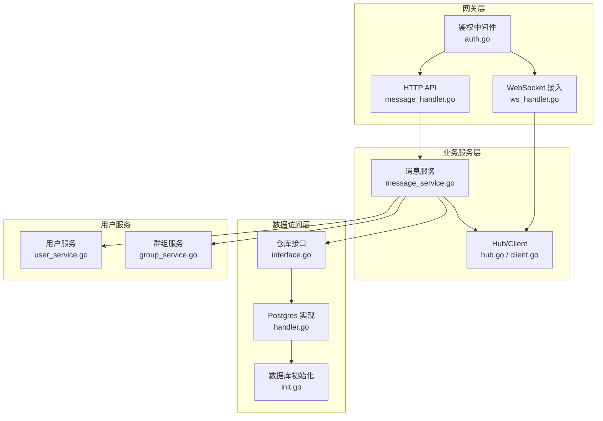
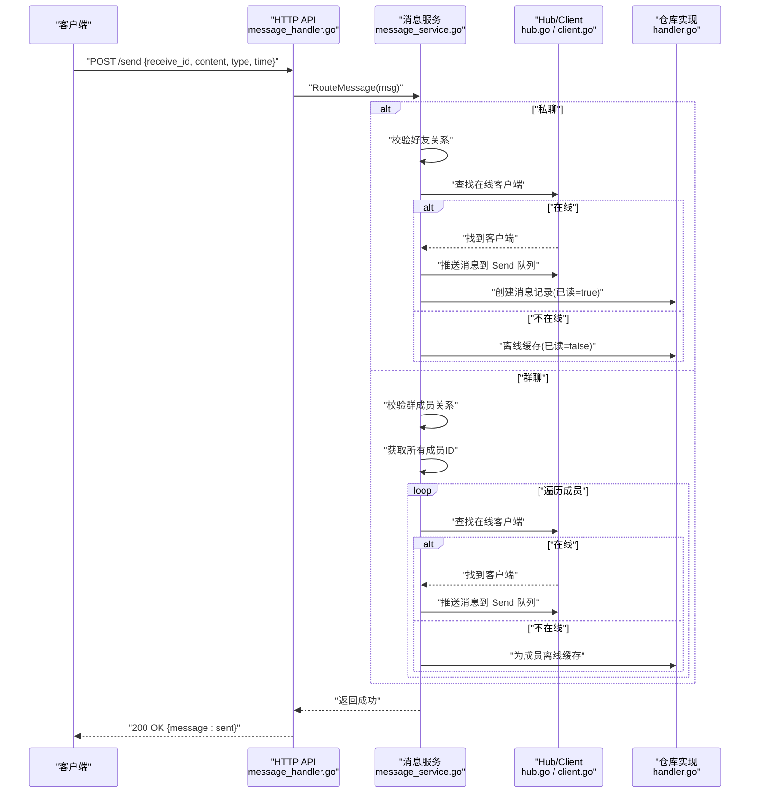
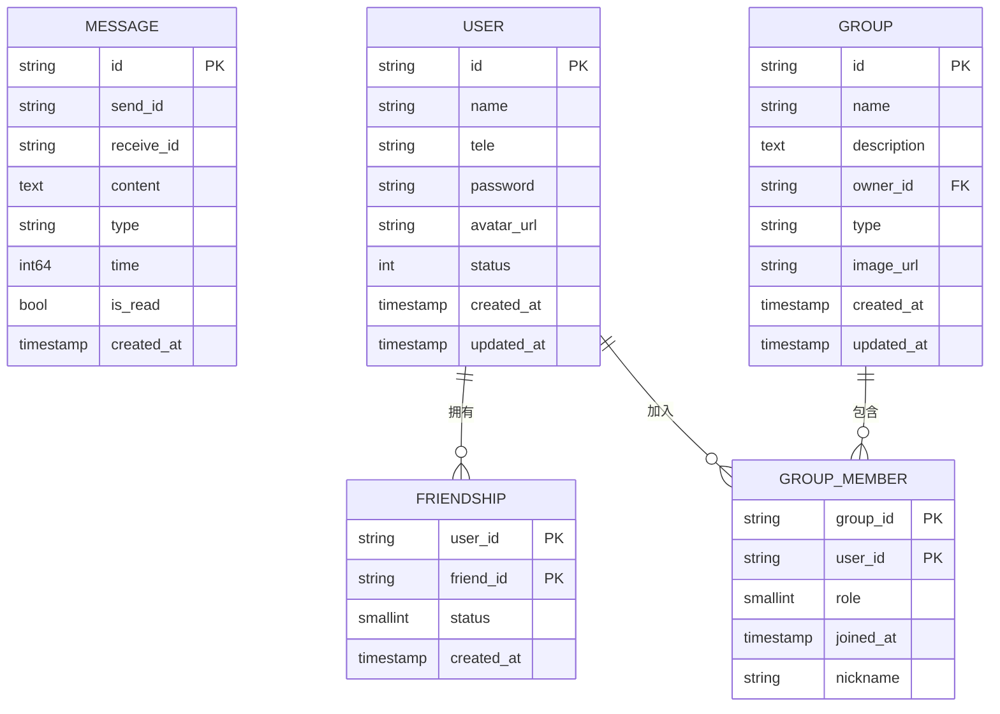
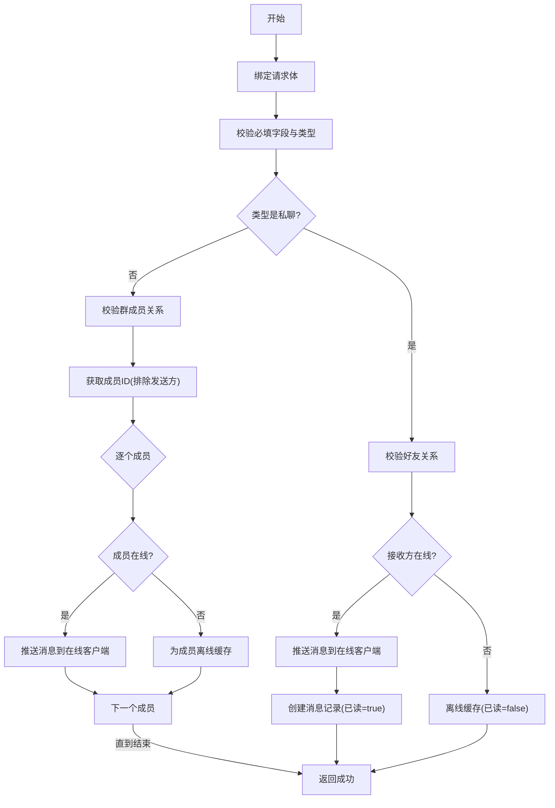
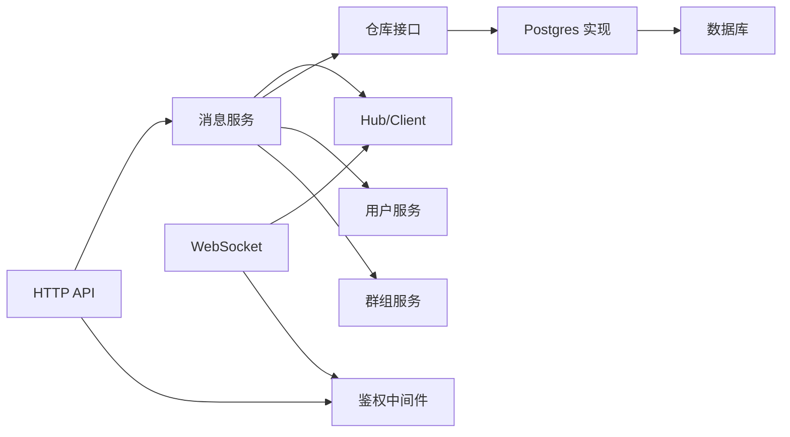

# 消息相关接口

<cite>
**本文引用的文件**
- [message_handler.go](file://server/gateway/api/message_handler.go)
- [message_service.go](file://server/msgservice/message_service.go)
- [models.go](file://server/model/models.go)
- [interface.go（仓库接口）](file://server/repository/interface.go)
- [hub.go](file://server/msgservice/hub/hub.go)
- [client.go](file://server/msgservice/hub/client.go)
- [handler.go（Postgres仓库实现）](file://server/repository/postgres/handler.go)
- [init.go（Postgres初始化）](file://server/repository/postgres/init.go)
- [ws_handler.go](file://server/gateway/api/ws_handler.go)
- [auth.go](file://server/gateway/auth/auth.go)
- [interface.go（消息队列接口）](file://server/mq/interface.go)
- [user_service.go](file://server/userservice/user_service.go)
- [group_service.go](file://server/userservice/group_service.go)
</cite>

## 目录
1. [简介](#简介)
2. [项目结构](#项目结构)
3. [核心组件](#核心组件)
4. [架构总览](#架构总览)
5. [详细组件分析](#详细组件分析)
6. [依赖关系分析](#依赖关系分析)
7. [性能考虑](#性能考虑)
8. [故障排查指南](#故障排查指南)
9. [结论](#结论)
10. [附录：接口规范与数据模型](#附录接口规范与数据模型)

## 简介
本文件面向消息相关API接口，系统性梳理私聊与群聊消息发送、离线消息获取、在线状态查询等能力的接口规范与实现细节。重点覆盖：
- 私聊消息发送的接口设计与校验逻辑
- 群聊消息发送的实现方式与成员广播策略
- 消息格式定义与数据结构
- 离线消息的存储机制、获取策略与标记已读行为
- 在线状态查询与消息送达确认
- 完整的消息发送流程示例（含验证、路由、转发、确认）
- 性能优化建议与错误处理策略

## 项目结构
消息子系统主要由以下层次构成：
- 网关层：HTTP路由与WebSocket接入，负责请求解析、鉴权与会话注册
- 业务服务层：消息路由与状态管理，负责消息类型分发、在线检测、离线缓存
- 传输层：Hub与WebSocket客户端，负责实时消息投递
- 数据访问层：基于GORM的Postgres实现，提供消息持久化与查询
- 用户服务：提供好友关系与群组成员关系的查询与校验

图表来源
- [message_handler.go:1-66](file://server/gateway/api/message_handler.go#L1-L66)
- [ws_handler.go:1-69](file://server/gateway/api/ws_handler.go#L1-L69)
- [auth.go:1-91](file://server/gateway/auth/auth.go#L1-L91)
- [message_service.go:1-168](file://server/msgservice/message_service.go#L1-L168)
- [hub.go:1-61](file://server/msgservice/hub/hub.go#L1-L61)
- [client.go:1-88](file://server/msgservice/hub/client.go#L1-L88)
- [interface.go（仓库接口）:1-74](file://server/repository/interface.go#L1-L74)
- [handler.go（Postgres仓库实现）:1-585](file://server/repository/postgres/handler.go#L1-L585)
- [init.go（Postgres初始化）:1-75](file://server/repository/postgres/init.go#L1-L75)
- [user_service.go:1-187](file://server/userservice/user_service.go#L1-L187)
- [group_service.go:1-217](file://server/userservice/group_service.go#L1-L217)

章节来源
- [message_handler.go:1-66](file://server/gateway/api/message_handler.go#L1-L66)
- [ws_handler.go:1-69](file://server/gateway/api/ws_handler.go#L1-L69)
- [auth.go:1-91](file://server/gateway/auth/auth.go#L1-L91)
- [message_service.go:1-168](file://server/msgservice/message_service.go#L1-L168)
- [hub.go:1-61](file://server/msgservice/hub/hub.go#L1-L61)
- [client.go:1-88](file://server/msgservice/hub/client.go#L1-L88)
- [interface.go（仓库接口）:1-74](file://server/repository/interface.go#L1-L74)
- [handler.go（Postgres仓库实现）:1-585](file://server/repository/postgres/handler.go#L1-L585)
- [init.go（Postgres初始化）:1-75](file://server/repository/postgres/init.go#L1-L75)
- [user_service.go:1-187](file://server/userservice/user_service.go#L1-L187)
- [group_service.go:1-217](file://server/userservice/group_service.go#L1-L217)

## 核心组件
- HTTP消息处理器：提供消息发送、离线消息获取、在线状态查询接口
- 消息服务：根据消息类型进行路由，处理私聊与群聊，维护离线缓存与已读标记
- Hub/Client：维护在线连接，向客户端推送消息
- 仓库接口与Postgres实现：提供消息的增删改查、离线消息查询与批量标记已读
- 鉴权中间件：基于JWT的Bearer Token认证
- 用户与群组服务：提供好友关系与群成员关系的校验

章节来源
- [message_handler.go:19-65](file://server/gateway/api/message_handler.go#L19-L65)
- [message_service.go:27-167](file://server/msgservice/message_service.go#L27-L167)
- [hub.go:10-61](file://server/msgservice/hub/hub.go#L10-L61)
- [client.go:12-88](file://server/msgservice/hub/client.go#L12-L88)
- [interface.go（仓库接口）:46-55](file://server/repository/interface.go#L46-L55)
- [handler.go（Postgres仓库实现）:327-438](file://server/repository/postgres/handler.go#L327-L438)
- [auth.go:37-90](file://server/gateway/auth/auth.go#L37-L90)
- [user_service.go:19-25](file://server/userservice/user_service.go#L19-L25)
- [group_service.go:18-25](file://server/userservice/group_service.go#L18-L25)

## 架构总览
消息从HTTP或WebSocket进入，经过鉴权与参数绑定后，由消息服务进行类型分发与路由。若接收方在线，则通过Hub直接推送到其WebSocket；否则写入离线消息表。离线消息在客户端拉取时被一次性标记为已读。

图表来源
- [message_handler.go:19-44](file://server/gateway/api/message_handler.go#L19-L44)
- [message_service.go:27-108](file://server/msgservice/message_service.go#L27-L108)
- [hub.go:44-60](file://server/msgservice/hub/hub.go#L44-L60)
- [client.go:61-87](file://server/msgservice/hub/client.go#L61-L87)
- [handler.go（Postgres仓库实现）:335-340](file://server/repository/postgres/handler.go#L335-L340)

## 详细组件分析

### HTTP消息接口
- 发送消息
  - 路径：/send
  - 方法：POST
  - 请求体字段：receive_id（接收方ID）、content（消息内容）、type（消息类型：private/group）、time（时间戳，可选）
  - 响应：成功返回200与提示信息
  - 错误：参数缺失返回400；内部错误返回500
- 获取离线消息
  - 路径：/offline
  - 方法：GET
  - 查询：无
  - 响应：返回messages数组；首次拉取时统一标记为已读
  - 错误：内部错误返回500
- 在线状态查询
  - 路径：/online_status
  - 方法：GET
  - 查询：无
  - 响应：返回online数组（在线的好友ID列表）
  - 错误：内部错误返回500

章节来源
- [message_handler.go:19-65](file://server/gateway/api/message_handler.go#L19-L65)

### 消息服务与路由
- 入口方法：RouteMessage
  - 必填字段校验：发送方、接收方、内容均不能为空
  - 时间戳：未提供时自动填充当前毫秒级时间
  - 类型分发：private 或 group
- 私聊路由：routePrivate
  - 校验好友关系
  - 若接收方在线：向其Send通道推送消息，并将消息记录标记为已读
  - 否则：写入离线消息表（已读=false）
- 群聊路由：routeGroup
  - 校验发送方是否为群成员
  - 获取所有成员ID（排除发送方自身）
  - 对每个成员：若在线则推送，否则为其单独生成离线消息记录
  - 返回聚合错误（若有多个成员投递失败）

章节来源
- [message_service.go:27-108](file://server/msgservice/message_service.go#L27-L108)

### 离线消息存储与获取
- 存储机制
  - 创建消息时若未指定ID，默认使用带时间戳的ID
  - 离线消息写入时is_read=false
- 获取策略
  - 拉取离线消息时按时间升序返回
  - 首次拉取后统一标记为已读
- 仓库接口
  - Create、GetOfflineMessages、MarkAllAsRead、GetUnreadCount等

章节来源
- [message_service.go:123-146](file://server/msgservice/message_service.go#L123-L146)
- [handler.go（Postgres仓库实现）:335-386](file://server/repository/postgres/handler.go#L335-L386)

### 在线状态查询
- 通过Hub查询在线客户端集合
- 通过FriendshipRepo获取好友ID列表
- 返回在线的好友ID数组

章节来源
- [message_service.go:148-167](file://server/msgservice/message_service.go#L148-L167)

### WebSocket接入与消息回执
- WebSocket升级：鉴权后注册到Hub，开始读写循环
- 读循环：解析消息、设置发送方与时间戳、回调服务处理
- 写循环：定时Ping、阻塞式发送消息
- 回执：私聊在线场景下，推送成功即认为送达并标记已读

章节来源
- [ws_handler.go:39-68](file://server/gateway/api/ws_handler.go#L39-L68)
- [hub.go:44-60](file://server/msgservice/hub/hub.go#L44-L60)
- [client.go:31-87](file://server/msgservice/hub/client.go#L31-L87)

### 数据模型与关系
消息实体包含消息ID、发送方、接收方、内容、类型、时间戳与已读标志。仓库接口定义了消息的增删改查与统计方法。

图表来源
- [models.go:23-105](file://server/model/models.go#L23-L105)

章节来源
- [models.go:23-105](file://server/model/models.go#L23-L105)
- [interface.go（仓库接口）:46-55](file://server/repository/interface.go#L46-L55)

### 消息发送流程示例（端到端）
- 步骤1：客户端发起HTTP请求至/发送消息
- 步骤2：网关层绑定请求体并调用消息服务
- 步骤3：消息服务校验必填字段与类型
- 步骤4：私聊：校验好友关系；群聊：校验成员关系并获取成员列表
- 步骤5：对每个目标：若在线推送，否则离线缓存
- 步骤6：返回成功响应
- 步骤7：客户端拉取离线消息时，服务端统一标记为已读

图表来源
- [message_handler.go:19-44](file://server/gateway/api/message_handler.go#L19-L44)
- [message_service.go:27-108](file://server/msgservice/message_service.go#L27-L108)
- [handler.go（Postgres仓库实现）:335-340](file://server/repository/postgres/handler.go#L335-L340)

## 依赖关系分析
- 网关层依赖消息服务与鉴权中间件
- 消息服务依赖Hub、仓库接口、用户与群组服务
- 仓库接口由Postgres实现，依赖GORM与数据库连接池
- WebSocket接入依赖Hub与鉴权

图表来源
- [message_handler.go:1-66](file://server/gateway/api/message_handler.go#L1-L66)
- [ws_handler.go:1-69](file://server/gateway/api/ws_handler.go#L1-L69)
- [auth.go:1-91](file://server/gateway/auth/auth.go#L1-L91)
- [message_service.go:1-25](file://server/msgservice/message_service.go#L1-L25)
- [interface.go（仓库接口）:1-74](file://server/repository/interface.go#L1-L74)
- [handler.go（Postgres仓库实现）:1-20](file://server/repository/postgres/handler.go#L1-L20)
- [init.go（Postgres初始化）:42-65](file://server/repository/postgres/init.go#L42-L65)
- [user_service.go:13-25](file://server/userservice/user_service.go#L13-L25)
- [group_service.go:11-25](file://server/userservice/group_service.go#L11-L25)

章节来源
- [message_handler.go:1-66](file://server/gateway/api/message_handler.go#L1-L66)
- [ws_handler.go:1-69](file://server/gateway/api/ws_handler.go#L1-L69)
- [auth.go:1-91](file://server/gateway/auth/auth.go#L1-L91)
- [message_service.go:1-25](file://server/msgservice/message_service.go#L1-L25)
- [interface.go（仓库接口）:1-74](file://server/repository/interface.go#L1-L74)
- [handler.go（Postgres仓库实现）:1-20](file://server/repository/postgres/handler.go#L1-L20)
- [init.go（Postgres初始化）:42-65](file://server/repository/postgres/init.go#L42-L65)
- [user_service.go:13-25](file://server/userservice/user_service.go#L13-L25)
- [group_service.go:11-25](file://server/userservice/group_service.go#L11-L25)

## 性能考虑
- 连接池与数据库
  - Postgres连接池配置：最大空闲连接数、最大打开连接数、连接最大生命周期
  - 建议：根据QPS调整MaxOpenConns与MaxIdleConns，开启慢查询日志定位瓶颈
- 消息投递
  - Hub的Send通道容量为256，建议监控背压情况，避免阻塞
  - 群聊广播采用逐成员投递，注意成员数量增长带来的并发压力
- 离线消息
  - 拉取时一次性标记已读，减少重复读取成本
  - 可引入分页参数以限制单次拉取量
- 缓存与索引
  - 消息表对receive_id、is_read、time建立索引，提升离线查询与排序效率
- 异步处理
  - 可引入消息队列Producer接口，将离线消息写入MQ异步落库，削峰填谷

章节来源
- [init.go（Postgres初始化）:59-65](file://server/repository/postgres/init.go#L59-L65)
- [client.go:12-25](file://server/msgservice/hub/client.go#L12-L25)
- [handler.go（Postgres仓库实现）:354-386](file://server/repository/postgres/handler.go#L354-L386)
- [interface.go（消息队列接口）:1-7](file://server/mq/interface.go#L1-L7)

## 故障排查指南
- 常见错误与处理
  - 参数缺失：请求体绑定失败，返回400
  - 非法消息类型：未知type，返回500
  - 不是好友：私聊发送前校验失败，返回500
  - 非群成员：群聊发送前校验失败，返回500
  - 数据库异常：查询/写入失败，返回500
- 日志与可观测性
  - WebSocket读循环中对意外关闭进行日志记录
  - 数据库初始化与迁移过程输出日志
- 诊断步骤
  - 确认鉴权头是否正确传递
  - 检查接收方是否在线（/online_status）
  - 检查离线消息是否被拉取并标记已读
  - 关注数据库索引与查询计划

章节来源
- [message_handler.go:26-43](file://server/gateway/api/message_handler.go#L26-L43)
- [message_service.go:28-43](file://server/msgservice/message_service.go#L28-L43)
- [client.go:42-59](file://server/msgservice/hub/client.go#L42-L59)
- [init.go（Postgres初始化）:63-64](file://server/repository/postgres/init.go#L63-L64)

## 结论
本系统提供了清晰的消息发送、离线消息与在线状态查询能力。通过Hub实现低延迟实时投递，结合Postgres离线缓存与批量已读标记，满足私聊与群聊场景需求。建议在高并发场景下进一步优化数据库连接池、引入消息队列异步落库，并完善分页与限流策略以提升整体稳定性与吞吐。

## 附录：接口规范与数据模型

### 接口一览
- 私聊发送
  - 路径：/send
  - 方法：POST
  - 请求体字段：receive_id、content、type(private)、time
  - 响应：200 {message:sent}
- 群聊发送
  - 路径：/send
  - 方法：POST
  - 请求体字段：receive_id(群ID)、content、type(group)、time
  - 响应：200 {message:sent}
- 获取离线消息
  - 路径：/offline
  - 方法：GET
  - 响应：200 {messages:[...]}；首次拉取后统一标记已读
- 在线状态查询
  - 路径：/online_status
  - 方法：GET
  - 响应：200 {online:[...]}
- WebSocket接入
  - 路径：/ws
  - 方法：GET
  - 升级后注册到Hub，开始读写循环

章节来源
- [message_handler.go:19-65](file://server/gateway/api/message_handler.go#L19-L65)
- [ws_handler.go:39-68](file://server/gateway/api/ws_handler.go#L39-L68)

### 消息数据模型
- 字段定义
  - msg_id：消息ID（主键）
  - send_id：发送方ID
  - receive_id：接收方ID（私聊为用户ID，群聊为群ID）
  - content：消息内容
  - type：消息类型（private/group）
  - time：时间戳（毫秒）
  - is_read：是否已读
  - created_at：创建时间

章节来源
- [models.go:23-36](file://server/model/models.go#L23-L36)