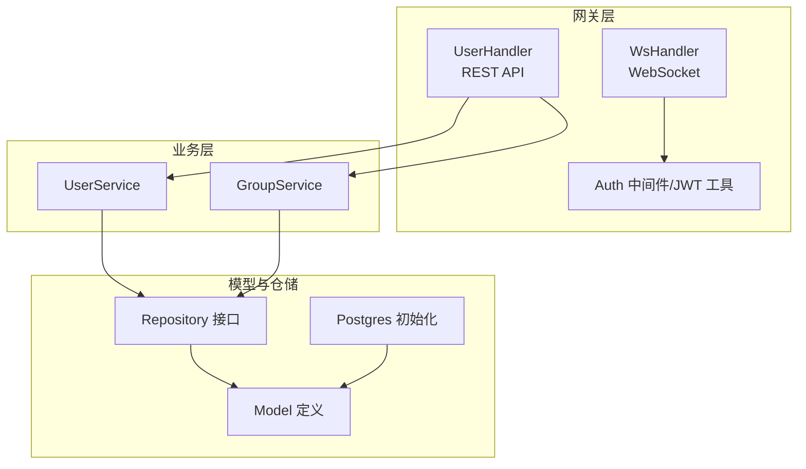
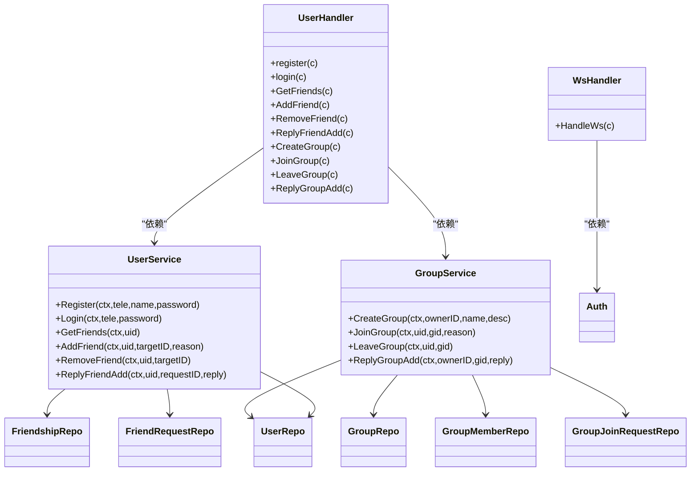

# 用户相关接口

<cite>
**本文引用的文件**
- [server/gateway/api/user_handler.go](file://server/gateway/api/user_handler.go)
- [server/gateway/api/ws_handler.go](file://server/gateway/api/ws_handler.go)
- [server/gateway/auth/auth.go](file://server/gateway/auth/auth.go)
- [server/userservice/user_service.go](file://server/userservice/user_service.go)
- [server/userservice/group_service.go](file://server/userservice/group_service.go)
- [server/model/models.go](file://server/model/models.go)
- [server/repository/interface.go](file://server/repository/interface.go)
- [server/repository/postgres/init.go](file://server/repository/postgres/init.go)
- [server/gateway/api/message_handler.go](file://server/gateway/api/message_handler.go)
- [go.mod](file://go.mod)
</cite>

## 目录
1. [简介](#简介)
2. [项目结构](#项目结构)
3. [核心组件](#核心组件)
4. [架构总览](#架构总览)
5. [详细组件分析](#详细组件分析)
6. [依赖关系分析](#依赖关系分析)
7. [性能考量](#性能考量)
8. [故障排查指南](#故障排查指南)
9. [结论](#结论)
10. [附录：接口规范与最佳实践](#附录接口规范与最佳实践)

## 简介
本文件面向即时通讯系统中的“用户相关”API，覆盖用户注册、登录、好友管理（申请、同意/拒绝、删除）、群组管理（创建、入群、退群、批量处理）等完整流程。文档提供每个接口的HTTP方法、URL路径、请求参数格式、响应数据结构、错误码、认证方式与权限要求，并给出JSON示例、最佳实践与常见问题解决方案。

## 项目结构
后端采用分层架构：
- 网关层（Gateway）：暴露REST API与WebSocket入口，负责参数绑定、鉴权中间件注入、Cookie设置等。
- 业务层（UserService/GroupService）：封装用户与群组的核心业务逻辑，包括密码哈希、好友/群组请求状态机等。
- 模型层（Model）：定义User、FriendRequest、Group、GroupJoinRequest等实体及常量。
- 仓储层（Repository）：抽象数据库访问接口，Postgres实现位于独立包中。
- 数据库初始化：通过GORM自动迁移模型表结构。



图表来源
- [server/gateway/api/user_handler.go:1-206](file://server/gateway/api/user_handler.go#L1-L206)
- [server/gateway/api/ws_handler.go:1-69](file://server/gateway/api/ws_handler.go#L1-L69)
- [server/gateway/auth/auth.go:1-91](file://server/gateway/auth/auth.go#L1-L91)
- [server/userservice/user_service.go:1-187](file://server/userservice/user_service.go#L1-L187)
- [server/userservice/group_service.go:1-217](file://server/userservice/group_service.go#L1-L217)
- [server/model/models.go:1-146](file://server/model/models.go#L1-L146)
- [server/repository/interface.go:1-74](file://server/repository/interface.go#L1-L74)
- [server/repository/postgres/init.go:1-75](file://server/repository/postgres/init.go#L1-L75)

章节来源
- [server/gateway/api/user_handler.go:1-206](file://server/gateway/api/user_handler.go#L1-L206)
- [server/gateway/api/ws_handler.go:1-69](file://server/gateway/api/ws_handler.go#L1-L69)
- [server/gateway/auth/auth.go:1-91](file://server/gateway/auth/auth.go#L1-L91)
- [server/userservice/user_service.go:1-187](file://server/userservice/user_service.go#L1-L187)
- [server/userservice/group_service.go:1-217](file://server/userservice/group_service.go#L1-L217)
- [server/model/models.go:1-146](file://server/model/models.go#L1-L146)
- [server/repository/interface.go:1-74](file://server/repository/interface.go#L1-L74)
- [server/repository/postgres/init.go:1-75](file://server/repository/postgres/init.go#L1-L75)

## 核心组件
- UserHandler：提供注册、登录、好友查询/申请/同意/拒绝/删除、群组创建/加入/退出/批量处理等REST接口。
- WsHandler：基于WebSocket提供实时消息通道，使用Cookie中的JWT进行鉴权。
- UserService：封装用户注册（手机号唯一性检查、密码bcrypt哈希）、登录（凭据校验）、好友关系管理（去重、状态机、双向建立）。
- GroupService：封装群组创建（默认拥有者即成员）、入群/退群、批量同意/拒绝入群请求、成员角色管理。
- Model：定义User/FriendRequest/Group/GroupJoinRequest等实体字段与状态常量。
- Repository接口：统一抽象用户、好友、群组、成员、消息、请求等操作。
- Postgres初始化：加载环境变量、连接数据库、执行AutoMigrate。

章节来源
- [server/gateway/api/user_handler.go:1-206](file://server/gateway/api/user_handler.go#L1-L206)
- [server/gateway/api/ws_handler.go:1-69](file://server/gateway/api/ws_handler.go#L1-L69)
- [server/gateway/auth/auth.go:1-91](file://server/gateway/auth/auth.go#L1-L91)
- [server/userservice/user_service.go:1-187](file://server/userservice/user_service.go#L1-L187)
- [server/userservice/group_service.go:1-217](file://server/userservice/group_service.go#L1-L217)
- [server/model/models.go:1-146](file://server/model/models.go#L1-L146)
- [server/repository/interface.go:1-74](file://server/repository/interface.go#L1-L74)
- [server/repository/postgres/init.go:1-75](file://server/repository/postgres/init.go#L1-L75)

## 架构总览
下图展示用户相关API在系统中的交互关系与数据流：

```mermaid
sequenceDiagram
participant C as "客户端"
participant GW as "网关(UserHandler/WsHandler)"
participant AUTH as "鉴权(JWT)"
participant US as "UserService"
participant GS as "GroupService"
participant R as "Repository接口"
participant DB as "Postgres"
C->>GW : "POST /api/register"
GW->>US : "Register(tele,name,password)"
US->>R : "ExistsByTele()"
R->>DB : "查询"
DB-->>R : "结果"
R-->>US : "存在性"
US->>US : "bcrypt哈希密码"
US->>R : "Create(User)"
R->>DB : "插入"
DB-->>R : "OK"
R-->>US : "OK"
US-->>GW : "User"
GW-->>C : "200 OK {message : name}"
C->>GW : "POST /api/login"
GW->>US : "Login(tele,password)"
US->>R : "GetByTele()"
R->>DB : "查询"
DB-->>R : "User"
R-->>US : "User"
US->>US : "bcrypt对比"
US-->>GW : "User"
GW->>AUTH : "GenerateToken(name,id)"
AUTH-->>GW : "token"
GW->>C : "Set-Cookie token; 24h"
GW-->>C : "200 OK {message,name}"
C->>GW : "GET /ws?... (WebSocket)"
GW->>AUTH : "ParseToken(cookie.token)"
AUTH-->>GW : "claims(sub,name)"
GW->>GW : "Upgrade to WS"
GW-->>C : "WS连接建立"
```

图表来源
- [server/gateway/api/user_handler.go:21-61](file://server/gateway/api/user_handler.go#L21-L61)
- [server/gateway/api/ws_handler.go:39-68](file://server/gateway/api/ws_handler.go#L39-L68)
- [server/gateway/auth/auth.go:22-61](file://server/gateway/auth/auth.go#L22-L61)
- [server/userservice/user_service.go:27-67](file://server/userservice/user_service.go#L27-L67)
- [server/repository/interface.go:8-18](file://server/repository/interface.go#L8-L18)
- [server/repository/postgres/init.go:42-65](file://server/repository/postgres/init.go#L42-L65)

## 详细组件分析

### 用户注册
- HTTP方法与路径
  - 方法：POST
  - 路径：/api/register
- 请求体参数
  - tele: 手机号（必填）
  - name: 昵称（必填）
  - password: 密码（必填）
- 响应
  - 成功：200 OK，返回 {message: 用户名}
  - 失败：400/500，返回 {error: 错误信息}
- 业务要点
  - 校验输入非空
  - 检查手机号是否已存在
  - 使用bcrypt对密码进行哈希存储
  - 生成唯一用户ID
- 错误码
  - 400：请求参数不合法
  - 500：内部错误（如哈希失败、数据库写入失败）

章节来源
- [server/gateway/api/user_handler.go:21-37](file://server/gateway/api/user_handler.go#L21-L37)
- [server/userservice/user_service.go:27-54](file://server/userservice/user_service.go#L27-L54)
- [server/model/models.go:8-21](file://server/model/models.go#L8-L21)

### 用户登录
- HTTP方法与路径
  - 方法：POST
  - 路径：/api/login
- 请求体参数
  - tele: 手机号（必填）
  - password: 密码（必填）
- 响应
  - 成功：200 OK，返回 {message: 登录成功, name: 用户名}
  - 失败：400/500，返回 {error: 错误信息}
- 会话与认证
  - 生成JWT并设置Cookie：token，有效期24小时，路径/ws，安全传输
  - 后续WebSocket连接需携带该Cookie
- 错误码
  - 400：用户名或密码错误
  - 500：内部错误（如生成token失败）

章节来源
- [server/gateway/api/user_handler.go:39-61](file://server/gateway/api/user_handler.go#L39-L61)
- [server/gateway/auth/auth.go:22-34](file://server/gateway/auth/auth.go#L22-L34)

### 获取好友列表
- HTTP方法与路径
  - 方法：GET
  - 路径：/api/friends
- 认证与权限
  - 需要通过JWT中间件，从Authorization头或Cookie中解析出userID
- 请求体
  - 无需请求体
- 响应
  - 成功：200 OK，返回 {friends: [用户对象数组]}
  - 失败：400/500，返回 {error: 错误信息}

章节来源
- [server/gateway/api/user_handler.go:63-75](file://server/gateway/api/user_handler.go#L63-L75)
- [server/gateway/auth/auth.go:37-61](file://server/gateway/auth/auth.go#L37-L61)
- [server/userservice/user_service.go:73-75](file://server/userservice/user_service.go#L73-L75)

### 添加好友
- HTTP方法与路径
  - 方法：POST
  - 路径：/api/friends/add
- 请求体参数
  - target_id: 对方用户ID（必填）
  - reason: 申请理由（必填）
- 响应
  - 成功：200 OK，返回 {message: success}
  - 失败：400/500，返回 {error: 错误信息}
- 业务要点
  - 自己不能加自己
  - 目标用户必须存在
  - 不能重复发送好友请求
  - 创建待处理的好友请求记录

章节来源
- [server/gateway/api/user_handler.go:77-93](file://server/gateway/api/user_handler.go#L77-L93)
- [server/userservice/user_service.go:77-116](file://server/userservice/user_service.go#L77-L116)
- [server/model/models.go:107-119](file://server/model/models.go#L107-L119)

### 删除好友
- HTTP方法与路径
  - 方法：POST
  - 路径：/api/friends/remove
- 请求体参数
  - target_id: 对方用户ID（必填）
- 响应
  - 成功：200 OK，返回 {message: success}
  - 失败：500，返回 {error: 错误信息}
- 业务要点
  - 自己不能删除自己
  - 必须是好友关系才允许删除

章节来源
- [server/gateway/api/user_handler.go:95-111](file://server/gateway/api/user_handler.go#L95-L111)
- [server/userservice/user_service.go:118-136](file://server/userservice/user_service.go#L118-L136)

### 回复好友申请
- HTTP方法与路径
  - 方法：POST
  - 路径：/api/friends/reply
- 请求体参数
  - target_id: 申请人ID（必填）
  - reply: 回复（"agree" 或其他值），仅"agree"时建立双向好友关系
- 响应
  - 成功：200 OK，返回 {message: success}
  - 失败：500，返回 {error: 错误信息}
- 业务要点
  - 仅被申请者可处理
  - 仅处理状态为“待处理”的请求
  - 同意时互建双向好友关系并更新请求状态为“已接受”
  - 拒绝时更新为“已拒绝”

章节来源
- [server/gateway/api/user_handler.go:113-130](file://server/gateway/api/user_handler.go#L113-L130)
- [server/userservice/user_service.go:138-178](file://server/userservice/user_service.go#L138-L178)

### 创建群组
- HTTP方法与路径
  - 方法：POST
  - 路径：/api/groups/create
- 请求体参数
  - name: 群名称（必填）
  - description: 群描述（可选）
- 响应
  - 成功：200 OK，返回 {group_id: 群ID, group_name: 群名称}
  - 失败：500，返回 {error: 错误信息}
- 业务要点
  - 创建者自动成为群主（角色为3）
  - 默认类型为normal

章节来源
- [server/gateway/api/user_handler.go:132-149](file://server/gateway/api/user_handler.go#L132-L149)
- [server/userservice/group_service.go:27-58](file://server/userservice/group_service.go#L27-L58)

### 加入群组
- HTTP方法与路径
  - 方法：POST
  - 路径：/api/groups/join
- 请求体参数
  - group_id: 群ID（必填）
  - reason: 入群理由（必填）
- 响应
  - 成功：200 OK，返回 {message: already post}
  - 失败：500，返回 {error: 错误信息}
- 业务要点
  - 不能重复提交入群请求
  - 不能已是成员

章节来源
- [server/gateway/api/user_handler.go:151-169](file://server/gateway/api/user_handler.go#L151-L169)
- [server/userservice/group_service.go:64-96](file://server/userservice/group_service.go#L64-L96)

### 退出群组
- HTTP方法与路径
  - 方法：POST
  - 路径：/api/groups/leave
- 请求体参数
  - group_id: 群ID（必填）
- 响应
  - 成功：200 OK，返回 {message: already leave}
  - 失败：500，返回 {error: 错误信息}
- 业务要点
  - 群主不可直接退出群组

章节来源
- [server/gateway/api/user_handler.go:171-186](file://server/gateway/api/user_handler.go#L171-L186)
- [server/userservice/group_service.go:98-117](file://server/userservice/group_service.go#L98-L117)

### 批量回复入群申请（群主）
- HTTP方法与路径
  - 方法：POST
  - 路径：/api/groups/reply
- 请求体参数
  - group_id: 群ID（必填）
  - reply: 回复（"agree" 或其他值）
- 响应
  - 成功：200 OK，返回 {message: already post}
  - 失败：500，返回 {error: 错误信息}
- 业务要点
  - 仅群主可操作
  - reply="agree"时批量将所有待处理请求转为“已接受”，并为每个申请人添加成员记录
  - 非同意时将所有待处理请求置为“已拒绝”

章节来源
- [server/gateway/api/user_handler.go:188-205](file://server/gateway/api/user_handler.go#L188-L205)
- [server/userservice/group_service.go:119-162](file://server/userservice/group_service.go#L119-L162)

### WebSocket连接与鉴权
- 路径
  - GET /ws
- 认证方式
  - 从Cookie读取token，使用与登录相同的JWT签名与校验规则
- 响应
  - 成功：升级为WebSocket，后续消息收发
  - 失败：401，返回 {error: 缺少token/无授权}

章节来源
- [server/gateway/api/ws_handler.go:39-68](file://server/gateway/api/ws_handler.go#L39-L68)
- [server/gateway/auth/auth.go:64-90](file://server/gateway/auth/auth.go#L64-L90)

## 依赖关系分析



图表来源
- [server/gateway/api/user_handler.go:12-19](file://server/gateway/api/user_handler.go#L12-L19)
- [server/gateway/api/ws_handler.go:30-37](file://server/gateway/api/ws_handler.go#L30-L37)
- [server/userservice/user_service.go:13-25](file://server/userservice/user_service.go#L13-L25)
- [server/userservice/group_service.go:11-25](file://server/userservice/group_service.go#L11-L25)
- [server/repository/interface.go:8-73](file://server/repository/interface.go#L8-L73)

章节来源
- [server/gateway/api/user_handler.go:1-206](file://server/gateway/api/user_handler.go#L1-L206)
- [server/gateway/api/ws_handler.go:1-69](file://server/gateway/api/ws_handler.go#L1-L69)
- [server/userservice/user_service.go:1-187](file://server/userservice/user_service.go#L1-L187)
- [server/userservice/group_service.go:1-217](file://server/userservice/group_service.go#L1-L217)
- [server/repository/interface.go:1-74](file://server/repository/interface.go#L1-L74)

## 性能考量
- 密码哈希成本：使用bcrypt默认成本，建议在生产环境评估并根据硬件能力调整，避免过高的CPU开销影响登录吞吐。
- 数据库连接池：Postgres初始化设置了最大空闲/打开连接数与生命周期，确保高并发下的稳定性。
- JWT签名算法：当前使用HS256，密钥固定于代码中，建议在生产环境改为从安全位置加载密钥并启用HTTPS。
- WebSocket：连接数增长时注意内存占用与广播开销，必要时引入限流与心跳保活机制。
- 查询索引：模型中对常用查询字段（如手机号、好友关系联合键、群成员联合键）已建立索引，有助于提升查询性能。

章节来源
- [server/userservice/user_service.go:36-39](file://server/userservice/user_service.go#L36-L39)
- [server/repository/postgres/init.go:42-65](file://server/repository/postgres/init.go#L42-L65)
- [server/gateway/auth/auth.go:14-14](file://server/gateway/auth/auth.go#L14-L14)

## 故障排查指南
- 400 错误
  - 请求参数缺失或格式不正确（如注册时缺少手机号/密码）
  - 登录时凭据无效
- 401 未授权
  - 缺少Authorization头或Cookie中的token
  - JWT解析失败或过期
- 500 内部错误
  - 数据库写入失败（注册/创建群组/添加好友）
  - 密码哈希失败
  - 业务状态机异常（重复请求、非法操作）
- 常见问题
  - 重复注册：手机号已存在
  - 重复加好友：已存在好友关系或已发送过请求
  - 非法操作：非本人处理好友/群组请求
  - 群主不可退群：群主无法直接退出群组

章节来源
- [server/gateway/api/user_handler.go:27-36](file://server/gateway/api/user_handler.go#L27-L36)
- [server/gateway/api/user_handler.go:44-51](file://server/gateway/api/user_handler.go#L44-L51)
- [server/gateway/api/ws_handler.go:42-52](file://server/gateway/api/ws_handler.go#L42-L52)
- [server/gateway/auth/auth.go:37-61](file://server/gateway/auth/auth.go#L37-L61)
- [server/userservice/user_service.go:77-116](file://server/userservice/user_service.go#L77-L116)
- [server/userservice/group_service.go:98-117](file://server/userservice/group_service.go#L98-L117)

## 结论
本文档梳理了用户相关API的完整流程与实现细节，涵盖注册、登录、好友管理与群组管理的关键接口。通过明确的请求/响应格式、错误码与鉴权机制，开发者可以快速集成并稳定运行。建议在生产环境中强化安全配置（密钥管理、HTTPS、速率限制）与监控告警，持续优化数据库索引与连接池参数以满足高并发场景。

## 附录：接口规范与最佳实践

### 接口一览与规范
- 用户注册
  - 方法：POST
  - 路径：/api/register
  - 请求体：{tele, name, password}
  - 响应：200 {message: 用户名}；400/500 {error}
- 用户登录
  - 方法：POST
  - 路径：/api/login
  - 请求体：{tele, password}
  - 响应：200 {message, name}；400/500 {error}
  - Cookie：token（24h，/ws，安全传输）
- 获取好友列表
  - 方法：GET
  - 路径：/api/friends
  - 认证：Authorization/Bearer 或 Cookie token
  - 响应：200 {friends: [...]}; 400/500 {error}
- 添加好友
  - 方法：POST
  - 路径：/api/friends/add
  - 请求体：{target_id, reason}
  - 响应：200 {message: success}; 500 {error}
- 删除好友
  - 方法：POST
  - 路径：/api/friends/remove
  - 请求体：{target_id}
  - 响应：200 {message: success}; 500 {error}
- 回复好友申请
  - 方法：POST
  - 路径：/api/friends/reply
  - 请求体：{target_id, reply("agree"|其他)}
  - 响应：200 {message: success}; 500 {error}
- 创建群组
  - 方法：POST
  - 路径：/api/groups/create
  - 请求体：{name, description}
  - 响应：200 {group_id, group_name}; 500 {error}
- 加入群组
  - 方法：POST
  - 路径：/api/groups/join
  - 请求体：{group_id, reason}
  - 响应：200 {message: already post}; 500 {error}
- 退出群组
  - 方法：POST
  - 路径：/api/groups/leave
  - 请求体：{group_id}
  - 响应：200 {message: already leave}; 500 {error}
- 批量回复入群申请
  - 方法：POST
  - 路径：/api/groups/reply
  - 请求体：{group_id, reply("agree"|其他)}
  - 响应：200 {message: already post}; 500 {error}
- WebSocket
  - 方法：GET
  - 路径：/ws
  - 认证：Cookie token
  - 响应：升级为WS；401 {error}

### 认证与权限
- REST接口：通过JWT中间件校验Authorization头或Cookie中的token
- WebSocket：从Cookie读取token并解析
- 权限控制：
  - 好友相关：仅操作人本人可发起/处理
  - 群组相关：仅群主可批量处理入群请求与成员角色变更

章节来源
- [server/gateway/api/user_handler.go:21-205](file://server/gateway/api/user_handler.go#L21-L205)
- [server/gateway/api/ws_handler.go:39-68](file://server/gateway/api/ws_handler.go#L39-L68)
- [server/gateway/auth/auth.go:37-90](file://server/gateway/auth/auth.go#L37-L90)

### 最佳实践
- 参数校验：前端与后端均需严格校验必填字段与格式
- 安全传输：生产环境必须启用HTTPS，Cookie设置HttpOnly与Secure
- 密钥管理：JWT密钥不应硬编码在源码中，建议从环境变量或密钥管理服务加载
- 幂等性：对重复请求（如重复加好友/入群）进行幂等处理
- 日志与监控：记录关键错误与慢查询，设置告警阈值
- 数据一致性：好友/群组状态变更需在事务中完成，失败回滚

### 常见问题与解决方案
- 重复注册：检查手机号唯一性，提示用户更换手机号
- 登录失败：确认手机号与密码匹配，检查bcrypt哈希是否正确
- 无法添加好友：确认目标用户存在且双方非好友，且未重复发送请求
- 退群失败：群主不可直接退出，需移交群主或解散群组
- WebSocket连接失败：确认Cookie中token有效且未过期