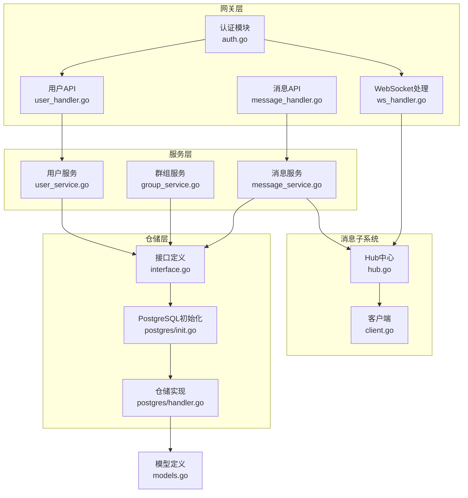
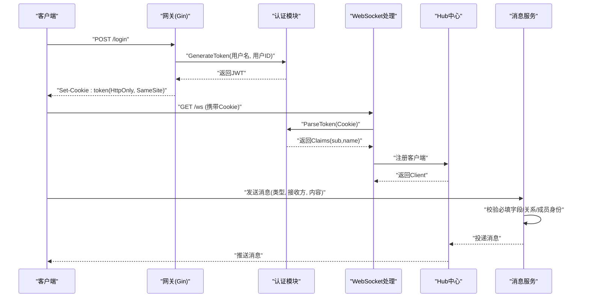
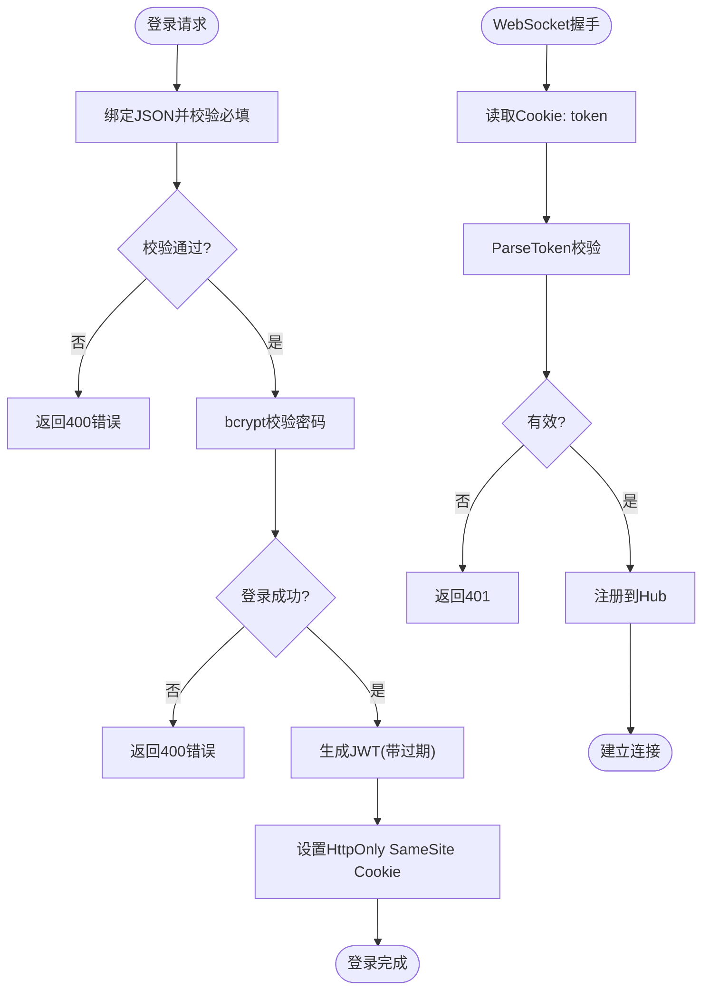
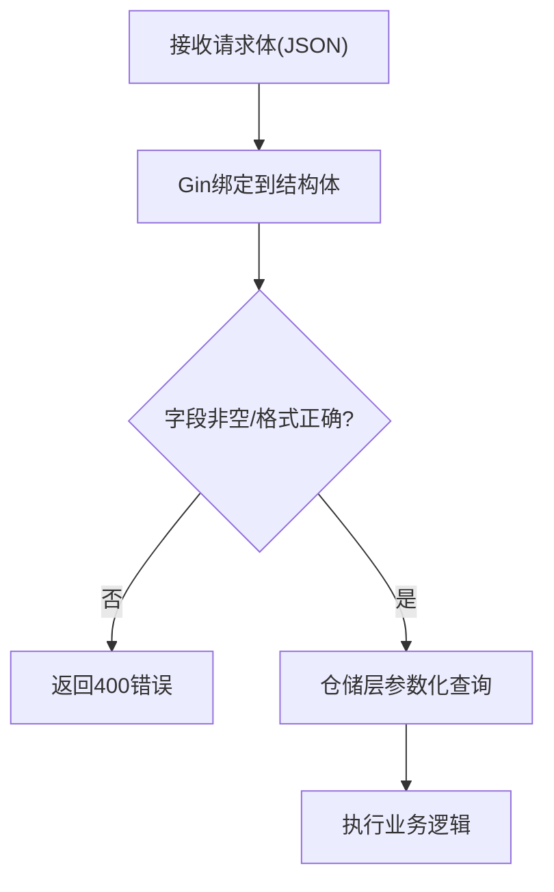
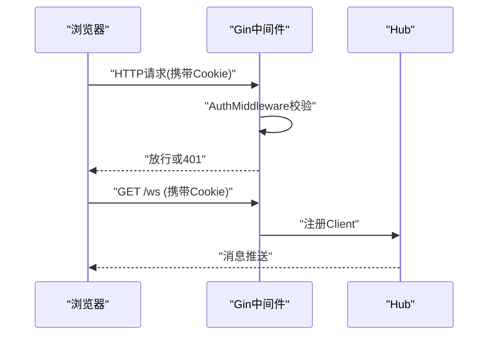
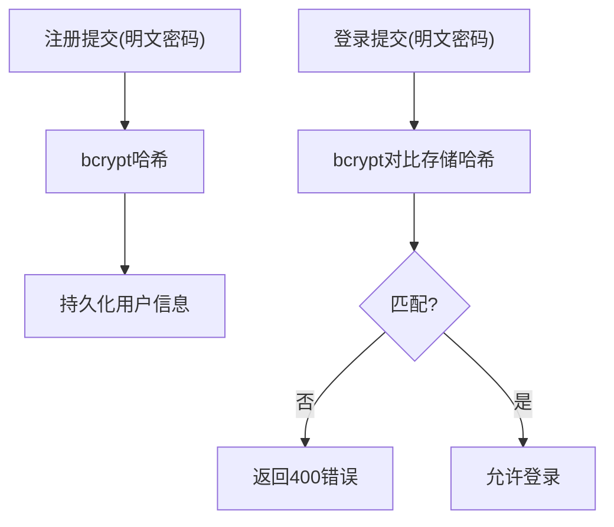
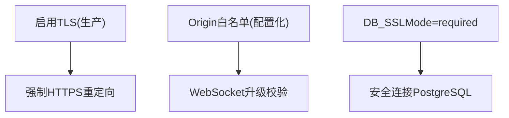
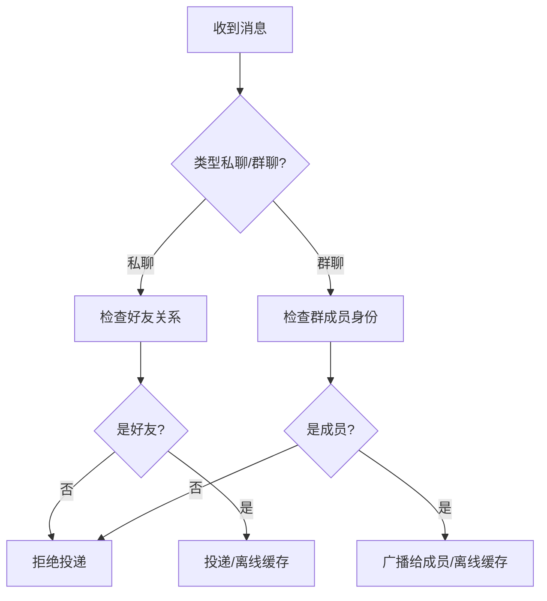
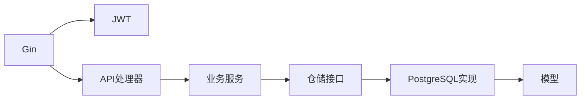

# 安全考虑

<cite>
**本文引用的文件**
- [server/gateway/auth/auth.go](file://server/gateway/auth/auth.go)
- [server/gateway/api/user_handler.go](file://server/gateway/api/user_handler.go)
- [server/gateway/api/ws_handler.go](file://server/gateway/api/ws_handler.go)
- [server/gateway/api/message_handler.go](file://server/gateway/api/message_handler.go)
- [server/userservice/user_service.go](file://server/userservice/user_service.go)
- [server/userservice/group_service.go](file://server/userservice/group_service.go)
- [server/msgservice/message_service.go](file://server/msgservice/message_service.go)
- [server/msgservice/hub/hub.go](file://server/msgservice/hub/hub.go)
- [server/msgservice/hub/client.go](file://server/msgservice/hub/client.go)
- [server/repository/interface.go](file://server/repository/interface.go)
- [server/repository/postgres/init.go](file://server/repository/postgres/init.go)
- [server/repository/postgres/handler.go](file://server/repository/postgres/handler.go)
- [server/model/models.go](file://server/model/models.go)
- [go.mod](file://go.mod)
- [main.txt](file://main.txt)
</cite>

## 目录
1. [引言](#引言)
2. [项目结构](#项目结构)
3. [核心组件](#核心组件)
4. [架构总览](#架构总览)
5. [详细组件分析](#详细组件分析)
6. [依赖关系分析](#依赖关系分析)
7. [性能与安全特性](#性能与安全特性)
8. [故障排查指南](#故障排查指南)
9. [结论](#结论)
10. [附录](#附录)

## 引言
本文件聚焦于该Go语言即时通讯项目的整体安全设计与实现，覆盖认证与授权、输入验证与数据清理、会话与状态保持、密码加密与存储、网络安全（TLS与WebSocket）、访问控制与权限管理、安全审计与日志、漏洞扫描与安全测试、以及安全事件响应与应急流程。内容基于仓库中现有代码进行系统化梳理，并提出可操作的改进建议。

## 项目结构
项目采用分层架构：网关层负责HTTP/WebSocket接入与鉴权；服务层封装业务逻辑；仓储层通过GORM访问PostgreSQL；消息子系统维护在线客户端与消息路由。

图示来源
- [server/gateway/api/user_handler.go:1-206](file://server/gateway/api/user_handler.go#L1-L206)
- [server/gateway/api/message_handler.go:1-66](file://server/gateway/api/message_handler.go#L1-L66)
- [server/gateway/api/ws_handler.go:1-69](file://server/gateway/api/ws_handler.go#L1-L69)
- [server/gateway/auth/auth.go:1-91](file://server/gateway/auth/auth.go#L1-L91)
- [server/userservice/user_service.go:1-187](file://server/userservice/user_service.go#L1-L187)
- [server/userservice/group_service.go:1-217](file://server/userservice/group_service.go#L1-L217)
- [server/msgservice/message_service.go:1-168](file://server/msgservice/message_service.go#L1-L168)
- [server/msgservice/hub/hub.go:1-61](file://server/msgservice/hub/hub.go#L1-L61)
- [server/msgservice/hub/client.go:1-88](file://server/msgservice/hub/client.go#L1-L88)
- [server/repository/interface.go:1-74](file://server/repository/interface.go#L1-L74)
- [server/repository/postgres/init.go:1-75](file://server/repository/postgres/init.go#L1-L75)
- [server/repository/postgres/handler.go:1-585](file://server/repository/postgres/handler.go#L1-L585)
- [server/model/models.go:1-146](file://server/model/models.go#L1-L146)

章节来源
- [server/gateway/api/user_handler.go:1-206](file://server/gateway/api/user_handler.go#L1-L206)
- [server/gateway/api/message_handler.go:1-66](file://server/gateway/api/message_handler.go#L1-L66)
- [server/gateway/api/ws_handler.go:1-69](file://server/gateway/api/ws_handler.go#L1-L69)
- [server/gateway/auth/auth.go:1-91](file://server/gateway/auth/auth.go#L1-L91)
- [server/userservice/user_service.go:1-187](file://server/userservice/user_service.go#L1-L187)
- [server/userservice/group_service.go:1-217](file://server/userservice/group_service.go#L1-L217)
- [server/msgservice/message_service.go:1-168](file://server/msgservice/message_service.go#L1-L168)
- [server/msgservice/hub/hub.go:1-61](file://server/msgservice/hub/hub.go#L1-L61)
- [server/msgservice/hub/client.go:1-88](file://server/msgservice/hub/client.go#L1-L88)
- [server/repository/interface.go:1-74](file://server/repository/interface.go#L1-L74)
- [server/repository/postgres/init.go:1-75](file://server/repository/postgres/init.go#L1-L75)
- [server/repository/postgres/handler.go:1-585](file://server/repository/postgres/handler.go#L1-L585)
- [server/model/models.go:1-146](file://server/model/models.go#L1-L146)

## 核心组件
- 认证与授权
  - JWT生成与解析：签发含过期时间的令牌，中间件校验Authorization头格式与签名有效性。
  - 登录成功后以HttpOnly SameSite Cookie下发令牌，用于后续WebSocket鉴权。
- 输入验证与数据清理
  - 使用Gin绑定器对请求体进行结构化校验；对空值、非法字段进行拒绝。
  - 消息路由前对必填字段进行前置校验。
- 会话与状态保持
  - WebSocket使用Cookie中的JWT进行一次性鉴权；Hub维护在线客户端映射。
- 密码加密与存储
  - 使用bcrypt对密码进行哈希存储；登录时比对哈希。
- 网络安全
  - Gin路由与中间件；WebSocket升级时存在Origin白名单检查；数据库连接参数支持sslmode。
- 访问控制与权限管理
  - 私聊/群聊消息投递前检查好友关系或群成员身份；群组操作需具备相应角色。
- 安全审计与日志
  - 数据库连接日志；WebSocket读写错误日志；部分鉴权失败日志输出。
- 漏洞扫描与安全测试
  - 建议引入静态分析与依赖扫描工具；对输入校验与鉴权路径进行自动化测试。
- 安全事件响应与应急流程
  - 建议建立令牌吊销、限流、封禁与告警联动机制。

章节来源
- [server/gateway/auth/auth.go:22-90](file://server/gateway/auth/auth.go#L22-L90)
- [server/gateway/api/user_handler.go:21-61](file://server/gateway/api/user_handler.go#L21-L61)
- [server/gateway/api/ws_handler.go:39-68](file://server/gateway/api/ws_handler.go#L39-L68)
- [server/msgservice/message_service.go:27-44](file://server/msgservice/message_service.go#L27-L44)
- [server/userservice/user_service.go:36-66](file://server/userservice/user_service.go#L36-L66)
- [server/msgservice/hub/client.go:31-87](file://server/msgservice/hub/client.go#L31-L87)
- [server/repository/postgres/init.go:42-65](file://server/repository/postgres/init.go#L42-L65)

## 架构总览
下图展示从HTTP到WebSocket再到消息路由的整体安全流程。

图示来源
- [server/gateway/api/user_handler.go:39-61](file://server/gateway/api/user_handler.go#L39-L61)
- [server/gateway/auth/auth.go:22-90](file://server/gateway/auth/auth.go#L22-L90)
- [server/gateway/api/ws_handler.go:39-68](file://server/gateway/api/ws_handler.go#L39-L68)
- [server/msgservice/message_service.go:27-108](file://server/msgservice/message_service.go#L27-L108)
- [server/msgservice/hub/hub.go:44-60](file://server/msgservice/hub/hub.go#L44-L60)

## 详细组件分析

### 认证与授权机制
- JWT策略
  - 生成：包含sub、name、iat、exp等声明，使用HS256签名。
  - 中间件：要求Authorization头为Bearer格式且非空；解析并校验签名与有效期。
  - 登录：成功后设置HttpOnly SameSite Cookie，提升抗CSRF能力。
- WebSocket鉴权
  - 从Cookie读取token，调用ParseToken完成一次性鉴权，随后注册到Hub。
- 令牌刷新
  - 当前未实现refresh token机制；建议引入短期访问令牌+长期刷新令牌，配合Redis黑名单。

图示来源
- [server/gateway/api/user_handler.go:21-61](file://server/gateway/api/user_handler.go#L21-L61)
- [server/gateway/auth/auth.go:22-90](file://server/gateway/auth/auth.go#L22-L90)
- [server/gateway/api/ws_handler.go:39-68](file://server/gateway/api/ws_handler.go#L39-L68)

章节来源
- [server/gateway/auth/auth.go:22-90](file://server/gateway/auth/auth.go#L22-L90)
- [server/gateway/api/user_handler.go:21-61](file://server/gateway/api/user_handler.go#L21-L61)
- [server/gateway/api/ws_handler.go:39-68](file://server/gateway/api/ws_handler.go#L39-L68)

### 输入验证与数据清理
- HTTP请求体绑定
  - 使用ShouldBindJSON/ShouldBindBodyWithJSON进行结构化校验；对空字段直接拒绝。
- 消息路由前置校验
  - 必填字段缺失则直接返回错误；默认时间戳在服务端补全。
- 数据库查询
  - 所有查询均使用参数化条件（如Where "id = ?"），避免拼接SQL，降低SQL注入风险。

图示来源
- [server/gateway/api/user_handler.go:21-37](file://server/gateway/api/user_handler.go#L21-L37)
- [server/gateway/api/message_handler.go:19-44](file://server/gateway/api/message_handler.go#L19-L44)
- [server/msgservice/message_service.go:27-44](file://server/msgservice/message_service.go#L27-L44)
- [server/repository/postgres/handler.go:33-54](file://server/repository/postgres/handler.go#L33-L54)

章节来源
- [server/gateway/api/user_handler.go:21-37](file://server/gateway/api/user_handler.go#L21-L37)
- [server/gateway/api/message_handler.go:19-44](file://server/gateway/api/message_handler.go#L19-L44)
- [server/msgservice/message_service.go:27-44](file://server/msgservice/message_service.go#L27-L44)
- [server/repository/postgres/handler.go:33-54](file://server/repository/postgres/handler.go#L33-L54)

### 会话管理与状态保持
- 登录态
  - HttpOnly + SameSite Cookie保存JWT；前端无法读取，降低XSS影响面。
- WebSocket
  - 握手阶段一次性校验Cookie中的token；连接建立后由Hub维护在线映射。
- 超时与心跳
  - 客户端侧设置读写超时、pong处理与Ping心跳，避免资源泄露。

图示来源
- [server/gateway/api/user_handler.go:58-60](file://server/gateway/api/user_handler.go#L58-L60)
- [server/gateway/api/ws_handler.go:39-68](file://server/gateway/api/ws_handler.go#L39-L68)
- [server/msgservice/hub/hub.go:44-60](file://server/msgservice/hub/hub.go#L44-L60)
- [server/msgservice/hub/client.go:31-87](file://server/msgservice/hub/client.go#L31-L87)

章节来源
- [server/gateway/api/user_handler.go:58-60](file://server/gateway/api/user_handler.go#L58-L60)
- [server/gateway/api/ws_handler.go:39-68](file://server/gateway/api/ws_handler.go#L39-L68)
- [server/msgservice/hub/hub.go:44-60](file://server/msgservice/hub/hub.go#L44-L60)
- [server/msgservice/hub/client.go:31-87](file://server/msgservice/hub/client.go#L31-L87)

### 密码加密与存储
- 存储策略
  - 注册时使用bcrypt生成哈希并存入数据库；登录时比较哈希。
- 安全性
  - bcrypt具备自适应成本参数，能抵御暴力破解；数据库仅存储密文。

图示来源
- [server/userservice/user_service.go:36-66](file://server/userservice/user_service.go#L36-L66)
- [server/model/models.go:38-46](file://server/model/models.go#L38-L46)

章节来源
- [server/userservice/user_service.go:36-66](file://server/userservice/user_service.go#L36-L66)
- [server/model/models.go:38-46](file://server/model/models.go#L38-L46)

### 网络安全（TLS与WebSocket）
- TLS
  - Gin当前未启用HTTPS监听；建议在生产环境启用TLS并强制HTTPS重定向。
- WebSocket
  - WebSocket升级时存在Origin白名单检查；建议将白名单从硬编码迁移到配置，并支持多域名。
- 数据库连接
  - 支持sslmode配置，默认为disable；生产环境应设为require或verify-full。

图示来源
- [server/repository/postgres/init.go:15-32](file://server/repository/postgres/init.go#L15-L32)
- [server/gateway/api/ws_handler.go:14-28](file://server/gateway/api/ws_handler.go#L14-L28)
- [main.txt:75-79](file://main.txt#L75-L79)

章节来源
- [server/repository/postgres/init.go:15-32](file://server/repository/postgres/init.go#L15-L32)
- [server/gateway/api/ws_handler.go:14-28](file://server/gateway/api/ws_handler.go#L14-L28)
- [main.txt:75-79](file://main.txt#L75-L79)

### 访问控制与权限管理
- 私聊
  - 发送前检查双方是否为好友，否则拒绝。
- 群聊
  - 发送前检查发送方是否为群成员，否则拒绝。
- 群组管理
  - 成员变更/角色调整需具备相应角色（如群主/管理员）。

图示来源
- [server/msgservice/message_service.go:46-108](file://server/msgservice/message_service.go#L46-L108)
- [server/userservice/group_service.go:176-216](file://server/userservice/group_service.go#L176-L216)

章节来源
- [server/msgservice/message_service.go:46-108](file://server/msgservice/message_service.go#L46-L108)
- [server/userservice/group_service.go:176-216](file://server/userservice/group_service.go#L176-L216)

### 安全审计与日志
- 已有
  - 数据库连接成功日志；WebSocket读写错误日志；鉴权失败日志。
- 建议
  - 统一日志格式与级别；记录敏感操作（登录、登出、群组变更、消息投递）；接入集中式日志系统。

章节来源
- [server/repository/postgres/init.go:63-64](file://server/repository/postgres/init.go#L63-L64)
- [server/msgservice/hub/client.go:43-49](file://server/msgservice/hub/client.go#L43-L49)

### 漏洞扫描与安全测试
- 依赖与静态分析
  - 引入gosec、golangci-lint、govulncheck等工具进行静态分析与漏洞扫描。
- 测试
  - 针对鉴权路径、输入校验、消息路由、数据库查询等关键路径编写单元与集成测试。
- 配置
  - 将安全相关配置（如JWT密钥、Origin白名单、DB SSLMode）从代码中抽离至环境变量或密钥管理。

章节来源
- [go.mod:5-12](file://go.mod#L5-L12)

### 安全事件响应与应急流程
- 应急
  - 立即轮换JWT密钥；吊销受影响会话；限制高危接口；开启限流与监控告警。
- 复盘
  - 分析日志定位攻击入口；修复漏洞并回滚不安全变更；更新应急预案。

## 依赖关系分析
- 外部依赖
  - Gin、JWT、gorilla/websocket、bcrypt、GORM PostgreSQL驱动。
- 组件耦合
  - 网关层依赖认证模块；服务层依赖仓储接口；仓储实现依赖GORM与PostgreSQL。

图示来源
- [go.mod:5-12](file://go.mod#L5-L12)
- [server/gateway/auth/auth.go:1-12](file://server/gateway/auth/auth.go#L1-L12)
- [server/repository/interface.go:1-74](file://server/repository/interface.go#L1-L74)
- [server/repository/postgres/handler.go:1-20](file://server/repository/postgres/handler.go#L1-L20)

章节来源
- [go.mod:5-12](file://go.mod#L5-L12)
- [server/repository/interface.go:1-74](file://server/repository/interface.go#L1-L74)
- [server/repository/postgres/handler.go:1-20](file://server/repository/postgres/handler.go#L1-L20)

## 性能与安全特性
- 性能
  - Hub使用RWMutex保护客户端映射；客户端通道缓冲区适配突发消息。
- 安全
  - HttpOnly Cookie降低XSS窃取风险；参数化查询防SQL注入；JWT过期控制降低长期暴露风险。
- 建议
  - 引入速率限制、IP黑白名单、CORS策略、WAF；对敏感接口增加二次校验与审计。

章节来源
- [server/msgservice/hub/hub.go:10-60](file://server/msgservice/hub/hub.go#L10-L60)
- [server/msgservice/hub/client.go:20-25](file://server/msgservice/hub/client.go#L20-L25)
- [server/repository/postgres/handler.go:33-54](file://server/repository/postgres/handler.go#L33-L54)

## 故障排查指南
- 登录失败
  - 检查请求体字段是否完整；确认数据库中是否存在该手机号用户；核对密码哈希是否正确。
- WebSocket连接被拒
  - 检查Cookie是否携带token且未过期；确认Origin是否在白名单内；查看服务器日志中的错误信息。
- 消息未送达
  - 检查发送方与接收方关系/成员身份；查看离线消息表是否正常写入；确认Hub在线映射是否正确。
- 数据库连接问题
  - 检查DB_HOST/DB_PORT/DB_USER/DB_PASSWORD/DB_NAME/DB_SSLMODE环境变量；确认PostgreSQL可达与SSL模式配置。

章节来源
- [server/gateway/api/user_handler.go:39-61](file://server/gateway/api/user_handler.go#L39-L61)
- [server/gateway/api/ws_handler.go:39-68](file://server/gateway/api/ws_handler.go#L39-L68)
- [server/msgservice/message_service.go:27-108](file://server/msgservice/message_service.go#L27-L108)
- [server/repository/postgres/init.go:24-32](file://server/repository/postgres/init.go#L24-L32)

## 结论
该项目在认证、输入校验、密码存储与消息路由方面已具备基础安全能力。建议进一步完善令牌刷新策略、TLS与WebSocket安全配置、Origin白名单管理、统一日志与审计体系、以及引入自动化安全测试与漏洞扫描流程，以满足生产级安全要求。

## 附录
- 关键文件清单
  - 认证与授权：[server/gateway/auth/auth.go:1-91](file://server/gateway/auth/auth.go#L1-L91)
  - 用户与群组API：[server/gateway/api/user_handler.go:1-206](file://server/gateway/api/user_handler.go#L1-L206)、[server/gateway/api/message_handler.go:1-66](file://server/gateway/api/message_handler.go#L1-L66)
  - WebSocket处理：[server/gateway/api/ws_handler.go:1-69](file://server/gateway/api/ws_handler.go#L1-L69)
  - 业务服务：[server/userservice/user_service.go:1-187](file://server/userservice/user_service.go#L1-L187)、[server/userservice/group_service.go:1-217](file://server/userservice/group_service.go#L1-L217)
  - 消息服务与Hub：[server/msgservice/message_service.go:1-168](file://server/msgservice/message_service.go#L1-L168)、[server/msgservice/hub/hub.go:1-61](file://server/msgservice/hub/hub.go#L1-L61)、[server/msgservice/hub/client.go:1-88](file://server/msgservice/hub/client.go#L1-L88)
  - 仓储与模型：[server/repository/interface.go:1-74](file://server/repository/interface.go#L1-L74)、[server/repository/postgres/init.go:1-75](file://server/repository/postgres/init.go#L1-L75)、[server/repository/postgres/handler.go:1-585](file://server/repository/postgres/handler.go#L1-L585)、[server/model/models.go:1-146](file://server/model/models.go#L1-L146)
  - 依赖与示例：[go.mod:1-51](file://go.mod#L1-L51)、[main.txt:1-175](file://main.txt#L1-L175)