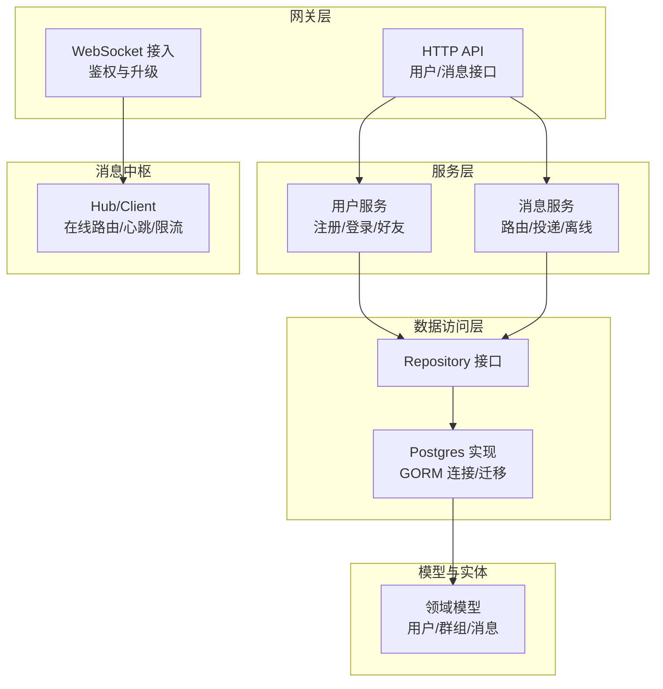
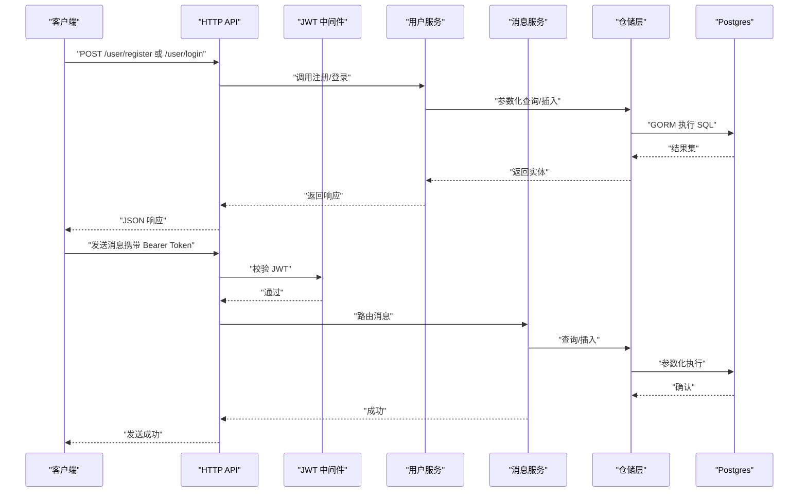
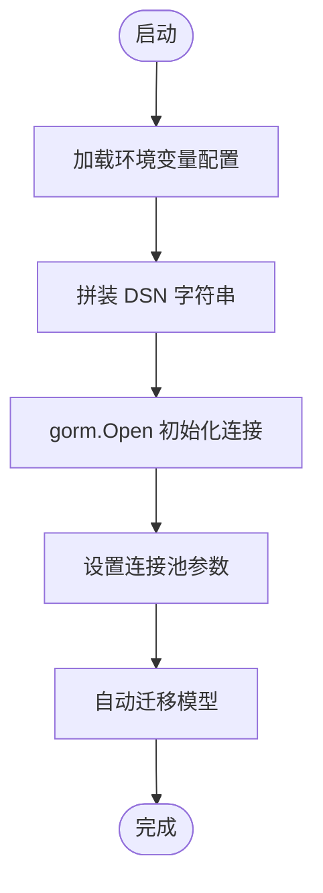
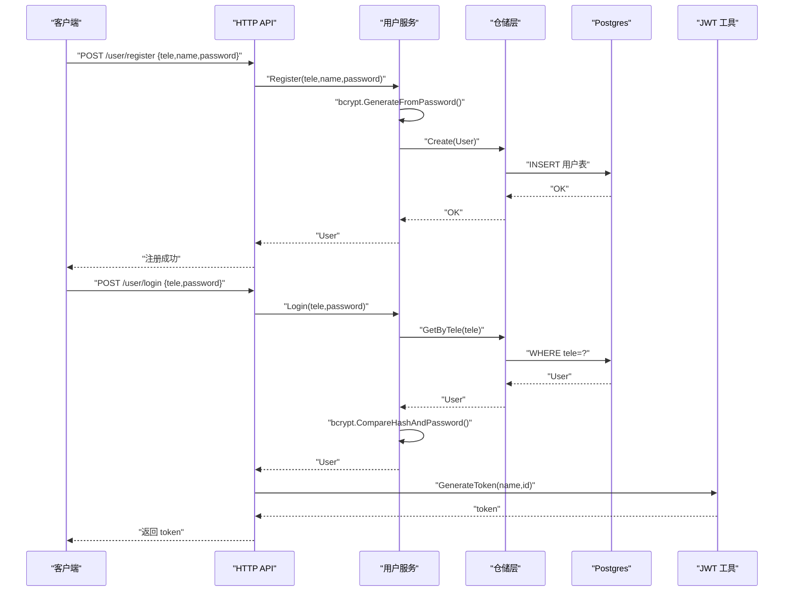
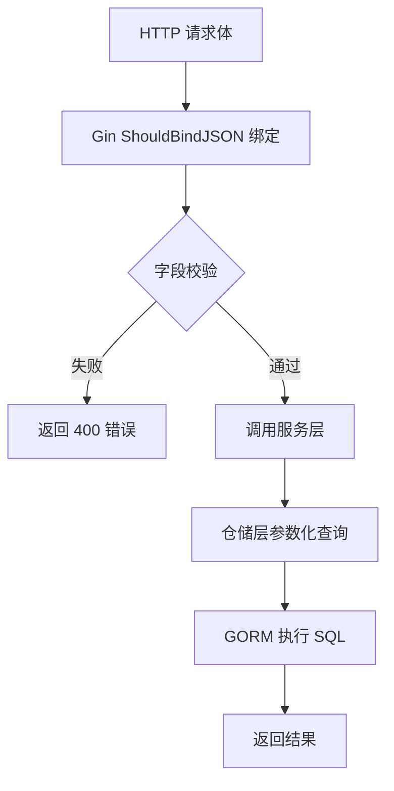
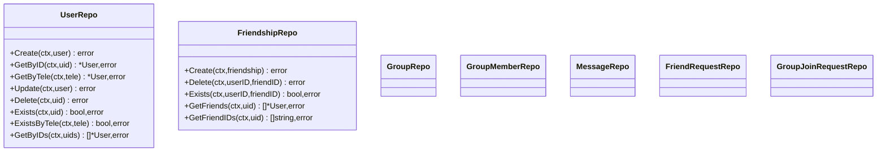
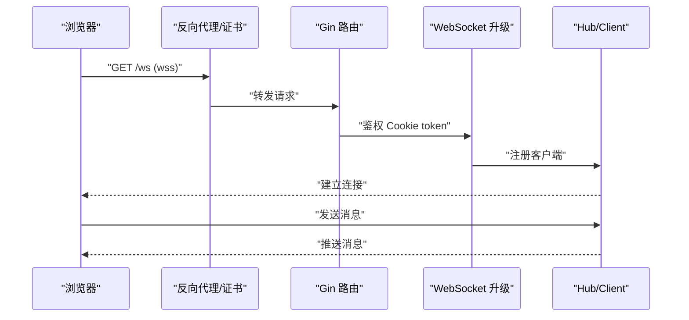
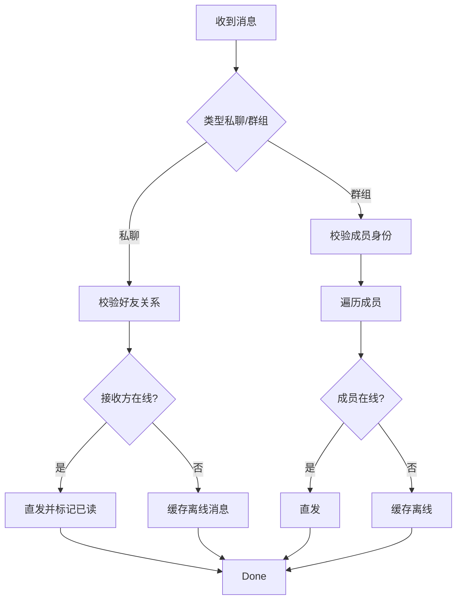
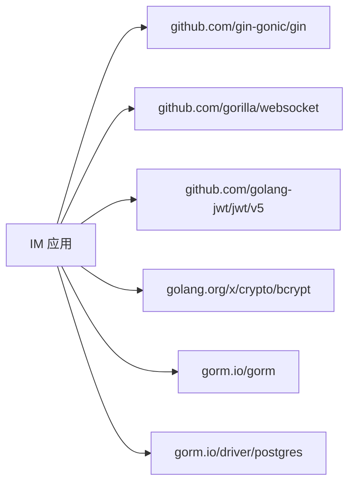

# 数据安全

<cite>
**本文引用的文件**
- [server/repository/postgres/init.go](file://server/repository/postgres/init.go)
- [server/repository/postgres/handler.go](file://server/repository/postgres/handler.go)
- [server/repository/interface.go](file://server/repository/interface.go)
- [server/model/models.go](file://server/model/models.go)
- [server/userservice/user_service.go](file://server/userservice/user_service.go)
- [server/msgservice/message_service.go](file://server/msgservice/message_service.go)
- [server/msgservice/hub/hub.go](file://server/msgservice/hub/hub.go)
- [server/msgservice/hub/client.go](file://server/msgservice/hub/client.go)
- [server/gateway/api/ws_handler.go](file://server/gateway/api/ws_handler.go)
- [server/gateway/auth/auth.go](file://server/gateway/auth/auth.go)
- [server/gateway/api/user_handler.go](file://server/gateway/api/user_handler.go)
- [server/gateway/api/message_handler.go](file://server/gateway/api/message_handler.go)
- [go.mod](file://go.mod)
- [go.sum](file://go.sum)
</cite>

## 目录
1. [简介](#简介)
2. [项目结构](#项目结构)
3. [核心组件](#核心组件)
4. [架构总览](#架构总览)
5. [详细组件分析](#详细组件分析)
6. [依赖关系分析](#依赖关系分析)
7. [性能与安全特性](#性能与安全特性)
8. [故障排查指南](#故障排查指南)
9. [结论](#结论)
10. [附录：安全配置清单与最佳实践](#附录安全配置清单与最佳实践)

## 简介
本文件面向Go语言即时通讯项目，聚焦数据安全设计与实现，覆盖数据库连接安全（连接池、SSL、凭据）、数据加密与解密（密码哈希、消息内容保护）、SQL注入防护（参数化查询与输入校验）、数据访问层安全（Repository模式与权限控制）、传输层安全（HTTPS与WebSocket安全）、数据备份与恢复策略、以及数据完整性与审计建议。文档以仓库中现有实现为依据，结合安全最佳实践给出改进建议与可操作清单。

## 项目结构
项目采用分层架构：网关层（HTTP/WebSocket）负责接入与鉴权；服务层封装业务逻辑；仓储层通过GORM访问PostgreSQL；消息中枢负责在线消息路由与离线缓存。

图示来源
- [server/gateway/api/user_handler.go:12-19](file://server/gateway/api/user_handler.go#L12-L19)
- [server/gateway/api/message_handler.go:12-18](file://server/gateway/api/message_handler.go#L12-L18)
- [server/gateway/api/ws_handler.go:30-37](file://server/gateway/api/ws_handler.go#L30-L37)
- [server/userservice/user_service.go:13-25](file://server/userservice/user_service.go#L13-L25)
- [server/msgservice/message_service.go:12-25](file://server/msgservice/message_service.go#L12-L25)
- [server/repository/interface.go:8-74](file://server/repository/interface.go#L8-L74)
- [server/repository/postgres/handler.go:21-27](file://server/repository/postgres/handler.go#L21-L27)
- [server/repository/postgres/init.go:42-65](file://server/repository/postgres/init.go#L42-L65)
- [server/model/models.go:23-146](file://server/model/models.go#L23-L146)
- [server/msgservice/hub/hub.go:10-25](file://server/msgservice/hub/hub.go#L10-L25)
- [server/msgservice/hub/client.go:12-30](file://server/msgservice/hub/client.go#L12-L30)

章节来源
- [server/gateway/api/user_handler.go:12-19](file://server/gateway/api/user_handler.go#L12-L19)
- [server/gateway/api/message_handler.go:12-18](file://server/gateway/api/message_handler.go#L12-L18)
- [server/gateway/api/ws_handler.go:30-37](file://server/gateway/api/ws_handler.go#L30-L37)
- [server/userservice/user_service.go:13-25](file://server/userservice/user_service.go#L13-L25)
- [server/msgservice/message_service.go:12-25](file://server/msgservice/message_service.go#L12-L25)
- [server/repository/interface.go:8-74](file://server/repository/interface.go#L8-L74)
- [server/repository/postgres/handler.go:21-27](file://server/repository/postgres/handler.go#L21-L27)
- [server/repository/postgres/init.go:42-65](file://server/repository/postgres/init.go#L42-L65)
- [server/model/models.go:23-146](file://server/model/models.go#L23-L146)
- [server/msgservice/hub/hub.go:10-25](file://server/msgservice/hub/hub.go#L10-L25)
- [server/msgservice/hub/client.go:12-30](file://server/msgservice/hub/client.go#L12-L30)

## 核心组件
- 数据库连接与连接池：Postgres初始化加载环境变量，设置DSN与SSL模式，并配置连接生命周期与最大连接数。
- 密码哈希：注册时使用bcrypt进行单向哈希存储，登录时比对哈希。
- 参数化查询与输入校验：仓储层广泛使用GORM Where/IN/Count等参数化查询；API层对请求体进行绑定与基本字段校验。
- JWT鉴权：生成与解析基于HS256，支持中间件校验与WebSocket Cookie鉴权。
- 消息路由与离线缓存：消息服务根据类型路由至私聊或群组，按在线状态选择直发或落库缓存。
- WebSocket安全：鉴权后升级，限制来源与缓冲区大小，设置读写超时与心跳。

章节来源
- [server/repository/postgres/init.go:15-65](file://server/repository/postgres/init.go#L15-L65)
- [server/userservice/user_service.go:27-67](file://server/userservice/user_service.go#L27-L67)
- [server/repository/postgres/handler.go:29-116](file://server/repository/postgres/handler.go#L29-L116)
- [server/gateway/auth/auth.go:22-90](file://server/gateway/auth/auth.go#L22-L90)
- [server/msgservice/message_service.go:27-108](file://server/msgservice/message_service.go#L27-L108)
- [server/gateway/api/ws_handler.go:14-68](file://server/gateway/api/ws_handler.go#L14-L68)

## 架构总览
下图展示从HTTP到数据库的关键数据流与安全控制点。

图示来源
- [server/gateway/api/user_handler.go:21-61](file://server/gateway/api/user_handler.go#L21-L61)
- [server/gateway/auth/auth.go:37-61](file://server/gateway/auth/auth.go#L37-L61)
- [server/userservice/user_service.go:27-67](file://server/userservice/user_service.go#L27-L67)
- [server/gateway/api/message_handler.go:19-44](file://server/gateway/api/message_handler.go#L19-L44)
- [server/msgservice/message_service.go:27-108](file://server/msgservice/message_service.go#L27-L108)
- [server/repository/postgres/handler.go:29-116](file://server/repository/postgres/handler.go#L29-L116)
- [server/repository/postgres/init.go:42-65](file://server/repository/postgres/init.go#L42-L65)

## 详细组件分析

### 数据库连接与凭据保护
- 环境变量加载：主机、端口、用户名、密码、数据库名、SSL模式均来自环境变量，避免硬编码。
- DSN拼装：统一在初始化函数中构造，便于集中管理。
- 连接池配置：设置最大空闲连接、最大打开连接、连接最大生命周期，降低资源争用与泄漏风险。
- SSL模式：通过环境变量控制，生产环境建议启用TLS（例如“require”）。

图示来源
- [server/repository/postgres/init.go:24-65](file://server/repository/postgres/init.go#L24-L65)

章节来源
- [server/repository/postgres/init.go:15-65](file://server/repository/postgres/init.go#L15-L65)

### 密码哈希与登录流程
- 注册：使用bcrypt对明文密码进行哈希存储，失败即刻返回错误。
- 登录：按手机号查询用户，使用bcrypt比对哈希，失败返回无效密码。
- 安全要点：未保存明文；错误信息不泄露具体原因；登录成功签发JWT。

图示来源
- [server/userservice/user_service.go:27-67](file://server/userservice/user_service.go#L27-L67)
- [server/repository/postgres/handler.go:45-54](file://server/repository/postgres/handler.go#L45-L54)
- [server/gateway/api/user_handler.go:21-61](file://server/gateway/api/user_handler.go#L21-L61)
- [server/gateway/auth/auth.go:22-34](file://server/gateway/auth/auth.go#L22-L34)

章节来源
- [server/userservice/user_service.go:27-67](file://server/userservice/user_service.go#L27-L67)
- [server/repository/postgres/handler.go:45-54](file://server/repository/postgres/handler.go#L45-L54)
- [server/gateway/api/user_handler.go:21-61](file://server/gateway/api/user_handler.go#L21-L61)
- [server/gateway/auth/auth.go:22-34](file://server/gateway/auth/auth.go#L22-L34)

### SQL注入防护与输入校验
- 参数化查询：仓储层广泛使用Where/IN/Count等方法，底层由GORM生成参数化SQL，有效防止注入。
- 输入校验：API层对JSON请求体进行绑定，检查必填字段；服务层对业务字段进行范围与关系校验。
- 建议增强：对长度、格式、枚举值进行白名单校验；对敏感字段增加长度上限与字符集限制。

图示来源
- [server/gateway/api/user_handler.go:21-37](file://server/gateway/api/user_handler.go#L21-L37)
- [server/gateway/api/message_handler.go:19-44](file://server/gateway/api/message_handler.go#L19-L44)
- [server/repository/postgres/handler.go:29-116](file://server/repository/postgres/handler.go#L29-L116)

章节来源
- [server/gateway/api/user_handler.go:21-37](file://server/gateway/api/user_handler.go#L21-L37)
- [server/gateway/api/message_handler.go:19-44](file://server/gateway/api/message_handler.go#L19-L44)
- [server/repository/postgres/handler.go:29-116](file://server/repository/postgres/handler.go#L29-L116)

### 数据访问层安全（Repository模式）
- 接口隔离：定义清晰的仓储接口，便于替换实现与单元测试。
- 查询封装：按领域对象封装常用查询（存在性、列表、计数），减少SQL散落。
- 权限控制：当前仓储未显式加入权限过滤，建议在查询入口增加上下文中的用户标识与资源边界判断。

图示来源
- [server/repository/interface.go:8-74](file://server/repository/interface.go#L8-L74)
- [server/repository/postgres/handler.go:21-585](file://server/repository/postgres/handler.go#L21-L585)

章节来源
- [server/repository/interface.go:8-74](file://server/repository/interface.go#L8-L74)
- [server/repository/postgres/handler.go:21-585](file://server/repository/postgres/handler.go#L21-L585)

### 传输层安全（HTTPS与WebSocket）
- HTTPS：建议在网关前部署反向代理（如Nginx/Caddy）开启TLS终止与强密码套件。
- WebSocket：当前鉴权通过Cookie中的token进行，建议：
  - 使用wss://协议；
  - 仅允许受信域名；
  - 启用SameSite=Lax/Strict，HttpOnly=true，Secure=true；
  - 在Hub层记录连接来源与用户标识，便于审计。

图示来源
- [server/gateway/api/ws_handler.go:14-68](file://server/gateway/api/ws_handler.go#L14-L68)
- [server/gateway/auth/auth.go:22-34](file://server/gateway/auth/auth.go#L22-L34)
- [server/msgservice/hub/hub.go:44-60](file://server/msgservice/hub/hub.go#L44-L60)
- [server/msgservice/hub/client.go:27-87](file://server/msgservice/hub/client.go#L27-L87)

章节来源
- [server/gateway/api/ws_handler.go:14-68](file://server/gateway/api/ws_handler.go#L14-L68)
- [server/gateway/auth/auth.go:22-34](file://server/gateway/auth/auth.go#L22-L34)
- [server/msgservice/hub/hub.go:44-60](file://server/msgservice/hub/hub.go#L44-L60)
- [server/msgservice/hub/client.go:27-87](file://server/msgservice/hub/client.go#L27-L87)

### 消息路由与离线缓存（含安全考量）
- 私聊路由：先校验双方是否为好友，再判断接收方在线；在线则直发，否则缓存至离线表。
- 群组路由：校验发送方是否为成员，遍历成员逐个投递，失败单独记录。
- 离线消息：统一落库，标记未读；拉取时批量标记已读，避免重复投递。
- 安全建议：对消息内容进行长度与格式限制；对群组消息投递失败进行重试与告警。

图示来源
- [server/msgservice/message_service.go:27-108](file://server/msgservice/message_service.go#L27-L108)
- [server/repository/postgres/handler.go:335-426](file://server/repository/postgres/handler.go#L335-L426)

章节来源
- [server/msgservice/message_service.go:27-108](file://server/msgservice/message_service.go#L27-L108)
- [server/repository/postgres/handler.go:335-426](file://server/repository/postgres/handler.go#L335-L426)

### 数据完整性与审计（建议）
- 完整性：利用数据库唯一索引（如用户手机号）与外键约束；服务层对关键状态转换进行幂等校验。
- 审计：建议在消息服务与用户服务的关键操作处增加审计事件（时间戳、用户ID、操作类型、目标ID、结果），落库或异步上报。

## 依赖关系分析
- 关键依赖：gin、gorilla/websocket、golang-jwt、gorm.io、bcrypt。
- 版本锁定：go.mod/go.sum确保依赖一致性与可复现构建。

图示来源
- [go.mod:5-12](file://go.mod#L5-L12)
- [go.sum:31-41](file://go.sum#L31-L41)

章节来源
- [go.mod:5-12](file://go.mod#L5-L12)
- [go.sum:31-41](file://go.sum#L31-L41)

## 性能与安全特性
- 连接池：合理设置最大连接数与空闲连接，避免高并发下的连接抖动。
- 参数化查询：默认使用GORM参数化，降低注入风险并提升执行计划复用。
- 密码哈希：bcrypt成本因子默认，兼顾安全性与性能。
- WebSocket：设置读写超时、心跳与消息大小限制，防止资源耗尽。

章节来源
- [server/repository/postgres/init.go:59-61](file://server/repository/postgres/init.go#L59-L61)
- [server/userservice/user_service.go:36-39](file://server/userservice/user_service.go#L36-L39)
- [server/msgservice/hub/client.go:20-25](file://server/msgservice/hub/client.go#L20-L25)

## 故障排查指南
- 数据库连接失败：检查环境变量与SSL模式；查看初始化日志与错误链路。
- 认证失败：确认Authorization头格式与签名算法；核对token过期与签发者配置。
- 参数化查询异常：关注Where/IN/Count的参数传递；避免字符串拼接。
- WebSocket拒绝：检查来源域名与Cookie Secure/HttpOnly属性；确认wss与证书有效性。
- 离线消息未送达：核查消息表状态与投递失败记录；检查Hub在线表与客户端通道容量。

章节来源
- [server/repository/postgres/init.go:50-52](file://server/repository/postgres/init.go#L50-L52)
- [server/gateway/auth/auth.go:64-90](file://server/gateway/auth/auth.go#L64-L90)
- [server/gateway/api/ws_handler.go:14-28](file://server/gateway/api/ws_handler.go#L14-L28)
- [server/msgservice/message_service.go:123-126](file://server/msgservice/message_service.go#L123-L126)

## 结论
本项目在数据安全方面已具备良好基础：参数化查询、密码哈希、JWT鉴权与连接池配置较为完善。建议在生产环境中进一步强化传输层TLS、来源校验、输入白名单、审计事件与备份恢复策略，以满足更严格的安全合规要求。

## 附录：安全配置清单与最佳实践
- 数据库
  - 使用环境变量管理凭据，禁用明文配置
  - 生产环境启用SSL（sslmode=require），并校验证书
  - 合理设置连接池参数，监控连接峰值与等待时间
- 认证与授权
  - 使用强随机密钥与HS256签名；限制token有效期
  - WebSocket使用wss与SameSite/Secure/HttpOnly Cookie
  - API中间件严格校验Authorization头格式
- 数据保护
  - 对用户输入进行白名单与长度限制；对消息内容做敏感词与格式校验
  - 对离线消息落库时记录必要审计字段（时间、用户、目标、类型）
- 传输安全
  - 反向代理启用TLS与现代密码套件；强制HTTP重定向HTTPS
  - WebSocket仅允许受信域名；限制消息大小与速率
- 备份与恢复
  - 定期导出数据库快照；验证恢复流程；加密备份介质
- 审计与监控
  - 记录关键操作（登录、消息投递、离线缓存、权限变更）
  - 监控异常登录、频繁失败、连接峰值与慢查询