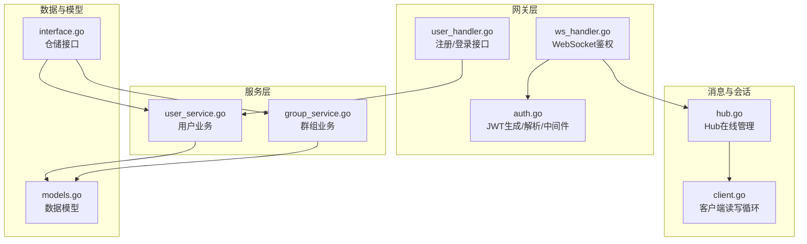
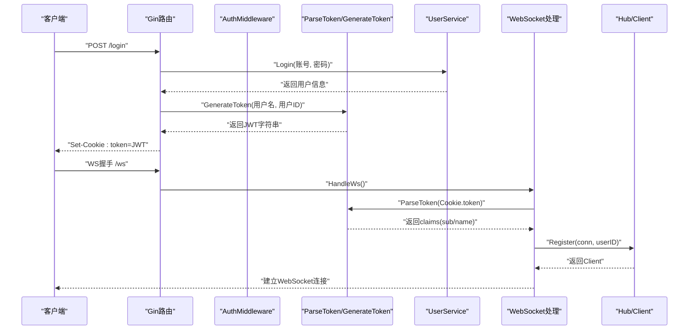
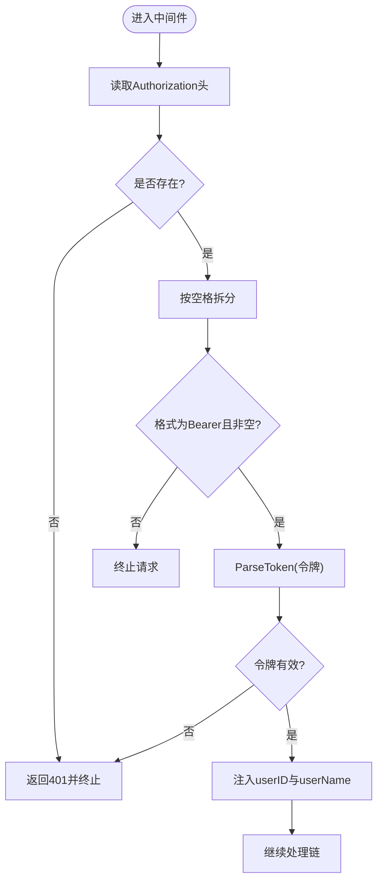
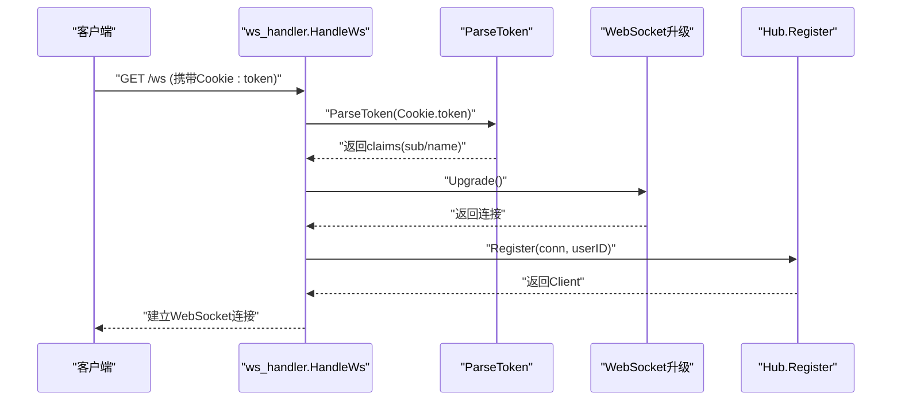
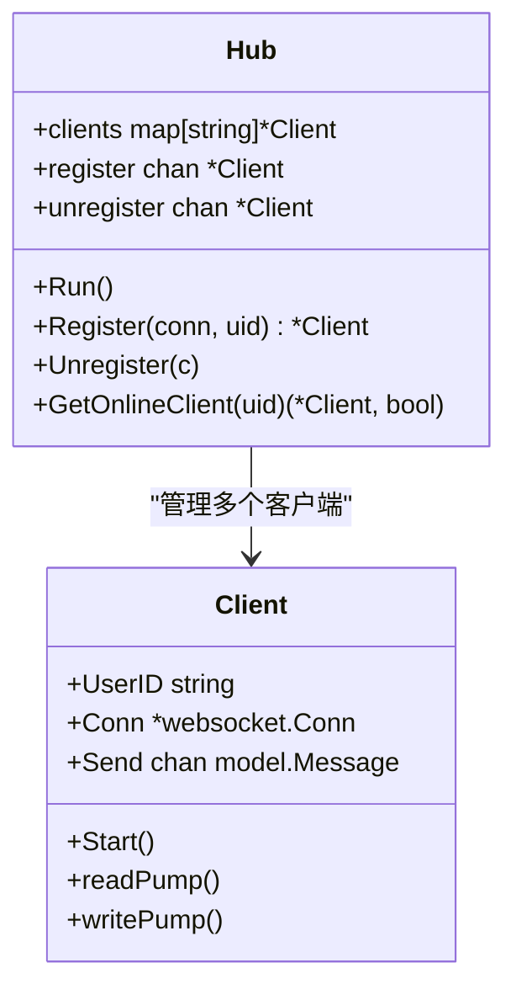
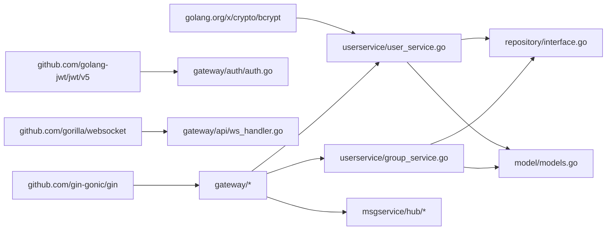

# 认证安全

<cite>
**本文引用的文件**
- [auth.go](file://server/gateway/auth/auth.go)
- [user_handler.go](file://server/gateway/api/user_handler.go)
- [ws_handler.go](file://server/gateway/api/ws_handler.go)
- [models.go](file://server/model/models.go)
- [user_service.go](file://server/userservice/user_service.go)
- [group_service.go](file://server/userservice/group_service.go)
- [hub.go](file://server/msgservice/hub/hub.go)
- [client.go](file://server/msgservice/hub/client.go)
- [interface.go](file://server/repository/interface.go)
- [go.mod](file://go.mod)
</cite>

## 目录
1. [简介](#简介)
2. [项目结构与认证相关模块](#项目结构与认证相关模块)
3. [核心组件](#核心组件)
4. [架构总览](#架构总览)
5. [详细组件分析](#详细组件分析)
6. [依赖关系分析](#依赖关系分析)
7. [性能与安全特性](#性能与安全特性)
8. [故障排查与安全日志](#故障排查与安全日志)
9. [结论](#结论)
10. [附录：最佳实践与改进建议](#附录最佳实践与改进建议)

## 简介
本文件聚焦于即时通讯项目的认证与安全机制，围绕以下目标展开：
- JWT令牌的生成、验证与过期管理
- AuthMiddleware中间件的实现原理（Authorization头解析、Bearer格式校验、令牌有效性检查）
- 令牌在用户会话中的作用（用户ID与用户名的提取）
- 令牌的安全存储与传输建议
- 令牌撤销与刷新策略的实现思路
- 多设备登录与会话管理的安全考量
- 认证失败的错误处理与安全日志记录

## 项目结构与认证相关模块
认证相关的关键模块分布如下：
- 网关层认证与HTTP接口
  - server/gateway/auth/auth.go：JWT生成、解析与中间件
  - server/gateway/api/user_handler.go：注册/登录接口，登录成功后通过Cookie下发令牌
  - server/gateway/api/ws_handler.go：WebSocket接入时从Cookie读取令牌进行鉴权
- 用户服务与业务逻辑
  - server/userservice/user_service.go：用户注册/登录等业务
  - server/userservice/group_service.go：群组相关业务
- 消息与会话
  - server/msgservice/hub/*：WebSocket连接管理与在线状态维护
- 数据模型与仓储接口
  - server/model/models.go：用户、群组、消息等数据模型
  - server/repository/interface.go：仓储接口定义



图表来源
- [auth.go:1-91](file://server/gateway/auth/auth.go#L1-L91)
- [user_handler.go:1-206](file://server/gateway/api/user_handler.go#L1-L206)
- [ws_handler.go:1-69](file://server/gateway/api/ws_handler.go#L1-L69)
- [user_service.go:1-187](file://server/userservice/user_service.go#L1-L187)
- [group_service.go:1-217](file://server/userservice/group_service.go#L1-L217)
- [hub.go:1-61](file://server/msgservice/hub/hub.go#L1-L61)
- [client.go:1-88](file://server/msgservice/hub/client.go#L1-L88)
- [models.go:1-146](file://server/model/models.go#L1-L146)
- [interface.go:1-74](file://server/repository/interface.go#L1-L74)

章节来源
- [auth.go:1-91](file://server/gateway/auth/auth.go#L1-L91)
- [user_handler.go:1-206](file://server/gateway/api/user_handler.go#L1-L206)
- [ws_handler.go:1-69](file://server/gateway/api/ws_handler.go#L1-L69)
- [user_service.go:1-187](file://server/userservice/user_service.go#L1-L187)
- [group_service.go:1-217](file://server/userservice/group_service.go#L1-L217)
- [hub.go:1-61](file://server/msgservice/hub/hub.go#L1-L61)
- [client.go:1-88](file://server/msgservice/hub/client.go#L1-L88)
- [models.go:1-146](file://server/model/models.go#L1-L146)
- [interface.go:1-74](file://server/repository/interface.go#L1-L74)

## 核心组件
- JWT生成与解析
  - 生成：使用HS256签名算法，声明包含用户名称、用户ID、签发时间与过期时间
  - 解析：限定仅允许HS256，要求过期时间、签发时间存在且未早于生效时间
- 中间件AuthMiddleware
  - 从Authorization头解析Bearer令牌
  - 调用ParseToken完成签名与有效期校验
  - 将用户ID与用户名注入上下文供后续处理器使用
- 登录流程
  - 登录成功后生成JWT，并通过Set-Cookie下发，Secure与HttpOnly开启
- WebSocket接入
  - 从Cookie读取token，调用ParseToken进行鉴权，再建立连接并注册到Hub

章节来源
- [auth.go:22-34](file://server/gateway/auth/auth.go#L22-L34)
- [auth.go:37-61](file://server/gateway/auth/auth.go#L37-L61)
- [auth.go:64-90](file://server/gateway/auth/auth.go#L64-L90)
- [user_handler.go:39-61](file://server/gateway/api/user_handler.go#L39-L61)
- [ws_handler.go:39-68](file://server/gateway/api/ws_handler.go#L39-L68)

## 架构总览
下图展示了从HTTP请求到WebSocket连接的认证链路，以及中间件如何在请求生命周期中插入鉴权逻辑。



图表来源
- [user_handler.go:39-61](file://server/gateway/api/user_handler.go#L39-L61)
- [ws_handler.go:39-68](file://server/gateway/api/ws_handler.go#L39-L68)
- [auth.go:22-34](file://server/gateway/auth/auth.go#L22-L34)
- [auth.go:64-90](file://server/gateway/auth/auth.go#L64-L90)
- [hub.go:44-51](file://server/msgservice/hub/hub.go#L44-L51)

## 详细组件分析

### JWT令牌生成与声明
- 声明内容
  - sub：用户ID
  - name：用户名
  - iat：签发时间
  - exp：过期时间（当前设置为24小时）
- 签名算法
  - HS256（HMAC-SHA256）
- 安全要点
  - 当前密钥为固定字节数组，应替换为强随机密钥并妥善保管
  - 建议增加jti（唯一标识）以支持撤销
  - 建议增加iss（发行者）、aud（受众）等字段增强防重放能力

章节来源
- [auth.go:22-34](file://server/gateway/auth/auth.go#L22-L34)

### JWT令牌解析与验证
- 方法限制
  - 仅允许HS256
- 必要条件
  - 过期时间必须存在且有效
  - 签发时间必须存在
  - 生效时间（NotBefore）必须存在
- 错误处理
  - 解析失败或无效令牌时返回错误
  - 中间件在解析失败时返回未授权响应

章节来源
- [auth.go:64-90](file://server/gateway/auth/auth.go#L64-L90)

### AuthMiddleware中间件
- 请求头解析
  - 读取Authorization头，按空格拆分
  - 校验是否为Bearer格式且令牌非空
- 令牌验证
  - 调用ParseToken执行签名与有效期校验
- 上下文注入
  - 将用户ID与用户名注入上下文键值，供后续处理器使用
- 终止与放行
  - 无令牌或令牌无效时终止请求并返回未授权
  - 否则调用c.Next()继续处理链



图表来源
- [auth.go:37-61](file://server/gateway/auth/auth.go#L37-L61)
- [auth.go:64-90](file://server/gateway/auth/auth.go#L64-L90)

章节来源
- [auth.go:37-61](file://server/gateway/auth/auth.go#L37-L61)

### 登录与Cookie下发
- 登录成功后生成JWT
- 设置Cookie：
  - 名称：token
  - 值：JWT字符串
  - 过期时间：24小时
  - SameSite：Lax
  - Secure：true（仅HTTPS）
  - HttpOnly：true（禁止JS访问）

```mermaid
sequenceDiagram
participant Client as "客户端"
participant UserHandler as "UserHandler.login"
participant JWT as "GenerateToken"
participant Cookie as "Set-Cookie"
Client->>UserHandler : "POST /login"
UserHandler->>JWT : "生成JWT"
JWT-->>UserHandler : "返回JWT"
UserHandler->>Cookie : "Set-Cookie : token=JWT; Secure; HttpOnly; SameSite=Lax"
UserHandler-->>Client : "返回登录成功"
```

图表来源
- [user_handler.go:39-61](file://server/gateway/api/user_handler.go#L39-L61)
- [auth.go:22-34](file://server/gateway/auth/auth.go#L22-L34)

章节来源
- [user_handler.go:39-61](file://server/gateway/api/user_handler.go#L39-L61)

### WebSocket接入与鉴权
- 从Cookie读取token
- 调用ParseToken进行鉴权
- 成功后建立WebSocket连接并注册到Hub
- Hub基于用户ID维护在线客户端映射



图表来源
- [ws_handler.go:39-68](file://server/gateway/api/ws_handler.go#L39-L68)
- [auth.go:64-90](file://server/gateway/auth/auth.go#L64-L90)
- [hub.go:44-51](file://server/msgservice/hub/hub.go#L44-L51)

章节来源
- [ws_handler.go:39-68](file://server/gateway/api/ws_handler.go#L39-L68)
- [hub.go:44-51](file://server/msgservice/hub/hub.go#L44-L51)

### 会话与在线状态管理
- Hub维护用户ID到客户端的映射
- 客户端读写循环负责心跳、消息收发与异常关闭清理
- 通过Hub可查询在线客户端，便于广播或定向推送



图表来源
- [hub.go:10-61](file://server/msgservice/hub/hub.go#L10-L61)
- [client.go:12-88](file://server/msgservice/hub/client.go#L12-L88)

章节来源
- [hub.go:10-61](file://server/msgservice/hub/hub.go#L10-L61)
- [client.go:12-88](file://server/msgservice/hub/client.go#L12-L88)

## 依赖关系分析
- 外部库
  - Gin：Web框架
  - JWT v5：JWT生成与解析
  - Gorilla WebSocket：WebSocket协议
  - bcrypt：密码哈希
- 内部模块
  - gateway/auth：认证与中间件
  - gateway/api：HTTP接口
  - userservice：用户/群组业务
  - msgservice/hub：WebSocket会话管理
  - repository：仓储接口
  - model：数据模型



图表来源
- [go.mod:5-12](file://go.mod#L5-L12)
- [auth.go:1-12](file://server/gateway/auth/auth.go#L1-L12)
- [user_handler.go:1-10](file://server/gateway/api/user_handler.go#L1-L10)
- [ws_handler.go:1-12](file://server/gateway/api/ws_handler.go#L1-L12)
- [user_service.go:1-11](file://server/userservice/user_service.go#L1-L11)
- [group_service.go:1-9](file://server/userservice/group_service.go#L1-L9)
- [interface.go:1-74](file://server/repository/interface.go#L1-L74)
- [models.go:1-7](file://server/model/models.go#L1-L7)

章节来源
- [go.mod:5-12](file://go.mod#L5-L12)

## 性能与安全特性
- 性能
  - JWT解析为纯内存计算，开销极低
  - WebSocket连接采用心跳与限流通道，避免阻塞
- 安全
  - 使用HS256签名，需妥善保管密钥
  - Cookie启用Secure与HttpOnly，降低XSS与窃听风险
  - 中间件强制Bearer格式，防止误用
  - 令牌包含iat与exp，确保时效性

章节来源
- [auth.go:22-34](file://server/gateway/auth/auth.go#L22-L34)
- [auth.go:64-90](file://server/gateway/auth/auth.go#L64-L90)
- [user_handler.go:58-60](file://server/gateway/api/user_handler.go#L58-L60)
- [client.go:20-25](file://server/msgservice/hub/client.go#L20-L25)

## 故障排查与安全日志
- 常见问题
  - 缺少Authorization头或格式不正确：中间件直接返回未授权
  - 令牌解析失败或已过期：返回未授权
  - WebSocket升级失败：记录错误并终止
- 建议的日志
  - 记录认证失败原因（缺少令牌、格式错误、签名失败、过期等）
  - 记录WebSocket接入来源与用户ID，便于审计
  - 对异常关闭与读写错误进行分级日志输出

章节来源
- [auth.go:37-61](file://server/gateway/auth/auth.go#L37-L61)
- [auth.go:64-90](file://server/gateway/auth/auth.go#L64-L90)
- [ws_handler.go:14-28](file://server/gateway/api/ws_handler.go#L14-L28)
- [client.go:42-59](file://server/msgservice/hub/client.go#L42-L59)

## 结论
当前实现提供了基础的JWT认证与中间件拦截能力，结合Cookie下发与WebSocket鉴权，满足了IM系统的基本安全需求。为进一步提升安全性与可运维性，建议在后续版本中引入密钥轮换、令牌撤销列表、刷新令牌策略、更严格的CORS与安全头配置，以及完善的审计与告警机制。

## 附录：最佳实践与改进建议
- 令牌声明与签名
  - 使用强随机密钥并定期轮换
  - 引入jti、iss、aud等字段，增强防重放
  - 严格控制过期时间，结合刷新令牌策略
- 存储与传输
  - Cookie启用Secure与HttpOnly；跨站场景谨慎使用SameSite
  - HTTPS生产环境必须开启
- 撤销与刷新
  - 引入黑名单或短期令牌+刷新令牌模式
  - 在登出时使旧令牌失效
- 多设备与会话管理
  - 为每个设备颁发独立令牌，支持踢人与批量登出
  - Hub中按设备维度维护连接，避免会话冲突
- 错误处理与日志
  - 明确区分“缺少令牌”“格式错误”“签名失败”“过期”等错误类型
  - 记录关键事件（登录、登出、WebSocket接入、异常关闭）并分级告警