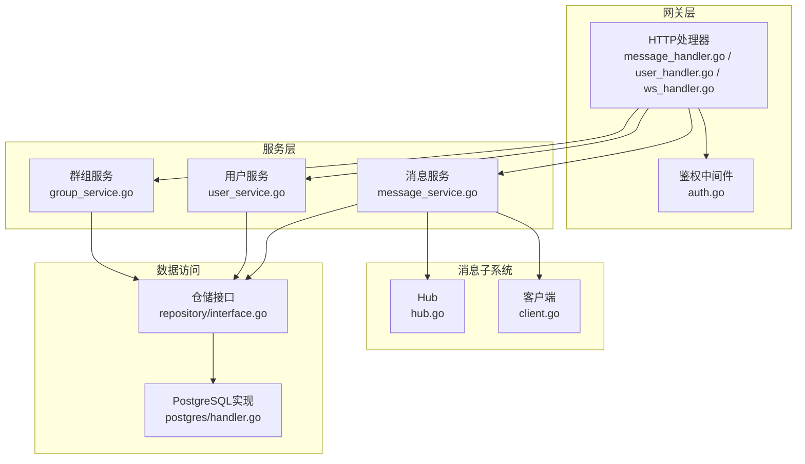
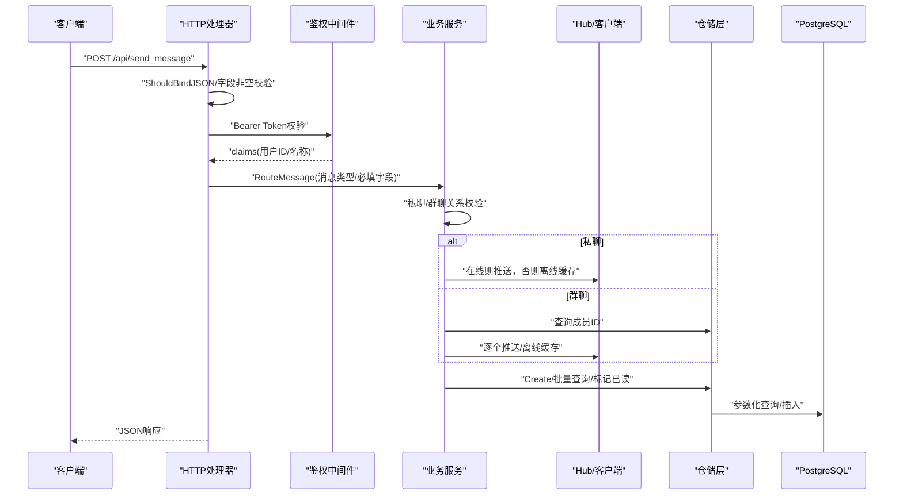
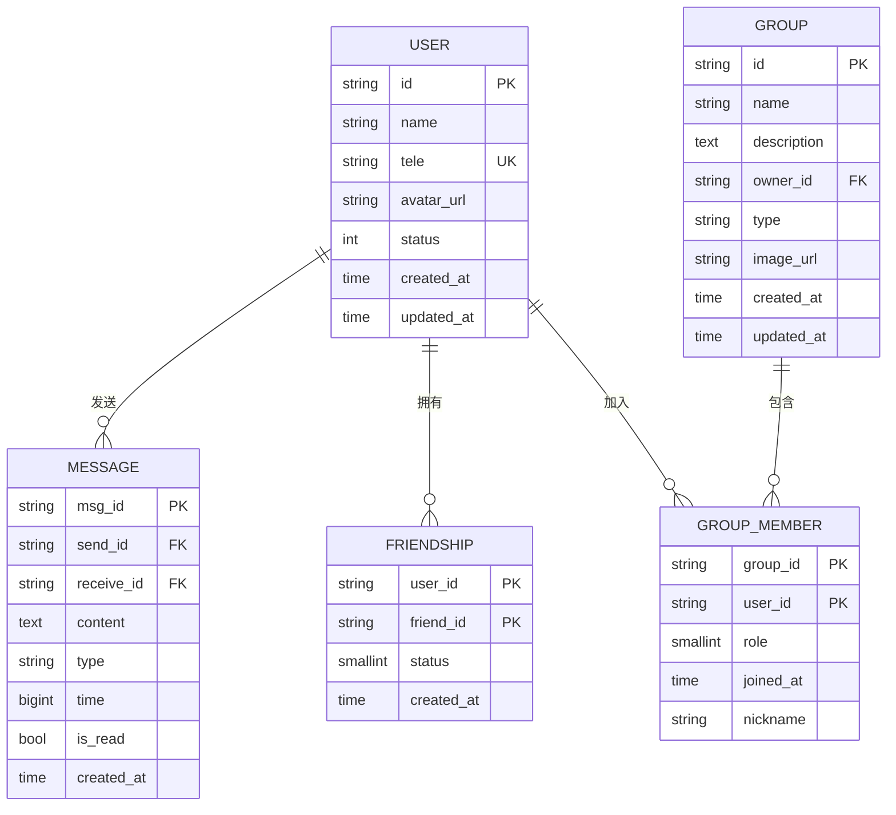

# 输入验证与清理

<cite>
**本文引用的文件**
- [server/gateway/api/message_handler.go](file://server/gateway/api/message_handler.go)
- [server/gateway/api/user_handler.go](file://server/gateway/api/user_handler.go)
- [server/gateway/api/ws_handler.go](file://server/gateway/api/ws_handler.go)
- [server/gateway/auth/auth.go](file://server/gateway/auth/auth.go)
- [server/model/models.go](file://server/model/models.go)
- [server/msgservice/message_service.go](file://server/msgservice/message_service.go)
- [server/msgservice/hub/client.go](file://server/msgservice/hub/client.go)
- [server/msgservice/hub/hub.go](file://server/msgservice/hub/hub.go)
- [server/userservice/user_service.go](file://server/userservice/user_service.go)
- [server/userservice/group_service.go](file://server/userservice/group_service.go)
- [server/repository/postgres/handler.go](file://server/repository/postgres/handler.go)
- [server/repository/interface.go](file://server/repository/interface.go)
- [go.mod](file://go.mod)
</cite>

## 目录
1. [简介](#简介)
2. [项目结构](#项目结构)
3. [核心组件](#核心组件)
4. [架构总览](#架构总览)
5. [详细组件分析](#详细组件分析)
6. [依赖分析](#依赖分析)
7. [性能考虑](#性能考虑)
8. [故障排查指南](#故障排查指南)
9. [结论](#结论)
10. [附录](#附录)

## 简介
本文件聚焦于该Go语言即时通讯项目的输入验证与清理机制，覆盖以下方面：
- HTTP请求参数的验证与绑定策略
- 用户注册与登录表单的字段校验与业务规则
- 消息内容与类型的安全检查（含白名单/黑名单思路）
- 数据库查询参数的SQL安全处理
- WebSocket消息的实时读写限制与基本校验
- 文件上传相关的安全建议与限制策略
- 错误输入的处理与用户反馈机制
- 日志记录中的敏感信息脱敏建议

## 项目结构
项目采用分层与职责分离的设计：网关层负责HTTP路由与鉴权；服务层封装业务逻辑；仓储层通过GORM访问PostgreSQL；消息子系统包含Hub与客户端读写泵。

图表来源
- [server/gateway/api/message_handler.go:1-66](file://server/gateway/api/message_handler.go#L1-L66)
- [server/gateway/api/user_handler.go:1-206](file://server/gateway/api/user_handler.go#L1-L206)
- [server/gateway/api/ws_handler.go:1-69](file://server/gateway/api/ws_handler.go#L1-L69)
- [server/gateway/auth/auth.go:1-91](file://server/gateway/auth/auth.go#L1-L91)
- [server/msgservice/message_service.go:1-168](file://server/msgservice/message_service.go#L1-L168)
- [server/msgservice/hub/hub.go:1-61](file://server/msgservice/hub/hub.go#L1-L61)
- [server/msgservice/hub/client.go:1-88](file://server/msgservice/hub/client.go#L1-L88)
- [server/repository/interface.go:1-74](file://server/repository/interface.go#L1-L74)
- [server/repository/postgres/handler.go:1-585](file://server/repository/postgres/handler.go#L1-L585)

章节来源
- [server/gateway/api/message_handler.go:1-66](file://server/gateway/api/message_handler.go#L1-L66)
- [server/gateway/api/user_handler.go:1-206](file://server/gateway/api/user_handler.go#L1-L206)
- [server/gateway/api/ws_handler.go:1-69](file://server/gateway/api/ws_handler.go#L1-L69)
- [server/gateway/auth/auth.go:1-91](file://server/gateway/auth/auth.go#L1-L91)
- [server/msgservice/message_service.go:1-168](file://server/msgservice/message_service.go#L1-L168)
- [server/msgservice/hub/hub.go:1-61](file://server/msgservice/hub/hub.go#L1-L61)
- [server/msgservice/hub/client.go:1-88](file://server/msgservice/hub/client.go#L1-L88)
- [server/repository/interface.go:1-74](file://server/repository/interface.go#L1-L74)
- [server/repository/postgres/handler.go:1-585](file://server/repository/postgres/handler.go#L1-L585)

## 核心组件
- HTTP处理器：统一进行请求体绑定与基础字段校验，并在失败时返回明确的错误响应。
- 鉴权中间件：基于Bearer Token与JWT解析，确保后续业务调用具备合法身份。
- 业务服务：在服务层补充更严格的业务规则校验（如好友关系、群成员关系）。
- 仓储层：使用GORM原生查询与占位符参数，避免字符串拼接引发SQL注入。
- WebSocket：设置读写限制、心跳保活与读取上限，防止消息过大或DoS。

章节来源
- [server/gateway/api/message_handler.go:19-44](file://server/gateway/api/message_handler.go#L19-L44)
- [server/gateway/api/user_handler.go:21-61](file://server/gateway/api/user_handler.go#L21-L61)
- [server/gateway/api/ws_handler.go:39-68](file://server/gateway/api/ws_handler.go#L39-L68)
- [server/gateway/auth/auth.go:37-61](file://server/gateway/auth/auth.go#L37-L61)
- [server/msgservice/message_service.go:27-44](file://server/msgservice/message_service.go#L27-L44)
- [server/repository/postgres/handler.go:335-426](file://server/repository/postgres/handler.go#L335-L426)

## 架构总览
下图展示从HTTP到服务与数据库的端到端流程，以及关键的输入验证与清理节点。

图表来源
- [server/gateway/api/message_handler.go:19-44](file://server/gateway/api/message_handler.go#L19-L44)
- [server/gateway/auth/auth.go:37-61](file://server/gateway/auth/auth.go#L37-L61)
- [server/msgservice/message_service.go:27-108](file://server/msgservice/message_service.go#L27-L108)
- [server/msgservice/hub/hub.go:44-60](file://server/msgservice/hub/hub.go#L44-L60)
- [server/repository/postgres/handler.go:335-426](file://server/repository/postgres/handler.go#L335-L426)

## 详细组件分析

### HTTP请求参数绑定与基础校验
- JSON绑定与字段非空校验：所有API处理器在接收请求体后，先进行绑定与必填字段检查，若失败立即返回错误。
- 登录/注册场景：除JSON绑定外，还显式检查关键字段是否为空，避免空值进入后续流程。
- 统一错误响应：对非法输入返回明确的错误码与提示，便于前端处理。

章节来源
- [server/gateway/api/message_handler.go:26-30](file://server/gateway/api/message_handler.go#L26-L30)
- [server/gateway/api/user_handler.go:27-30](file://server/gateway/api/user_handler.go#L27-L30)
- [server/gateway/api/user_handler.go:44-47](file://server/gateway/api/user_handler.go#L44-L47)

### 用户注册与登录表单安全
- 注册：校验电话、姓名、密码均非空；密码经bcrypt哈希存储；重复手机号检查。
- 登录：按手机号查询用户，比对哈希后的密码；成功后签发JWT并以安全Cookie下发token。
- 会话安全：登录时设置SameSite/Lax、HttpOnly与Secure标志（注：当前示例未设置Secure，建议生产环境开启）。

章节来源
- [server/gateway/api/user_handler.go:21-61](file://server/gateway/api/user_handler.go#L21-L61)
- [server/userservice/user_service.go:27-67](file://server/userservice/user_service.go#L27-L67)
- [server/gateway/auth/auth.go:22-34](file://server/gateway/auth/auth.go#L22-L34)

### JWT鉴权与中间件
- 中间件解析Authorization头，校验Token格式与签名方法；解析失败直接拒绝。
- 将用户标识与名称注入上下文，供后续处理器使用。
- 建议：生产环境应启用过期时间、签发时间等严格校验，并考虑刷新令牌策略。

章节来源
- [server/gateway/auth/auth.go:37-61](file://server/gateway/auth/auth.go#L37-L61)
- [server/gateway/auth/auth.go:64-90](file://server/gateway/auth/auth.go#L64-L90)

### 消息内容与类型的安全检查
- 必填字段校验：发送消息前要求发送方、接收方与内容均存在。
- 类型白名单：仅允许“私聊/群聊”两类类型，未知类型直接拒绝。
- 业务规则：私聊需为好友，群聊需为群成员；不满足条件直接报错。
- 内容长度：WebSocket读取设置上限，防止超大消息导致内存压力。

章节来源
- [server/msgservice/message_service.go:27-44](file://server/msgservice/message_service.go#L27-L44)
- [server/msgservice/message_service.go:46-66](file://server/msgservice/message_service.go#L46-L66)
- [server/msgservice/message_service.go:68-108](file://server/msgservice/message_service.go#L68-L108)
- [server/msgservice/hub/client.go:20-25](file://server/msgservice/hub/client.go#L20-L25)
- [server/msgservice/hub/client.go:36-41](file://server/msgservice/hub/client.go#L36-L41)

### 数据库查询参数的安全处理
- 参数化查询：仓储层使用GORM原生查询与占位符参数，避免字符串拼接。
- 关键查询点：按ID/手机号/名称查询用户；按ID/状态查询消息；IN查询批量ID等。
- 建议：对可变输入（如排序、分页）进行白名单控制，避免注入风险。

章节来源
- [server/repository/postgres/handler.go:35-54](file://server/repository/postgres/handler.go#L35-L54)
- [server/repository/postgres/handler.go:109-115](file://server/repository/postgres/handler.go#L109-L115)
- [server/repository/postgres/handler.go:354-426](file://server/repository/postgres/handler.go#L354-L426)

### WebSocket消息的实时验证与清理
- 读取限制：设置最大消息尺寸与读取截止时间，配合pong保活。
- 心跳保活：定时Ping/Pong维持连接活性，异常关闭自动清理。
- 消息反序列化：读取后尝试JSON反序列化，失败则忽略，避免异常传播。
- 发送队列：带缓冲通道，避免阻塞主线程；异常时及时关闭连接。

章节来源
- [server/msgservice/hub/client.go:20-25](file://server/msgservice/hub/client.go#L20-L25)
- [server/msgservice/hub/client.go:36-60](file://server/msgservice/hub/client.go#L36-L60)
- [server/msgservice/hub/client.go:61-87](file://server/msgservice/hub/client.go#L61-L87)
- [server/msgservice/hub/hub.go:44-60](file://server/msgservice/hub/hub.go#L44-L60)

### 文件上传的安全验证与大小限制
- 当前仓库未发现文件上传相关实现。
- 安全建议（通用实践）：
  - 限制文件大小与数量；
  - 白名单扩展名与MIME类型；
  - 存储路径随机化与不可执行权限；
  - 异步病毒扫描与预览生成；
  - 对外访问通过独立CDN/对象存储并禁用直接执行。

（本节为概念性指导，不对应具体源码）

### 错误输入的处理策略与用户反馈机制
- HTTP处理器：对绑定失败与必填字段缺失返回400错误与明确提示。
- 业务服务：对关系校验失败、不存在实体等返回语义化错误。
- WebSocket：读取异常时记录日志并断开连接，避免异常扩散。
- 建议：统一错误码与国际化文案，便于前端一致化处理。

章节来源
- [server/gateway/api/message_handler.go:26-30](file://server/gateway/api/message_handler.go#L26-L30)
- [server/gateway/api/user_handler.go:27-30](file://server/gateway/api/user_handler.go#L27-L30)
- [server/msgservice/message_service.go:47-53](file://server/msgservice/message_service.go#L47-L53)
- [server/msgservice/hub/client.go:43-59](file://server/msgservice/hub/client.go#L43-L59)

### 日志记录中的敏感信息脱敏处理
- 当前仓库未发现集中化的日志脱敏实现。
- 建议（通用实践）：
  - 脱敏字段：手机号、密码、Token、IP地址等；
  - 记录方式：统一日志结构体，脱敏后再输出；
  - 存储：避免将敏感信息写入审计日志或错误堆栈；
  - 传输：日志采集链路加密与最小化授权。

（本节为概念性指导，不对应具体源码）

## 依赖分析
- Web框架：Gin（路由与中间件）
- JWT：golang-jwt（Token签发与解析）
- WebSocket：gorilla/websocket（升级与读写）
- 加密：bcrypt（密码哈希）
- ORM：GORM（PostgreSQL驱动）

章节来源
- [go.mod:5-12](file://go.mod#L5-L12)

## 性能考虑
- 请求绑定与校验前置：尽早失败，减少无效计算。
- 消息投递：优先在线直发，缓冲区大小合理配置；离线缓存批量写入。
- 查询优化：索引覆盖常见查询（ID/手机号/状态/时间），分页limit/offset控制。
- 连接管理：Hub并发注册/注销使用互斥锁，避免竞态；客户端心跳周期与超时合理设置。

（本节为通用指导，不对应具体源码）

## 故障排查指南
- 登录失败
  - 检查Authorization头格式与Bearer前缀；
  - 校验Token签名方法与过期时间；
  - 确认用户是否存在且密码正确。
- 发送消息失败
  - 确认消息类型为“私聊/群聊”之一；
  - 私聊需为好友，群聊需为群成员；
  - 检查内容与双方ID是否为空。
- WebSocket无法连接
  - 检查Origin白名单与Cookie携带；
  - 观察读写超时与心跳是否正常；
  - 查看连接关闭原因码。

章节来源
- [server/gateway/auth/auth.go:37-61](file://server/gateway/auth/auth.go#L37-L61)
- [server/msgservice/message_service.go:27-44](file://server/msgservice/message_service.go#L27-L44)
- [server/msgservice/hub/client.go:36-60](file://server/msgservice/hub/client.go#L36-L60)
- [server/gateway/api/ws_handler.go:14-28](file://server/gateway/api/ws_handler.go#L14-L28)

## 结论
本项目在输入验证与清理方面采取了多层防护：
- HTTP层进行基础绑定与字段校验；
- 业务层补充关系与规则校验；
- 仓储层使用参数化查询避免SQL注入；
- WebSocket设置读写限制与心跳保活；
- 登录采用JWT与bcrypt增强认证与存储安全。

建议在生产环境中进一步完善：
- 补充文件上传安全策略；
- 实施统一日志脱敏；
- 强化错误码与国际化文案；
- 引入速率限制与WAF等纵深防御。

## 附录

### 数据模型与字段约束

图表来源
- [server/model/models.go:23-50](file://server/model/models.go#L23-L50)
- [server/model/models.go:67-105](file://server/model/models.go#L67-L105)