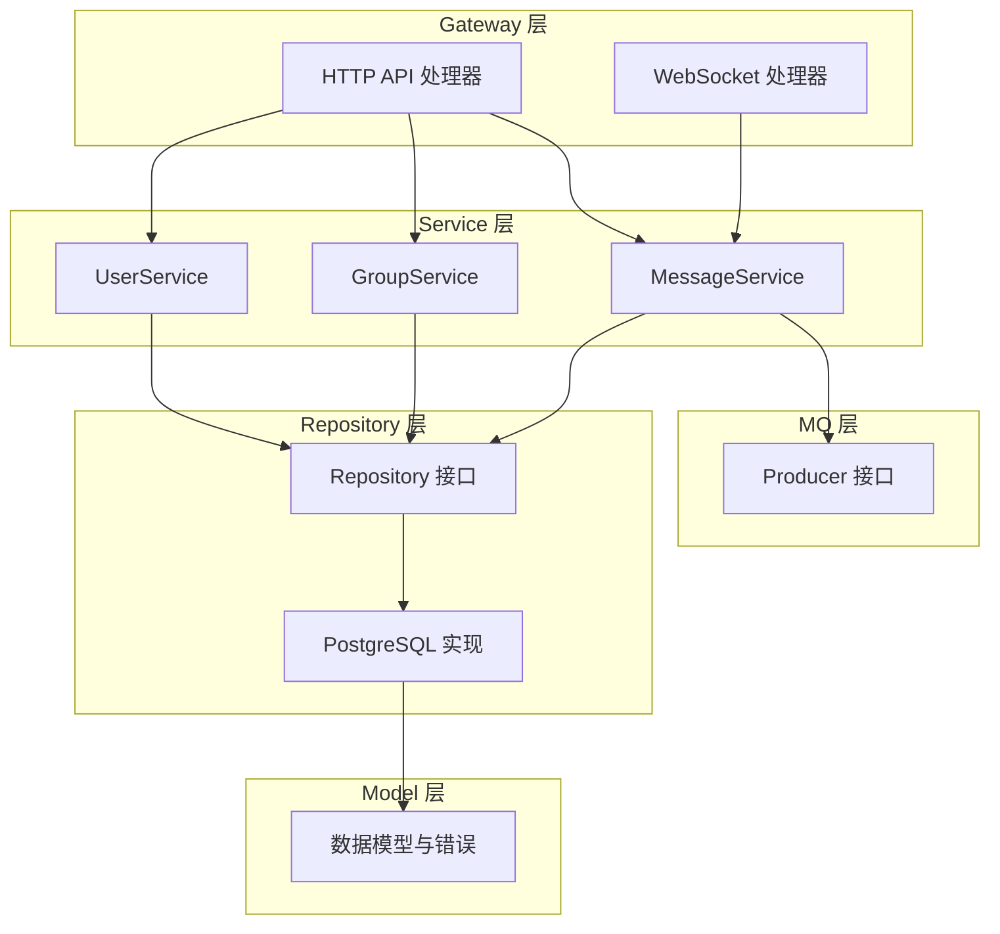
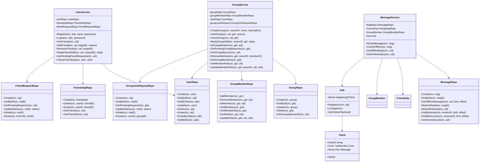
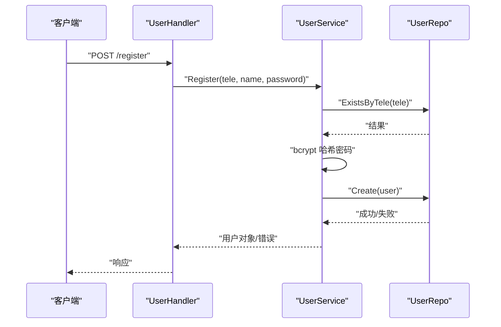
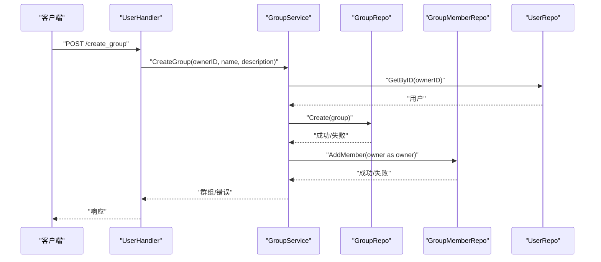
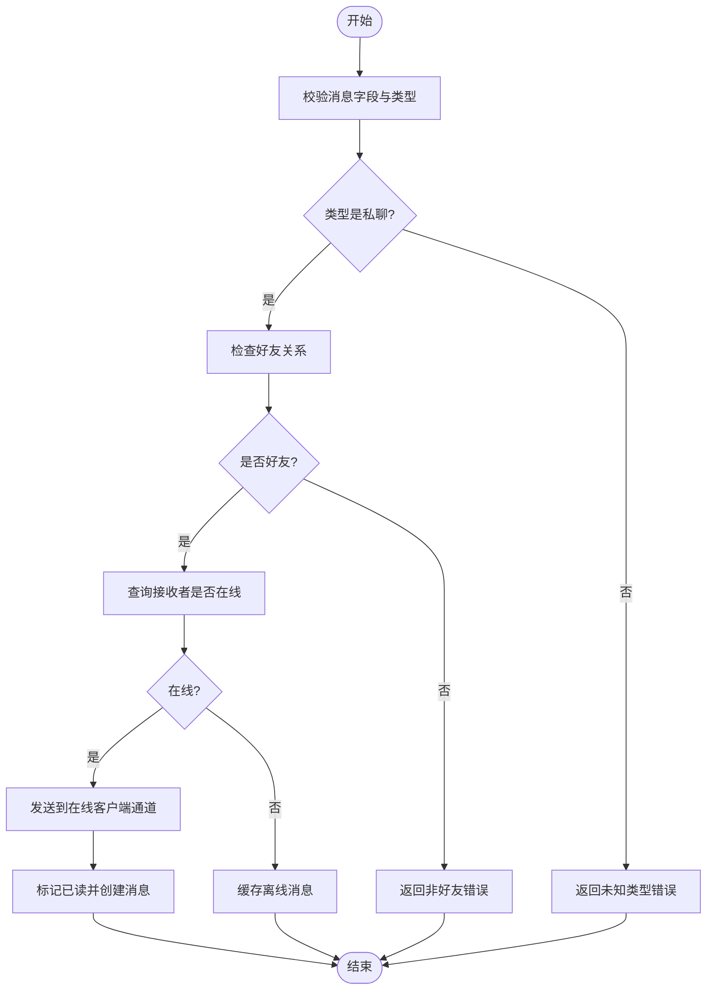
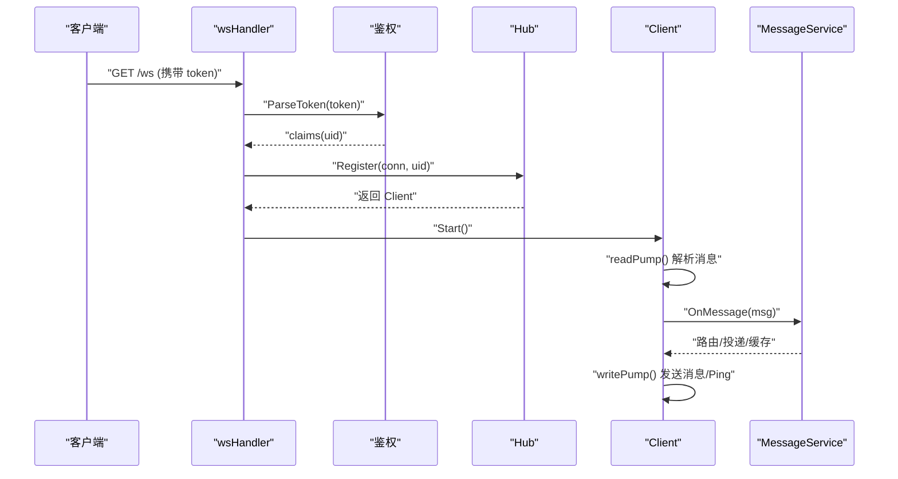
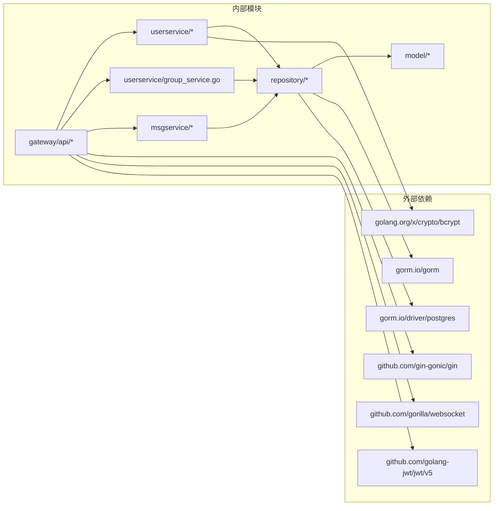

# 代码结构说明

<cite>
**本文档引用的文件**
- [server/model/models.go](file://server/model/models.go)
- [server/repository/interface.go](file://server/repository/interface.go)
- [server/repository/postgres/init.go](file://server/repository/postgres/init.go)
- [server/repository/postgres/handler.go](file://server/repository/postgres/handler.go)
- [server/userservice/user_service.go](file://server/userservice/user_service.go)
- [server/userservice/group_service.go](file://server/userservice/group_service.go)
- [server/msgservice/message_service.go](file://server/msgservice/message_service.go)
- [server/msgservice/hub/hub.go](file://server/msgservice/hub/hub.go)
- [server/msgservice/hub/client.go](file://server/msgservice/hub/client.go)
- [server/mq/interface.go](file://server/mq/interface.go)
- [server/gateway/api/user_handler.go](file://server/gateway/api/user_handler.go)
- [server/gateway/api/message_handler.go](file://server/gateway/api/message_handler.go)
- [server/gateway/api/ws_handler.go](file://server/gateway/api/ws_handler.go)
- [go.mod](file://go.mod)
- [main.txt](file://main.txt)
</cite>

## 目录
1. [简介](#简介)
2. [项目结构](#项目结构)
3. [核心组件](#核心组件)
4. [架构总览](#架构总览)
5. [详细组件分析](#详细组件分析)
6. [依赖关系分析](#依赖关系分析)
7. [性能考虑](#性能考虑)
8. [故障排除指南](#故障排除指南)
9. [结论](#结论)

## 简介
本项目是一个基于 Go 语言的即时通讯系统，采用清晰的分层架构设计，包含以下层次：
- Model 层：定义数据模型与错误类型
- Repository 层：定义数据访问接口与 PostgreSQL 实现
- Service 层：用户服务（UserService）与消息服务（MessageService），以及群组服务（GroupService）
- Gateway 层：HTTP API 处理器与 WebSocket 处理器
- MQ 层：消息队列接口（可扩展为 RabbitMQ 等）

该架构强调接口抽象、依赖注入与模块解耦，便于测试与扩展。

## 项目结构
项目采用按功能域分层的包结构，主要目录如下：
- server/model：数据模型与错误常量
- server/repository：数据访问接口与 PostgreSQL 实现
- server/userservice：用户与群组业务逻辑
- server/msgservice：消息路由、离线缓存与 Hub 管理
- server/gateway：HTTP API 与 WebSocket 入口
- server/mq：消息队列接口（预留）
- go.mod：依赖管理
- main.txt：早期示例（可忽略或迁移）

**图表来源**
- [server/gateway/api/user_handler.go:1-206](file://server/gateway/api/user_handler.go#L1-L206)
- [server/gateway/api/message_handler.go:1-66](file://server/gateway/api/message_handler.go#L1-L66)
- [server/gateway/api/ws_handler.go:1-69](file://server/gateway/api/ws_handler.go#L1-L69)
- [server/userservice/user_service.go:1-187](file://server/userservice/user_service.go#L1-L187)
- [server/userservice/group_service.go:1-217](file://server/userservice/group_service.go#L1-L217)
- [server/msgservice/message_service.go:1-168](file://server/msgservice/message_service.go#L1-L168)
- [server/repository/interface.go:1-74](file://server/repository/interface.go#L1-L74)
- [server/repository/postgres/handler.go:1-585](file://server/repository/postgres/handler.go#L1-L585)
- [server/model/models.go:1-146](file://server/model/models.go#L1-L146)
- [server/mq/interface.go:1-7](file://server/mq/interface.go#L1-L7)

**章节来源**
- [go.mod:1-51](file://go.mod#L1-L51)
- [server/model/models.go:1-146](file://server/model/models.go#L1-L146)
- [server/repository/interface.go:1-74](file://server/repository/interface.go#L1-L74)
- [server/repository/postgres/init.go:1-75](file://server/repository/postgres/init.go#L1-L75)
- [server/repository/postgres/handler.go:1-585](file://server/repository/postgres/handler.go#L1-L585)
- [server/userservice/user_service.go:1-187](file://server/userservice/user_service.go#L1-L187)
- [server/userservice/group_service.go:1-217](file://server/userservice/group_service.go#L1-L217)
- [server/msgservice/message_service.go:1-168](file://server/msgservice/message_service.go#L1-L168)
- [server/msgservice/hub/hub.go:1-61](file://server/msgservice/hub/hub.go#L1-L61)
- [server/msgservice/hub/client.go:1-88](file://server/msgservice/hub/client.go#L1-L88)
- [server/mq/interface.go:1-7](file://server/mq/interface.go#L1-L7)
- [server/gateway/api/user_handler.go:1-206](file://server/gateway/api/user_handler.go#L1-L206)
- [server/gateway/api/message_handler.go:1-66](file://server/gateway/api/message_handler.go#L1-L66)
- [server/gateway/api/ws_handler.go:1-69](file://server/gateway/api/ws_handler.go#L1-L69)

## 核心组件
本节概述各层职责与接口设计原则：

- Model 层
  - 定义用户、消息、群组、关系等实体模型
  - 定义统一的业务错误类型，便于上层处理
  - 使用 GORM 注解进行表映射与索引优化

- Repository 层
  - 定义用户、好友、群组、成员、消息、请求等接口
  - 提供 PostgreSQL 实现，统一上下文传递与错误包装
  - 通过接口抽象隐藏具体存储细节

- Service 层
  - UserService：注册、登录、好友关系管理、好友请求处理
  - GroupService：群组创建、加入/退出、成员角色管理、入群请求处理
  - MessageService：消息路由（私聊/群聊）、在线投递、离线缓存、未读统计

- Gateway 层
  - HTTP API：用户注册/登录、好友/群组操作、消息发送与离线查询
  - WebSocket：连接升级、鉴权、客户端注册到 Hub、读写循环

- MQ 层
  - Producer 接口预留，便于扩展异步消息处理（如 RabbitMQ）

**章节来源**
- [server/model/models.go:1-146](file://server/model/models.go#L1-L146)
- [server/repository/interface.go:1-74](file://server/repository/interface.go#L1-L74)
- [server/userservice/user_service.go:1-187](file://server/userservice/user_service.go#L1-L187)
- [server/userservice/group_service.go:1-217](file://server/userservice/group_service.go#L1-L217)
- [server/msgservice/message_service.go:1-168](file://server/msgservice/message_service.go#L1-L168)
- [server/gateway/api/user_handler.go:1-206](file://server/gateway/api/user_handler.go#L1-L206)
- [server/gateway/api/message_handler.go:1-66](file://server/gateway/api/message_handler.go#L1-L66)
- [server/gateway/api/ws_handler.go:1-69](file://server/gateway/api/ws_handler.go#L1-L69)
- [server/mq/interface.go:1-7](file://server/mq/interface.go#L1-L7)

## 架构总览
系统采用“接口抽象 + 依赖注入”的设计，确保各层松耦合、易测试。下图展示了关键组件之间的交互关系。

**图表来源**
- [server/repository/interface.go:1-74](file://server/repository/interface.go#L1-L74)
- [server/repository/postgres/handler.go:1-585](file://server/repository/postgres/handler.go#L1-L585)
- [server/userservice/user_service.go:1-187](file://server/userservice/user_service.go#L1-L187)
- [server/userservice/group_service.go:1-217](file://server/userservice/group_service.go#L1-L217)
- [server/msgservice/message_service.go:1-168](file://server/msgservice/message_service.go#L1-L168)
- [server/msgservice/hub/hub.go:1-61](file://server/msgservice/hub/hub.go#L1-L61)
- [server/msgservice/hub/client.go:1-88](file://server/msgservice/hub/client.go#L1-L88)

## 详细组件分析

### Model 层：数据模型与错误
- 数据模型
  - 用户：包含唯一标识、电话、密码哈希、头像、状态与时间戳
  - 消息：包含消息 ID、发送者、接收者、内容、类型、时间戳与是否已读
  - 群组：包含群组 ID、名称、描述、所有者、类型与时间戳
  - 关系：好友关系、群成员关系、好友请求、入群请求
- 错误类型
  - 统一定义业务错误（用户不存在、已是好友、不是成员、请求不存在、消息不存在、非群主等），便于上层判断与处理

最佳实践
- 使用 GORM 注解定义表名与索引，提升查询性能
- 将敏感字段（如密码）在序列化时屏蔽输出
- 通过常量枚举请求状态，避免魔法字符串

**章节来源**
- [server/model/models.go:1-146](file://server/model/models.go#L1-L146)

### Repository 层：接口与 PostgreSQL 实现
- 接口设计
  - 面向用户、好友、群组、成员、消息、请求分别定义接口，职责单一、易于替换
  - 所有接口方法均接受 context 参数，支持超时与取消
- PostgreSQL 实现
  - 通过 GORM 进行 ORM 映射与查询
  - 对记录不存在场景返回统一错误类型
  - 支持批量查询与条件聚合

依赖注入与抽象
- 通过接口抽象存储实现，便于单元测试与替换存储后端
- 初始化函数负责数据库连接与自动迁移

**章节来源**
- [server/repository/interface.go:1-74](file://server/repository/interface.go#L1-L74)
- [server/repository/postgres/init.go:1-75](file://server/repository/postgres/init.go#L1-L75)
- [server/repository/postgres/handler.go:1-585](file://server/repository/postgres/handler.go#L1-L585)

### UserService：用户业务逻辑
- 职责
  - 用户注册：校验电话唯一性、密码哈希、创建用户
  - 用户登录：根据电话查询用户并比对密码
  - 好友管理：添加/删除好友、检查好友关系、处理好友请求
- 设计要点
  - 依赖注入：通过构造函数注入 UserRepo、FriendshipRepo、FriendRequestRepo
  - 错误传播：将底层错误包装为带上下文的错误，便于定位问题
  - 业务幂等：重复发送请求或重复好友关系会返回明确错误

典型调用流程（注册）

**图表来源**
- [server/gateway/api/user_handler.go:21-37](file://server/gateway/api/user_handler.go#L21-L37)
- [server/userservice/user_service.go:27-54](file://server/userservice/user_service.go#L27-L54)
- [server/repository/postgres/handler.go:100-107](file://server/repository/postgres/handler.go#L100-L107)

**章节来源**
- [server/userservice/user_service.go:1-187](file://server/userservice/user_service.go#L1-L187)
- [server/gateway/api/user_handler.go:1-206](file://server/gateway/api/user_handler.go#L1-L206)

### GroupService：群组业务逻辑
- 职责
  - 创建群组：校验所有者存在、创建群组并添加所有者为成员
  - 加入/退出群组：处理入群请求、成员移除、所有者不可退出
  - 成员角色管理：设置成员角色、查询成员列表与角色
- 设计要点
  - 权限控制：仅群主可变更成员角色与移除成员
  - 请求幂等：重复请求与重复成员会返回明确错误

典型调用流程（创建群组）

**图表来源**
- [server/gateway/api/user_handler.go:132-149](file://server/gateway/api/user_handler.go#L132-L149)
- [server/userservice/group_service.go:27-58](file://server/userservice/group_service.go#L27-L58)
- [server/repository/postgres/handler.go:187-237](file://server/repository/postgres/handler.go#L187-L237)

**章节来源**
- [server/userservice/group_service.go:1-217](file://server/userservice/group_service.go#L1-L217)
- [server/gateway/api/user_handler.go:132-169](file://server/gateway/api/user_handler.go#L132-L169)

### MessageService：消息处理逻辑
- 职责
  - 消息路由：区分私聊与群聊，校验权限
  - 在线投递：优先投递至在线客户端，否则缓存离线消息
  - 离线缓存：将未送达消息持久化，支持批量拉取与标记已读
  - 在线状态：查询好友在线状态
- 设计要点
  - Hub 协调在线客户端，避免直接耦合
  - 私聊需验证好友关系，群聊需验证成员身份
  - 离线消息按接收者与时间排序，支持限制数量

消息路由流程（私聊）

**图表来源**
- [server/msgservice/message_service.go:27-66](file://server/msgservice/message_service.go#L27-L66)

**章节来源**
- [server/msgservice/message_service.go:1-168](file://server/msgservice/message_service.go#L1-L168)

### Hub 与 WebSocket：在线连接管理
- Hub
  - 维护在线客户端映射，支持注册/注销与并发安全访问
  - 启动后台循环处理注册/注销事件
- Client
  - 读循环：处理心跳、反序列化消息、回调业务处理
  - 写循环：定时 Ping、发送消息、优雅关闭
- WebSocket 处理器
  - 从 Cookie 解析 JWT，鉴权通过后升级连接
  - 注册到 Hub 并启动读写循环

连接建立与消息处理

**图表来源**
- [server/gateway/api/ws_handler.go:39-68](file://server/gateway/api/ws_handler.go#L39-L68)
- [server/msgservice/hub/hub.go:44-60](file://server/msgservice/hub/hub.go#L44-L60)
- [server/msgservice/hub/client.go:27-87](file://server/msgservice/hub/client.go#L27-L87)
- [server/msgservice/message_service.go:46-66](file://server/msgservice/message_service.go#L46-L66)

**章节来源**
- [server/msgservice/hub/hub.go:1-61](file://server/msgservice/hub/hub.go#L1-L61)
- [server/msgservice/hub/client.go:1-88](file://server/msgservice/hub/client.go#L1-L88)
- [server/gateway/api/ws_handler.go:1-69](file://server/gateway/api/ws_handler.go#L1-L69)

### API 层：HTTP 接口与控制器
- 用户相关
  - 注册/登录：参数校验、调用 UserService、生成 JWT 并写入 Cookie
  - 好友管理：添加/删除好友、同意/拒绝好友请求、查询好友列表
  - 群组管理：创建群组、加入/退出群组、同意/拒绝入群请求、成员角色管理
- 消息相关
  - 发送消息：校验参数、调用 MessageService 路由
  - 获取离线消息：调用 MessageService 查询并标记已读
  - 查询在线状态：调用 MessageService 获取好友在线列表

**章节来源**
- [server/gateway/api/user_handler.go:1-206](file://server/gateway/api/user_handler.go#L1-L206)
- [server/gateway/api/message_handler.go:1-66](file://server/gateway/api/message_handler.go#L1-L66)

## 依赖关系分析
- 包依赖
  - Gin：HTTP 路由与中间件
  - Gorilla WebSocket：WebSocket 升级与读写
  - GORM + Postgres Driver：ORM 与数据库驱动
  - bcrypt：密码哈希
  - JWT：令牌解析与鉴权
- 模块内依赖
  - Service 层依赖 Repository 接口，不直接依赖具体实现
  - Gateway 层依赖 Service 层，不直接依赖 Repository
  - Hub 与 Client 仅在 msgservice 内部协作

**图表来源**
- [go.mod:5-12](file://go.mod#L5-L12)
- [server/gateway/api/user_handler.go:1-10](file://server/gateway/api/user_handler.go#L1-L10)
- [server/userservice/user_service.go:3-11](file://server/userservice/user_service.go#L3-L11)
- [server/repository/postgres/init.go:3-13](file://server/repository/postgres/init.go#L3-L13)

**章节来源**
- [go.mod:1-51](file://go.mod#L1-L51)

## 性能考虑
- 数据库连接池
  - 设置最大空闲连接数与最大打开连接数，控制并发与资源占用
  - 设置连接生命周期，避免长时间持有无效连接
- 查询优化
  - 为常用查询字段（如电话、ID、索引字段）建立索引
  - 使用分页查询与限制数量，避免一次性加载大量数据
- 消息投递
  - 优先投递至在线客户端，减少数据库压力
  - 离线消息按接收者与时间排序，支持批量拉取与批量标记已读
- 并发安全
  - Hub 使用读写锁保护客户端映射，降低锁竞争
  - 通道缓冲区合理设置，避免阻塞导致消息丢失

[本节为通用指导，无需特定文件引用]

## 故障排除指南
- 常见错误类型
  - 用户相关：用户不存在、用户已存在、密码错误
  - 好友相关：已是好友、非好友、请求不存在、无效请求
  - 群组相关：群组不存在、已是成员、不是成员、非群主
  - 消息相关：消息不存在、未知消息类型
- 排查步骤
  - 检查数据库连接配置与迁移是否完成
  - 确认 JWT 令牌有效且未过期
  - 核对好友关系与群成员身份
  - 查看离线消息查询参数与分页限制
- 日志与监控
  - 记录关键错误堆栈与上下文信息
  - 监控数据库连接池与查询耗时

**章节来源**
- [server/model/models.go:8-21](file://server/model/models.go#L8-L21)
- [server/msgservice/message_service.go:27-44](file://server/msgservice/message_service.go#L27-L44)
- [server/repository/postgres/init.go:42-65](file://server/repository/postgres/init.go#L42-L65)

## 结论
本项目通过清晰的分层架构与接口抽象，实现了用户、群组与消息的核心业务能力。依赖注入与 Hub 的引入提升了系统的可测试性与可扩展性。建议后续增强：
- 引入消息队列（Producer 接口）以异步处理高并发消息
- 增加单元测试与集成测试覆盖关键路径
- 优化数据库索引与查询计划，持续监控性能指标