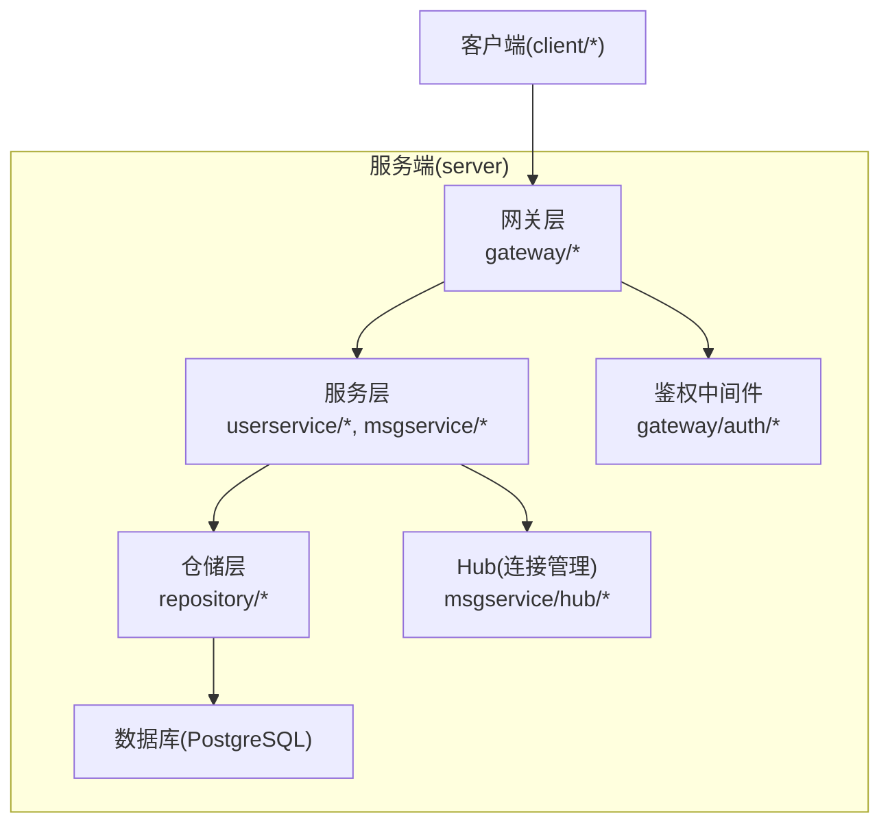
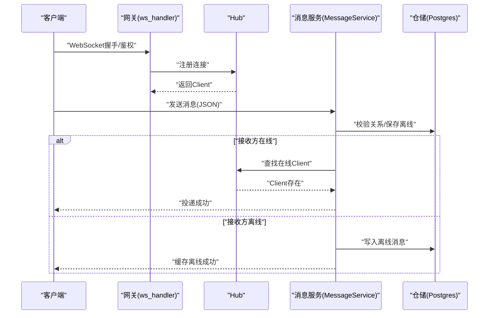
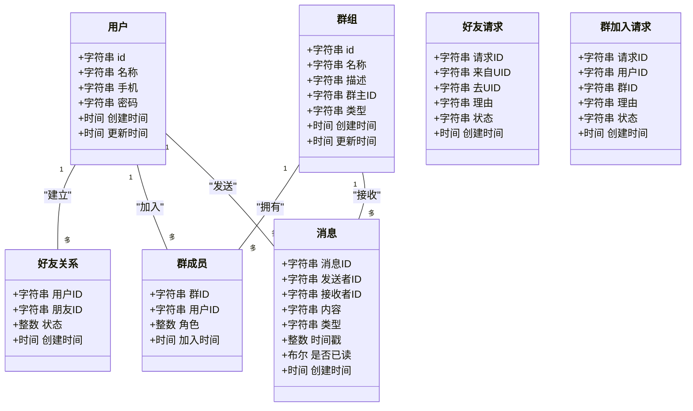
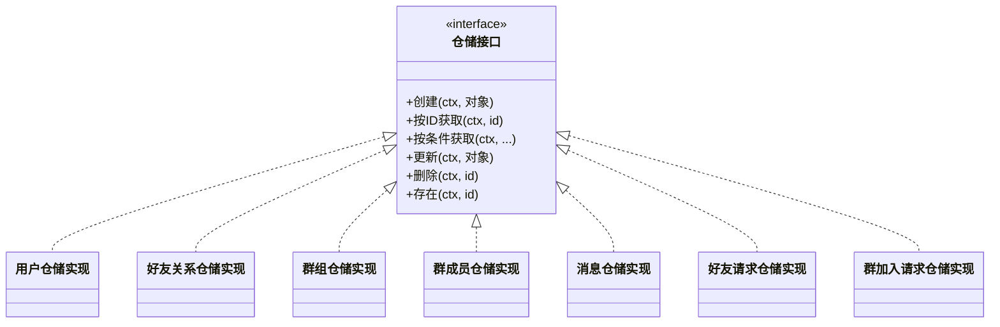
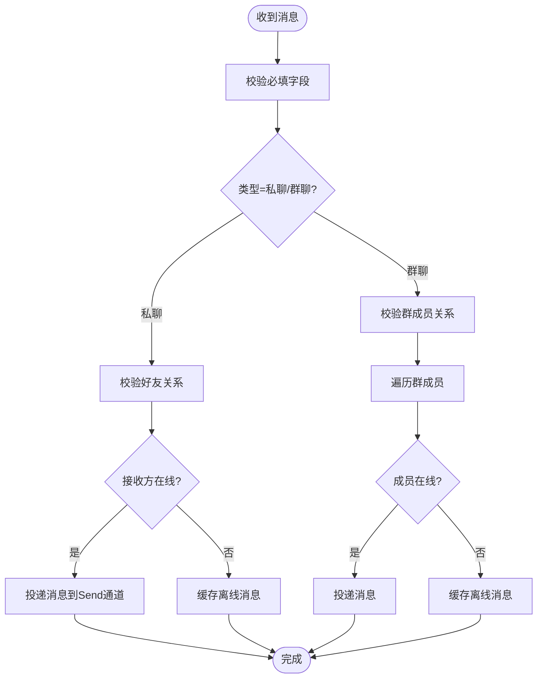
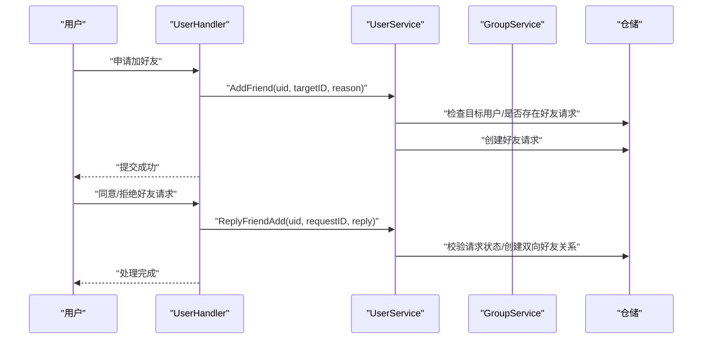
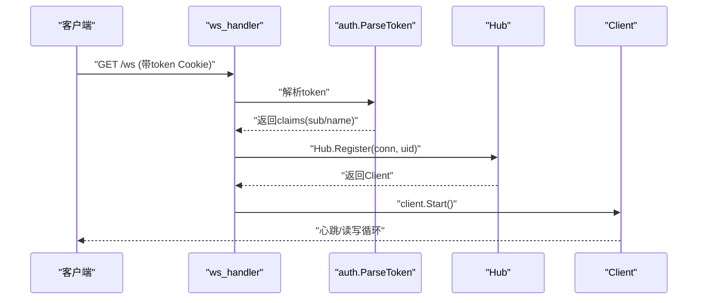
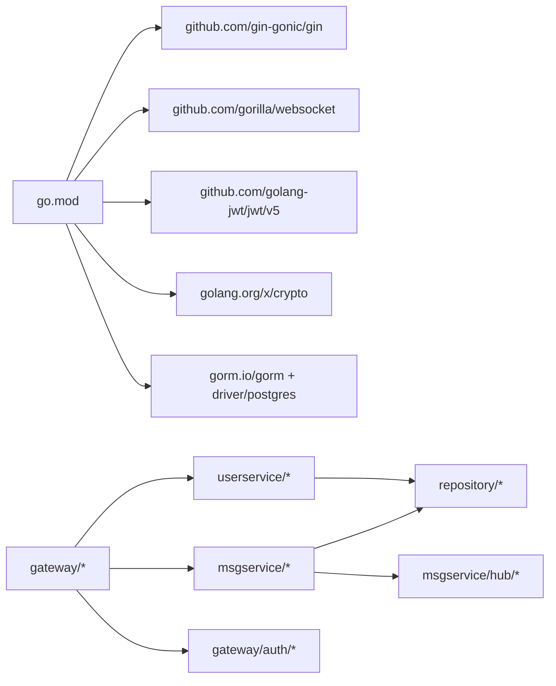

# 开发指南

<cite>
**本文引用的文件**
- [go.mod](file://go.mod)
- [main.txt](file://main.txt)
- [server/model/models.go](file://server/model/models.go)
- [server/mq/interface.go](file://server/mq/interface.go)
- [server/repository/interface.go](file://server/repository/interface.go)
- [server/repository/postgres/init.go](file://server/repository/postgres/init.go)
- [server/repository/postgres/handler.go](file://server/repository/postgres/handler.go)
- [server/msgservice/message_service.go](file://server/msgservice/message_service.go)
- [server/msgservice/hub/hub.go](file://server/msgservice/hub/hub.go)
- [server/msgservice/hub/client.go](file://server/msgservice/hub/client.go)
- [server/userservice/user_service.go](file://server/userservice/user_service.go)
- [server/userservice/group_service.go](file://server/userservice/group_service.go)
- [server/gateway/api/ws_handler.go](file://server/gateway/api/ws_handler.go)
- [server/gateway/api/message_handler.go](file://server/gateway/api/message_handler.go)
- [server/gateway/api/user_handler.go](file://server/gateway/api/user_handler.go)
- [server/gateway/auth/auth.go](file://server/gateway/auth/auth.go)
</cite>

## 目录
1. [简介](#简介)
2. [项目结构](#项目结构)
3. [核心组件](#核心组件)
4. [架构总览](#架构总览)
5. [详细组件分析](#详细组件分析)
6. [依赖关系分析](#依赖关系分析)
7. [性能与内存优化](#性能与内存优化)
8. [调试与故障排查](#调试与故障排查)
9. [测试指南（单元/集成）](#测试指南单元集成)
10. [扩展开发指南（新增API/消息类型/业务）](#扩展开发指南新增api消息类型业务)
11. [持续集成与部署建议](#持续集成与部署建议)
12. [结论](#结论)

## 简介
本指南面向Go语言即时通讯项目开发者，系统性阐述代码结构、模块职责、接口设计原则、开发环境搭建、编码规范、扩展方法、测试策略、调试与性能优化、以及CI/CD建议。项目采用分层清晰的架构：网关层负责HTTP/WebSocket接入与鉴权；服务层封装用户、群组、消息路由等业务；仓储层抽象数据库访问；模型层定义数据结构与约束。

## 项目结构
- 根目录包含模块声明与入口示例
- server目录按领域与层次组织：
  - model：数据模型与错误常量
  - repository：仓储接口与PostgreSQL实现
  - msgservice：消息服务与连接Hub
  - userservice：用户与群组服务
  - gateway：API网关与鉴权
  - mq：消息队列Producer接口（预留）

图示来源
- [server/gateway/api/ws_handler.go:1-69](file://server/gateway/api/ws_handler.go#L1-L69)
- [server/gateway/api/message_handler.go:1-66](file://server/gateway/api/message_handler.go#L1-L66)
- [server/gateway/api/user_handler.go:1-206](file://server/gateway/api/user_handler.go#L1-L206)
- [server/gateway/auth/auth.go:1-91](file://server/gateway/auth/auth.go#L1-L91)
- [server/msgservice/message_service.go:1-168](file://server/msgservice/message_service.go#L1-L168)
- [server/msgservice/hub/hub.go:1-61](file://server/msgservice/hub/hub.go#L1-L61)
- [server/repository/postgres/init.go:1-75](file://server/repository/postgres/init.go#L1-L75)
- [server/repository/postgres/handler.go:1-585](file://server/repository/postgres/handler.go#L1-L585)

章节来源
- [go.mod:1-51](file://go.mod#L1-L51)
- [main.txt:1-175](file://main.txt#L1-L175)

## 核心组件
- 模型层：定义用户、群组、消息、关系与请求等实体及索引字段，统一使用GORM标签与表名映射。
- 仓储层：以接口隔离具体存储实现，PostgreSQL实现提供CRUD与聚合查询。
- 服务层：用户服务、群组服务、消息服务，封装业务规则与流程控制。
- 网关层：HTTP API与WebSocket接入，鉴权中间件与路由处理。
- Hub：WebSocket连接注册、注销与广播，维护在线用户映射。

章节来源
- [server/model/models.go:1-146](file://server/model/models.go#L1-L146)
- [server/repository/interface.go:1-74](file://server/repository/interface.go#L1-L74)
- [server/repository/postgres/handler.go:1-585](file://server/repository/postgres/handler.go#L1-L585)
- [server/userservice/user_service.go:1-187](file://server/userservice/user_service.go#L1-L187)
- [server/userservice/group_service.go:1-217](file://server/userservice/group_service.go#L1-L217)
- [server/msgservice/message_service.go:1-168](file://server/msgservice/message_service.go#L1-L168)
- [server/msgservice/hub/hub.go:1-61](file://server/msgservice/hub/hub.go#L1-L61)
- [server/gateway/api/ws_handler.go:1-69](file://server/gateway/api/ws_handler.go#L1-L69)
- [server/gateway/auth/auth.go:1-91](file://server/gateway/auth/auth.go#L1-L91)

## 架构总览
系统采用“网关-服务-仓储-数据库”的分层架构，消息通过Hub在在线用户间转发，离线消息持久化到数据库；用户与群组操作通过服务层完成业务校验与状态变更。

图示来源
- [server/gateway/api/ws_handler.go:39-68](file://server/gateway/api/ws_handler.go#L39-L68)
- [server/msgservice/hub/hub.go:44-60](file://server/msgservice/hub/hub.go#L44-L60)
- [server/msgservice/message_service.go:27-108](file://server/msgservice/message_service.go#L27-L108)
- [server/repository/postgres/handler.go:335-386](file://server/repository/postgres/handler.go#L335-L386)

## 详细组件分析

### 数据模型与错误
- 用户、群组、消息、关系与请求均定义明确的字段与索引，便于查询与一致性约束。
- 定义了统一的业务错误常量，便于上层处理与响应。

图示来源
- [server/model/models.go:23-146](file://server/model/models.go#L23-L146)

章节来源
- [server/model/models.go:1-146](file://server/model/models.go#L1-L146)

### 仓储接口与PostgreSQL实现
- 仓储接口以领域对象为参数，提供创建、查询、更新、删除与批量查询能力。
- PostgreSQL实现基于GORM，提供自动迁移、连接池配置与事务支持。

图示来源
- [server/repository/interface.go:1-74](file://server/repository/interface.go#L1-L74)
- [server/repository/postgres/handler.go:1-585](file://server/repository/postgres/handler.go#L1-L585)

章节来源
- [server/repository/interface.go:1-74](file://server/repository/interface.go#L1-L74)
- [server/repository/postgres/init.go:1-75](file://server/repository/postgres/init.go#L1-L75)
- [server/repository/postgres/handler.go:1-585](file://server/repository/postgres/handler.go#L1-L585)

### 消息服务与Hub
- 消息服务根据消息类型路由至私聊或群聊，检查关系合法性，优先投递在线用户，否则缓存离线消息。
- Hub负责连接生命周期管理与广播，提供按用户ID的在线查询。

图示来源
- [server/msgservice/message_service.go:27-108](file://server/msgservice/message_service.go#L27-L108)
- [server/msgservice/hub/hub.go:55-60](file://server/msgservice/hub/hub.go#L55-L60)

章节来源
- [server/msgservice/message_service.go:1-168](file://server/msgservice/message_service.go#L1-L168)
- [server/msgservice/hub/hub.go:1-61](file://server/msgservice/hub/hub.go#L1-L61)
- [server/msgservice/hub/client.go:1-88](file://server/msgservice/hub/client.go#L1-L88)

### 用户与群组服务
- 用户服务：注册、登录、好友关系管理、好友请求处理。
- 群组服务：建群、入群/退群、群主审批、成员角色管理。

图示来源
- [server/gateway/api/user_handler.go:77-130](file://server/gateway/api/user_handler.go#L77-L130)
- [server/userservice/user_service.go:77-178](file://server/userservice/user_service.go#L77-L178)

章节来源
- [server/userservice/user_service.go:1-187](file://server/userservice/user_service.go#L1-L187)
- [server/userservice/group_service.go:1-217](file://server/userservice/group_service.go#L1-L217)
- [server/gateway/api/user_handler.go:1-206](file://server/gateway/api/user_handler.go#L1-L206)

### 网关与鉴权
- WebSocket接入：基于Cookie中的token进行鉴权，允许指定来源域名。
- HTTP API：基于Bearer Token中间件注入用户信息，供业务使用。

图示来源
- [server/gateway/api/ws_handler.go:39-68](file://server/gateway/api/ws_handler.go#L39-L68)
- [server/gateway/auth/auth.go:37-61](file://server/gateway/auth/auth.go#L37-L61)

章节来源
- [server/gateway/api/ws_handler.go:1-69](file://server/gateway/api/ws_handler.go#L1-L69)
- [server/gateway/auth/auth.go:1-91](file://server/gateway/auth/auth.go#L1-L91)

## 依赖关系分析
- 模块依赖集中在Gin、WebSocket、JWT、GORM与PostgreSQL驱动。
- 服务层对仓储接口解耦，便于替换存储实现。
- 网关层仅依赖服务层与鉴权模块，职责单一。

图示来源
- [go.mod:5-12](file://go.mod#L5-L12)
- [server/userservice/user_service.go:1-25](file://server/userservice/user_service.go#L1-L25)
- [server/msgservice/message_service.go:12-25](file://server/msgservice/message_service.go#L12-L25)
- [server/gateway/api/user_handler.go:1-19](file://server/gateway/api/user_handler.go#L1-L19)
- [server/gateway/auth/auth.go:1-12](file://server/gateway/auth/auth.go#L1-L12)

章节来源
- [go.mod:1-51](file://go.mod#L1-L51)

## 性能与内存优化
- 连接管理
  - Hub使用RWMutex保护在线用户映射，读多写少场景下提升并发性能。
  - Client读写分离协程，心跳与超时设置降低无效连接占用。
- 缓冲与背压
  - Send通道容量限制避免内存无限增长；默认分支关闭阻塞通道，及时清理异常连接。
- 数据库
  - 连接池参数调优（最大空闲/打开连接数、连接最长存活时间），减少连接开销。
  - GORM日志级别适中，避免生产环境过多I/O开销。
- 消息路由
  - 在线优先投递，离线批量入库；合理设置分页与排序索引，降低查询延迟。

章节来源
- [server/msgservice/hub/hub.go:10-43](file://server/msgservice/hub/hub.go#L10-L43)
- [server/msgservice/hub/client.go:20-88](file://server/msgservice/hub/client.go#L20-L88)
- [server/repository/postgres/init.go:54-65](file://server/repository/postgres/init.go#L54-L65)
- [server/msgservice/message_service.go:27-108](file://server/msgservice/message_service.go#L27-L108)

## 调试与故障排查
- 常见问题定位
  - WebSocket握手失败：检查来源域名白名单与Cookie/Token有效性。
  - 消息未送达：确认好友/群成员关系、接收方是否在线、Send通道是否阻塞。
  - 登录鉴权失败：核对JWT签名算法、过期时间与密钥一致性。
- 日志与可观测性
  - 关键路径增加日志输出，如注册/注销、读写错误、鉴权失败。
  - 使用pprof或第三方监控采集CPU/内存/连接数指标。
- 快速验证
  - 使用HTTP API先验证鉴权与业务流程，再接入WebSocket进行实时消息验证。

章节来源
- [server/gateway/api/ws_handler.go:14-28](file://server/gateway/api/ws_handler.go#L14-L28)
- [server/gateway/auth/auth.go:37-61](file://server/gateway/auth/auth.go#L37-L61)
- [server/msgservice/hub/client.go:31-60](file://server/msgservice/hub/client.go#L31-L60)

## 测试指南（单元/集成）
- 单元测试
  - 为服务层方法构造最小依赖，使用内存Mock仓储接口，覆盖正常/异常分支。
  - 验证消息路由、好友/群组关系变更、鉴权中间件行为。
- 集成测试
  - 启动嵌入式数据库或容器化PostgreSQL，执行端到端流程（注册、登录、加好友、入群、发送消息、离线拉取）。
  - 使用WebSocket客户端模拟真实场景，验证Hub广播与离线缓存。
- 测试工具
  - 使用标准库testing与testify辅助断言；使用httptest/Gock模拟HTTP/WebSocket交互。

[本节为通用指导，不直接分析具体文件，故无章节来源]

## 扩展开发指南（新增API/消息类型/业务）
- 新增消息类型
  - 在模型层定义新类型字段与索引；在消息服务switch中新增路由分支；必要时扩展仓储查询。
  - 参考路径：[server/model/models.go:23-36](file://server/model/models.go#L23-L36), [server/msgservice/message_service.go:36-44](file://server/msgservice/message_service.go#L36-L44)
- 新增API接口
  - 在gateway/api中新增处理器，绑定请求体，调用对应服务层方法；在网关层注册路由。
  - 参考路径：[server/gateway/api/message_handler.go:19-44](file://server/gateway/api/message_handler.go#L19-L44), [server/gateway/api/user_handler.go:132-149](file://server/gateway/api/user_handler.go#L132-L149)
- 新增业务逻辑
  - 在userservice或msgservice中新增方法，遵循现有错误返回与上下文传递模式。
  - 参考路径：[server/userservice/user_service.go:77-116](file://server/userservice/user_service.go#L77-L116), [server/msgservice/message_service.go:109-126](file://server/msgservice/message_service.go#L109-L126)
- 仓储扩展
  - 在repository/interface.go新增接口方法，在PostgreSQL实现中补充SQL与错误处理。
  - 参考路径：[server/repository/interface.go:46-55](file://server/repository/interface.go#L46-L55), [server/repository/postgres/handler.go:335-386](file://server/repository/postgres/handler.go#L335-L386)

## 持续集成与部署建议
- CI流水线
  - 代码质量：静态检查（go vet、ineffassign）、格式化（go fmt）、安全扫描（gosec）。
  - 测试：单元测试+集成测试，覆盖率阈值设定；数据库测试使用容器化PostgreSQL。
  - 构建：交叉编译生成多平台二进制，镜像构建（Docker）。
- 部署
  - 容器化：使用轻量基础镜像，暴露端口，挂载配置与日志。
  - 数据库：使用托管PostgreSQL或容器化实例，开启备份与只读副本。
  - 运维：健康检查、限流熔断、日志采集与告警。

[本节为通用指导，不直接分析具体文件，故无章节来源]

## 结论
本项目以清晰的分层与接口设计实现了即时通讯的核心能力。通过Hub与消息服务的协作，结合仓储层的可替换性，能够快速扩展消息类型与业务功能。建议在开发过程中严格遵循接口契约、错误处理与日志规范，配合完善的测试与CI/CD体系，确保系统的稳定性与可演进性。