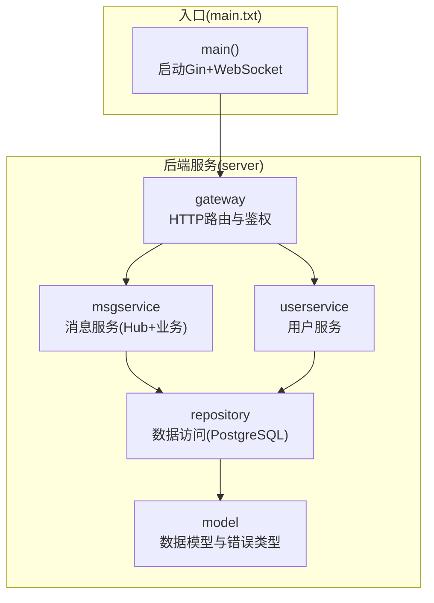
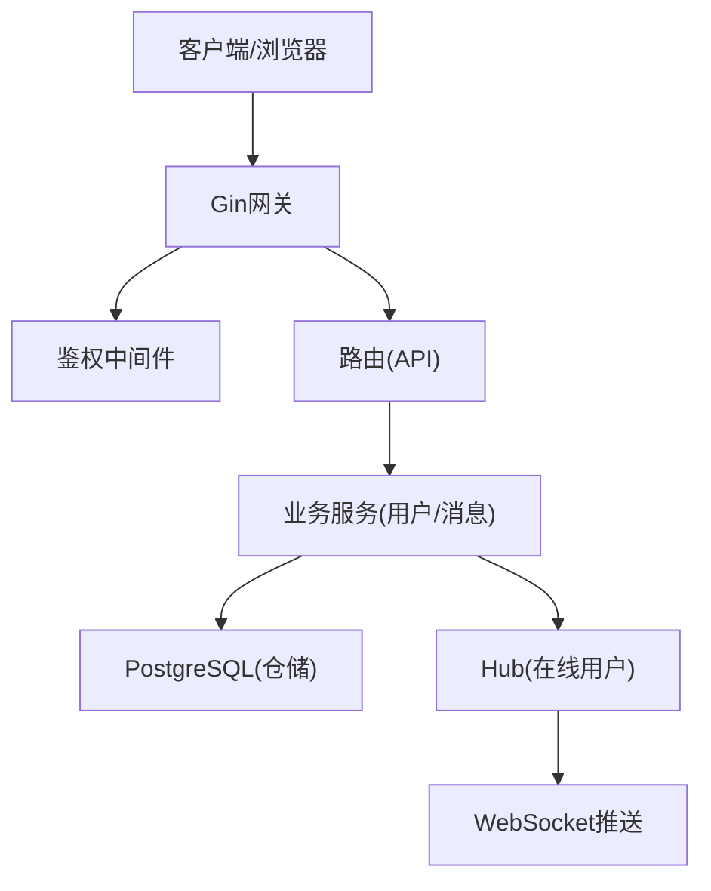
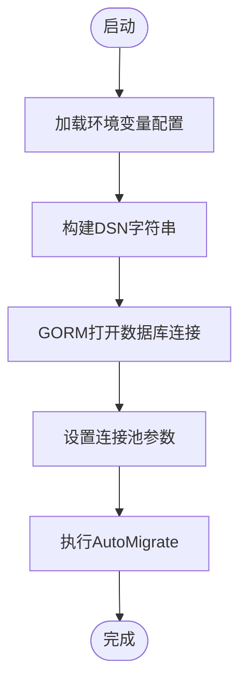
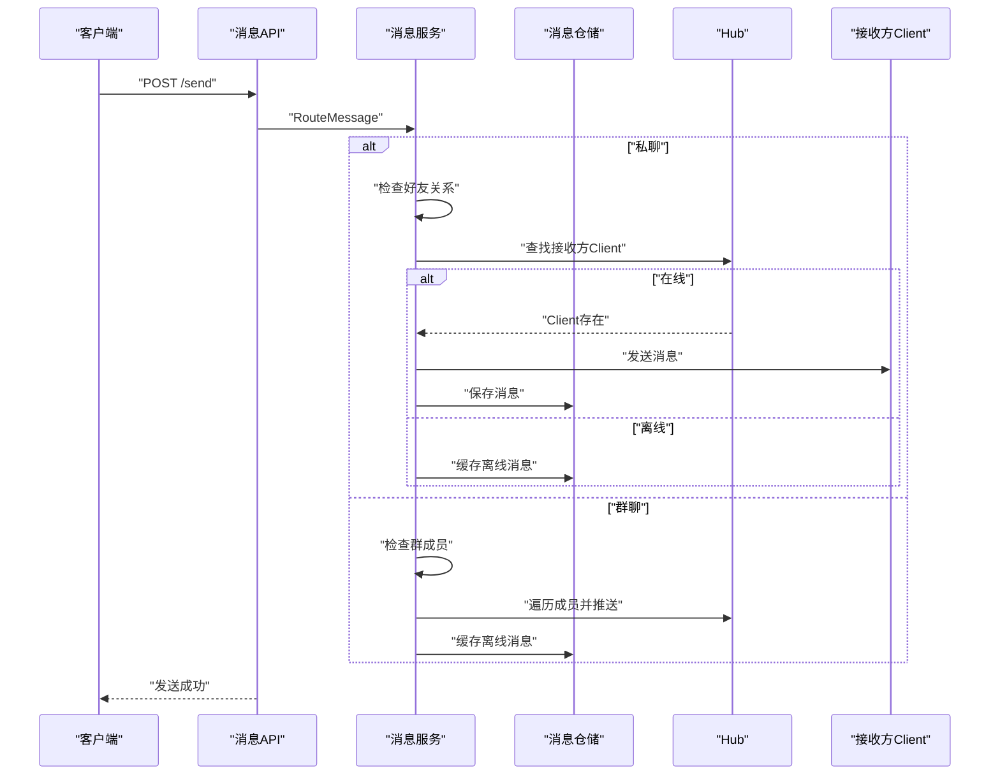
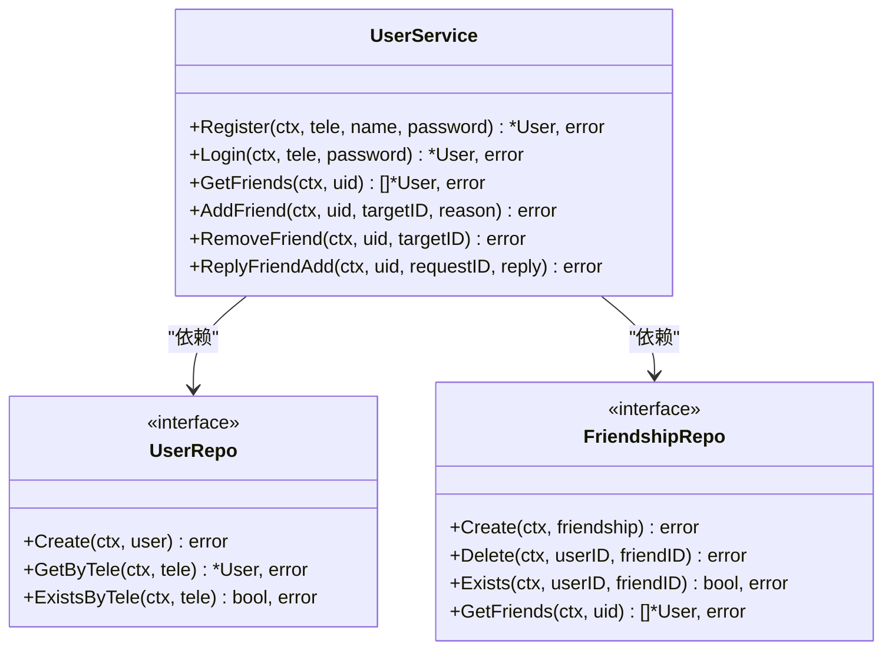
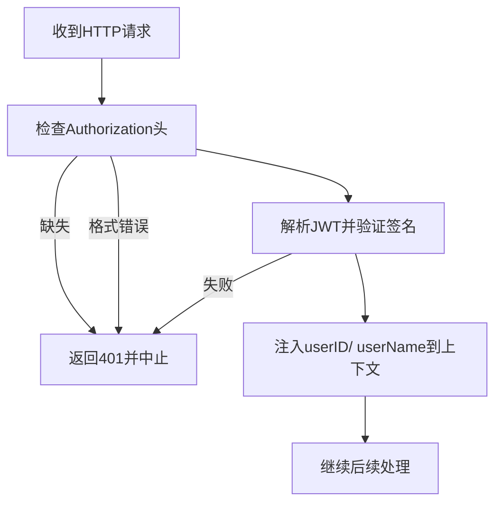
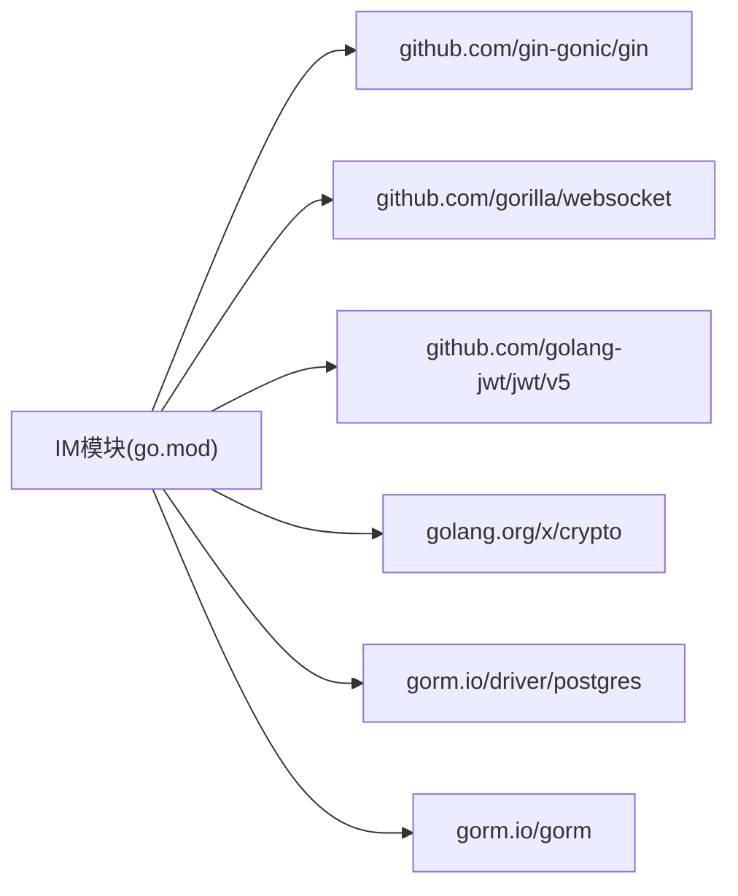

# 开发环境搭建

<cite>
**本文档引用的文件**
- [go.mod](file://go.mod)
- [go.sum](file://go.sum)
- [main.txt](file://main.txt)
- [server/gateway/api/message_handler.go](file://server/gateway/api/message_handler.go)
- [server/repository/postgres/init.go](file://server/repository/postgres/init.go)
- [server/model/models.go](file://server/model/models.go)
- [server/userservice/user_service.go](file://server/userservice/user_service.go)
- [server/msgservice/message_service.go](file://server/msgservice/message_service.go)
- [server/gateway/auth/auth.go](file://server/gateway/auth/auth.go)
- [server/repository/interface.go](file://server/repository/interface.go)
- [server/msgservice/hub/hub.go](file://server/msgservice/hub/hub.go)
- [server/msgservice/hub/client.go](file://server/msgservice/hub/client.go)
</cite>

## 目录
1. [简介](#简介)
2. [项目结构](#项目结构)
3. [核心组件](#核心组件)
4. [架构总览](#架构总览)
5. [详细组件分析](#详细组件分析)
6. [依赖分析](#依赖分析)
7. [性能考虑](#性能考虑)
8. [故障排除指南](#故障排除指南)
9. [结论](#结论)
10. [附录](#附录)

## 简介
本指南面向Go语言即时通讯项目的开发者，提供从零开始的完整开发环境搭建流程，涵盖以下内容：
- Go语言开发环境安装与配置（版本要求、GOPATH/GOROOT、模块代理等）
- 数据库环境搭建（PostgreSQL安装、初始化脚本执行、连接配置）
- 项目依赖安装与版本管理（go mod tidy、go.sum校验）
- 调试工具配置（Delve调试器使用、断点设置）
- 开发服务器启动与常用开发命令

本项目采用模块化设计，后端基于Gin框架提供HTTP接口，WebSocket处理消息推送，数据持久化通过GORM与PostgreSQL实现。

## 项目结构
项目采用按功能分层的目录组织方式：
- server：后端服务代码
  - gateway：网关层（HTTP路由与鉴权）
  - model：数据模型与错误类型
  - repository：数据访问层（PostgreSQL实现）
  - msgservice：消息服务（业务逻辑与Hub）
  - userservice：用户服务（注册、登录、好友关系）
- client：前端或客户端示例（当前仓库未包含具体前端代码）
- 根目录：go.mod/go.sum（模块与依赖管理）、入口程序main.txt

**图表来源**
- [main.txt:159-175](file://main.txt#L159-L175)
- [server/gateway/api/message_handler.go:19-44](file://server/gateway/api/message_handler.go#L19-L44)
- [server/userservice/user_service.go:19-25](file://server/userservice/user_service.go#L19-L25)
- [server/msgservice/message_service.go:19-25](file://server/msgservice/message_service.go#L19-L25)
- [server/repository/postgres/init.go:42-65](file://server/repository/postgres/init.go#L42-L65)
- [server/model/models.go:23-119](file://server/model/models.go#L23-L119)

**章节来源**
- [main.txt:159-175](file://main.txt#L159-L175)
- [server/gateway/api/message_handler.go:12-18](file://server/gateway/api/message_handler.go#L12-L18)
- [server/userservice/user_service.go:13-25](file://server/userservice/user_service.go#L13-L25)
- [server/msgservice/message_service.go:12-25](file://server/msgservice/message_service.go#L12-L25)
- [server/repository/postgres/init.go:15-33](file://server/repository/postgres/init.go#L15-L33)
- [server/model/models.go:8-21](file://server/model/models.go#L8-L21)

## 核心组件
- Gin Web框架：提供HTTP路由与中间件支持，用于REST API与WebSocket升级。
- GORM + PostgreSQL：ORM与数据库驱动，负责用户、群组、消息等实体的持久化。
- Gorilla WebSocket：提供WebSocket连接管理与消息收发。
- JWT鉴权：基于Gin中间件进行请求鉴权。
- Hub与Client：消息服务中的在线用户管理与消息广播。

**章节来源**
- [go.mod:5-12](file://go.mod#L5-L12)
- [server/gateway/auth/auth.go:37-61](file://server/gateway/auth/auth.go#L37-L61)
- [server/msgservice/hub/hub.go:10-25](file://server/msgservice/hub/hub.go#L10-L25)
- [server/msgservice/hub/client.go:12-30](file://server/msgservice/hub/client.go#L12-L30)

## 架构总览
系统采用“网关-服务-仓储-数据库”的分层架构：
- 网关层负责HTTP请求接收、参数绑定、鉴权与路由转发
- 服务层封装业务规则（用户、消息、群组）
- 仓储层抽象数据访问，当前实现为PostgreSQL
- 数据库层为PostgreSQL，使用GORM自动迁移

**图表来源**
- [main.txt:159-175](file://main.txt#L159-L175)
- [server/gateway/auth/auth.go:37-61](file://server/gateway/auth/auth.go#L37-L61)
- [server/gateway/api/message_handler.go:19-44](file://server/gateway/api/message_handler.go#L19-L44)
- [server/msgservice/message_service.go:27-44](file://server/msgservice/message_service.go#L27-L44)
- [server/repository/postgres/init.go:42-65](file://server/repository/postgres/init.go#L42-L65)

## 详细组件分析

### 组件A：数据库连接与迁移
- 配置加载：通过环境变量加载数据库连接参数（主机、端口、用户名、密码、库名、SSL模式），提供默认值。
- 连接建立：使用GORM打开PostgreSQL连接，设置日志级别、连接池参数（最大空闲连接、最大打开连接、生命周期）。
- 自动迁移：根据模型定义执行AutoMigrate，创建用户、群组、消息等表。

**图表来源**
- [server/repository/postgres/init.go:24-33](file://server/repository/postgres/init.go#L24-L33)
- [server/repository/postgres/init.go:42-65](file://server/repository/postgres/init.go#L42-L65)
- [server/repository/postgres/init.go:67-74](file://server/repository/postgres/init.go#L67-L74)

**章节来源**
- [server/repository/postgres/init.go:15-33](file://server/repository/postgres/init.go#L15-L33)
- [server/repository/postgres/init.go:42-65](file://server/repository/postgres/init.go#L42-L65)
- [server/repository/postgres/init.go:67-74](file://server/repository/postgres/init.go#L67-L74)
- [server/model/models.go:23-119](file://server/model/models.go#L23-L119)

### 组件B：消息服务与Hub
- 消息路由：根据消息类型（私聊/群聊）进行路由处理；私聊需验证好友关系，群聊需验证成员身份。
- 在线推送：若接收方在线，直接通过Hub向其Client发送消息；否则缓存离线消息。
- 离线消息：提供查询与标记已读能力。

**图表来源**
- [server/gateway/api/message_handler.go:19-44](file://server/gateway/api/message_handler.go#L19-L44)
- [server/msgservice/message_service.go:27-108](file://server/msgservice/message_service.go#L27-L108)
- [server/msgservice/hub/hub.go:55-60](file://server/msgservice/hub/hub.go#L55-L60)

**章节来源**
- [server/gateway/api/message_handler.go:12-18](file://server/gateway/api/message_handler.go#L12-L18)
- [server/msgservice/message_service.go:12-25](file://server/msgservice/message_service.go#L12-L25)
- [server/msgservice/message_service.go:27-108](file://server/msgservice/message_service.go#L27-L108)
- [server/msgservice/hub/hub.go:10-25](file://server/msgservice/hub/hub.go#L10-L25)
- [server/msgservice/hub/client.go:12-30](file://server/msgservice/hub/client.go#L12-L30)

### 组件C：用户服务
- 用户注册：校验手机号唯一性，生成用户ID，哈希密码后创建用户。
- 用户登录：按手机号查询用户，比对密码哈希。
- 好友关系：发送/处理好友请求、删除好友、查询好友列表、检查关系状态。

**图表来源**
- [server/userservice/user_service.go:13-25](file://server/userservice/user_service.go#L13-L25)
- [server/repository/interface.go:8-26](file://server/repository/interface.go#L8-L26)

**章节来源**
- [server/userservice/user_service.go:27-67](file://server/userservice/user_service.go#L27-L67)
- [server/userservice/user_service.go:77-136](file://server/userservice/user_service.go#L77-L136)
- [server/repository/interface.go:8-26](file://server/repository/interface.go#L8-L26)

### 组件D：鉴权中间件
- 支持Bearer Token鉴权，解析JWT并注入用户信息到上下文。
- 提供令牌签发函数，便于本地开发与测试。

**图表来源**
- [server/gateway/auth/auth.go:37-61](file://server/gateway/auth/auth.go#L37-L61)
- [server/gateway/auth/auth.go:64-90](file://server/gateway/auth/auth.go#L64-L90)

**章节来源**
- [server/gateway/auth/auth.go:22-34](file://server/gateway/auth/auth.go#L22-L34)
- [server/gateway/auth/auth.go:37-61](file://server/gateway/auth/auth.go#L37-L61)
- [server/gateway/auth/auth.go:64-90](file://server/gateway/auth/auth.go#L64-L90)

## 依赖分析
- Go版本：1.26.1
- 主要依赖：
  - Gin：Web框架
  - Gorilla WebSocket：WebSocket支持
  - JWT：鉴权
  - GORM + Postgres驱动：ORM与数据库访问
  - x/crypto：密码哈希

**图表来源**
- [go.mod:5-12](file://go.mod#L5-L12)

**章节来源**
- [go.mod:3](file://go.mod#L3)
- [go.mod:5-12](file://go.mod#L5-L12)

## 性能考虑
- 连接池：合理设置最大空闲/打开连接数与生命周期，避免频繁创建销毁连接。
- 日志级别：生产环境建议降低GORM日志级别以减少开销。
- 消息队列：当前Hub为内存实现，高并发场景建议引入消息队列或Redis缓存。
- 并发安全：Hub使用读写锁保护客户端映射，注意在高并发下避免阻塞。

[本节为通用指导，无需特定文件引用]

## 故障排除指南
- 数据库连接失败
  - 检查环境变量是否正确（主机、端口、用户名、密码、库名、SSL模式）
  - 确认PostgreSQL服务运行正常
  - 查看连接日志输出
- JWT鉴权失败
  - 确认Authorization头格式为Bearer Token
  - 检查密钥与算法配置
- WebSocket无法连接
  - 检查路由与跨域策略
  - 确认客户端连接参数（路径、查询参数）

**章节来源**
- [server/repository/postgres/init.go:24-33](file://server/repository/postgres/init.go#L24-L33)
- [server/gateway/auth/auth.go:37-61](file://server/gateway/auth/auth.go#L37-L61)
- [main.txt:75-80](file://main.txt#L75-L80)

## 结论
本指南提供了从Go环境、数据库、依赖管理到调试与启动的全流程说明。按照此文档配置后，即可顺利运行即时通讯服务，并在此基础上扩展业务功能。

[本节为总结，无需特定文件引用]

## 附录

### A. Go开发环境安装与配置
- 版本要求：Go 1.26.1
- GOPATH/GOROOT：建议使用Go 1.18+的模块模式，无需手动设置GOPATH
- 模块代理：可配置国内镜像加速下载（如需要）
- IDE推荐：VSCode + Go插件，或GoLand；启用格式化与导入优化

**章节来源**
- [go.mod:3](file://go.mod#L3)

### B. 数据库环境搭建（PostgreSQL）
- 安装：在目标系统安装PostgreSQL服务
- 初始化：启动后创建数据库与用户，确保连接参数正确
- 迁移：首次运行时会自动执行数据库迁移，创建所需表

**章节来源**
- [server/repository/postgres/init.go:24-33](file://server/repository/postgres/init.go#L24-L33)
- [server/repository/postgres/init.go:67-74](file://server/repository/postgres/init.go#L67-L74)

### C. 项目依赖安装与版本管理
- 使用go mod tidy同步依赖，确保go.mod与go.sum一致
- 如需更新依赖，先修改go.mod，再执行go mod tidy
- go.sum记录了精确的依赖版本，保证可重复构建

**章节来源**
- [go.mod:14-51](file://go.mod#L14-L51)
- [go.sum:1-50](file://go.sum#L1-L50)

### D. 调试工具配置（Delve）
- 安装：go install github.com/go-delve/delve/cmd/dlv@latest
- 启动调试：dlv debug . 或 dlv attach pid
- 断点设置：在IDE中点击行号或使用dlv命令设置断点
- 常用操作：next、step、continue、breakpoint list、print

[本节为通用指导，无需特定文件引用]

### E. 开发服务器启动与常用命令
- 启动开发服务器：go run main.txt
- 热重载：可配合air或fresh实现热重启
- 测试：go test ./...（如存在测试文件）
- 代码格式化：go fmt ./...

**章节来源**
- [main.txt:159-175](file://main.txt#L159-L175)