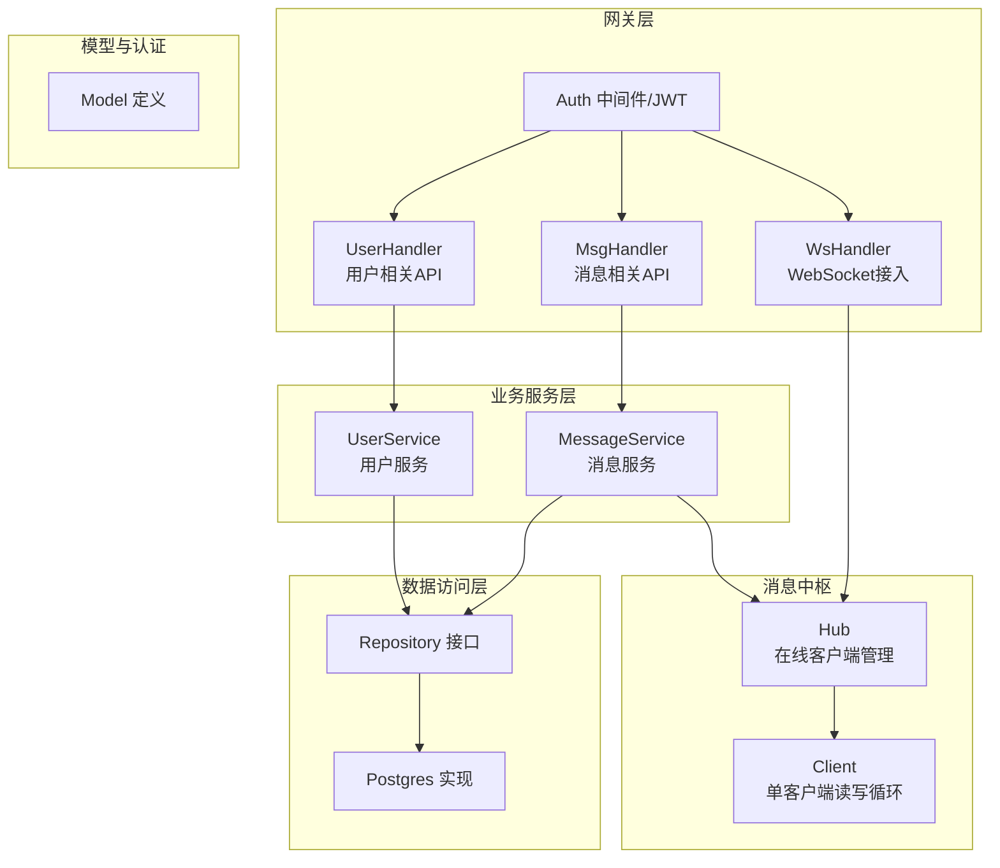
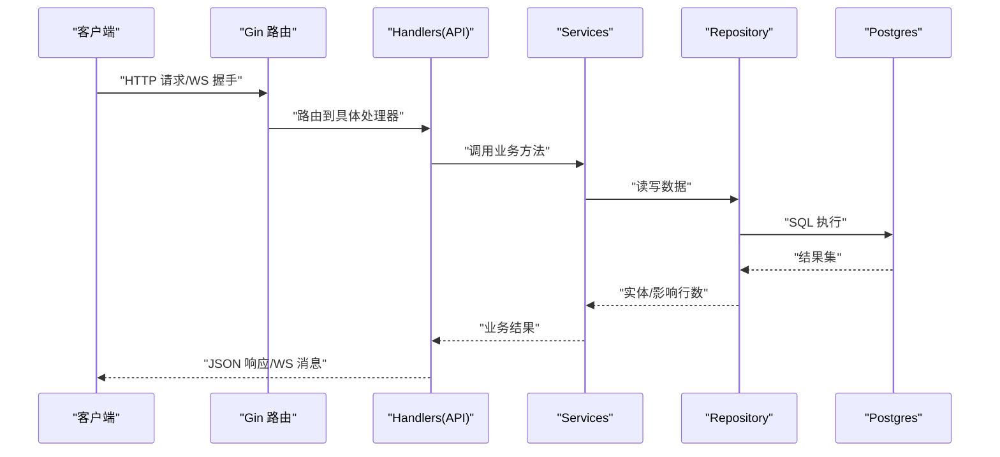
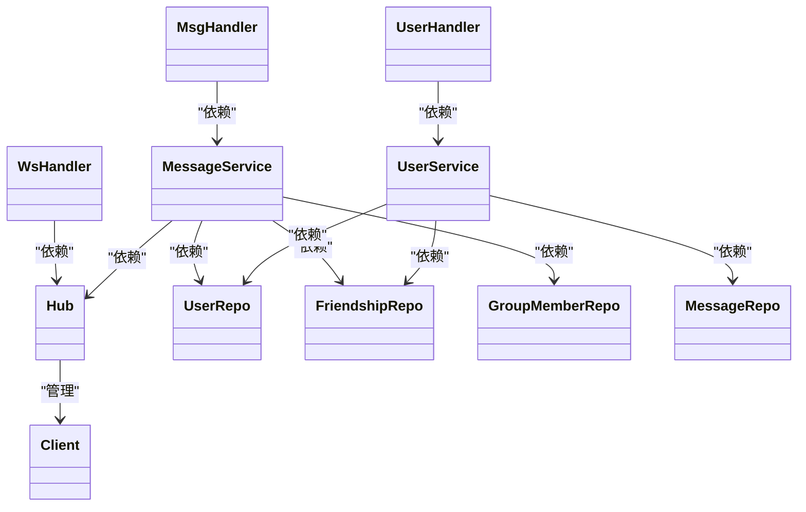

# 测试策略

<cite>
**本文引用的文件**
- [server/gateway/api/message_handler.go](file://server/gateway/api/message_handler.go)
- [server/gateway/api/user_handler.go](file://server/gateway/api/user_handler.go)
- [server/gateway/api/ws_handler.go](file://server/gateway/api/ws_handler.go)
- [server/gateway/auth/auth.go](file://server/gateway/auth/auth.go)
- [server/msgservice/message_service.go](file://server/msgservice/message_service.go)
- [server/msgservice/hub/hub.go](file://server/msgservice/hub/hub.go)
- [server/msgservice/hub/client.go](file://server/msgservice/hub/client.go)
- [server/repository/interface.go](file://server/repository/interface.go)
- [server/repository/postgres/init.go](file://server/repository/postgres/init.go)
- [server/model/models.go](file://server/model/models.go)
- [server/userservice/user_service.go](file://server/userservice/user_service.go)
- [go.mod](file://go.mod)
</cite>

## 目录
1. [引言](#引言)
2. [项目结构](#项目结构)
3. [核心组件](#核心组件)
4. [架构总览](#架构总览)
5. [详细组件分析](#详细组件分析)
6. [依赖分析](#依赖分析)
7. [性能与压力测试](#性能与压力测试)
8. [测试自动化与持续集成](#测试自动化与持续集成)
9. [故障排查指南](#故障排查指南)
10. [结论](#结论)
11. [附录：测试用例设计与数据准备](#附录测试用例设计与数据准备)

## 引言
本测试策略文档面向Go语言即时通讯项目，目标是建立系统化、可执行的测试体系，覆盖单元测试、集成测试（含数据库、API与WebSocket）、测试覆盖率要求、测试报告生成、性能与压力测试以及测试自动化与持续集成配置。文档以仓库中实际代码为依据，结合各模块职责与交互关系，给出可操作的测试方案。

## 项目结构
项目采用分层+领域驱动的组织方式：
- 网关层（Gateway）：HTTP路由与WebSocket接入，负责请求解析、鉴权与转发到服务层
- 业务服务层（UserService、MessageService）：封装用户与消息领域的业务逻辑
- 消息中枢（Hub）：维护在线客户端集合，负责消息投递与离线缓存
- 数据访问层（Repository）：抽象数据库操作接口，Postgres实现用于持久化
- 模型层（Model）：定义实体与错误类型
- 认证（Auth）：JWT签发与中间件校验

图表来源
- [server/gateway/api/user_handler.go:1-206](file://server/gateway/api/user_handler.go#L1-L206)
- [server/gateway/api/message_handler.go:1-66](file://server/gateway/api/message_handler.go#L1-L66)
- [server/gateway/api/ws_handler.go:1-69](file://server/gateway/api/ws_handler.go#L1-L69)
- [server/gateway/auth/auth.go:1-91](file://server/gateway/auth/auth.go#L1-L91)
- [server/msgservice/message_service.go:1-168](file://server/msgservice/message_service.go#L1-L168)
- [server/msgservice/hub/hub.go:1-61](file://server/msgservice/hub/hub.go#L1-L61)
- [server/msgservice/hub/client.go:1-88](file://server/msgservice/hub/client.go#L1-L88)
- [server/repository/interface.go:1-74](file://server/repository/interface.go#L1-L74)
- [server/repository/postgres/init.go:1-75](file://server/repository/postgres/init.go#L1-L75)
- [server/model/models.go:1-146](file://server/model/models.go#L1-L146)

章节来源
- [go.mod:1-51](file://go.mod#L1-L51)

## 核心组件
- 用户服务（UserService）：注册、登录、好友关系、加好友/同意/拒绝、入群/退群等
- 消息服务（MessageService）：消息路由（私聊/群聊）、离线缓存、在线状态查询
- Hub与Client：在线客户端注册、心跳、消息发送队列、断开清理
- Repository接口与Postgres实现：统一的数据访问抽象与迁移
- 认证（Auth）：JWT签发与中间件校验，支持Cookie与Header两种鉴权方式
- 模型（Model）：用户、群组、消息、关系与请求等实体及错误常量

章节来源
- [server/userservice/user_service.go:1-187](file://server/userservice/user_service.go#L1-L187)
- [server/msgservice/message_service.go:1-168](file://server/msgservice/message_service.go#L1-L168)
- [server/msgservice/hub/hub.go:1-61](file://server/msgservice/hub/hub.go#L1-L61)
- [server/msgservice/hub/client.go:1-88](file://server/msgservice/hub/client.go#L1-L88)
- [server/repository/interface.go:1-74](file://server/repository/interface.go#L1-L74)
- [server/repository/postgres/init.go:1-75](file://server/repository/postgres/init.go#L1-L75)
- [server/gateway/auth/auth.go:1-91](file://server/gateway/auth/auth.go#L1-L91)
- [server/model/models.go:1-146](file://server/model/models.go#L1-L146)

## 架构总览
下图展示从HTTP/WebSocket请求到服务层与数据层的调用链路，以及Hub在消息投递中的作用。

图表来源
- [server/gateway/api/user_handler.go:1-206](file://server/gateway/api/user_handler.go#L1-L206)
- [server/gateway/api/message_handler.go:1-66](file://server/gateway/api/message_handler.go#L1-L66)
- [server/gateway/api/ws_handler.go:1-69](file://server/gateway/api/ws_handler.go#L1-L69)
- [server/msgservice/message_service.go:1-168](file://server/msgservice/message_service.go#L1-L168)
- [server/repository/interface.go:1-74](file://server/repository/interface.go#L1-L74)
- [server/repository/postgres/init.go:1-75](file://server/repository/postgres/init.go#L1-L75)

## 详细组件分析

### 用户服务（UserService）测试要点
- 单元测试
  - 注册：输入校验、去重校验、密码加密、创建成功
  - 登录：凭据匹配、密码校验失败、用户不存在
  - 好友流程：添加好友（自加、已存在、请求重复、目标不存在）、删除好友、同意/拒绝好友申请、待处理请求查询
- Mock对象
  - 使用Repository接口进行隔离，Mock UserRepo、FriendshipRepo、FriendRequestRepo
- 测试数据
  - 准备唯一电话号码、不同状态的用户与关系记录，确保幂等性与边界条件

章节来源
- [server/userservice/user_service.go:1-187](file://server/userservice/user_service.go#L1-L187)
- [server/repository/interface.go:1-74](file://server/repository/interface.go#L1-L74)
- [server/model/models.go:1-146](file://server/model/models.go#L1-L146)

### 消息服务（MessageService）测试要点
- 单元测试
  - 私聊路由：非好友拦截、在线直接投递、缓冲区阻塞时离线缓存、离线缓存
  - 群聊路由：非成员拦截、成员列表获取、逐个投递、部分失败聚合
  - 离线消息：批量读取、标记已读
  - 在线状态：好友在线集合
- Mock对象
  - Mock MessageRepo、FriendshipRepo、GroupMemberRepo、Hub
- 测试数据
  - 构造消息体、用户关系、群组成员、离线消息集合

章节来源
- [server/msgservice/message_service.go:1-168](file://server/msgservice/message_service.go#L1-L168)
- [server/repository/interface.go:1-74](file://server/repository/interface.go#L1-L74)
- [server/model/models.go:1-146](file://server/model/models.go#L1-L146)

### Hub与Client测试要点
- 单元测试
  - Hub注册/注销、并发安全、在线查询
  - Client读循环（解码、超时、异常关闭）、写循环（心跳、Ping/Pong、缓冲区满）
- Mock对象
  - WebSocket连接（模拟读写），注入Send队列
- 测试数据
  - 不同消息大小、心跳间隔、缓冲区容量

章节来源
- [server/msgservice/hub/hub.go:1-61](file://server/msgservice/hub/hub.go#L1-L61)
- [server/msgservice/hub/client.go:1-88](file://server/msgservice/hub/client.go#L1-L88)

### 认证（Auth）测试要点
- 单元测试
  - JWT签发：声明构造、签名、过期时间
  - 中间件：缺失令牌、格式错误、解析失败、合法令牌透传
  - Token解析：方法白名单、过期/未生效、无效签名
- Mock对象
  - 无需外部依赖，但需控制时间与密钥
- 测试数据
  - 合法/非法载荷、过期时间、不同算法

章节来源
- [server/gateway/auth/auth.go:1-91](file://server/gateway/auth/auth.go#L1-L91)

### API处理器测试要点
- 用户API（UserHandler）
  - 注册/登录：参数校验、业务错误、Cookie设置
  - 好友/群组：增删改查、权限校验、请求状态
- 消息API（MsgHandler）
  - 发送消息：消息体校验、路由调用、错误返回
  - 获取离线消息/在线状态：调用服务层、错误处理
- WebSocket（WsHandler）
  - Cookie鉴权、Origin校验、升级失败处理、注册到Hub、启动读写循环

章节来源
- [server/gateway/api/user_handler.go:1-206](file://server/gateway/api/user_handler.go#L1-L206)
- [server/gateway/api/message_handler.go:1-66](file://server/gateway/api/message_handler.go#L1-L66)
- [server/gateway/api/ws_handler.go:1-69](file://server/gateway/api/ws_handler.go#L1-L69)

### 数据库与迁移测试要点
- 单元测试
  - 连接配置加载、DSN拼装、连接池参数、AutoMigrate执行
- 集成测试
  - 使用独立测试数据库实例，执行迁移后插入最小化测试数据，验证CRUD与索引
- Mock对象
  - 可通过替换DB实例或使用内存数据库（如testcontainers）进行隔离

章节来源
- [server/repository/postgres/init.go:1-75](file://server/repository/postgres/init.go#L1-L75)
- [server/repository/interface.go:1-74](file://server/repository/interface.go#L1-L74)
- [server/model/models.go:1-146](file://server/model/models.go#L1-L146)

## 依赖分析
- 组件耦合
  - Handlers依赖Services；Services依赖Repository接口；Hub与Services双向协作；Auth贯穿所有入口
- 外部依赖
  - Gin、GORM、Postgres驱动、JWT、WebSocket
- 循环依赖
  - 当前结构无明显循环依赖，Hub通过指针持有Client，Client反向持有Hub，属于典型“观察者”模式

图表来源
- [server/gateway/api/user_handler.go:1-206](file://server/gateway/api/user_handler.go#L1-L206)
- [server/gateway/api/message_handler.go:1-66](file://server/gateway/api/message_handler.go#L1-L66)
- [server/gateway/api/ws_handler.go:1-69](file://server/gateway/api/ws_handler.go#L1-L69)
- [server/msgservice/message_service.go:1-168](file://server/msgservice/message_service.go#L1-L168)
- [server/msgservice/hub/hub.go:1-61](file://server/msgservice/hub/hub.go#L1-L61)
- [server/msgservice/hub/client.go:1-88](file://server/msgservice/hub/client.go#L1-L88)
- [server/repository/interface.go:1-74](file://server/repository/interface.go#L1-L74)

## 性能与压力测试
- 并发处理能力
  - Hub并发注册/注销：多协程同时注册/注销，验证互斥锁与通道行为
  - Client读写循环：高吞吐消息、心跳触发频率、缓冲区满时的背压
  - MessageService路由：大量私聊/群聊消息，统计平均延迟与丢弃率
- 响应时间评估
  - API端点：使用基准测试（Benchmark）测量注册/登录、发送消息、获取离线消息
  - WebSocket：建立N条连接，发送固定大小消息，统计P95/P99延迟
- 资源占用
  - 内存：GC前后堆大小对比，避免频繁分配
  - CPU：火焰图定位热点函数（如JSON编解码、数据库查询）
- 压力测试建议
  - 使用工具：Gin的Benchmark、自定义并发脚本、JMeter/K6（WebSocket场景建议专用工具）
  - 场景：峰值QPS、长时间稳定运行、突发流量、网络抖动

[本节为通用指导，不直接分析具体文件]

## 测试自动化与持续集成
- 单元测试与覆盖率
  - 使用go test与coverprofile输出覆盖率报告，设定阈值（如函数行覆盖率≥80%）
  - 将覆盖率上传至平台（如Codecov/GitHub Checks）
- 集成测试
  - 使用Docker Compose启动Postgres，自动执行迁移后运行集成测试
  - 对WebSocket场景，使用本地WebSocket服务器或容器化环境
- CI流水线建议
  - 触发：push/pr到main分支
  - 步骤：安装Go、依赖、单元测试+覆盖率、集成测试（带DB）、静态检查、构建
  - 缓存：GOMODCACHE加速依赖安装
- GitHub Actions参考
  - 作业：测试（含覆盖率）、集成测试（含DB）、构建与发布制品
  - 环境变量：DB_*、JWT密钥（仅测试环境）

[本节为通用指导，不直接分析具体文件]

## 故障排查指南
- 常见问题
  - 登录失败：检查密码哈希比较、用户是否存在
  - 发送消息失败：确认消息体字段、好友关系、群成员身份
  - WebSocket无法升级：核对Origin白名单、Cookie鉴权、Upgrader配置
  - 离线消息未读：确认标记已读逻辑与查询范围
- 日志与追踪
  - Handler层：错误返回JSON，便于前端定位
  - Hub/Client：读写错误日志、意外关闭原因
  - 数据库：开启GORM日志，定位慢查询
- 回归建议
  - 为每个修复增加回归用例，覆盖边界与异常路径

章节来源
- [server/gateway/api/user_handler.go:1-206](file://server/gateway/api/user_handler.go#L1-L206)
- [server/gateway/api/message_handler.go:1-66](file://server/gateway/api/message_handler.go#L1-L66)
- [server/gateway/api/ws_handler.go:1-69](file://server/gateway/api/ws_handler.go#L1-L69)
- [server/msgservice/hub/client.go:1-88](file://server/msgservice/hub/client.go#L1-L88)
- [server/repository/postgres/init.go:1-75](file://server/repository/postgres/init.go#L1-L75)

## 结论
本测试策略以实际代码为依据，明确了各层测试重点、Mock与数据准备方法、覆盖率与报告要求、性能与压力测试方向，以及CI/CD落地建议。建议优先完成单元测试与关键集成测试，再逐步扩展到端到端与压力测试，确保系统在功能正确性、稳定性与性能上满足生产要求。

[本节为总结，不直接分析具体文件]

## 附录：测试用例设计与数据准备

### 单元测试设计原则
- 每个函数/方法至少覆盖正常路径与至少一条错误路径
- 使用表驱动测试覆盖边界条件（空值、超长字符串、负数）
- 使用Mock隔离外部依赖，确保测试可重复

### Mock对象使用
- Repository接口：为每个被测方法提供对应Mock实现
- Hub：Mock Client的Send通道，断言投递内容与次数
- Auth：控制时间与密钥，便于验证过期与签名

### 测试数据准备
- 用户：唯一电话号码、不同状态（正常/拉黑）、密码哈希
- 关系：好友对、黑名单、待处理请求
- 群组：普通群、拥有者、成员角色
- 消息：私聊/群聊、已读/未读、时间戳

### API测试清单
- 用户API
  - 注册：必填字段缺失、重复电话、成功注册
  - 登录：密码错误、用户不存在、成功登录并设置Cookie
  - 好友：添加/删除/同意/拒绝、自加/重复请求
  - 群组：创建/加入/退出、权限校验
- 消息API
  - 发送消息：消息体校验、路由调用、错误返回
  - 离线消息/在线状态：返回结构与业务逻辑
- WebSocket
  - Cookie鉴权、Origin校验、升级失败、心跳与断开

### 集成测试清单
- 数据库
  - 连接配置、迁移执行、CRUD一致性
- API
  - 端到端请求/响应，含鉴权头与Cookie
- WebSocket
  - 多连接并发、消息广播、断线重连

[本节为通用指导，不直接分析具体文件]