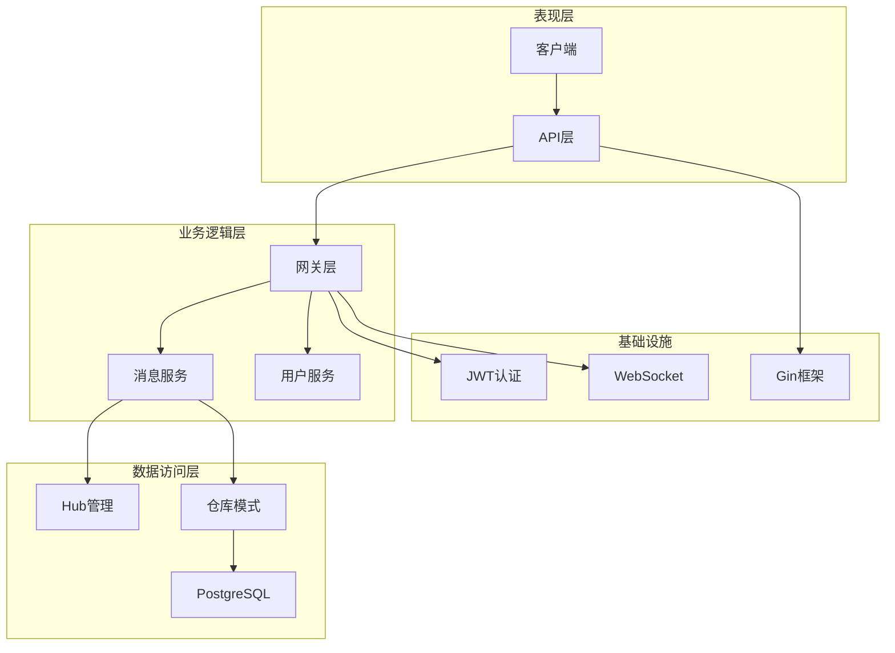
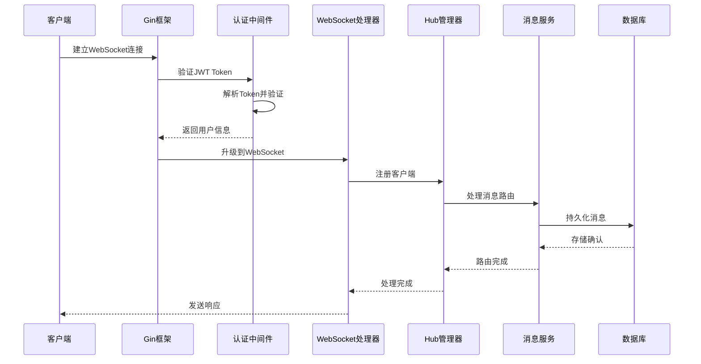
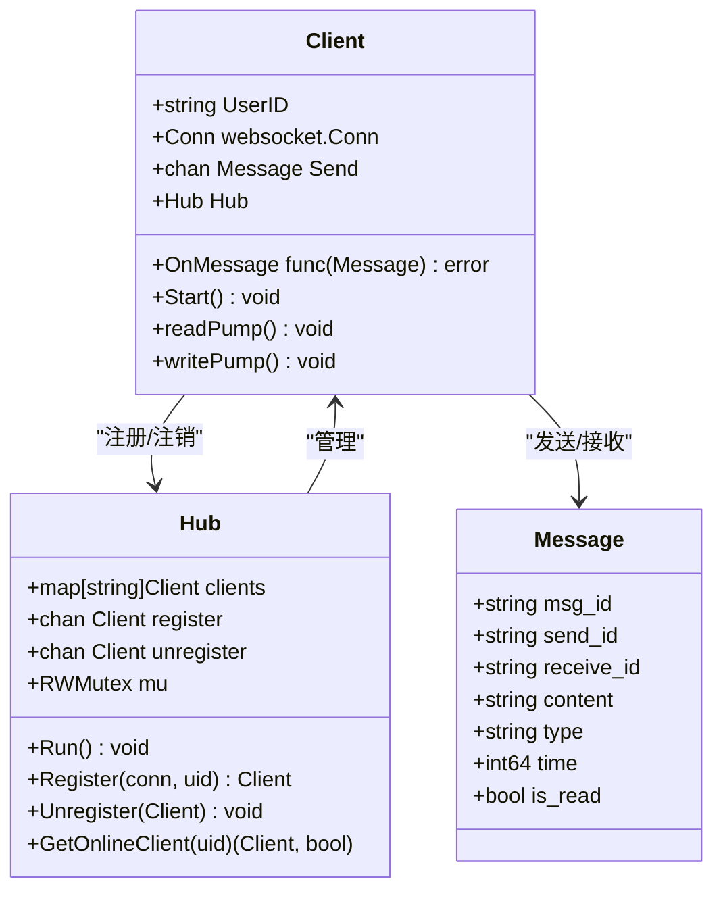
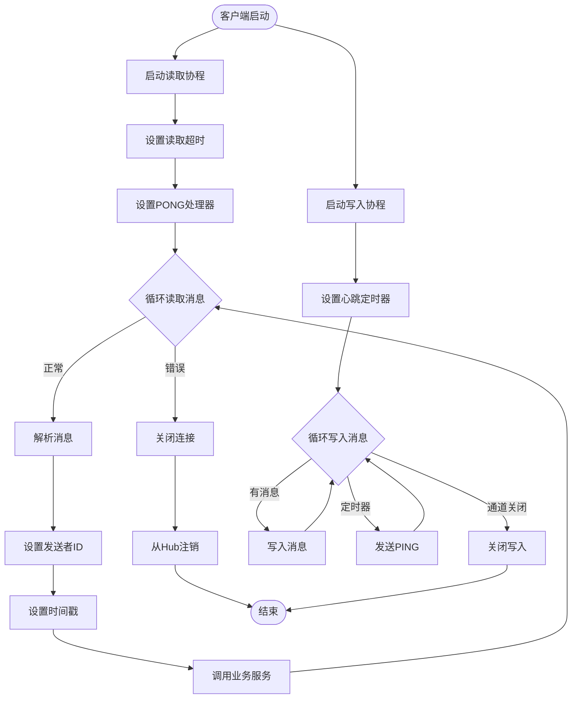
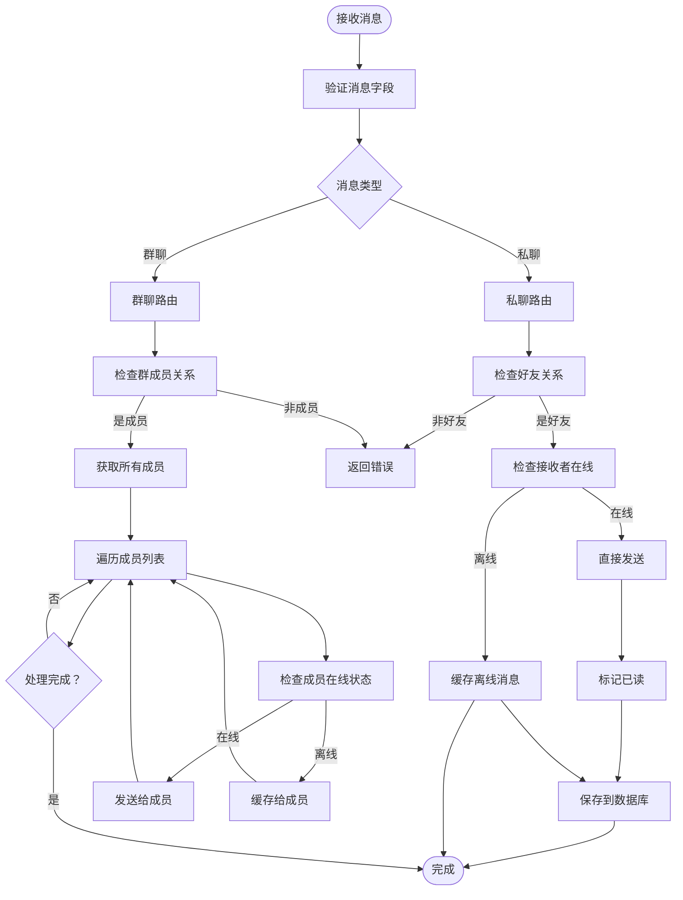
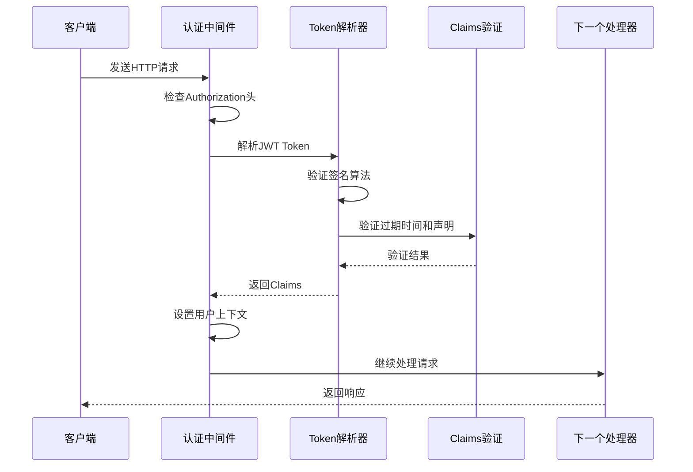
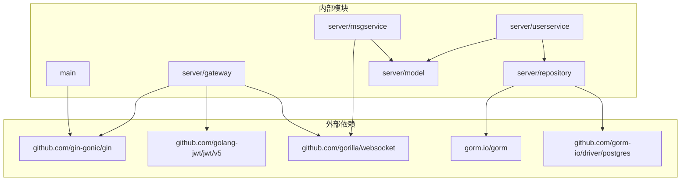

# 调试技巧

<cite>
**本文档引用的文件**
- [main.txt](file://main.txt)
- [ws_handler.go](file://server/gateway/api/ws_handler.go)
- [hub.go](file://server/msgservice/hub/hub.go)
- [client.go](file://server/msgservice/hub/client.go)
- [message_service.go](file://server/msgservice/message_service.go)
- [auth.go](file://server/gateway/auth/auth.go)
- [models.go](file://server/model/models.go)
- [init.go](file://server/repository/postgres/init.go)
- [interface.go](file://server/repository/interface.go)
- [user_service.go](file://server/userservice/user_service.go)
- [go.mod](file://go.mod)
</cite>

## 目录
1. [简介](#简介)
2. [项目结构](#项目结构)
3. [核心组件](#核心组件)
4. [架构概览](#架构概览)
5. [详细组件分析](#详细组件分析)
6. [依赖关系分析](#依赖关系分析)
7. [性能考虑](#性能考虑)
8. [故障排除指南](#故障排除指南)
9. [结论](#结论)

## 简介

本指南专为Go语言即时通讯项目设计，提供了全面的调试技巧和最佳实践。该系统采用WebSocket实时通信，结合JWT认证、消息路由和持久化存储，是一个典型的微服务架构应用。本文档重点涵盖Delve调试器使用、WebSocket连接问题诊断、日志记录最佳实践、内存泄漏检测和性能瓶颈分析等关键调试技能。

## 项目结构

该项目采用清晰的分层架构设计，主要分为以下几个层次：



**图表来源**
- [main.txt:159-175](file://main.txt#L159-L175)
- [ws_handler.go:39-68](file://server/gateway/api/ws_handler.go#L39-L68)
- [message_service.go:12-25](file://server/msgservice/message_service.go#L12-L25)

**章节来源**
- [main.txt:1-175](file://main.txt#L1-L175)
- [go.mod:1-51](file://go.mod#L1-L51)

## 核心组件

### WebSocket连接管理

系统实现了两个版本的WebSocket处理机制：

1. **基础版本** (`main.txt`)：直接使用gorilla/websocket库
2. **企业版** (`server/gateway/api/ws_handler.go`)：集成JWT认证和Hub管理

### 消息路由系统

消息服务负责不同类型消息的路由和处理：
- 私聊消息（private）
- 群聊消息（group）
- 离线消息缓存
- 在线状态查询

### 认证系统

基于JWT的认证机制，支持：
- Bearer Token验证
- 中间件拦截
- 用户信息提取

**章节来源**
- [main.txt:75-103](file://main.txt#L75-L103)
- [ws_handler.go:39-68](file://server/gateway/api/ws_handler.go#L39-L68)
- [message_service.go:27-44](file://server/msgservice/message_service.go#L27-L44)

## 架构概览



**图表来源**
- [ws_handler.go:39-68](file://server/gateway/api/ws_handler.go#L39-L68)
- [client.go:27-30](file://server/msgservice/hub/client.go#L27-L30)
- [message_service.go:27-44](file://server/msgservice/message_service.go#L27-L44)

## 详细组件分析

### WebSocket客户端管理

客户端通过Hub进行统一管理，实现连接生命周期的完整控制：



**图表来源**
- [client.go:12-18](file://server/msgservice/hub/client.go#L12-L18)
- [hub.go:10-15](file://server/msgservice/hub/hub.go#L10-L15)
- [models.go:23-32](file://server/model/models.go#L23-L32)

#### 客户端读写泵机制

客户端实现了独立的读取和写入协程，确保消息处理的异步性和可靠性：



**图表来源**
- [client.go:31-60](file://server/msgservice/hub/client.go#L31-L60)
- [client.go:61-87](file://server/msgservice/hub/client.go#L61-L87)

**章节来源**
- [client.go:12-88](file://server/msgservice/hub/client.go#L12-L88)
- [hub.go:10-61](file://server/msgservice/hub/hub.go#L10-L61)

### 消息路由与处理

消息服务实现了智能的消息路由逻辑，支持私聊和群聊两种模式：



**图表来源**
- [message_service.go:27-108](file://server/msgservice/message_service.go#L27-L108)

**章节来源**
- [message_service.go:12-168](file://server/msgservice/message_service.go#L12-L168)

### JWT认证流程

认证系统采用中间件模式，提供统一的请求拦截和验证：



**图表来源**
- [auth.go:37-61](file://server/gateway/auth/auth.go#L37-L61)
- [auth.go:64-90](file://server/gateway/auth/auth.go#L64-L90)

**章节来源**
- [auth.go:14-91](file://server/gateway/auth/auth.go#L14-L91)

## 依赖关系分析



**图表来源**
- [go.mod:5-12](file://go.mod#L5-L12)

**章节来源**
- [go.mod:1-51](file://go.mod#L1-L51)

## 性能考虑

### 内存管理优化

系统在多个层面实现了内存优化策略：

1. **缓冲区大小控制**：客户端Send通道容量设置为256，避免内存无限增长
2. **连接池配置**：PostgreSQL连接池最大空闲连接数10，最大活跃连接数100
3. **超时机制**：读取、写入、心跳都有明确的超时设置
4. **资源清理**：连接关闭时自动清理相关资源

### 并发安全

- 使用RWMutex保护Hub中的客户端映射
- 通道通信确保协程间安全的数据交换
- 原子操作保证状态一致性

### 性能监控建议

1. **添加指标收集**：监控连接数、消息吞吐量、延迟等关键指标
2. **数据库连接池监控**：观察连接池使用情况，调整最大连接数
3. **内存使用监控**：定期检查内存占用，识别潜在泄漏

## 故障排除指南

### Delve调试器使用

#### 基础调试操作

1. **启动调试会话**
   ```bash
   dlv debug --headless --listen=:2345 --api-version=2 --accept-multiclient ./main.go
   ```

2. **设置断点**
   - 在函数入口设置断点：`break server/gateway/api/ws_handler.go:39`
   - 在特定行设置断点：`break server/msgservice/hub/client.go:43`

3. **变量检查**
   - 查看当前作用域变量：`locals`
   - 检查特定变量值：`print client.UserID`
   - 查看结构体内容：`struct`

#### WebSocket连接问题调试

1. **连接建立失败**
   - 检查升级过程：`break server/gateway/api/ws_handler.go:56`
   - 验证认证流程：`break server/gateway/auth/auth.go:48`
   - 监控Hub注册：`break server/msgservice/hub/hub.go:30`

2. **消息传输异常**
   - 断点读取消息：`break server/msgservice/hub/client.go:43`
   - 检查消息路由：`break server/msgservice/message_service.go:27`
   - 监控数据库操作：`break server/repository/postgres/init.go:47`

3. **客户端断开排查**
   - 捕获意外断开：`break server/msgservice/hub/client.go:45`
   - 监控Hub注销：`break server/msgservice/hub/hub.go:35`
   - 检查资源清理：`break server/msgservice/hub/client.go:33`

#### 日志记录最佳实践

1. **日志级别设置**
   - 开发环境：Debug级别，详细输出
   - 生产环境：Info级别，关键信息
   - 错误环境：Error级别，错误追踪

2. **关键信息输出**
   - 用户ID和操作：`log.Printf("用户%s执行操作", userID)`
   - 时间戳记录：`log.Printf("时间：%d", time.Now().Unix())`
   - 错误堆栈：`log.Printf("错误：%v", err)`

3. **错误追踪方法**
   - 使用fmt.Errorf包装错误：`return fmt.Errorf("操作失败: %w", err)`
   - 添加上下文信息：`log.Printf("连接失败：%v，用户：%s", err, userID)`

#### 内存泄漏检测

1. **pprof工具使用**
   ```bash
   go pprof http://localhost:8080/debug/pprof/heap
   go pprof http://localhost:8080/debug/pprof/profile
   ```

2. **常见泄漏场景**
   - 未关闭的WebSocket连接
   - 未清理的通道引用
   - 未释放的数据库连接

3. **检测方法**
   - 监控内存使用趋势
   - 比较不同时间段的内存快照
   - 分析goroutine数量变化

#### 性能瓶颈分析

1. **CPU使用率分析**
   - 使用`go tool pprof cpu`分析热点函数
   - 关注消息序列化和反序列化
   - 检查数据库查询性能

2. **内存使用分析**
   - 分析对象分配模式
   - 检查缓冲区使用效率
   - 监控垃圾回收频率

3. **网络性能分析**
   - 监控WebSocket连接数
   - 分析消息延迟分布
   - 检查带宽使用情况

### 常见问题诊断

#### 用户认证失败

1. **Token验证失败**
   - 检查Token格式：`Authorization: Bearer <token>`
   - 验证签名算法：HS256要求
   - 检查过期时间：exp字段验证

2. **中间件拦截问题**
   - 确认中间件注册顺序
   - 检查请求头是否正确传递
   - 验证用户ID提取逻辑

**章节来源**
- [auth.go:37-61](file://server/gateway/auth/auth.go#L37-L61)
- [ws_handler.go:39-68](file://server/gateway/api/ws_handler.go#L39-L68)

#### 消息丢失问题

1. **私聊消息丢失**
   - 检查好友关系验证
   - 监控在线状态查询
   - 验证离线消息缓存

2. **群聊消息丢失**
   - 检查群成员关系
   - 监控成员列表获取
   - 验证消息分发逻辑

3. **数据库连接问题**
   - 检查连接池配置
   - 监控SQL执行时间
   - 验证事务处理

**章节来源**
- [message_service.go:46-108](file://server/msgservice/message_service.go#L46-L108)
- [init.go:42-65](file://server/repository/postgres/init.go#L42-L65)

#### WebSocket连接问题

1. **连接升级失败**
   - 检查CORS配置
   - 验证协议版本
   - 监控握手过程

2. **心跳超时**
   - 检查网络延迟
   - 验证超时设置
   - 监控服务器负载

3. **消息队列阻塞**
   - 检查通道容量
   - 监控消费者处理速度
   - 验证背压机制

**章节来源**
- [ws_handler.go:14-28](file://server/gateway/api/ws_handler.go#L14-L28)
- [client.go:20-25](file://server/msgservice/hub/client.go#L20-L25)

## 结论

本调试指南涵盖了Go语言即时通讯项目的各个方面，从基础的Delve调试器使用到复杂的性能分析。通过合理运用这些调试技巧，可以有效提升系统的稳定性和可维护性。

关键要点总结：
- 建立完善的日志体系，区分不同级别的日志输出
- 使用Delve进行精确的断点调试和变量检查
- 实施内存泄漏检测和性能监控
- 建立标准化的故障排除流程
- 持续优化系统架构和代码质量

建议在开发过程中：
1. 始终保持良好的日志记录习惯
2. 定期进行性能基准测试
3. 建立自动化监控和告警机制
4. 持续改进调试工具链
5. 培养团队的调试协作能力