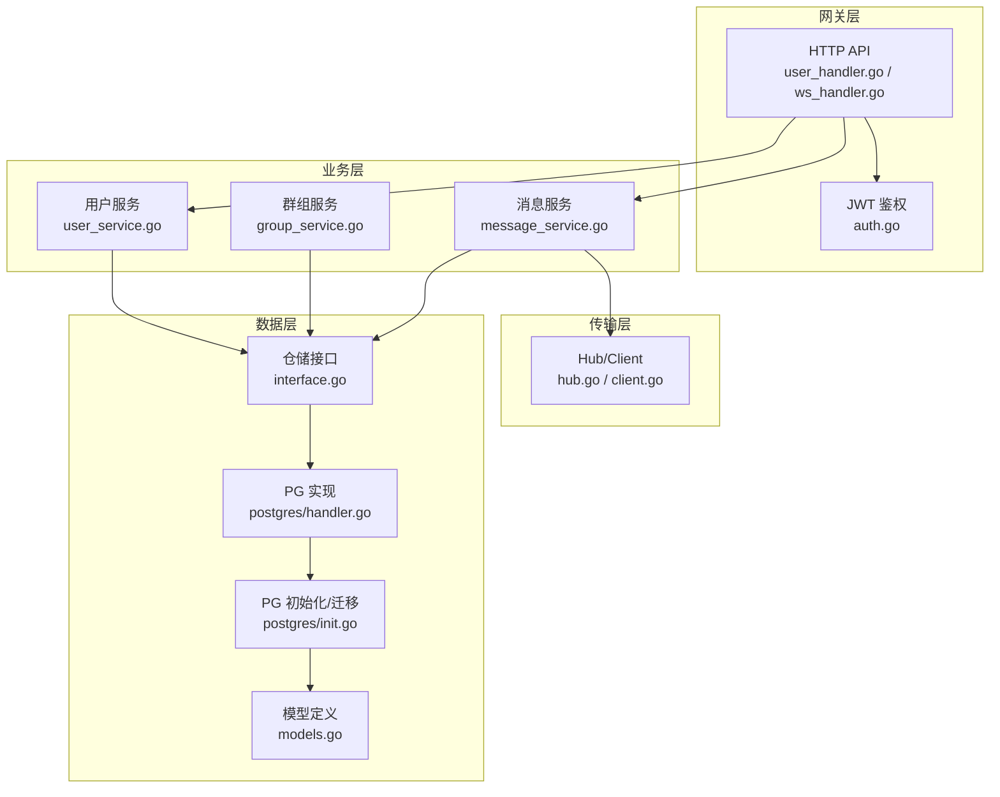
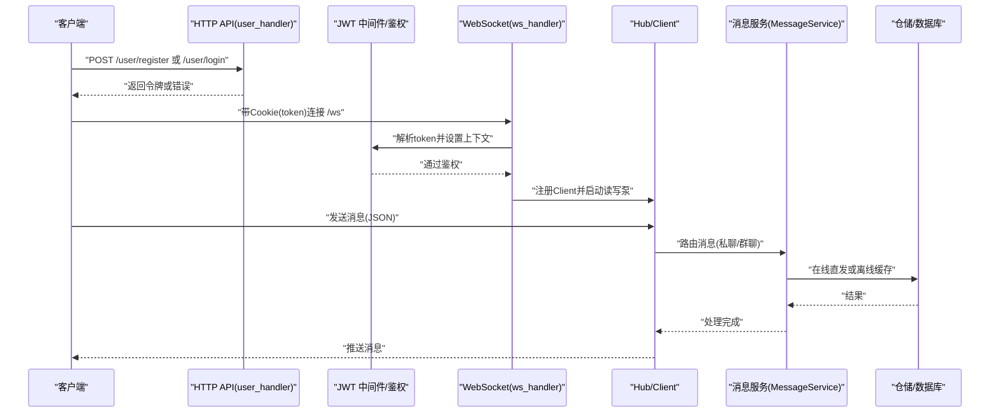
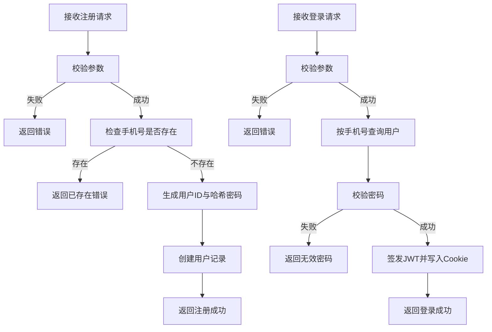
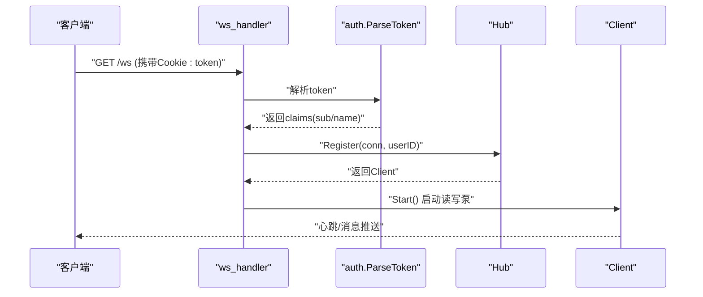
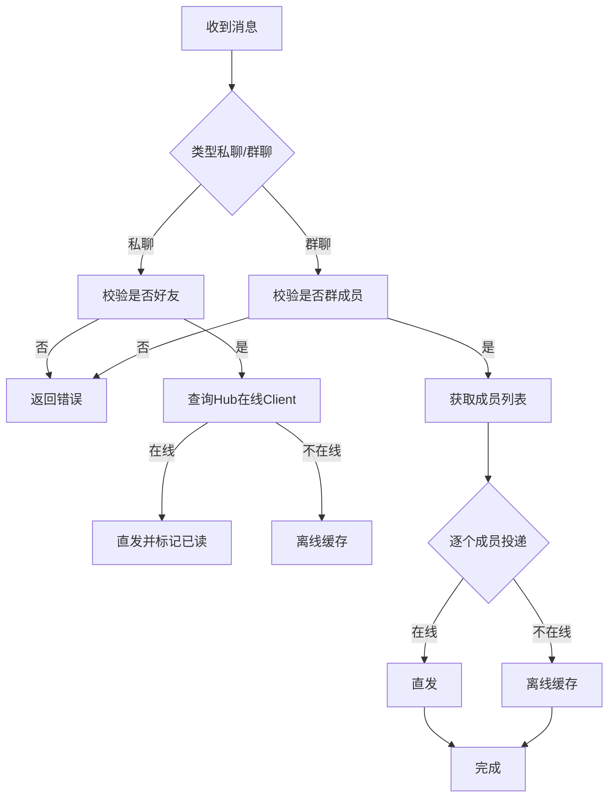
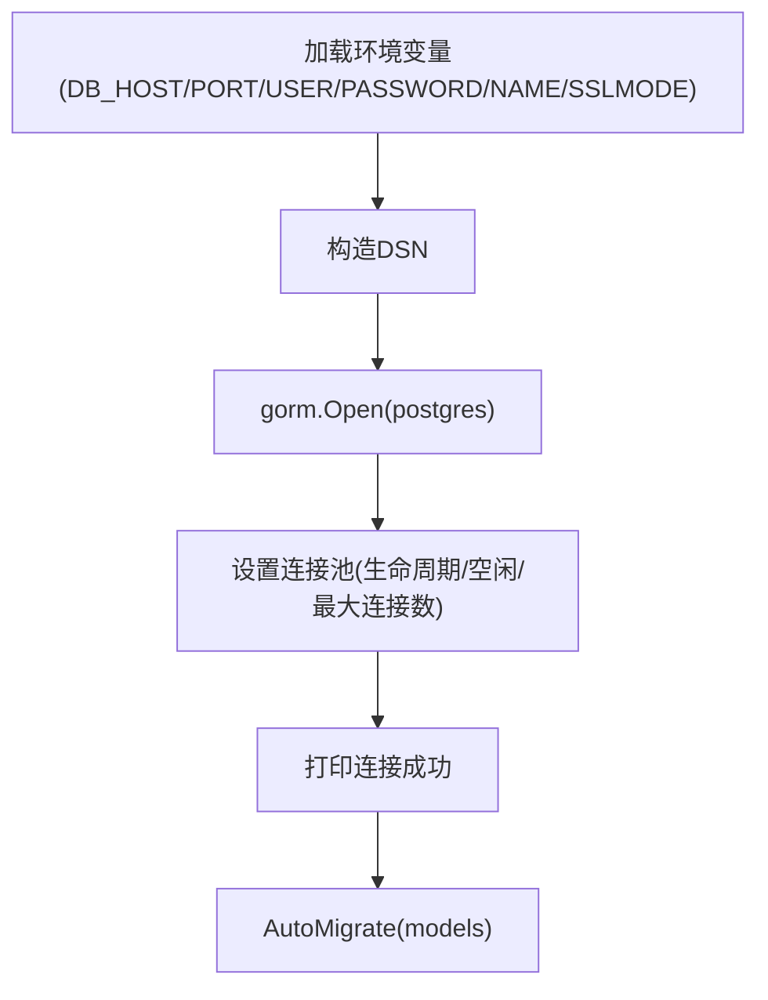
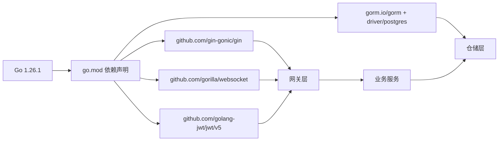

# 快速开始

<cite>
**本文引用的文件**
- [go.mod](file://go.mod)
- [main.txt](file://main.txt)
- [server/gateway/api/ws_handler.go](file://server/gateway/api/ws_handler.go)
- [server/gateway/api/user_handler.go](file://server/gateway/api/user_handler.go)
- [server/gateway/auth/auth.go](file://server/gateway/auth/auth.go)
- [server/repository/postgres/init.go](file://server/repository/postgres/init.go)
- [server/repository/postgres/handler.go](file://server/repository/postgres/handler.go)
- [server/repository/interface.go](file://server/repository/interface.go)
- [server/model/models.go](file://server/model/models.go)
- [server/msgservice/message_service.go](file://server/msgservice/message_service.go)
- [server/msgservice/hub/hub.go](file://server/msgservice/hub/hub.go)
- [server/msgservice/hub/client.go](file://server/msgservice/hub/client.go)
- [server/userservice/user_service.go](file://server/userservice/user_service.go)
- [server/userservice/group_service.go](file://server/userservice/group_service.go)
</cite>

## 目录
1. [简介](#简介)
2. [项目结构](#项目结构)
3. [核心组件](#核心组件)
4. [架构总览](#架构总览)
5. [详细组件分析](#详细组件分析)
6. [依赖关系分析](#依赖关系分析)
7. [性能与可扩展性建议](#性能与可扩展性建议)
8. [故障排查指南](#故障排查指南)
9. [结论](#结论)
10. [附录：30分钟上手清单](#附录30分钟上手清单)

## 简介
本指南面向新手开发者，帮助你在30分钟内完成Go语言即时通讯项目的环境准备、依赖安装、数据库初始化、编译运行、基础功能验证与常见问题排查。项目采用Go模块化分层设计，包含网关层（HTTP+WebSocket）、认证、消息服务、用户与群组服务、仓储层（PostgreSQL）以及模型定义。

## 项目结构
项目采用按“职责”分层的目录组织方式：
- server/gateway：HTTP接口与WebSocket接入层
- server/userservice：用户与群组业务逻辑
- server/msgservice：消息路由与在线/离线投递
- server/repository：数据访问抽象与PostgreSQL实现
- server/model：领域模型与错误类型
- server/gateway/auth：JWT鉴权与中间件
- go.mod：Go模块与依赖声明
- main.txt：简易单文件示例（演示Hub/WS）

图表来源
- [server/gateway/api/user_handler.go:1-206](file://server/gateway/api/user_handler.go#L1-L206)
- [server/gateway/api/ws_handler.go:1-69](file://server/gateway/api/ws_handler.go#L1-L69)
- [server/gateway/auth/auth.go:1-91](file://server/gateway/auth/auth.go#L1-L91)
- [server/userservice/user_service.go:1-187](file://server/userservice/user_service.go#L1-L187)
- [server/userservice/group_service.go:1-217](file://server/userservice/group_service.go#L1-L217)
- [server/msgservice/message_service.go:1-168](file://server/msgservice/message_service.go#L1-L168)
- [server/msgservice/hub/hub.go:1-61](file://server/msgservice/hub/hub.go#L1-L61)
- [server/msgservice/hub/client.go:1-88](file://server/msgservice/hub/client.go#L1-L88)
- [server/repository/interface.go:1-74](file://server/repository/interface.go#L1-L74)
- [server/repository/postgres/init.go:1-75](file://server/repository/postgres/init.go#L1-L75)
- [server/repository/postgres/handler.go:1-585](file://server/repository/postgres/handler.go#L1-L585)
- [server/model/models.go:1-146](file://server/model/models.go#L1-L146)

章节来源
- [go.mod:1-51](file://go.mod#L1-L51)
- [server/gateway/api/user_handler.go:1-206](file://server/gateway/api/user_handler.go#L1-L206)
- [server/gateway/api/ws_handler.go:1-69](file://server/gateway/api/ws_handler.go#L1-L69)
- [server/gateway/auth/auth.go:1-91](file://server/gateway/auth/auth.go#L1-L91)
- [server/repository/postgres/init.go:1-75](file://server/repository/postgres/init.go#L1-L75)
- [server/repository/postgres/handler.go:1-585](file://server/repository/postgres/handler.go#L1-L585)
- [server/repository/interface.go:1-74](file://server/repository/interface.go#L1-L74)
- [server/model/models.go:1-146](file://server/model/models.go#L1-L146)
- [server/msgservice/message_service.go:1-168](file://server/msgservice/message_service.go#L1-L168)
- [server/msgservice/hub/hub.go:1-61](file://server/msgservice/hub/hub.go#L1-L61)
- [server/msgservice/hub/client.go:1-88](file://server/msgservice/hub/client.go#L1-L88)
- [server/userservice/user_service.go:1-187](file://server/userservice/user_service.go#L1-L187)
- [server/userservice/group_service.go:1-217](file://server/userservice/group_service.go#L1-L217)

## 核心组件
- 网关与鉴权
  - HTTP API：注册、登录、好友/群组相关接口
  - WebSocket：基于Cookie中的token进行鉴权后升级
  - JWT：签发与解析，支持中间件校验
- 消息服务
  - 私聊/群聊路由
  - 在线直发与离线缓存
  - 在线状态查询
- 用户与群组服务
  - 用户注册/登录、好友请求、删除好友
  - 群组创建、入群/退群、成员角色管理
- 数据层
  - GORM PostgreSQL驱动
  - 自动迁移
  - 仓储接口与实现分离

章节来源
- [server/gateway/api/user_handler.go:1-206](file://server/gateway/api/user_handler.go#L1-L206)
- [server/gateway/api/ws_handler.go:1-69](file://server/gateway/api/ws_handler.go#L1-L69)
- [server/gateway/auth/auth.go:1-91](file://server/gateway/auth/auth.go#L1-L91)
- [server/msgservice/message_service.go:1-168](file://server/msgservice/message_service.go#L1-L168)
- [server/userservice/user_service.go:1-187](file://server/userservice/user_service.go#L1-L187)
- [server/userservice/group_service.go:1-217](file://server/userservice/group_service.go#L1-L217)
- [server/repository/postgres/init.go:1-75](file://server/repository/postgres/init.go#L1-L75)
- [server/repository/postgres/handler.go:1-585](file://server/repository/postgres/handler.go#L1-L585)
- [server/repository/interface.go:1-74](file://server/repository/interface.go#L1-L74)
- [server/model/models.go:1-146](file://server/model/models.go#L1-L146)

## 架构总览
下图展示从客户端到服务端的关键交互路径：HTTP注册/登录 -> WebSocket鉴权 -> Hub维护连接 -> 消息服务路由 -> 仓储持久化。

图表来源
- [server/gateway/api/user_handler.go:1-206](file://server/gateway/api/user_handler.go#L1-L206)
- [server/gateway/api/ws_handler.go:1-69](file://server/gateway/api/ws_handler.go#L1-L69)
- [server/gateway/auth/auth.go:1-91](file://server/gateway/auth/auth.go#L1-L91)
- [server/msgservice/hub/hub.go:1-61](file://server/msgservice/hub/hub.go#L1-L61)
- [server/msgservice/hub/client.go:1-88](file://server/msgservice/hub/client.go#L1-L88)
- [server/msgservice/message_service.go:1-168](file://server/msgservice/message_service.go#L1-L168)
- [server/repository/postgres/handler.go:1-585](file://server/repository/postgres/handler.go#L1-L585)

## 详细组件分析

### 组件A：HTTP注册与登录（用户服务）
- 功能要点
  - 注册：校验参数，密码加密，生成用户ID并入库
  - 登录：凭手机号查找用户，bcrypt校验密码，签发JWT并写入Cookie
- 关键流程

图表来源
- [server/userservice/user_service.go:1-187](file://server/userservice/user_service.go#L1-L187)
- [server/gateway/api/user_handler.go:1-206](file://server/gateway/api/user_handler.go#L1-L206)
- [server/gateway/auth/auth.go:1-91](file://server/gateway/auth/auth.go#L1-L91)

章节来源
- [server/userservice/user_service.go:1-187](file://server/userservice/user_service.go#L1-L187)
- [server/gateway/api/user_handler.go:1-206](file://server/gateway/api/user_handler.go#L1-L206)
- [server/gateway/auth/auth.go:1-91](file://server/gateway/auth/auth.go#L1-L91)

### 组件B：WebSocket鉴权与连接（网关）
- 功能要点
  - 从Cookie读取token，解析JWT，设置用户上下文
  - 升级为WebSocket，注册到Hub，启动读写泵
- 关键流程

图表来源
- [server/gateway/api/ws_handler.go:1-69](file://server/gateway/api/ws_handler.go#L1-L69)
- [server/gateway/auth/auth.go:1-91](file://server/gateway/auth/auth.go#L1-L91)
- [server/msgservice/hub/hub.go:1-61](file://server/msgservice/hub/hub.go#L1-L61)
- [server/msgservice/hub/client.go:1-88](file://server/msgservice/hub/client.go#L1-L88)

章节来源
- [server/gateway/api/ws_handler.go:1-69](file://server/gateway/api/ws_handler.go#L1-L69)
- [server/gateway/auth/auth.go:1-91](file://server/gateway/auth/auth.go#L1-L91)
- [server/msgservice/hub/hub.go:1-61](file://server/msgservice/hub/hub.go#L1-L61)
- [server/msgservice/hub/client.go:1-88](file://server/msgservice/hub/client.go#L1-L88)

### 组件C：消息路由与投递（消息服务）
- 功能要点
  - 路由类型：私聊/群聊
  - 在线直发：命中在线用户直接投递
  - 离线缓存：未命中在线用户则落库
  - 群聊广播：遍历成员并分别尝试直发或缓存
- 关键流程

图表来源
- [server/msgservice/message_service.go:1-168](file://server/msgservice/message_service.go#L1-L168)
- [server/msgservice/hub/hub.go:1-61](file://server/msgservice/hub/hub.go#L1-L61)
- [server/repository/postgres/handler.go:1-585](file://server/repository/postgres/handler.go#L1-L585)

章节来源
- [server/msgservice/message_service.go:1-168](file://server/msgservice/message_service.go#L1-L168)
- [server/msgservice/hub/hub.go:1-61](file://server/msgservice/hub/hub.go#L1-L61)
- [server/repository/postgres/handler.go:1-585](file://server/repository/postgres/handler.go#L1-L585)

### 组件D：仓储接口与PostgreSQL初始化
- 功能要点
  - 定义用户、好友、群组、成员、消息、请求等仓储接口
  - 通过环境变量加载PG配置，建立连接，设置连接池
  - 自动迁移模型表结构
- 关键流程

图表来源
- [server/repository/postgres/init.go:1-75](file://server/repository/postgres/init.go#L1-L75)
- [server/repository/interface.go:1-74](file://server/repository/interface.go#L1-L74)
- [server/model/models.go:1-146](file://server/model/models.go#L1-L146)

章节来源
- [server/repository/postgres/init.go:1-75](file://server/repository/postgres/init.go#L1-L75)
- [server/repository/interface.go:1-74](file://server/repository/interface.go#L1-L74)
- [server/model/models.go:1-146](file://server/model/models.go#L1-L146)

## 依赖关系分析
- 语言与框架
  - Go 1.26.1
  - Gin Web框架、Gorilla WebSocket、JWT、GORM PostgreSQL
- 模块耦合
  - 网关层依赖鉴权与业务服务
  - 业务服务依赖仓储接口
  - 仓储接口由PostgreSQL实现
  - 消息服务依赖Hub与仓储
- 外部依赖
  - PostgreSQL数据库
  - 环境变量控制数据库连接

图表来源
- [go.mod:1-51](file://go.mod#L1-L51)

章节来源
- [go.mod:1-51](file://go.mod#L1-L51)

## 性能与可扩展性建议
- 连接池与超时
  - 已在PG初始化中设置连接池参数；可根据QPS调优
- 消息投递
  - 在线直发使用带缓冲的Send通道；离线缓存使用数据库批量写入
- 并发模型
  - Hub使用RWMutex保护在线用户映射；Client读写分离
- 可扩展点
  - 引入消息队列（如Kafka/RabbitMQ）解耦消息投递
  - 增加Redis缓存热点用户在线状态
  - 分库分表与读写分离（按用户ID/群组ID哈希）

[本节为通用建议，无需特定文件引用]

## 故障排查指南
- 环境变量未设置导致数据库连接失败
  - 症状：启动时报数据库连接错误
  - 排查：确认DB_HOST/DB_PORT/DB_USER/DB_PASSWORD/DB_NAME/DB_SSLMODE
  - 参考：[server/repository/postgres/init.go:24-33](file://server/repository/postgres/init.go#L24-L33)
- JWT签名密钥不一致或过期
  - 症状：WebSocket升级失败或返回未授权
  - 排查：核对签发与解析使用的密钥；检查过期时间
  - 参考：[server/gateway/auth/auth.go:14-34](file://server/gateway/auth/auth.go#L14-L34)
- WebSocket跨域/Origin限制
  - 症状：升级失败或被拒绝
  - 排查：检查允许的Origin列表
  - 参考：[server/gateway/api/ws_handler.go:14-28](file://server/gateway/api/ws_handler.go#L14-L28)
- 消息未送达
  - 症状：接收方未收到消息
  - 排查：确认收方是否在线；查看离线消息是否入库；检查路由类型与权限
  - 参考：[server/msgservice/message_service.go:27-108](file://server/msgservice/message_service.go#L27-L108)

章节来源
- [server/repository/postgres/init.go:24-33](file://server/repository/postgres/init.go#L24-L33)
- [server/gateway/auth/auth.go:14-34](file://server/gateway/auth/auth.go#L14-L34)
- [server/gateway/api/ws_handler.go:14-28](file://server/gateway/api/ws_handler.go#L14-L28)
- [server/msgservice/message_service.go:27-108](file://server/msgservice/message_service.go#L27-L108)

## 结论
本项目提供了从HTTP注册登录到WebSocket实时通信的完整链路，结合GORM PostgreSQL实现数据持久化与自动迁移。按照“30分钟上手清单”，你可以在本地快速跑通并验证核心功能。

[本节为总结，无需特定文件引用]

## 附录：30分钟上手清单

- 环境准备
  - 安装Go 1.26.1或以上版本
  - 安装PostgreSQL并创建数据库（名称与环境变量一致）
  - 准备文本编辑器或IDE（推荐Go插件）
- 依赖安装
  - 进入项目根目录执行依赖安装（模块已声明于go.mod）
  - 参考：[go.mod:1-51](file://go.mod#L1-L51)
- 数据库配置与初始化
  - 设置环境变量（DB_HOST/DB_PORT/DB_USER/DB_PASSWORD/DB_NAME/DB_SSLMODE）
  - 启动应用后自动执行数据库迁移
  - 参考：[server/repository/postgres/init.go:24-75](file://server/repository/postgres/init.go#L24-L75)
- 编译与运行
  - 使用Go命令编译并运行主程序（或参考main.txt中的单文件示例）
  - 访问根路径查看提示信息
  - 参考：[main.txt:159-175](file://main.txt#L159-L175)
- 基本使用流程（从注册到WebSocket）
  - 注册：POST /user/register（携带手机号、昵称、密码）
  - 登录：POST /user/login（成功后会话Cookie含token）
  - 建立WebSocket：GET /ws（需携带Cookie: token）
  - 发送消息：向已连接的WebSocket发送JSON消息（包含type/content等字段）
  - 参考：
    - [server/gateway/api/user_handler.go:21-61](file://server/gateway/api/user_handler.go#L21-L61)
    - [server/gateway/api/ws_handler.go:39-68](file://server/gateway/api/ws_handler.go#L39-L68)
- 测试与验证
  - HTTP接口：使用curl或Postman验证注册/登录
  - WebSocket：使用浏览器或WebSocket客户端连接，发送消息并观察回执
  - 参考：
    - [server/gateway/api/user_handler.go:1-206](file://server/gateway/api/user_handler.go#L1-L206)
    - [server/gateway/api/ws_handler.go:1-69](file://server/gateway/api/ws_handler.go#L1-L69)
- 常见问题与解决
  - 数据库连接失败：检查环境变量与数据库可达性
  - WebSocket升级失败：确认Cookie中token有效且Origin允许
  - 消息未送达：确认双方关系/群组成员身份与在线状态
  - 参考：
    - [server/repository/postgres/init.go:42-65](file://server/repository/postgres/init.go#L42-L65)
    - [server/gateway/api/ws_handler.go:14-28](file://server/gateway/api/ws_handler.go#L14-L28)
    - [server/msgservice/message_service.go:27-108](file://server/msgservice/message_service.go#L27-L108)

章节来源
- [go.mod:1-51](file://go.mod#L1-L51)
- [server/repository/postgres/init.go:24-75](file://server/repository/postgres/init.go#L24-L75)
- [main.txt:159-175](file://main.txt#L159-L175)
- [server/gateway/api/user_handler.go:1-206](file://server/gateway/api/user_handler.go#L1-L206)
- [server/gateway/api/ws_handler.go:1-69](file://server/gateway/api/ws_handler.go#L1-L69)
- [server/msgservice/message_service.go:27-108](file://server/msgservice/message_service.go#L27-L108)