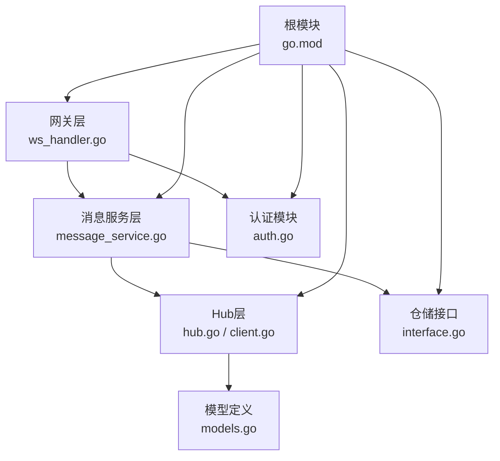
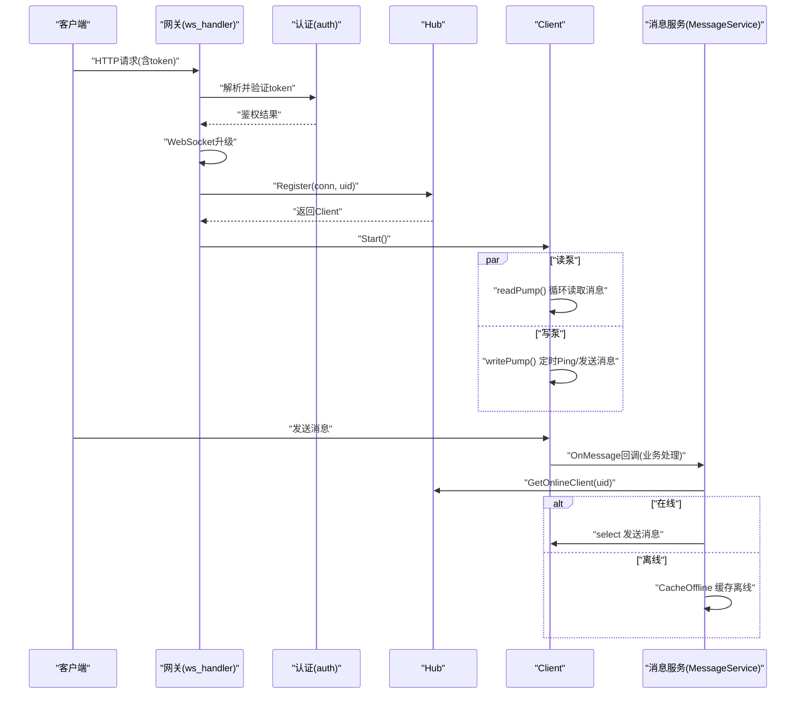
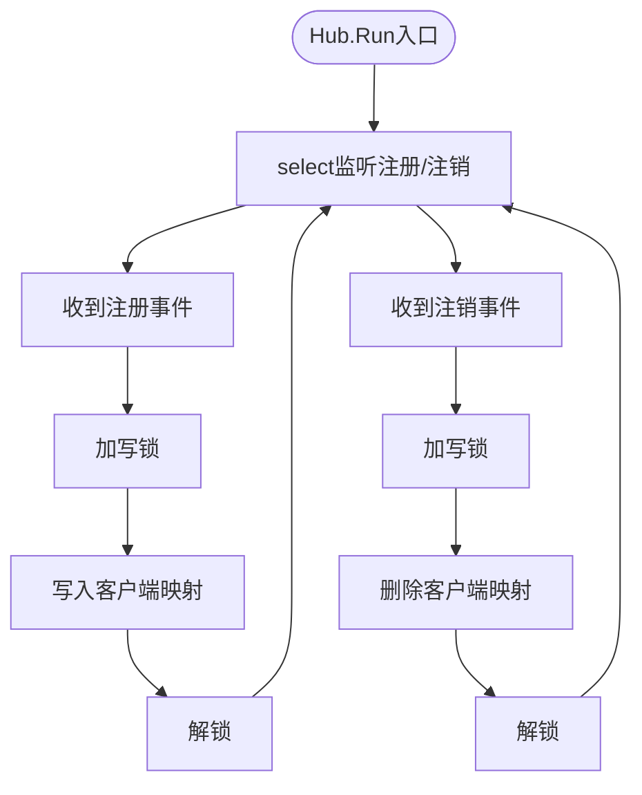
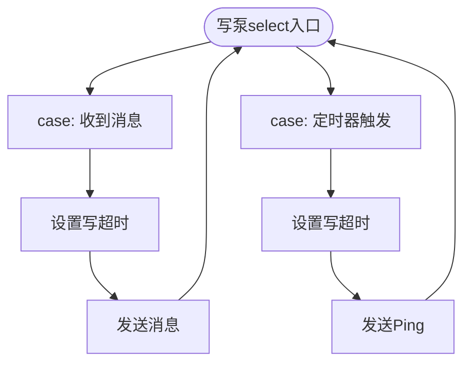
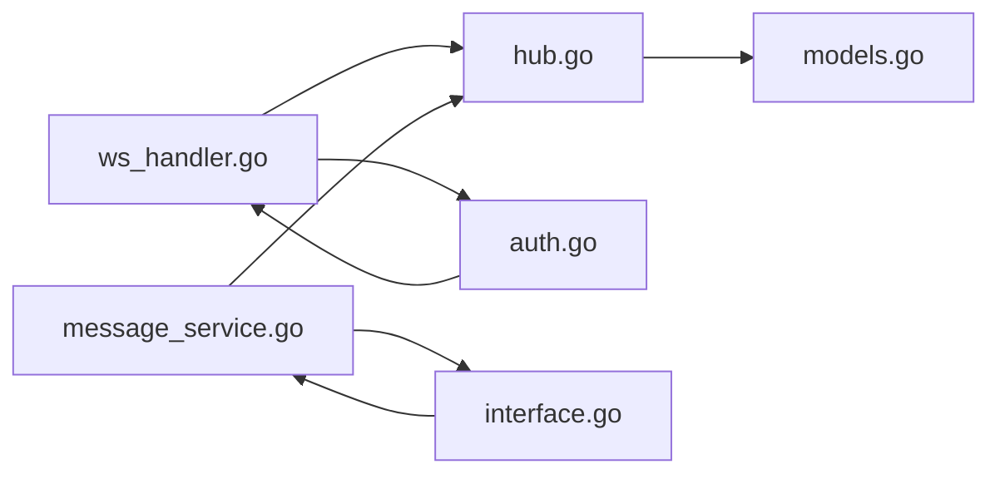

# 并发处理优化

<cite>
**本文引用的文件**
- [server/msgservice/hub/hub.go](file://server/msgservice/hub/hub.go)
- [server/msgservice/hub/client.go](file://server/msgservice/hub/client.go)
- [server/msgservice/message_service.go](file://server/msgservice/message_service.go)
- [server/gateway/api/ws_handler.go](file://server/gateway/api/ws_handler.go)
- [server/model/models.go](file://server/model/models.go)
- [server/gateway/auth/auth.go](file://server/gateway/auth/auth.go)
- [server/repository/interface.go](file://server/repository/interface.go)
- [go.mod](file://go.mod)
- [main.txt](file://main.txt)
</cite>

## 目录
1. [引言](#引言)
2. [项目结构](#项目结构)
3. [核心组件](#核心组件)
4. [架构总览](#架构总览)
5. [详细组件分析](#详细组件分析)
6. [依赖关系分析](#依赖关系分析)
7. [性能考量](#性能考量)
8. [故障排查指南](#故障排查指南)
9. [结论](#结论)
10. [附录：优化前后对比示例路径](#附录优化前后对比示例路径)

## 引言
本文件面向Go语言即时通讯项目，聚焦Hub模式的并发处理与优化。内容涵盖客户端注册/注销的并发安全、goroutine池与channel缓冲区配置、读写锁（RWMutex）的使用与性能影响、并发数据结构选择、select-case在Hub中的应用与优化、goroutine数量控制与上下文取消机制，以及并发调试与性能分析方法，并通过“附录”给出优化前后对比示例的定位路径。

## 项目结构
该项目采用分层+功能域划分的组织方式：
- 网关层：HTTP路由与WebSocket升级，负责鉴权与连接建立
- 消息服务层：消息路由、离线缓存、在线状态查询
- Hub层：客户端集合管理、注册/注销调度、读写泵
- 模型与仓库接口：消息、用户、群组等模型定义与仓储接口
- 认证模块：JWT解析与鉴权中间件
- 根模块：Go版本与依赖声明

图示来源
- [server/gateway/api/ws_handler.go:39-68](file://server/gateway/api/ws_handler.go#L39-L68)
- [server/msgservice/message_service.go:27-108](file://server/msgservice/message_service.go#L27-L108)
- [server/msgservice/hub/hub.go:10-61](file://server/msgservice/hub/hub.go#L10-L61)
- [server/msgservice/hub/client.go:27-87](file://server/msgservice/hub/client.go#L27-L87)
- [server/model/models.go:23-36](file://server/model/models.go#L23-L36)
- [server/gateway/auth/auth.go:37-61](file://server/gateway/auth/auth.go#L37-L61)
- [server/repository/interface.go:46-55](file://server/repository/interface.go#L46-L55)
- [go.mod:1-51](file://go.mod#L1-L51)

章节来源
- [server/gateway/api/ws_handler.go:39-68](file://server/gateway/api/ws_handler.go#L39-L68)
- [server/msgservice/message_service.go:27-108](file://server/msgservice/message_service.go#L27-L108)
- [server/msgservice/hub/hub.go:10-61](file://server/msgservice/hub/hub.go#L10-L61)
- [server/msgservice/hub/client.go:27-87](file://server/msgservice/hub/client.go#L27-L87)
- [server/model/models.go:23-36](file://server/model/models.go#L23-L36)
- [server/gateway/auth/auth.go:37-61](file://server/gateway/auth/auth.go#L37-L61)
- [server/repository/interface.go:46-55](file://server/repository/interface.go#L46-L55)
- [go.mod:1-51](file://go.mod#L1-L51)

## 核心组件
- Hub与Client
  - Hub维护在线客户端映射、注册/注销通道与读写锁；Run循环通过select处理注册/注销事件，保证并发安全
  - Client封装单个WebSocket连接，包含发送队列、读写泵协程、心跳与超时控制
- 消息服务
  - 路由私聊/群聊消息，结合Hub在线状态进行直发或离线缓存
  - 使用select-case非阻塞尝试投递消息，避免阻塞写入导致的级联影响
- 网关与认证
  - WebSocket升级与Origin校验、JWT鉴权中间件，确保连接建立的安全性
- 模型与仓储接口
  - 统一的消息结构与仓储接口契约，便于替换存储后端

章节来源
- [server/msgservice/hub/hub.go:10-61](file://server/msgservice/hub/hub.go#L10-L61)
- [server/msgservice/hub/client.go:27-87](file://server/msgservice/hub/client.go#L27-L87)
- [server/msgservice/message_service.go:27-108](file://server/msgservice/message_service.go#L27-L108)
- [server/gateway/api/ws_handler.go:39-68](file://server/gateway/api/ws_handler.go#L39-L68)
- [server/gateway/auth/auth.go:37-61](file://server/gateway/auth/auth.go#L37-L61)
- [server/model/models.go:23-36](file://server/model/models.go#L23-L36)
- [server/repository/interface.go:46-55](file://server/repository/interface.go#L46-L55)

## 架构总览
下图展示从HTTP到WebSocket、再到Hub与Client的完整调用链路与并发交互：

图示来源
- [server/gateway/api/ws_handler.go:39-68](file://server/gateway/api/ws_handler.go#L39-L68)
- [server/gateway/auth/auth.go:64-90](file://server/gateway/auth/auth.go#L64-L90)
- [server/msgservice/hub/hub.go:44-60](file://server/msgservice/hub/hub.go#L44-L60)
- [server/msgservice/hub/client.go:27-87](file://server/msgservice/hub/client.go#L27-L87)
- [server/msgservice/message_service.go:27-108](file://server/msgservice/message_service.go#L27-L108)

## 详细组件分析

### Hub模式与并发安全
- 注册/注销流程
  - Hub通过两个带缓冲的通道接收注册/注销请求，Run循环以select处理，避免阻塞
  - 对共享映射的修改使用互斥锁保护，确保并发安全
- 在线查询
  - GetOnlineClient使用读写锁的读锁，允许多个并发读取，提升高并发下的查询吞吐
- 读写泵
  - Client的读泵负责解码消息并触发业务回调；写泵负责定时Ping与消息发送，设置写入超时，防止阻塞

图示来源
- [server/msgservice/hub/hub.go:27-43](file://server/msgservice/hub/hub.go#L27-L43)
- [server/msgservice/hub/hub.go:55-60](file://server/msgservice/hub/hub.go#L55-L60)

章节来源
- [server/msgservice/hub/hub.go:10-61](file://server/msgservice/hub/hub.go#L10-L61)
- [server/msgservice/hub/client.go:27-87](file://server/msgservice/hub/client.go#L27-L87)

### goroutine池与channel缓冲区配置
- Hub注册/注销通道
  - 注册通道缓冲区适中，可承载短时间突发注册；注销通道缓冲区较小，避免过多延迟注销堆积
- Client发送队列
  - 发送通道缓冲区较大，用于缓解下游写阻塞与网络抖动
- 建议
  - 根据峰值在线数与消息速率动态评估缓冲区大小，避免过大造成内存压力或过小导致丢消息
  - 可引入背压策略（如阻塞发送或拒绝策略）以保护系统稳定性

章节来源
- [server/msgservice/hub/hub.go:17-25](file://server/msgservice/hub/hub.go#L17-L25)
- [server/msgservice/hub/client.go:12-18](file://server/msgservice/hub/client.go#L12-L18)

### 读写锁（RWMutex）的使用与性能影响
- 使用场景
  - Hub在线表查询使用读锁，允许多个协程同时读取，提高并发查询效率
- 性能影响
  - 读多写少场景收益显著；若写操作频繁，读锁竞争可能上升，需结合业务特征评估
- 建议
  - 将读写分离明确化，避免在读锁内执行耗时逻辑
  - 对热点键做局部缓存或分片，降低全局锁竞争

章节来源
- [server/msgservice/hub/hub.go:55-60](file://server/msgservice/hub/hub.go#L55-L60)

### 并发数据结构选择与替代方案
- 当前实现
  - 使用map存储在线客户端，配合互斥锁保护写操作；查询使用读锁
- 替代方案
  - sync.Map：适合读多写少且键稳定场景，减少锁粒度
  - 分片map：按用户ID哈希分桶，降低锁冲突
  - 有序结构：如跳表或平衡树，便于范围查询与限流
- 选型建议
  - 优先评估业务并发特征与访问模式，再决定是否引入更复杂结构

章节来源
- [server/msgservice/hub/hub.go:10-15](file://server/msgservice/hub/hub.go#L10-L15)

### select-case在Hub中的应用与优化
- 应用点
  - Hub.Run：select处理注册/注销事件，避免阻塞
  - Client.writePump：select处理消息发送与定时Ping，兼顾实时性与资源占用
  - MessageService：对在线目标尝试非阻塞发送，失败则缓存离线
- 优化技巧
  - default分支用于非阻塞发送，避免写阻塞扩散
  - 合理设置写超时与Ping周期，提升连接健康度
  - 将耗时逻辑移出select，避免阻塞事件处理

图示来源
- [server/msgservice/hub/client.go:61-87](file://server/msgservice/hub/client.go#L61-L87)
- [server/msgservice/message_service.go:55-65](file://server/msgservice/message_service.go#L55-L65)
- [server/msgservice/message_service.go:88-101](file://server/msgservice/message_service.go#L88-L101)

章节来源
- [server/msgservice/hub/client.go:61-87](file://server/msgservice/hub/client.go#L61-L87)
- [server/msgservice/message_service.go:55-65](file://server/msgservice/message_service.go#L55-L65)
- [server/msgservice/message_service.go:88-101](file://server/msgservice/message_service.go#L88-L101)

### goroutine数量控制与上下文取消
- 控制要点
  - 每个Client启动独立读/写泵协程，避免阻塞其他连接
  - 读泵在连接关闭或错误时主动注销，释放资源
  - 写泵设置写超时与Ping，及时发现异常连接
- 上下文取消
  - 消息服务路由函数接收context，可在上层统一取消或超时控制
  - 建议在业务处理链路中传播context，以便优雅终止长耗时操作

章节来源
- [server/msgservice/hub/client.go:27-60](file://server/msgservice/hub/client.go#L27-L60)
- [server/msgservice/message_service.go:27-44](file://server/msgservice/message_service.go#L27-L44)

### 并发调试与性能分析
- 常用手段
  - pprof：CPU/内存/阻塞分析，定位热点与瓶颈
  - trace：观察协程调度与锁竞争
  - 日志：记录注册/注销、消息投递、写超时等关键事件
- 关注指标
  - Hub注册/注销通道积压长度
  - Client发送队列长度与丢弃率
  - 读/写泵的错误统计与超时次数
  - RWMutex读写等待时间

章节来源
- [server/msgservice/hub/hub.go:27-43](file://server/msgservice/hub/hub.go#L27-L43)
- [server/msgservice/hub/client.go:61-87](file://server/msgservice/hub/client.go#L61-L87)

## 依赖关系分析
- 组件耦合
  - 网关层仅依赖Hub与认证模块，职责清晰
  - 消息服务依赖Hub与仓储接口，便于替换存储
- 外部依赖
  - Gin、Gorilla WebSocket、JWT等第三方库
- 潜在风险
  - 通道缓冲区不当可能导致内存膨胀或丢消息
  - 锁粒度过粗可能引发竞争与延迟

图示来源
- [server/gateway/api/ws_handler.go:39-68](file://server/gateway/api/ws_handler.go#L39-L68)
- [server/msgservice/hub/hub.go:10-61](file://server/msgservice/hub/hub.go#L10-L61)
- [server/msgservice/message_service.go:12-25](file://server/msgservice/message_service.go#L12-L25)
- [server/gateway/auth/auth.go:37-61](file://server/gateway/auth/auth.go#L37-L61)
- [server/repository/interface.go:46-55](file://server/repository/interface.go#L46-L55)
- [server/model/models.go:23-36](file://server/model/models.go#L23-L36)

章节来源
- [server/gateway/api/ws_handler.go:39-68](file://server/gateway/api/ws_handler.go#L39-L68)
- [server/msgservice/hub/hub.go:10-61](file://server/msgservice/hub/hub.go#L10-L61)
- [server/msgservice/message_service.go:12-25](file://server/msgservice/message_service.go#L12-L25)
- [server/gateway/auth/auth.go:37-61](file://server/gateway/auth/auth.go#L37-L61)
- [server/repository/interface.go:46-55](file://server/repository/interface.go#L46-L55)
- [server/model/models.go:23-36](file://server/model/models.go#L23-L36)

## 性能考量
- 通道缓冲与背压
  - 依据峰值在线数与消息速率调整缓冲区，避免过度缓存或阻塞
- 锁策略
  - 读多写少场景优先读锁；必要时拆分锁或采用无锁结构
- 协程规模
  - 限制每连接协程数量，避免资源枯竭；对异常连接快速回收
- I/O与超时
  - 设置合理的读/写超时与Ping周期，提升连接稳定性
- 存储与离线缓存
  - 离线消息写入应具备幂等与限流，避免数据库成为瓶颈

## 故障排查指南
- 连接频繁断开
  - 检查写超时与Ping配置；确认客户端网络环境与代理行为
- 消息丢失
  - 核查Client发送队列长度与默认分支策略；确认离线缓存落盘
- 性能抖动
  - 使用pprof定位热点；检查Hub通道积压与锁等待
- 在线状态不准确
  - 确认注销流程是否被阻塞；检查读写锁使用是否正确

章节来源
- [server/msgservice/hub/client.go:61-87](file://server/msgservice/hub/client.go#L61-L87)
- [server/msgservice/message_service.go:55-65](file://server/msgservice/message_service.go#L55-L65)
- [server/msgservice/message_service.go:88-101](file://server/msgservice/message_service.go#L88-L101)

## 结论
本项目在Hub模式基础上实现了清晰的并发分层：网关负责连接与鉴权，Hub负责注册/注销与在线查询，Client负责读写泵与心跳，消息服务负责路由与离线缓存。通过select-case与读写锁的组合，系统在高并发下保持了较好的吞吐与稳定性。建议进一步结合业务特征优化通道缓冲、锁策略与协程规模，并引入完善的监控与性能分析手段以持续改进。

## 附录：优化前后对比示例路径
以下示例路径展示了优化思路的对照位置（不直接展示代码内容）：
- 优化前（基于main.txt中的经典Hub实现）
  - 注册/注销通道与互斥锁保护：[main.txt:42-72](file://main.txt#L42-L72)
  - 客户端读写泵与广播逻辑：[main.txt:117-157](file://main.txt#L117-L157)
- 优化后（当前server/msgservice/hub）
  - Hub运行循环与读写锁：[server/msgservice/hub/hub.go:27-43](file://server/msgservice/hub/hub.go#L27-L43)
  - 在线查询读锁：[server/msgservice/hub/hub.go:55-60](file://server/msgservice/hub/hub.go#L55-L60)
  - Client写泵与Ping：[server/msgservice/hub/client.go:61-87](file://server/msgservice/hub/client.go#L61-L87)
  - 消息服务select-case直发与离线缓存：[server/msgservice/message_service.go:55-65](file://server/msgservice/message_service.go#L55-L65)、[server/msgservice/message_service.go:88-101](file://server/msgservice/message_service.go#L88-L101)