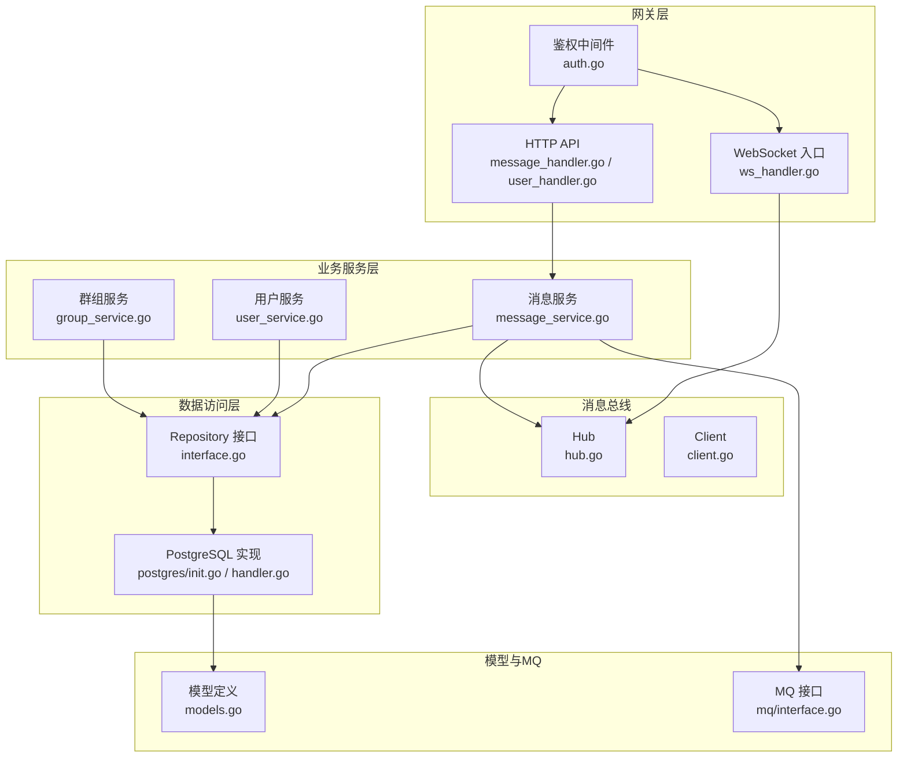
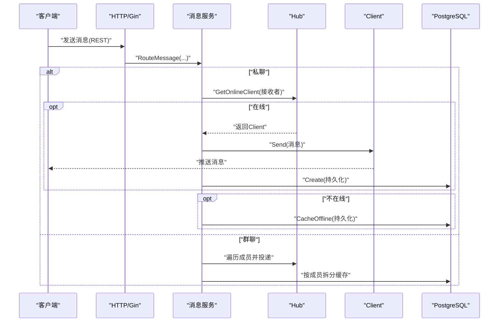
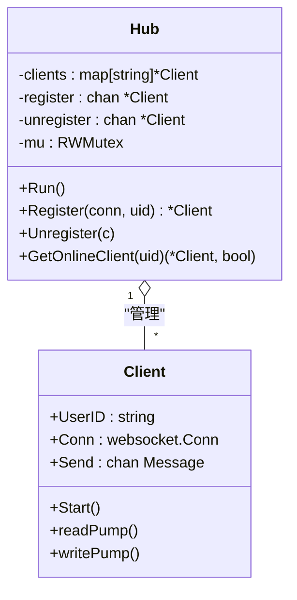
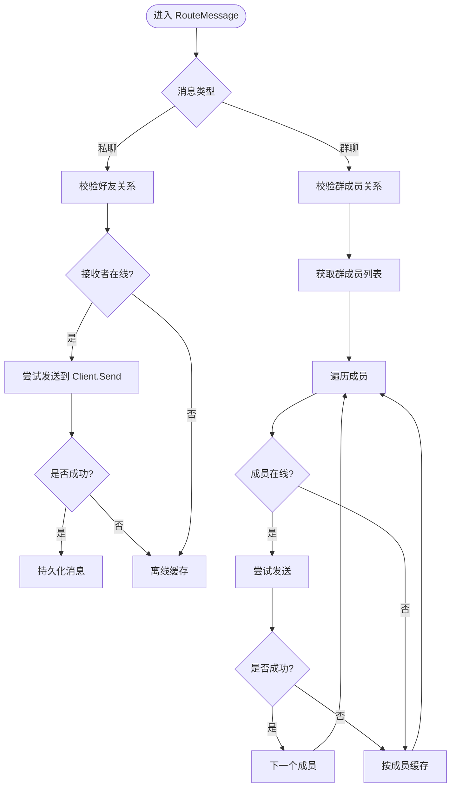
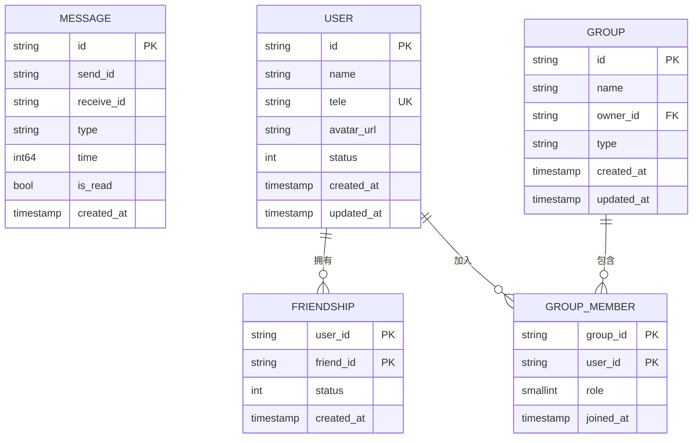
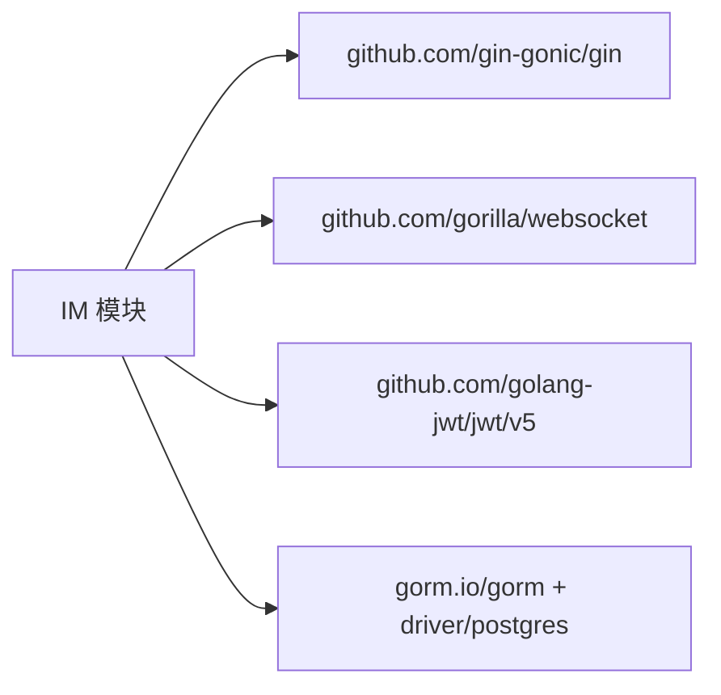

# 性能优化

<cite>
**本文引用的文件**
- [server/gateway/api/ws_handler.go](file://server/gateway/api/ws_handler.go)
- [server/msgservice/hub/hub.go](file://server/msgservice/hub/hub.go)
- [server/msgservice/hub/client.go](file://server/msgservice/hub/client.go)
- [server/msgservice/message_service.go](file://server/msgservice/message_service.go)
- [server/repository/postgres/init.go](file://server/repository/postgres/init.go)
- [server/repository/postgres/handler.go](file://server/repository/postgres/handler.go)
- [server/repository/interface.go](file://server/repository/interface.go)
- [server/model/models.go](file://server/model/models.go)
- [server/userservice/user_service.go](file://server/userservice/user_service.go)
- [server/userservice/group_service.go](file://server/userservice/group_service.go)
- [server/gateway/api/message_handler.go](file://server/gateway/api/message_handler.go)
- [server/gateway/api/user_handler.go](file://server/gateway/api/user_handler.go)
- [server/gateway/auth/auth.go](file://server/gateway/auth/auth.go)
- [server/mq/interface.go](file://server/mq/interface.go)
- [go.mod](file://go.mod)
</cite>

## 目录
1. [简介](#简介)
2. [项目结构](#项目结构)
3. [核心组件](#核心组件)
4. [架构总览](#架构总览)
5. [详细组件分析](#详细组件分析)
6. [依赖关系分析](#依赖关系分析)
7. [性能考量与优化策略](#性能考量与优化策略)
8. [故障排查指南](#故障排查指南)
9. [结论](#结论)
10. [附录](#附录)

## 简介
本文件面向一个基于 Go 的即时通讯（IM）系统，聚焦于性能优化，覆盖并发处理、数据库查询、内存管理、网络优化、缓存策略、监控与指标、负载与压力测试以及扩展性设计。通过对现有代码结构与实现的深入分析，提出可落地的优化建议与最佳实践。

## 项目结构
该项目采用分层与模块化组织方式：
- 网关层：HTTP 接口与 WebSocket 入口，负责鉴权与请求路由
- 业务服务层：用户服务、群组服务、消息服务
- 消息总线：Hub 与客户端通道，负责在线消息转发
- 数据访问层：Repository 抽象与 PostgreSQL 实现
- 模型层：统一的数据模型定义
- MQ 接口：预留消息队列扩展点

**图表来源**
- [server/gateway/api/ws_handler.go:1-69](file://server/gateway/api/ws_handler.go#L1-L69)
- [server/gateway/api/message_handler.go:1-66](file://server/gateway/api/message_handler.go#L1-L66)
- [server/gateway/api/user_handler.go:1-206](file://server/gateway/api/user_handler.go#L1-L206)
- [server/gateway/auth/auth.go:1-91](file://server/gateway/auth/auth.go#L1-L91)
- [server/msgservice/message_service.go:1-168](file://server/msgservice/message_service.go#L1-L168)
- [server/msgservice/hub/hub.go:1-61](file://server/msgservice/hub/hub.go#L1-L61)
- [server/msgservice/hub/client.go:1-88](file://server/msgservice/hub/client.go#L1-L88)
- [server/repository/interface.go:1-74](file://server/repository/interface.go#L1-L74)
- [server/repository/postgres/init.go:1-75](file://server/repository/postgres/init.go#L1-L75)
- [server/repository/postgres/handler.go:1-585](file://server/repository/postgres/handler.go#L1-L585)
- [server/model/models.go:1-146](file://server/model/models.go#L1-L146)
- [server/mq/interface.go:1-7](file://server/mq/interface.go#L1-L7)

**章节来源**
- [server/gateway/api/ws_handler.go:1-69](file://server/gateway/api/ws_handler.go#L1-L69)
- [server/gateway/api/message_handler.go:1-66](file://server/gateway/api/message_handler.go#L1-L66)
- [server/gateway/api/user_handler.go:1-206](file://server/gateway/api/user_handler.go#L1-L206)
- [server/gateway/auth/auth.go:1-91](file://server/gateway/auth/auth.go#L1-L91)
- [server/msgservice/message_service.go:1-168](file://server/msgservice/message_service.go#L1-L168)
- [server/msgservice/hub/hub.go:1-61](file://server/msgservice/hub/hub.go#L1-L61)
- [server/msgservice/hub/client.go:1-88](file://server/msgservice/hub/client.go#L1-L88)
- [server/repository/interface.go:1-74](file://server/repository/interface.go#L1-L74)
- [server/repository/postgres/init.go:1-75](file://server/repository/postgres/init.go#L1-L75)
- [server/repository/postgres/handler.go:1-585](file://server/repository/postgres/handler.go#L1-L585)
- [server/model/models.go:1-146](file://server/model/models.go#L1-L146)
- [server/mq/interface.go:1-7](file://server/mq/interface.go#L1-L7)

## 核心组件
- WebSocket 入口与鉴权：负责升级连接、鉴权与注册到 Hub
- Hub 与 Client：维护在线用户映射、读写 pump 协程、心跳与超时控制
- 消息服务：根据消息类型路由到私聊或群聊，处理离线缓存
- Repository 层：抽象接口与 PostgreSQL 实现，提供事务与连接池配置
- 用户/群组服务：封装业务逻辑，调用 Repository 完成持久化
- 模型层：定义消息、用户、群组等实体及索引字段
- MQ 接口：为异步解耦与削峰留出扩展空间

**章节来源**
- [server/gateway/api/ws_handler.go:1-69](file://server/gateway/api/ws_handler.go#L1-L69)
- [server/msgservice/hub/hub.go:1-61](file://server/msgservice/hub/hub.go#L1-L61)
- [server/msgservice/hub/client.go:1-88](file://server/msgservice/hub/client.go#L1-L88)
- [server/msgservice/message_service.go:1-168](file://server/msgservice/message_service.go#L1-L168)
- [server/repository/interface.go:1-74](file://server/repository/interface.go#L1-L74)
- [server/repository/postgres/handler.go:1-585](file://server/repository/postgres/handler.go#L1-L585)
- [server/model/models.go:1-146](file://server/model/models.go#L1-L146)
- [server/mq/interface.go:1-7](file://server/mq/interface.go#L1-L7)

## 架构总览
系统采用“HTTP/API + WebSocket + Hub + Repository”的架构。HTTP 路由到消息服务，WebSocket 建立长连接并通过 Hub 进行广播/单播；消息服务在内存中进行快速投递，必要时落库作为离线缓存；数据库通过连接池与索引优化支撑高并发读写。

**图表来源**
- [server/gateway/api/message_handler.go:1-66](file://server/gateway/api/message_handler.go#L1-L66)
- [server/msgservice/message_service.go:1-168](file://server/msgservice/message_service.go#L1-L168)
- [server/msgservice/hub/hub.go:1-61](file://server/msgservice/hub/hub.go#L1-L61)
- [server/msgservice/hub/client.go:1-88](file://server/msgservice/hub/client.go#L1-L88)
- [server/repository/postgres/handler.go:1-585](file://server/repository/postgres/handler.go#L1-L585)

**章节来源**
- [server/gateway/api/message_handler.go:1-66](file://server/gateway/api/message_handler.go#L1-L66)
- [server/msgservice/message_service.go:1-168](file://server/msgservice/message_service.go#L1-L168)
- [server/msgservice/hub/hub.go:1-61](file://server/msgservice/hub/hub.go#L1-L61)
- [server/msgservice/hub/client.go:1-88](file://server/msgservice/hub/client.go#L1-L88)
- [server/repository/postgres/handler.go:1-585](file://server/repository/postgres/handler.go#L1-L585)

## 详细组件分析

### WebSocket 与 Hub 组件
- 连接升级与鉴权：入口对 Origin 限制、从 Cookie 提取 token 并解析，设置用户上下文后升级为 WebSocket
- Hub：维护在线用户映射，注册/注销通道，使用互斥锁保护 map 访问
- Client：读 pump 负责消息解码、注入发送方与时间戳、回调业务处理；写 pump 负责心跳与消息发送
- 心跳与超时：读写 deadline、pong handler、ping ticker，防止僵尸连接占用资源

**图表来源**
- [server/msgservice/hub/hub.go:1-61](file://server/msgservice/hub/hub.go#L1-L61)
- [server/msgservice/hub/client.go:1-88](file://server/msgservice/hub/client.go#L1-L88)

**章节来源**
- [server/gateway/api/ws_handler.go:1-69](file://server/gateway/api/ws_handler.go#L1-L69)
- [server/msgservice/hub/hub.go:1-61](file://server/msgservice/hub/hub.go#L1-L61)
- [server/msgservice/hub/client.go:1-88](file://server/msgservice/hub/client.go#L1-L88)

### 消息服务与路由
- 路由逻辑：区分私聊与群聊，校验关系合法性
- 在线投递：优先向在线 Client 发送；若阻塞则回退到离线缓存
- 离线缓存：私聊与群聊分别持久化，支持批量拉取与已读标记

**图表来源**
- [server/msgservice/message_service.go:1-168](file://server/msgservice/message_service.go#L1-L168)

**章节来源**
- [server/msgservice/message_service.go:1-168](file://server/msgservice/message_service.go#L1-L168)

### 数据访问层与数据库优化
- 连接池：最大空闲连接、最大打开连接、最大生命周期，降低连接创建开销
- 日志级别：设置为 Info，便于生产环境观察但不过度输出
- 自动迁移：启动时执行，确保表结构一致性
- 查询优化要点：模型已为高频字段建立索引（如消息的发送方、接收方、类型、时间、是否已读），建议结合 EXPLAIN 分析热点查询

**图表来源**
- [server/model/models.go:1-146](file://server/model/models.go#L1-L146)
- [server/repository/postgres/handler.go:1-585](file://server/repository/postgres/handler.go#L1-L585)

**章节来源**
- [server/repository/postgres/init.go:1-75](file://server/repository/postgres/init.go#L1-L75)
- [server/repository/postgres/handler.go:1-585](file://server/repository/postgres/handler.go#L1-L585)
- [server/model/models.go:1-146](file://server/model/models.go#L1-L146)

### 业务服务层
- 用户服务：注册、登录、好友关系、好友请求
- 群组服务：建群、入群、退群、成员角色管理、待处理请求
- 两者均通过 Repository 接口与 PostgreSQL 实现解耦

**章节来源**
- [server/userservice/user_service.go:1-187](file://server/userservice/user_service.go#L1-L187)
- [server/userservice/group_service.go:1-217](file://server/userservice/group_service.go#L1-L217)
- [server/repository/interface.go:1-74](file://server/repository/interface.go#L1-L74)

## 依赖关系分析
- 框架与库：Gin、Gorilla WebSocket、GORM、JWT
- 关键依赖版本与间接依赖在 go.mod 中声明

**图表来源**
- [go.mod:1-51](file://go.mod#L1-L51)

**章节来源**
- [go.mod:1-51](file://go.mod#L1-L51)

## 性能考量与优化策略

### 并发处理优化
- goroutine 池管理
  - 当前 Hub 使用固定容量的注册/注销通道，配合单例 Hub 的 Run 循环处理注册/注销，避免频繁创建 goroutine
  - 建议：对高并发场景，可在业务层引入 worker pool 控制消息处理并发度，避免 goroutine 数量无界增长
- channel 使用模式
  - Client.Send 缓冲区大小为 256，适合短时突发；建议根据峰值 QPS 与平均消息大小评估缓冲区，避免阻塞与丢弃
  - Hub 的注册/注销通道容量分别为 10/5，建议结合实际连接速率动态调整
- 锁竞争避免
  - Hub 对 clients map 使用 RWMutex，读多写少场景下读锁更友好；建议进一步拆分用户维度的锁或使用更细粒度的并发结构（如 sharding）以降低热点竞争

**章节来源**
- [server/msgservice/hub/hub.go:1-61](file://server/msgservice/hub/hub.go#L1-L61)
- [server/msgservice/hub/client.go:1-88](file://server/msgservice/hub/client.go#L1-L88)

### 数据库查询优化
- 索引设计
  - 已为消息表的关键字段建立索引（发送方、接收方、类型、时间、是否已读），建议定期审查热点查询并补充复合索引
- 查询优化
  - 离线消息查询按时间排序并支持 limit/offset；建议对高频分页场景增加基于游标（cursor-based pagination）的方案
  - 批量查询用户信息使用 IN 子句，建议限制批量大小并分批处理
- 连接池配置
  - 已设置最大空闲/打开连接数与生命周期，建议结合实例规格与 QPS 动态调优；开启只读副本用于读多写少场景

**章节来源**
- [server/model/models.go:1-146](file://server/model/models.go#L1-L146)
- [server/repository/postgres/init.go:1-75](file://server/repository/postgres/init.go#L1-L75)
- [server/repository/postgres/handler.go:1-585](file://server/repository/postgres/handler.go#L1-L585)

### 内存管理最佳实践
- 对象池
  - 可为高频分配的对象（如消息体、字节缓冲）引入对象池减少 GC 压力
- 垃圾回收优化
  - 合理设置 GOGC、GOMAXPROCS；避免大对象常驻堆；减少反射与字符串拼接
- 内存泄漏检测
  - 使用 pprof 采集 heap/profile，定位异常增长；关注未关闭的连接与未释放的定时器

**章节来源**
- [server/msgservice/hub/client.go:1-88](file://server/msgservice/hub/client.go#L1-L88)

### 网络优化
- WebSocket 连接复用
  - 建议客户端侧保持长连接，服务端启用 ping/pong 与读写 deadline，避免资源泄露
- 消息压缩
  - 对大文本消息启用压缩（如 gzip/snappy），降低带宽占用
- 带宽管理
  - 限速与令牌桶策略，防止突发流量冲击；对离线消息采用分批拉取与背压机制

**章节来源**
- [server/gateway/api/ws_handler.go:1-69](file://server/gateway/api/ws_handler.go#L1-L69)
- [server/msgservice/hub/client.go:1-88](file://server/msgservice/hub/client.go#L1-L88)

### 缓存策略
- Redis 集成
  - 在线状态、会话信息、好友列表等可放入 Redis；结合过期策略与热数据淘汰
- 本地缓存
  - Hub 内部在线映射即为本地缓存；建议结合 LRU 或 TTL 策略管理内存占用
- 离线消息
  - 已通过数据库实现离线缓存；可叠加 Redis 作为热备，提升读取性能

**章节来源**
- [server/msgservice/message_service.go:1-168](file://server/msgservice/message_service.go#L1-L168)
- [server/msgservice/hub/hub.go:1-61](file://server/msgservice/hub/hub.go#L1-L61)

### 性能监控与指标收集
- 指标体系
  - 连接数、消息吞吐、延迟分布、错误率、数据库 QPS/P95、GC 次数与暂停时间
- 采样与埋点
  - 在消息路由、数据库操作、鉴权等关键路径埋点；使用 Prometheus + Grafana 可视化
- 日志与追踪
  - 结合 OpenTelemetry 进行分布式追踪，定位慢调用

**章节来源**
- [server/gateway/api/message_handler.go:1-66](file://server/gateway/api/message_handler.go#L1-L66)
- [server/msgservice/message_service.go:1-168](file://server/msgservice/message_service.go#L1-L168)

### 负载与压力测试
- 场景设计
  - 连接并发、消息吞吐、离线消息拉取、好友/群组操作等
- 工具选择
  - wrk、ghz、k6 或自研压测工具；模拟真实用户行为
- 指标观测
  - P50/P95/P99 延迟、成功率、资源占用、数据库锁等待

**章节来源**
- [server/gateway/api/ws_handler.go:1-69](file://server/gateway/api/ws_handler.go#L1-L69)
- [server/gateway/api/message_handler.go:1-66](file://server/gateway/api/message_handler.go#L1-L66)

### 扩展性与水平扩展
- 无状态服务
  - 将会话与鉴权状态下沉至外部存储（Redis），便于横向扩容
- 负载均衡
  - 使用 Nginx/Envoy 做四层/七层负载，结合健康检查
- 数据分片
  - 按用户 ID 或时间维度分表分库，降低单实例压力
- MQ 异步化
  - 引入消息队列（RabbitMQ/Kafka）承接削峰与异步处理，MQ 接口已在代码中预留

**章节来源**
- [server/mq/interface.go:1-7](file://server/mq/interface.go#L1-L7)

## 故障排查指南
- WebSocket 连接失败
  - 检查 Origin 白名单、Cookie 与 Token 是否正确传递
- 消息未送达
  - 查看 Client.Send 缓冲是否满导致阻塞；确认 Hub 在线映射与路由逻辑
- 数据库慢查询
  - 使用 EXPLAIN 分析 SQL，核对索引使用情况；调整 limit/offset 或引入游标分页
- 连接池耗尽
  - 检查最大连接数与生命周期配置，确认连接泄漏（未关闭连接）

**章节来源**
- [server/gateway/api/ws_handler.go:1-69](file://server/gateway/api/ws_handler.go#L1-L69)
- [server/msgservice/hub/client.go:1-88](file://server/msgservice/hub/client.go#L1-L88)
- [server/repository/postgres/init.go:1-75](file://server/repository/postgres/init.go#L1-L75)

## 结论
本项目在并发模型、消息路由与数据库索引方面具备良好基础。建议在以下方向持续优化：引入 goroutine 池与更细粒度锁、优化数据库索引与查询、启用 Redis 缓存与 MQ 异步化、完善监控与压测体系，并通过水平扩展与分片提升整体吞吐与稳定性。

## 附录
- 关键实现参考路径
  - WebSocket 入口与鉴权：[server/gateway/api/ws_handler.go:1-69](file://server/gateway/api/ws_handler.go#L1-L69)
  - Hub 与 Client：[server/msgservice/hub/hub.go:1-61](file://server/msgservice/hub/hub.go#L1-L61)，[server/msgservice/hub/client.go:1-88](file://server/msgservice/hub/client.go#L1-L88)
  - 消息服务路由与离线缓存：[server/msgservice/message_service.go:1-168](file://server/msgservice/message_service.go#L1-L168)
  - 数据库连接池与迁移：[server/repository/postgres/init.go:1-75](file://server/repository/postgres/init.go#L1-L75)，[server/repository/postgres/handler.go:1-585](file://server/repository/postgres/handler.go#L1-L585)
  - 业务服务：[server/userservice/user_service.go:1-187](file://server/userservice/user_service.go#L1-L187)，[server/userservice/group_service.go:1-217](file://server/userservice/group_service.go#L1-L217)
  - 模型与接口：[server/model/models.go:1-146](file://server/model/models.go#L1-L146)，[server/repository/interface.go:1-74](file://server/repository/interface.go#L1-L74)
  - HTTP API：[server/gateway/api/message_handler.go:1-66](file://server/gateway/api/message_handler.go#L1-L66)，[server/gateway/api/user_handler.go:1-206](file://server/gateway/api/user_handler.go#L1-L206)
  - 鉴权：[server/gateway/auth/auth.go:1-91](file://server/gateway/auth/auth.go#L1-L91)
  - MQ 接口：[server/mq/interface.go:1-7](file://server/mq/interface.go#L1-L7)
  - 依赖清单：[go.mod:1-51](file://go.mod#L1-L51)