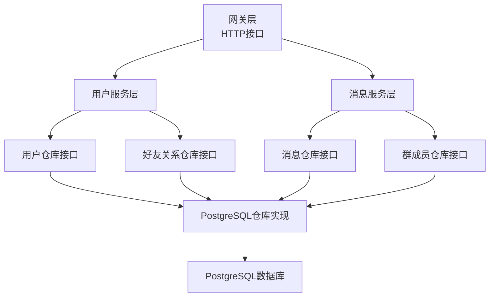
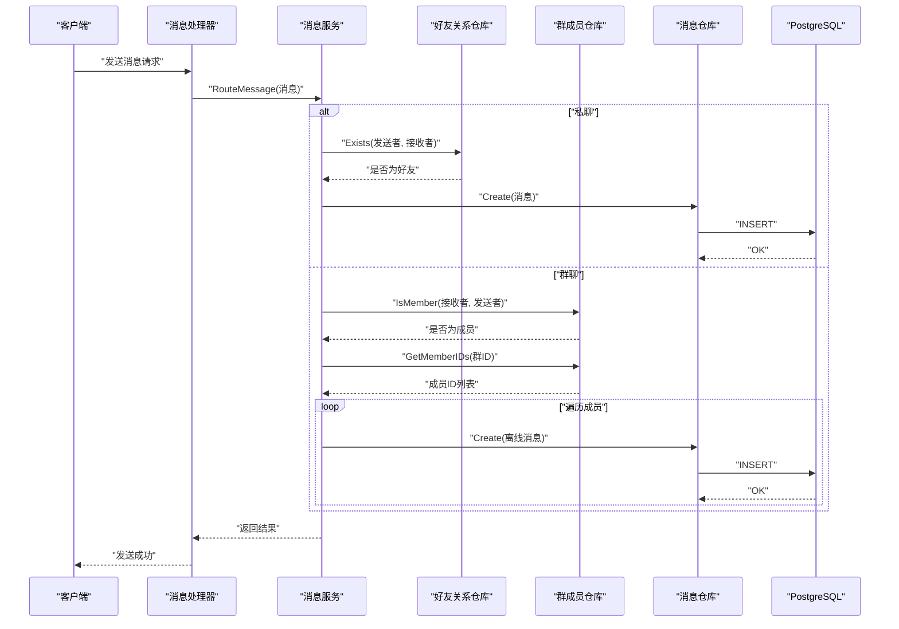
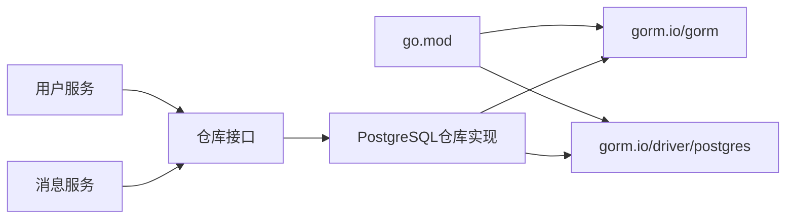

# 数据库查询优化

<cite>
**本文引用的文件列表**
- [server/repository/postgres/init.go](file://server/repository/postgres/init.go)
- [server/repository/postgres/handler.go](file://server/repository/postgres/handler.go)
- [server/model/models.go](file://server/model/models.go)
- [server/repository/interface.go](file://server/repository/interface.go)
- [server/userservice/user_service.go](file://server/userservice/user_service.go)
- [server/msgservice/message_service.go](file://server/msgservice/message_service.go)
- [server/gateway/api/message_handler.go](file://server/gateway/api/message_handler.go)
- [go.mod](file://go.mod)
</cite>

## 目录
1. [简介](#简介)
2. [项目结构](#项目结构)
3. [核心组件](#核心组件)
4. [架构总览](#架构总览)
5. [详细组件分析](#详细组件分析)
6. [依赖关系分析](#依赖关系分析)
7. [性能考量与优化建议](#性能考量与优化建议)
8. [故障排查指南](#故障排查指南)
9. [结论](#结论)
10. [附录](#附录)

## 简介
本文件面向即时通讯（IM）系统的数据库查询优化，结合现有代码库中的 PostgreSQL 连接池配置、GORM 使用模式、查询路径与模型设计，系统性地给出连接池参数调优、索引设计原则、查询计划分析、GORM 性能优化技巧、事务使用建议、慢查询日志与监控方法、表结构设计优化以及连接超时与重连机制配置等实践指导。目标是在保证功能正确性的前提下，提升数据库吞吐与稳定性，降低延迟与资源占用。

## 项目结构
本项目采用分层架构：网关层负责 HTTP 接口；服务层封装业务逻辑；仓库层通过 GORM 访问 PostgreSQL；模型定义数据结构。数据库初始化位于仓库层的 PostgreSQL 实现中，包含连接池参数设置与自动迁移。

图表来源
- [server/gateway/api/message_handler.go:1-66](file://server/gateway/api/message_handler.go#L1-L66)
- [server/userservice/user_service.go:1-187](file://server/userservice/user_service.go#L1-L187)
- [server/msgservice/message_service.go:1-168](file://server/msgservice/message_service.go#L1-L168)
- [server/repository/interface.go:1-74](file://server/repository/interface.go#L1-L74)
- [server/repository/postgres/handler.go:1-585](file://server/repository/postgres/handler.go#L1-L585)

章节来源
- [server/gateway/api/message_handler.go:1-66](file://server/gateway/api/message_handler.go#L1-L66)
- [server/userservice/user_service.go:1-187](file://server/userservice/user_service.go#L1-L187)
- [server/msgservice/message_service.go:1-168](file://server/msgservice/message_service.go#L1-L168)
- [server/repository/interface.go:1-74](file://server/repository/interface.go#L1-L74)
- [server/repository/postgres/handler.go:1-585](file://server/repository/postgres/handler.go#L1-L585)

## 核心组件
- PostgreSQL 连接池初始化与参数设置：在数据库初始化函数中设置最大空闲连接数、最大打开连接数与连接最大生命周期。
- GORM 模型与查询：通过结构体标签定义索引、唯一索引、默认值与列名映射；仓库层以 GORM 查询 DSL 构建 SQL。
- 仓库接口与实现：定义清晰的仓储接口，便于替换底层存储与测试。
- 服务层业务编排：在服务层组织多表关联查询、条件判断与结果处理，避免在仓库层过度复杂化。

章节来源
- [server/repository/postgres/init.go:42-65](file://server/repository/postgres/init.go#L42-L65)
- [server/model/models.go:23-146](file://server/model/models.go#L23-L146)
- [server/repository/interface.go:1-74](file://server/repository/interface.go#L1-L74)
- [server/repository/postgres/handler.go:29-116](file://server/repository/postgres/handler.go#L29-L116)

## 架构总览
下图展示从 HTTP 请求到数据库访问的关键调用链，以及消息路由与离线缓存的流程。

图表来源
- [server/gateway/api/message_handler.go:19-44](file://server/gateway/api/message_handler.go#L19-L44)
- [server/msgservice/message_service.go:27-108](file://server/msgservice/message_service.go#L27-L108)
- [server/repository/postgres/handler.go:141-177](file://server/repository/postgres/handler.go#L141-L177)
- [server/repository/postgres/handler.go:261-296](file://server/repository/postgres/handler.go#L261-L296)
- [server/repository/postgres/handler.go:335-340](file://server/repository/postgres/handler.go#L335-L340)

## 详细组件分析

### PostgreSQL 连接池配置与调优
- 当前配置
  - 最大空闲连接数：10
  - 最大打开连接数：100
  - 连接最大生命周期：1 小时
- 建议
  - 根据并发请求数与数据库承载能力调整最大打开连接数，避免过高导致数据库连接拥塞或过低导致排队。
  - 合理设置空闲连接数，平衡内存占用与连接复用效率。
  - 结合数据库端 max_connections 与 wait_timeout 参数进行整体调优。
  - 在高并发场景下可考虑启用连接池健康检查与自动回收策略。

章节来源
- [server/repository/postgres/init.go:59-61](file://server/repository/postgres/init.go#L59-L61)

### GORM ORM 性能优化技巧
- 预加载与关联查询
  - 用户与好友、群组的多对多关联已在模型中定义，服务层可按需使用 Joins 或预加载减少 N+1 查询。
  - 示例参考：好友列表查询使用 JOIN 获取用户信息，避免多次单独查询。
- 批量操作
  - 批量插入/更新/删除可显著降低往返次数与锁竞争，建议在消息离线缓存等高频写入场景使用。
- 延迟加载与按需查询
  - 对于非必要字段（如密码），应避免在查询中返回，减少网络与序列化开销。
- 条件与排序
  - 明确的 WHERE 条件与 ORDER BY 可帮助数据库生成更优执行计划；注意为常用过滤字段建立索引。

章节来源
- [server/repository/postgres/handler.go:154-165](file://server/repository/postgres/handler.go#L154-L165)
- [server/repository/postgres/handler.go:354-372](file://server/repository/postgres/handler.go#L354-L372)
- [server/model/models.go:48-49](file://server/model/models.go#L48-L49)

### SQL 查询优化策略
- 索引设计原则
  - 主键与唯一键：用户电话号码、消息 ID、好友关系复合主键等已具备唯一性，有助于快速定位记录。
  - 组合索引：消息表的发送方、接收方、时间、是否已读组合索引可覆盖常见查询路径。
  - 单列索引：名称、状态、类型等过滤字段可根据查询频率建立索引。
- 查询计划分析
  - 使用 EXPLAIN/EXPLAIN ANALYZE 分析关键查询的执行计划，关注是否存在全表扫描、隐式转换与不必要的排序。
  - 关注索引选择性与统计信息更新，确保查询优化器做出正确决策。
- 分页与限制
  - 对离线消息查询使用 LIMIT/OFFSET 时，建议配合时间戳或游标分页，避免深层 OFFSET 导致的性能退化。

章节来源
- [server/model/models.go:23-32](file://server/model/models.go#L23-L32)
- [server/repository/postgres/handler.go:354-372](file://server/repository/postgres/handler.go#L354-L372)

### 数据表结构设计优化建议
- 字段类型选择
  - 使用合适的数据类型以减少存储与 IO 开销；例如布尔型用于 is_read，整型用于状态码。
  - 文本内容使用 text 类型，避免过长 varchar 导致的行膨胀。
- 约束设计
  - 主键与外键约束确保数据一致性；唯一索引用于电话号码等去重需求。
  - 默认值与自动时间戳减少应用层逻辑，提高一致性。
- 多对多中间表
  - 好友关系与群成员关系使用复合主键的中间表，避免冗余数据与更新异常。

章节来源
- [server/model/models.go:38-50](file://server/model/models.go#L38-L50)
- [server/model/models.go:56-65](file://server/model/models.go#L56-L65)
- [server/model/models.go:95-105](file://server/model/models.go#L95-L105)

### 数据库事务的合理使用与性能影响
- 事务边界
  - 将相关联的写操作放入单个事务，确保原子性；对于只读查询尽量避免开启事务。
- 锁竞争与隔离级别
  - 降低锁持有时间，避免长事务；根据业务需求选择合适的隔离级别。
- 回滚与错误处理
  - 在服务层捕获错误并回滚事务，确保状态一致；对重复提交与幂等性进行处理。

（本节为通用指导，不直接分析具体文件）

### 慢查询日志分析与查询性能监控
- 慢查询日志
  - 在数据库端启用慢查询日志，设置阈值（如 100ms），定期分析热点 SQL。
- 监控指标
  - 连接池指标：活跃连接数、等待时间、拒绝次数。
  - 查询指标：QPS、P95/P99 延迟、错误率。
- 工具建议
  - 使用 pg_stat_statements 收集 SQL 统计；结合 APM 工具定位瓶颈。

（本节为通用指导，不直接分析具体文件）

### 连接超时与重连机制配置
- 连接超时
  - 设置合理的连接超时与读取超时，避免请求长时间阻塞。
- 重连策略
  - 在连接断开时进行指数退避重试，避免雪崩效应；对关键路径增加熔断保护。
- 连接池健康检查
  - 定期执行轻量级探测语句验证连接可用性，及时剔除失效连接。

（本节为通用指导，不直接分析具体文件）

### 数据库备份与恢复的性能考虑
- 备份策略
  - 选择合适的时间窗口进行全量备份；增量备份与归档 WAL 结合，缩短 RPO/RTO。
- 恢复演练
  - 定期进行恢复演练，验证备份完整性与恢复速度。
- 影响评估
  - 备份与恢复对在线业务的影响最小化，优先在低峰时段执行。

（本节为通用指导，不直接分析具体文件）

## 依赖关系分析
- 外部依赖
  - GORM v1.31.1 与 PostgreSQL 驱动 v1.6.0 提供 ORM 能力与驱动支持。
- 内部依赖
  - 服务层依赖仓库接口，仓库层依赖 GORM 与 PostgreSQL 驱动。
  - 网关层依赖服务层，负责请求解析与响应返回。

图表来源
- [go.mod:5-12](file://go.mod#L5-L12)
- [server/repository/interface.go:1-74](file://server/repository/interface.go#L1-L74)
- [server/repository/postgres/handler.go:1-20](file://server/repository/postgres/handler.go#L1-L20)

章节来源
- [go.mod:5-12](file://go.mod#L5-L12)
- [server/repository/interface.go:1-74](file://server/repository/interface.go#L1-L74)
- [server/repository/postgres/handler.go:1-20](file://server/repository/postgres/handler.go#L1-L20)

## 性能考量与优化建议
- 连接池参数
  - 根据峰值 QPS 与平均响应时间估算最大打开连接数；空闲连接数控制在 10%-30%。
  - 调整连接最大生命周期，避免长时间占用导致资源泄漏。
- 查询路径优化
  - 为高频过滤字段建立索引；避免 SELECT *，仅返回必要字段。
  - 使用 LIMIT 控制结果集大小；对深度分页使用基于游标的分页方案。
- 写入优化
  - 批量写入消息离线缓存；减少事务粒度与锁持有时间。
  - 对幂等写入进行去重校验，避免重复写入。
- 缓存与异步
  - 对读多写少的数据引入缓存；对实时性要求不高的写入采用异步队列。
- 监控与告警
  - 建立数据库与应用双维度监控，设置阈值告警与自动扩容策略。

（本节为通用指导，不直接分析具体文件）

## 故障排查指南
- 常见问题
  - 连接池耗尽：检查最大连接数与活跃连接数，优化慢查询与事务时长。
  - 死锁与锁冲突：减少长事务、统一锁顺序、避免跨分区更新。
  - 索引失效：检查查询条件与数据类型是否匹配，重建或调整索引。
- 排查步骤
  - 启用慢查询日志与数据库统计信息，定位热点 SQL。
  - 结合应用日志与数据库日志交叉验证，确认事务边界与错误传播路径。
  - 对关键路径进行压力测试，观察连接池与数据库指标变化。

（本节为通用指导，不直接分析具体文件）

## 结论
通过对现有代码库的分析，可以看到项目在连接池配置、GORM 使用与查询路径方面已有一定基础。为进一步提升性能与稳定性，建议：
- 明确并量化连接池参数，结合业务峰值进行动态调优；
- 强化索引设计与查询计划分析，减少全表扫描；
- 在服务层合理使用批量操作与延迟加载，降低 N+1 查询；
- 建立完善的慢查询日志与监控体系，持续优化热点路径；
- 规范事务使用与错误处理，保障一致性与可用性。

（本节为总结性内容，不直接分析具体文件）

## 附录
- 关键查询路径参考
  - 私聊消息路由与离线缓存：[server/msgservice/message_service.go:46-66](file://server/msgservice/message_service.go#L46-L66)
  - 群聊消息路由与离线缓存：[server/msgservice/message_service.go:68-108](file://server/msgservice/message_service.go#L68-L108)
  - 离线消息查询与标记已读：[server/repository/postgres/handler.go:354-386](file://server/repository/postgres/handler.go#L354-L386)
- 模型与索引参考
  - 用户、好友关系、群组、消息与请求模型定义：[server/model/models.go:23-146](file://server/model/models.go#L23-L146)