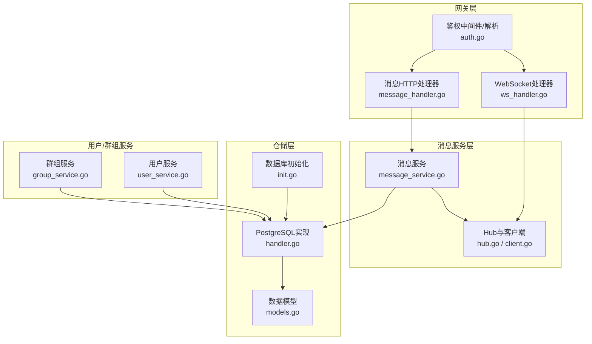
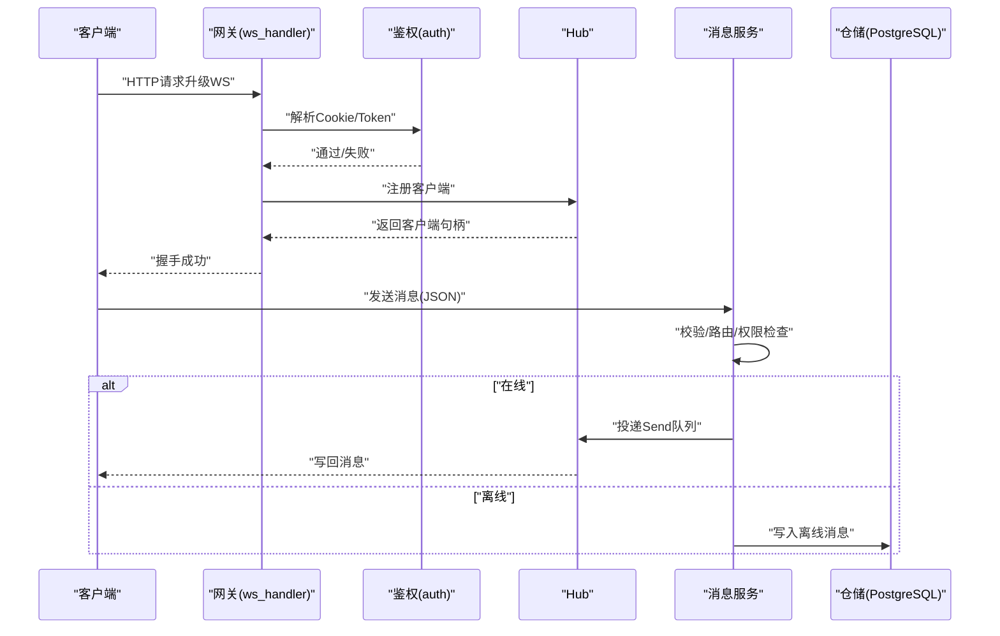
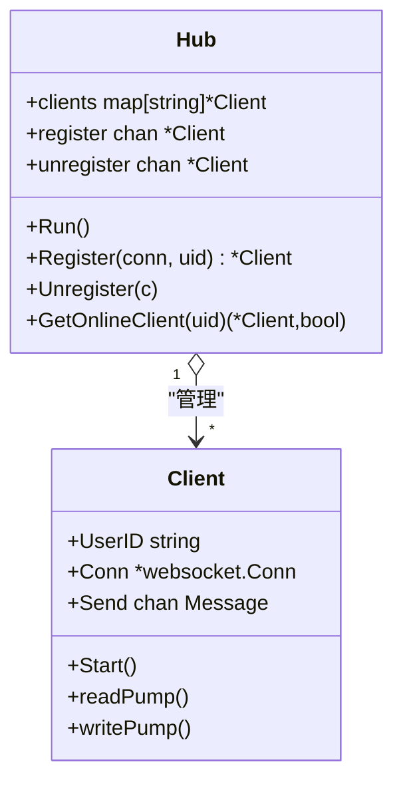
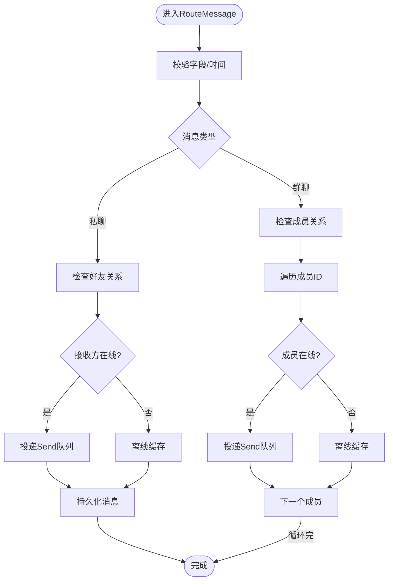
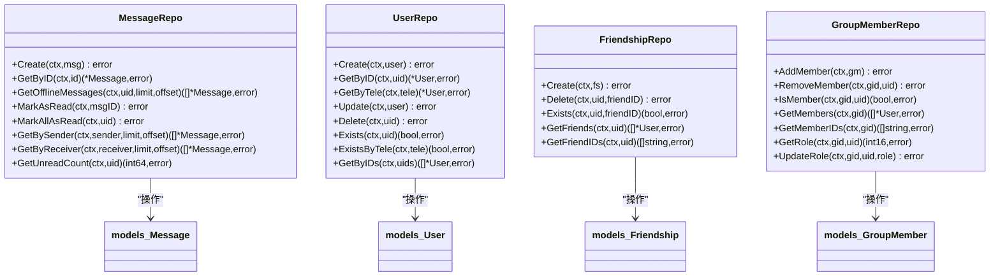
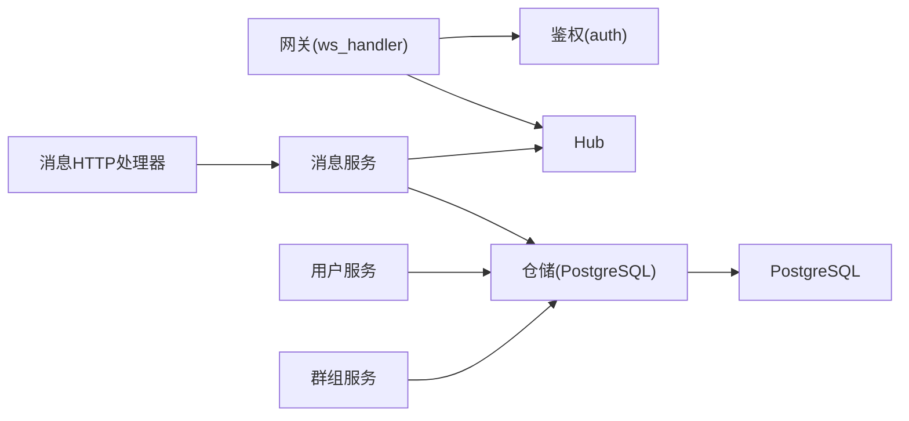

# 性能监控

<cite>
**本文引用的文件**
- [main.txt](file://main.txt)
- [ws_handler.go](file://server/gateway/api/ws_handler.go)
- [hub.go](file://server/msgservice/hub/hub.go)
- [client.go](file://server/msgservice/hub/client.go)
- [message_service.go](file://server/msgservice/message_service.go)
- [handler.go](file://server/repository/postgres/handler.go)
- [init.go](file://server/repository/postgres/init.go)
- [models.go](file://server/model/models.go)
- [message_handler.go](file://server/gateway/api/message_handler.go)
- [user_handler.go](file://server/gateway/api/user_handler.go)
- [auth.go](file://server/gateway/auth/auth.go)
- [user_service.go](file://server/userservice/user_service.go)
- [group_service.go](file://server/userservice/group_service.go)
</cite>

## 目录
1. [简介](#简介)
2. [项目结构](#项目结构)
3. [核心组件](#核心组件)
4. [架构总览](#架构总览)
5. [详细组件分析](#详细组件分析)
6. [依赖关系分析](#依赖关系分析)
7. [性能指标与采集方案](#性能指标与采集方案)
8. [监控工具配置（Prometheus/Grafana）](#监控工具配置prometheusgrafana)
9. [性能告警与阈值建议](#性能告警与阈值建议)
10. [性能瓶颈识别与监控策略](#性能瓶颈识别与监控策略)
11. [性能基准测试与压力测试](#性能基准测试与压力测试)
12. [故障排查指南](#故障排查指南)
13. [结论](#结论)

## 简介
本文件面向该Go语言即时通讯项目的性能监控与优化，围绕连接数、消息吞吐量、内存/CPU占用、数据库查询性能等关键指标，结合现有代码结构，给出可落地的监控采集、可视化与告警策略，并提供基准与压测方法，帮助评估系统承载能力与优化方向。

## 项目结构
项目采用分层+网关模式：HTTP网关负责鉴权与协议升级；消息服务负责路由与离线缓存；仓库层封装PostgreSQL访问；用户服务与群组服务提供业务能力；模型定义数据表结构。

图示来源
- [ws_handler.go:39-68](file://server/gateway/api/ws_handler.go#L39-L68)
- [message_handler.go:19-44](file://server/gateway/api/message_handler.go#L19-L44)
- [auth.go:37-61](file://server/gateway/auth/auth.go#L37-L61)
- [message_service.go:27-108](file://server/msgservice/message_service.go#L27-L108)
- [hub.go:44-54](file://server/msgservice/hub/hub.go#L44-L54)
- [client.go:27-87](file://server/msgservice/hub/client.go#L27-L87)
- [init.go:42-65](file://server/repository/postgres/init.go#L42-L65)
- [handler.go:327-438](file://server/repository/postgres/handler.go#L327-L438)
- [models.go:23-105](file://server/model/models.go#L23-L105)
- [user_service.go:19-25](file://server/userservice/user_service.go#L19-L25)
- [group_service.go:18-25](file://server/userservice/group_service.go#L18-L25)

章节来源
- [ws_handler.go:14-68](file://server/gateway/api/ws_handler.go#L14-L68)
- [message_handler.go:12-66](file://server/gateway/api/message_handler.go#L12-L66)
- [auth.go:14-91](file://server/gateway/auth/auth.go#L14-L91)
- [message_service.go:12-25](file://server/msgservice/message_service.go#L12-L25)
- [hub.go:10-25](file://server/msgservice/hub/hub.go#L10-L25)
- [client.go:12-25](file://server/msgservice/hub/client.go#L12-L25)
- [init.go:15-65](file://server/repository/postgres/init.go#L15-L65)
- [handler.go:21-585](file://server/repository/postgres/handler.go#L21-L585)
- [models.go:1-146](file://server/model/models.go#L1-L146)
- [user_service.go:13-187](file://server/userservice/user_service.go#L13-L187)
- [group_service.go:11-217](file://server/userservice/group_service.go#L11-L217)

## 核心组件
- WebSocket网关与鉴权：负责从HTTP升级到WebSocket，校验令牌并建立连接，维护Hub注册与生命周期。
- Hub与客户端：管理在线用户集合，读写泵循环处理消息收发与心跳。
- 消息服务：根据消息类型进行路由（私聊/群聊），检查权限与在线状态，向Hub投递或落库离线。
- 仓储层：基于GORM封装用户、好友、群组、消息、请求等表操作，统一上下文与错误处理。
- 用户/群组服务：提供注册、登录、好友、加群等业务流程。

章节来源
- [ws_handler.go:30-68](file://server/gateway/api/ws_handler.go#L30-L68)
- [hub.go:10-61](file://server/msgservice/hub/hub.go#L10-L61)
- [client.go:27-87](file://server/msgservice/hub/client.go#L27-L87)
- [message_service.go:27-168](file://server/msgservice/message_service.go#L27-L168)
- [handler.go:21-585](file://server/repository/postgres/handler.go#L21-L585)
- [user_service.go:27-187](file://server/userservice/user_service.go#L27-L187)
- [group_service.go:27-217](file://server/userservice/group_service.go#L27-L217)

## 架构总览

图示来源
- [ws_handler.go:39-68](file://server/gateway/api/ws_handler.go#L39-L68)
- [auth.go:37-61](file://server/gateway/auth/auth.go#L37-L61)
- [hub.go:44-54](file://server/msgservice/hub/hub.go#L44-L54)
- [message_service.go:46-108](file://server/msgservice/message_service.go#L46-L108)
- [handler.go:335-340](file://server/repository/postgres/handler.go#L335-L340)

## 详细组件分析

### 组件A：WebSocket与Hub
- 关键点
  - 协议升级与来源校验
  - 客户端读写泵：读取消息、心跳与超时控制；写入消息、Ping/Pong与写超时
  - Hub注册/注销：并发安全的在线用户集合
- 性能关注
  - Send队列容量与阻塞行为
  - 读写超时与心跳周期
  - Hub锁粒度与广播路径

图示来源
- [hub.go:10-61](file://server/msgservice/hub/hub.go#L10-L61)
- [client.go:12-87](file://server/msgservice/hub/client.go#L12-L87)

章节来源
- [ws_handler.go:14-28](file://server/gateway/api/ws_handler.go#L14-L28)
- [hub.go:27-61](file://server/msgservice/hub/hub.go#L27-L61)
- [client.go:27-87](file://server/msgservice/hub/client.go#L27-L87)

### 组件B：消息服务与路由
- 关键点
  - 私聊：检查好友关系，若在线则投递Send队列，否则离线缓存
  - 群聊：检查成员关系，遍历成员在线状态分别投递或离线缓存
  - 时间戳与去重ID策略
- 性能关注
  - 成员列表规模对广播复杂度的影响
  - 仓储写入的事务与索引利用
  - 错误聚合与返回

图示来源
- [message_service.go:27-108](file://server/msgservice/message_service.go#L27-L108)

章节来源
- [message_service.go:27-168](file://server/msgservice/message_service.go#L27-L168)

### 组件C：仓储层（PostgreSQL）
- 关键点
  - GORM配置与日志级别
  - 连接池参数（最大空闲/打开连接、最大生命周期）
  - 多表CRUD封装与上下文传递
- 性能关注
  - 索引覆盖（send_id/receive_id/type/time/is_read等）
  - 查询排序与分页限制
  - 并发连接上限与慢查询定位

图示来源
- [handler.go:21-585](file://server/repository/postgres/handler.go#L21-L585)
- [models.go:23-105](file://server/model/models.go#L23-L105)

章节来源
- [init.go:42-65](file://server/repository/postgres/init.go#L42-L65)
- [handler.go:21-585](file://server/repository/postgres/handler.go#L21-L585)
- [models.go:23-105](file://server/model/models.go#L23-L105)

### 组件D：用户/群组服务
- 关键点
  - 用户注册（密码哈希）、登录（凭据校验）
  - 好友请求、接受/拒绝、删除好友
  - 群组创建、加/退群、成员角色变更
- 性能关注
  - 密码哈希成本与并发
  - 请求幂等性与重复发送
  - 角色与权限检查的查询效率

章节来源
- [user_service.go:27-187](file://server/userservice/user_service.go#L27-L187)
- [group_service.go:27-217](file://server/userservice/group_service.go#L27-L217)

## 依赖关系分析
- 网关层依赖鉴权模块与消息服务；消息服务依赖Hub与仓储；用户/群组服务依赖仓储。
- 数据流自上而下：HTTP -> JWT鉴权 -> WS握手 -> Hub注册 -> 消息路由 -> 仓储持久化。
- 仓储层通过GORM与PostgreSQL交互，连接池参数直接影响吞吐与稳定性。

图示来源
- [ws_handler.go:39-68](file://server/gateway/api/ws_handler.go#L39-L68)
- [auth.go:37-61](file://server/gateway/auth/auth.go#L37-L61)
- [message_handler.go:19-44](file://server/gateway/api/message_handler.go#L19-L44)
- [message_service.go:12-25](file://server/msgservice/message_service.go#L12-L25)
- [handler.go:327-438](file://server/repository/postgres/handler.go#L327-L438)

章节来源
- [ws_handler.go:30-68](file://server/gateway/api/ws_handler.go#L30-L68)
- [message_handler.go:12-66](file://server/gateway/api/message_handler.go#L12-L66)
- [message_service.go:12-25](file://server/msgservice/message_service.go#L12-L25)
- [handler.go:327-438](file://server/repository/postgres/handler.go#L327-L438)

## 性能指标与采集方案
以下为可直接映射到代码与接口的性能指标与采集点位：

- 连接数
  - 在线用户数：Hub中按用户ID维护在线集合，可作为在线人数统计源
  - WebSocket连接数：可通过运行时指标或外部探针统计
  - 采集位置：Hub注册/注销通道与客户端数量
  - 指标样例：connections_online、connections_total、hub_client_count

- 消息吞吐量
  - 消息路由速率：在消息服务RouteMessage处埋点
  - 发送/接收延迟：在客户端读写泵中记录时间戳差
  - 指标样例：messages_in_rate、messages_out_rate、message_process_duration_ms

- 内存/CPU占用
  - Go运行时指标：goroutines、heap allocations、GC pause等
  - 采集方式：标准库runtime/metrics或pprof
  - 指标样例：go_goroutines、go_memstats_alloc_bytes、process_cpu_seconds_total

- 数据库查询性能
  - SQL执行耗时与错误计数：GORM Logger输出或数据库慢查询日志
  - 连接池使用情况：活跃/空闲连接数
  - 指标样例：db_query_duration_ms、db_errors_total、pool_connections_inuse

- HTTP接口性能
  - 接口QPS、P95/P99延迟、错误率：网关层路由
  - 采集位置：消息HTTP处理器与鉴权中间件
  - 指标样例：http_request_duration_ms、http_requests_total

- 离线消息与存储
  - 离线消息写入速率与积压：消息服务离线缓存路径
  - 指标样例：offline_messages_created_rate、offline_queue_length

章节来源
- [hub.go:27-61](file://server/msgservice/hub/hub.go#L27-L61)
- [client.go:27-87](file://server/msgservice/hub/client.go#L27-L87)
- [message_service.go:27-168](file://server/msgservice/message_service.go#L27-L168)
- [init.go:59-61](file://server/repository/postgres/init.go#L59-L61)
- [message_handler.go:19-44](file://server/gateway/api/message_handler.go#L19-L44)
- [auth.go:37-61](file://server/gateway/auth/auth.go#L37-L61)

## 监控工具配置（Prometheus/Grafana）
- Prometheus
  - 配置目标：暴露Go运行时指标与自定义指标（如消息速率、连接数、数据库指标）
  - 抓取间隔：默认15s，可根据负载调整
  - 保留策略：短期高频数据（15天），长期低频数据（90天）

- Grafana
  - 仪表盘建议：
    - 实时在线人数与连接趋势
    - 消息路由QPS与延迟分布
    - 数据库连接池使用率与慢查询
    - HTTP接口错误率与延迟
    - 内存/CPU使用与GC频率

- 指标导出
  - 使用Prometheus Go客户端注册自定义指标
  - 将GORM日志接入日志系统，配合查询耗时标签化

[本节为通用配置说明，不直接分析具体文件，故无“章节来源”]

## 性能告警与阈值建议
- 连接数
  - 在线人数突增/骤降触发预警
  - 连接注册/注销速率异常

- 消息吞吐
  - 路由延迟P95超过阈值（如>50ms）
  - 发送队列堆积（Send队列长度持续增长）

- 数据库
  - 连接池耗尽（inuse接近max_open）
  - 慢查询比例上升（>5%）
  - 写入延迟P95>100ms

- HTTP接口
  - 5xx错误率>1%
  - P95延迟>200ms

- 内存/CPU
  - GC暂停时间P95>50ms
  - CPU使用率>90%

[本节为通用阈值建议，不直接分析具体文件，故无“章节来源”]

## 性能瓶颈识别与监控策略
- WebSocket连接阻塞
  - 现象：Send队列满导致丢弃、写入失败、客户端断开
  - 监控：Send队列长度、写入错误计数、客户端断开原因
  - 优化：增大队列容量、异步写入、背压控制

- 数据库慢查询
  - 现象：路由/查询延迟高、连接池紧张
  - 监控：慢查询日志、SQL耗时直方图、连接池等待时间
  - 优化：索引补充（receive_id/is_read、send_id等）、批量查询、读写分离

- 内存泄漏/增长过快
  - 现象：heap持续上涨、GC频繁
  - 监控：heap_alloc、gc_pause、goroutines
  - 优化：减少临时对象、复用缓冲区、避免闭包持有大对象

- 热点函数
  - 现象：CPU集中在某函数
  - 监控：火焰图、pprof
  - 优化：算法优化、并行化、缓存热点数据

章节来源
- [client.go:61-87](file://server/msgservice/hub/client.go#L61-L87)
- [message_service.go:46-108](file://server/msgservice/message_service.go#L46-L108)
- [handler.go:354-372](file://server/repository/postgres/handler.go#L354-L372)
- [init.go:59-61](file://server/repository/postgres/init.go#L59-L61)

## 性能基准测试与压力测试
- 基准测试（benchmarks）
  - 针对消息路由、仓储写入、鉴权等关键路径进行基准测试
  - 使用go test -bench=.

- 压力测试（load testing）
  - 场景一：大量客户端同时连接并发送消息，观察延迟与丢包
  - 场景二：离线消息风暴，验证离线缓存与读取性能
  - 工具建议：k6、wrk、自研压测工具
  - 指标：QPS、P95/P99延迟、错误率、资源占用

- 回归与对比
  - 对比不同版本/配置下的指标变化
  - 记录优化前后的对比数据

[本节为通用方法论，不直接分析具体文件，故无“章节来源”]

## 故障排查指南
- WebSocket无法升级
  - 检查来源校验与Buffer大小
  - 查看握手日志与错误返回

- 客户端频繁断开
  - 检查心跳周期与超时设置
  - 关注写入错误与关闭原因

- 消息未送达
  - 检查好友/群成员关系
  - 核对离线缓存是否生效

- 数据库连接异常
  - 检查连接池参数与慢查询
  - 观察连接数与等待时间

章节来源
- [ws_handler.go:14-28](file://server/gateway/api/ws_handler.go#L14-L28)
- [client.go:36-41](file://server/msgservice/hub/client.go#L36-L41)
- [message_service.go:46-108](file://server/msgservice/message_service.go#L46-L108)
- [init.go:59-61](file://server/repository/postgres/init.go#L59-L61)

## 结论
通过在Hub、消息服务、仓储与HTTP网关等关键节点埋点，结合Prometheus/Grafana实现全链路可观测性，可有效识别并解决连接阻塞、慢查询、内存问题与接口瓶颈。建议以场景化压测驱动优化，持续迭代指标与告警阈值，确保系统在高并发下稳定运行。