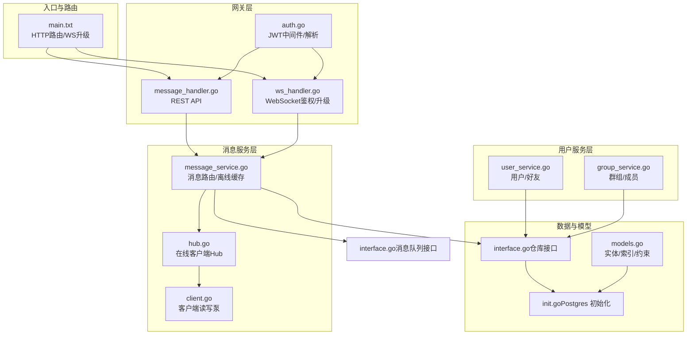
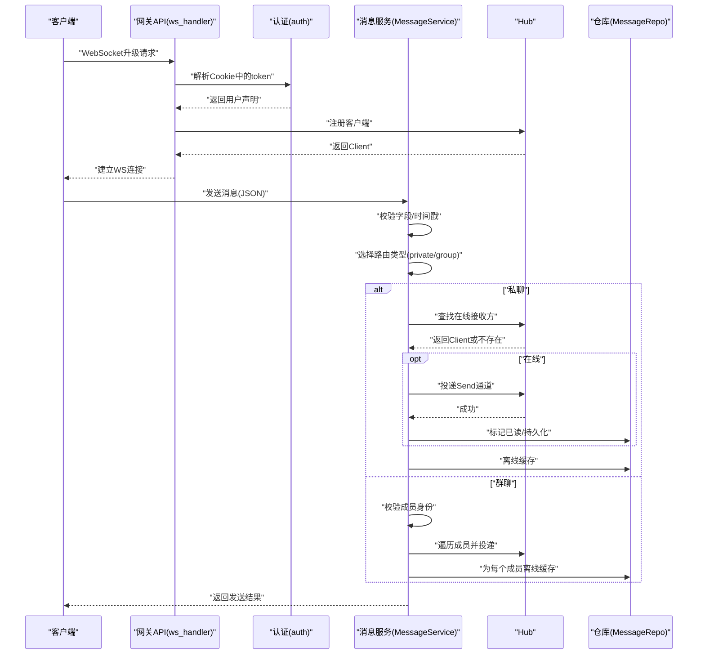
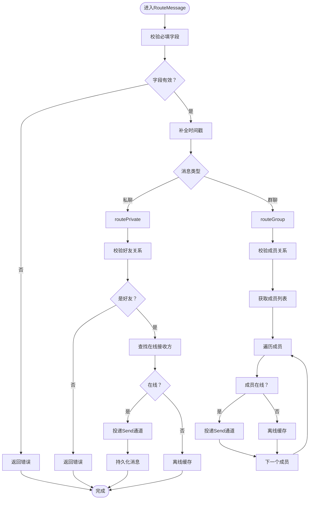
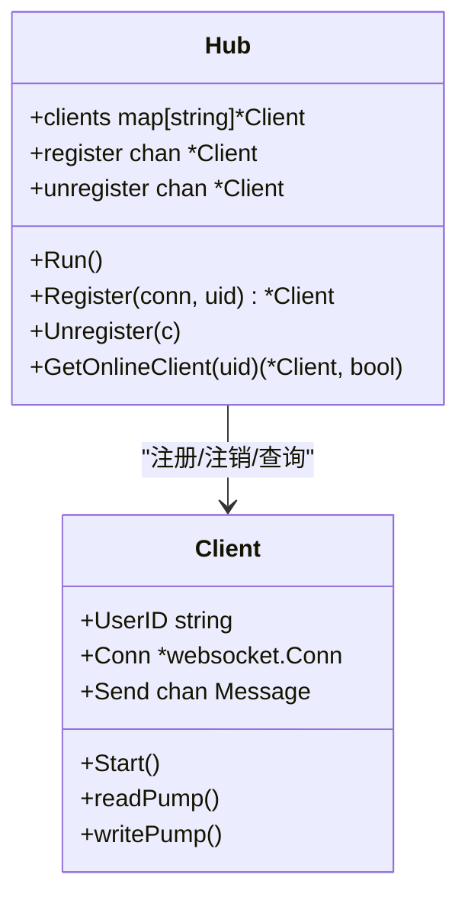
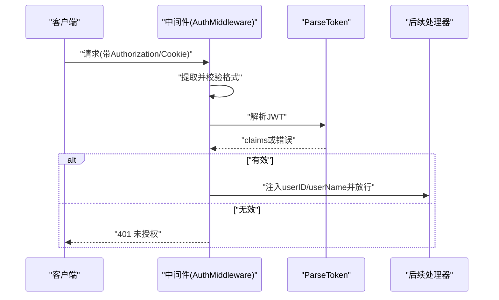
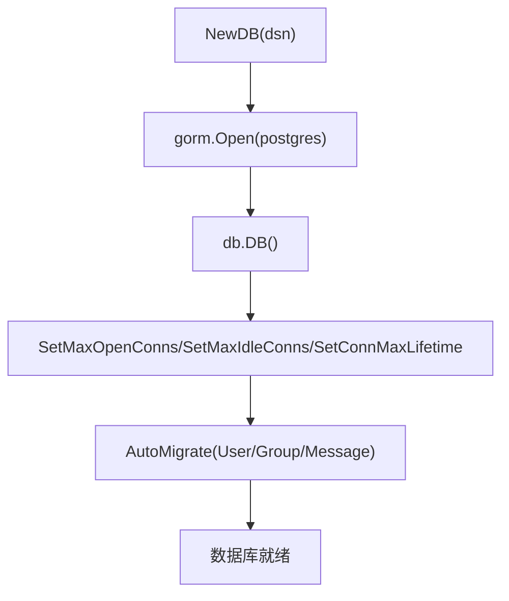
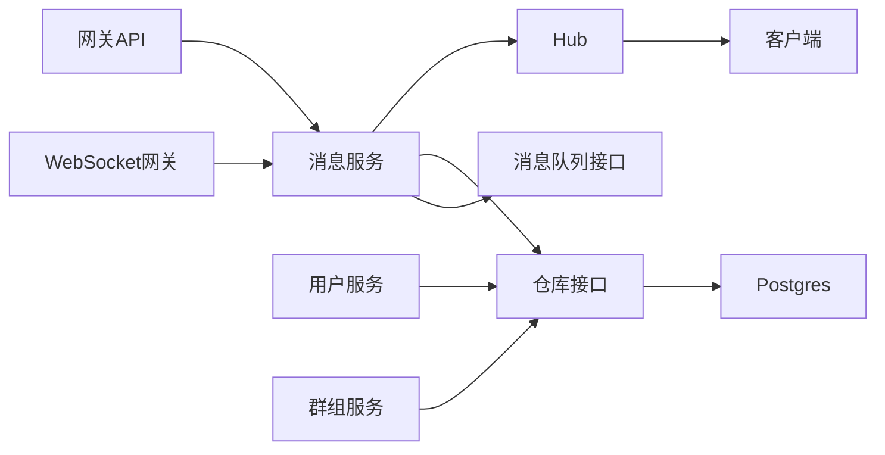

# 故障排查与维护

<cite>
**本文引用的文件**
- [main.txt](file://main.txt)
- [message_handler.go](file://server/gateway/api/message_handler.go)
- [ws_handler.go](file://server/gateway/api/ws_handler.go)
- [message_service.go](file://server/msgservice/message_service.go)
- [hub.go](file://server/msgservice/hub/hub.go)
- [client.go](file://server/msgservice/hub/client.go)
- [interface.go（仓库接口）](file://server/repository/interface.go)
- [init.go（Postgres 初始化）](file://server/repository/postgres/init.go)
- [auth.go](file://server/gateway/auth/auth.go)
- [models.go](file://server/model/models.go)
- [user_service.go](file://server/userservice/user_service.go)
- [group_service.go](file://server/userservice/group_service.go)
- [interface.go（消息队列接口）](file://server/mq/interface.go)
- [go.mod](file://go.mod)
</cite>

## 目录
1. [简介](#简介)
2. [项目结构](#项目结构)
3. [核心组件](#核心组件)
4. [架构总览](#架构总览)
5. [详细组件分析](#详细组件分析)
6. [依赖关系分析](#依赖关系分析)
7. [性能考量](#性能考量)
8. [故障排查指南](#故障排查指南)
9. [结论](#结论)
10. [附录](#附录)

## 简介
本文件面向Go语言即时通讯项目的运维与开发团队，提供系统化的故障排查与维护指南。内容覆盖连接失败、消息丢失、认证错误等常见问题的诊断与修复；日志分析方法与关键日志信息解读；性能问题定位与优化策略（CPU、内存、数据库慢查询）；系统监控与告警配置；备份恢复流程与数据一致性检查；版本升级与回滚策略；灾难恢复与业务连续性保障；以及运维自动化与DevOps最佳实践。

## 项目结构
项目采用分层与按功能模块组织的结构：入口程序负责HTTP路由与WebSocket升级；网关层处理API与鉴权；消息服务层负责消息路由、离线缓存与在线投递；用户服务层负责用户与群组生命周期管理；仓库层抽象数据库访问；模型定义数据结构；Postgres初始化负责连接池与迁移；消息队列接口预留扩展。

图表来源
- [main.txt:159-175](file://main.txt#L159-L175)
- [message_handler.go:19-44](file://server/gateway/api/message_handler.go#L19-L44)
- [ws_handler.go:39-68](file://server/gateway/api/ws_handler.go#L39-L68)
- [message_service.go:27-44](file://server/msgservice/message_service.go#L27-L44)
- [hub.go:27-42](file://server/msgservice/hub/hub.go#L27-L42)
- [client.go:27-30](file://server/msgservice/hub/client.go#L27-L30)
- [interface.go（仓库接口）:46-55](file://server/repository/interface.go#L46-L55)
- [init.go（Postgres 初始化）:42-64](file://server/repository/postgres/init.go#L42-L64)
- [auth.go:37-60](file://server/gateway/auth/auth.go#L37-L60)
- [models.go:23-36](file://server/model/models.go#L23-L36)
- [interface.go（消息队列接口）:4-6](file://server/mq/interface.go#L4-L6)

章节来源
- [main.txt:159-175](file://main.txt#L159-L175)
- [message_handler.go:19-44](file://server/gateway/api/message_handler.go#L19-L44)
- [ws_handler.go:39-68](file://server/gateway/api/ws_handler.go#L39-L68)
- [message_service.go:27-44](file://server/msgservice/message_service.go#L27-L44)
- [hub.go:27-42](file://server/msgservice/hub/hub.go#L27-L42)
- [client.go:27-30](file://server/msgservice/hub/client.go#L27-L30)
- [interface.go（仓库接口）:46-55](file://server/repository/interface.go#L46-L55)
- [init.go（Postgres 初始化）:42-64](file://server/repository/postgres/init.go#L42-L64)
- [auth.go:37-60](file://server/gateway/auth/auth.go#L37-L60)
- [models.go:23-36](file://server/model/models.go#L23-L36)
- [interface.go（消息队列接口）:4-6](file://server/mq/interface.go#L4-L6)

## 核心组件
- 入口与路由：启动HTTP服务器，注册WS端点，提供简单根页面提示。
- 网关API：接收REST消息请求，注入当前用户上下文，调用消息服务。
- WebSocket网关：基于Cookie令牌鉴权，升级为WS，注册到Hub并启动读写泵。
- 消息服务：根据消息类型路由至私聊或群聊，校验关系后投递到在线客户端或缓存离线消息。
- Hub与客户端：维护在线用户映射，读写泵处理心跳、读取与发送消息。
- 用户/群组服务：用户注册登录、好友关系、群组创建与成员管理。
- 数据层：通过GORM访问Postgres，设置连接池参数与自动迁移。
- 认证：JWT中间件与解析，支持授权头与Cookie令牌两种方式。
- 模型：定义消息、用户、好友、群组、成员、请求等实体及索引/约束。

章节来源
- [main.txt:159-175](file://main.txt#L159-L175)
- [message_handler.go:19-44](file://server/gateway/api/message_handler.go#L19-L44)
- [ws_handler.go:39-68](file://server/gateway/api/ws_handler.go#L39-L68)
- [message_service.go:27-44](file://server/msgservice/message_service.go#L27-L44)
- [hub.go:27-42](file://server/msgservice/hub/hub.go#L27-L42)
- [client.go:27-30](file://server/msgservice/hub/client.go#L27-L30)
- [user_service.go:27-54](file://server/userservice/user_service.go#L27-L54)
- [group_service.go:27-58](file://server/userservice/group_service.go#L27-L58)
- [init.go（Postgres 初始化）:42-64](file://server/repository/postgres/init.go#L42-L64)
- [auth.go:37-60](file://server/gateway/auth/auth.go#L37-L60)
- [models.go:23-36](file://server/model/models.go#L23-L36)

## 架构总览
系统采用“HTTP + WebSocket”双通道：REST用于消息发送与状态查询，WebSocket用于实时双向通信。消息服务在路由时优先投递到在线客户端，否则缓存至数据库。用户/群组服务通过仓库接口访问Postgres，模型定义了必要的索引以支撑高频查询。

图表来源
- [ws_handler.go:39-68](file://server/gateway/api/ws_handler.go#L39-L68)
- [auth.go:37-60](file://server/gateway/auth/auth.go#L37-L60)
- [message_service.go:27-44](file://server/msgservice/message_service.go#L27-L44)
- [hub.go:44-51](file://server/msgservice/hub/hub.go#L44-L51)
- [client.go:61-87](file://server/msgservice/hub/client.go#L61-L87)
- [interface.go（仓库接口）:46-55](file://server/repository/interface.go#L46-L55)

## 详细组件分析

### 组件A：消息服务与路由
- 职责：校验消息字段、补全时间戳、区分私聊/群聊、校验关系、投递在线或缓存离线。
- 关键路径：
  - 私聊：校验好友关系，若在线则直接投递并持久化，否则离线缓存。
  - 群聊：校验成员关系，遍历成员逐个投递或离线缓存。
- 性能关注：批量成员投递使用select默认分支避免阻塞；离线缓存统一走仓库接口。

图表来源
- [message_service.go:27-44](file://server/msgservice/message_service.go#L27-L44)
- [message_service.go:46-66](file://server/msgservice/message_service.go#L46-L66)
- [message_service.go:68-108](file://server/msgservice/message_service.go#L68-L108)
- [interface.go（仓库接口）:46-55](file://server/repository/interface.go#L46-L55)

章节来源
- [message_service.go:27-44](file://server/msgservice/message_service.go#L27-L44)
- [message_service.go:46-66](file://server/msgservice/message_service.go#L46-L66)
- [message_service.go:68-108](file://server/msgservice/message_service.go#L68-L108)
- [interface.go（仓库接口）:46-55](file://server/repository/interface.go#L46-L55)

### 组件B：Hub与客户端读写泵
- Hub：维护用户ID到Client的映射，注册/注销通道，读写锁保护并发安全。
- 客户端：
  - 读泵：设置读超时与pong处理器，解码消息后交给上层处理。
  - 写泵：定时Ping，设置写超时，向客户端发送消息或关闭。
- 关键参数：最大消息大小、心跳间隔、写等待时间等。

图表来源
- [hub.go:10-61](file://server/msgservice/hub/hub.go#L10-L61)
- [client.go:12-88](file://server/msgservice/hub/client.go#L12-L88)

章节来源
- [hub.go:10-61](file://server/msgservice/hub/hub.go#L10-L61)
- [client.go:12-88](file://server/msgservice/hub/client.go#L12-L88)

### 组件C：认证与鉴权
- 支持两种方式：
  - Authorization头：Bearer Token
  - Cookie：token键值
- 中间件验证签名、过期、签发/签收时间等，并将用户ID与名称注入上下文。
- 解析失败返回未授权。

图表来源
- [auth.go:37-60](file://server/gateway/auth/auth.go#L37-L60)
- [auth.go:64-90](file://server/gateway/auth/auth.go#L64-L90)
- [ws_handler.go:40-54](file://server/gateway/api/ws_handler.go#L40-L54)

章节来源
- [auth.go:37-60](file://server/gateway/auth/auth.go#L37-L60)
- [auth.go:64-90](file://server/gateway/auth/auth.go#L64-L90)
- [ws_handler.go:40-54](file://server/gateway/api/ws_handler.go#L40-L54)

### 组件D：数据库与模型
- Postgres连接池：设置最大空闲/打开连接数与连接最大生命周期。
- 自动迁移：对用户、群组、消息表执行迁移。
- 模型索引：消息表对发送者、接收者、类型、时间、是否已读建立索引，提升查询效率。

图表来源
- [init.go（Postgres 初始化）:42-64](file://server/repository/postgres/init.go#L42-L64)
- [init.go（Postgres 初始化）:67-74](file://server/repository/postgres/init.go#L67-L74)
- [models.go:23-36](file://server/model/models.go#L23-L36)

章节来源
- [init.go（Postgres 初始化）:42-64](file://server/repository/postgres/init.go#L42-L64)
- [init.go（Postgres 初始化）:67-74](file://server/repository/postgres/init.go#L67-L74)
- [models.go:23-36](file://server/model/models.go#L23-L36)

## 依赖关系分析
- 组件耦合：
  - 网关API与消息服务通过接口解耦，便于替换实现。
  - 消息服务依赖仓库接口与Hub，Hub依赖客户端。
  - 用户/群组服务依赖对应仓库接口。
- 外部依赖：
  - Web框架、WebSocket、JWT、GORM、Postgres驱动。
- 循环依赖：未见明显循环导入。

图表来源
- [message_handler.go:16-18](file://server/gateway/api/message_handler.go#L16-L18)
- [message_service.go:19-25](file://server/msgservice/message_service.go#L19-L25)
- [hub.go:10-15](file://server/msgservice/hub/hub.go#L10-L15)
- [client.go:12-18](file://server/msgservice/hub/client.go#L12-L18)
- [interface.go（仓库接口）:46-55](file://server/repository/interface.go#L46-L55)
- [user_service.go:19-24](file://server/userservice/user_service.go#L19-L24)
- [group_service.go:18-24](file://server/userservice/group_service.go#L18-L24)
- [interface.go（消息队列接口）:4-6](file://server/mq/interface.go#L4-L6)

章节来源
- [message_handler.go:16-18](file://server/gateway/api/message_handler.go#L16-L18)
- [message_service.go:19-25](file://server/msgservice/message_service.go#L19-L25)
- [hub.go:10-15](file://server/msgservice/hub/hub.go#L10-L15)
- [client.go:12-18](file://server/msgservice/hub/client.go#L12-L18)
- [interface.go（仓库接口）:46-55](file://server/repository/interface.go#L46-L55)
- [user_service.go:19-24](file://server/userservice/user_service.go#L19-L24)
- [group_service.go:18-24](file://server/userservice/group_service.go#L18-L24)
- [interface.go（消息队列接口）:4-6](file://server/mq/interface.go#L4-L6)

## 性能考量
- 并发与锁：
  - Hub使用读写锁保护在线客户端映射，降低竞争。
  - 客户端写泵使用ticker定期Ping，避免长时间无响应导致连接被误判。
- 缓冲与背压：
  - Send通道容量为256，防止阻塞；默认分支用于丢弃过载消息，避免阻塞路由。
- 数据库连接池：
  - 最大空闲/打开连接数与生命周期合理配置，减少连接抖动。
- 查询索引：
  - 消息表多字段索引，有助于按发送者/接收者/类型/时间检索与统计未读数量。
- 建议：
  - 对高并发场景增加Hub工作协程或拆分Hub按用户ID分区。
  - 引入消息队列异步落库，缓解数据库压力。
  - 使用连接池监控与慢查询日志，结合指标告警。

章节来源
- [hub.go:14-15](file://server/msgservice/hub/hub.go#L14-L15)
- [client.go:20-25](file://server/msgservice/hub/client.go#L20-L25)
- [client.go:61-87](file://server/msgservice/hub/client.go#L61-L87)
- [init.go（Postgres 初始化）:59-61](file://server/repository/postgres/init.go#L59-L61)
- [models.go:23-36](file://server/model/models.go#L23-L36)

## 故障排查指南

### 一、连接失败
- 现象
  - WebSocket升级失败、握手异常、跨域拒绝。
- 排查步骤
  - 检查请求头Origin是否在允许列表内；查看网关日志中“wrong origin”记录。
  - 确认Cookie中token存在且可被解析；检查Authorization头格式。
  - 核对WS端点与路径，确认服务监听端口与防火墙策略。
- 关键日志
  - “upgrader wrong”：升级失败。
  - “wrong origin: ...”：跨域拒绝。
  - “no authorization/mising token”：鉴权失败。
- 修复建议
  - 在生产环境调整允许的Origin白名单。
  - 确保前端正确携带Cookie或Authorization头。
  - 检查反向代理与TLS终止配置。

章节来源
- [ws_handler.go:14-28](file://server/gateway/api/ws_handler.go#L14-L28)
- [ws_handler.go:56-60](file://server/gateway/api/ws_handler.go#L56-L60)
- [auth.go:37-60](file://server/gateway/auth/auth.go#L37-L60)

### 二、消息丢失
- 现象
  - 发送成功但接收方未收到；离线消息未拉取。
- 排查步骤
  - 确认消息类型与目标ID有效；检查路由逻辑是否命中私聊/群聊分支。
  - 校验好友关系或群成员关系是否满足。
  - 查看接收方是否在线；若在线应能从Send通道投递；若离线应缓存至数据库。
  - 检查离线消息拉取接口是否正常调用并标记已读。
- 关键日志
  - “unknown message type”：消息类型不支持。
  - “cannot send message: not friends”：非好友。
  - “sender is not a member of the group”：非群成员。
- 修复建议
  - 补充消息类型校验与错误返回。
  - 在线投递失败时自动降级为离线缓存。
  - 确保离线消息拉取后及时标记已读。

章节来源
- [message_service.go:27-44](file://server/msgservice/message_service.go#L27-L44)
- [message_service.go:46-66](file://server/msgservice/message_service.go#L46-L66)
- [message_service.go:68-108](file://server/msgservice/message_service.go#L68-L108)
- [message_handler.go:45-54](file://server/gateway/api/message_handler.go#L45-L54)

### 三、认证错误
- 现象
  - 返回401未授权；无法访问受保护接口。
- 排查步骤
  - 检查Authorization头是否为Bearer Token且格式正确。
  - 检查Cookie中token是否存在且未过期。
  - 校验JWT签名算法与密钥一致。
- 关键日志
  - “missing token/no authorization”：缺少或无效令牌。
  - JWT解析错误：签名无效、过期、未生效等。
- 修复建议
  - 前端统一使用Bearer头或正确设置Cookie。
  - 严格管理密钥与过期时间，避免跨环境不一致。

章节来源
- [auth.go:37-60](file://server/gateway/auth/auth.go#L37-L60)
- [auth.go:64-90](file://server/gateway/auth/auth.go#L64-L90)
- [ws_handler.go:40-54](file://server/gateway/api/ws_handler.go#L40-L54)

### 四、日志分析与关键信息解读
- 日志位置
  - 服务启动与端口监听、WS连接/断开、读写错误、升级失败、鉴权失败等。
- 关键日志类别
  - 连接类：用户上线/下线计数、升级失败、跨域拒绝。
  - 读写类：读取错误、写入错误、Ping/Pong处理。
  - 业务类：消息类型未知、关系校验失败、离线缓存。
- 分析要点
  - 结合时间戳与用户ID定位具体会话。
  - 统计401/403频率判断前端配置问题。
  - 统计写入错误与离线缓存数量评估系统负载。

章节来源
- [main.txt:49-58](file://main.txt#L49-L58)
- [main.txt:125-126](file://main.txt#L125-L126)
- [main.txt:152](file://main.txt#L152)
- [ws_handler.go:23](file://server/gateway/api/ws_handler.go#L23)
- [client.go:45-48](file://server/msgservice/hub/client.go#L45-L48)
- [client.go:77](file://server/msgservice/hub/client.go#L77)
- [message_service.go:42](file://server/msgservice/message_service.go#L42)
- [message_service.go:52](file://server/msgservice/message_service.go#L52)
- [message_service.go:74](file://server/msgservice/message_service.go#L74)

### 五、性能问题定位与解决
- CPU占用过高
  - 检查Hub运行循环与客户端读写泵是否阻塞；观察缓冲区满导致的默认分支触发。
  - 建议：限流/熔断、拆分Hub、引入消息队列异步化。
- 内存泄漏
  - 确认客户端断开后是否正确Unregister并释放Send通道。
  - 建议：启用内存分析工具，检查长连接持有对象。
- 数据库慢查询
  - 开启慢查询日志，结合索引使用情况分析。
  - 建议：为高频查询字段添加合适索引，优化批量操作。
- 连接池问题
  - 观察最大连接数与空闲连接变化，避免连接泄露。
  - 建议：调整连接池参数，配合健康检查。

章节来源
- [hub.go:27-42](file://server/msgservice/hub/hub.go#L27-L42)
- [client.go:31-60](file://server/msgservice/hub/client.go#L31-L60)
- [client.go:61-87](file://server/msgservice/hub/client.go#L61-L87)
- [init.go（Postgres 初始化）:59-61](file://server/repository/postgres/init.go#L59-L61)
- [models.go:23-36](file://server/model/models.go#L23-L36)

### 六、系统监控与告警
- 指标建议
  - 连接数：在线用户数、WS连接数、HTTP请求数。
  - 错误率：4xx/5xx、鉴权失败、消息投递失败。
  - 延迟：消息路由耗时、数据库查询耗时、离线缓存耗时。
  - 资源：CPU、内存、Goroutines、goroutine阻塞栈。
- 告警阈值
  - 连接数异常增长或骤降。
  - 鉴权失败率超过阈值。
  - 消息投递失败率上升。
  - 数据库慢查询比例升高。
- 工具建议
  - Prometheus + Grafana；pprof + pprof-web；日志聚合（ELK/OTel）。

[本节为通用实践建议，无需特定文件引用]

### 七、备份恢复与数据一致性
- 备份策略
  - 定时逻辑备份Postgres（如pg_dump），保留多版本。
  - 记录当前数据库Schema与数据快照时间点。
- 恢复流程
  - 停止服务 -> 恢复指定时间点备份 -> 执行迁移 -> 启动服务。
- 一致性检查
  - 校验消息表索引完整性与唯一性。
  - 对比用户/群组/成员关系表数据一致性。
  - 验证离线消息拉取与已读标记逻辑。

章节来源
- [init.go（Postgres 初始化）:67-74](file://server/repository/postgres/init.go#L67-L74)
- [models.go:23-36](file://server/model/models.go#L23-L36)

### 八、版本升级与回滚
- 升级步骤
  - 准备新版本二进制与配置；预热数据库迁移；滚动更新。
  - 监控错误率与延迟，确保平滑过渡。
- 回滚步骤
  - 回滚到上一个稳定版本；必要时回退数据库迁移。
- 版本控制
  - 使用go.mod锁定依赖版本；发布带版本号的镜像/包。

章节来源
- [go.mod:1-51](file://go.mod#L1-L51)

### 九、灾难恢复与业务连续性
- 方案建议
  - 多机房/多副本部署，跨可用区容灾。
  - 本地与异地备份，定期演练恢复。
  - 限流/熔断/降级策略，保证核心链路可用。
  - 健康检查与自动重启，缩短故障恢复时间。

[本节为通用实践建议，无需特定文件引用]

### 十、运维自动化与DevOps
- 自动化建议
  - CI/CD流水线：代码检查、单元测试、打包、发布。
  - 基础设施即代码：容器编排、网络与存储配置。
  - 基于Prometheus的自动化告警与自愈脚本。
- DevOps最佳实践
  - 基准测试与压测基线；变更评审与灰度发布。
  - 文档与知识库：故障案例、排障手册、升级指南。

[本节为通用实践建议，无需特定文件引用]

## 结论
本指南围绕连接、消息、认证、性能、监控、备份、升级与灾备等维度提供了系统化的排障与维护方法。建议结合日志与指标持续优化，完善自动化与监控体系，确保系统在高并发与复杂场景下的稳定性与可靠性。

## 附录
- 常用命令参考
  - 启动服务：运行入口程序，监听HTTP端口。
  - 数据库迁移：执行自动迁移脚本。
  - 日志查看：结合服务日志与数据库慢查询日志定位问题。
- 参考文件清单
  - 入口与路由：[main.txt](file://main.txt)
  - 网关API与WebSocket：[message_handler.go](file://server/gateway/api/message_handler.go), [ws_handler.go](file://server/gateway/api/ws_handler.go)
  - 消息服务与Hub：[message_service.go](file://server/msgservice/message_service.go), [hub.go](file://server/msgservice/hub/hub.go), [client.go](file://server/msgservice/hub/client.go)
  - 认证与模型：[auth.go](file://server/gateway/auth/auth.go), [models.go](file://server/model/models.go)
  - 数据库与仓库：[init.go（Postgres 初始化）](file://server/repository/postgres/init.go), [interface.go（仓库接口）](file://server/repository/interface.go)
  - 用户/群组服务：[user_service.go](file://server/userservice/user_service.go), [group_service.go](file://server/userservice/group_service.go)
  - 消息队列接口：[interface.go（消息队列接口）](file://server/mq/interface.go)
  - 依赖与版本：[go.mod](file://go.mod)