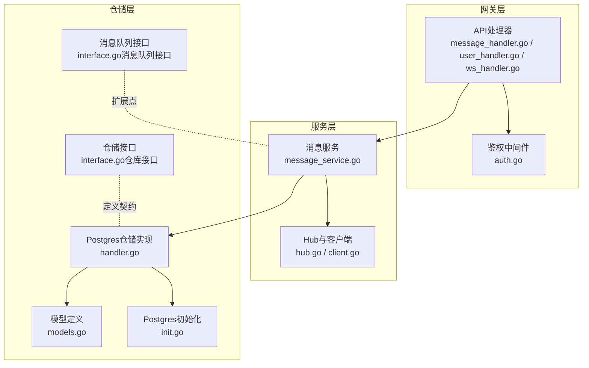
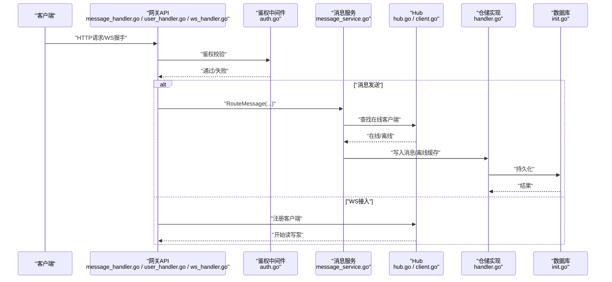
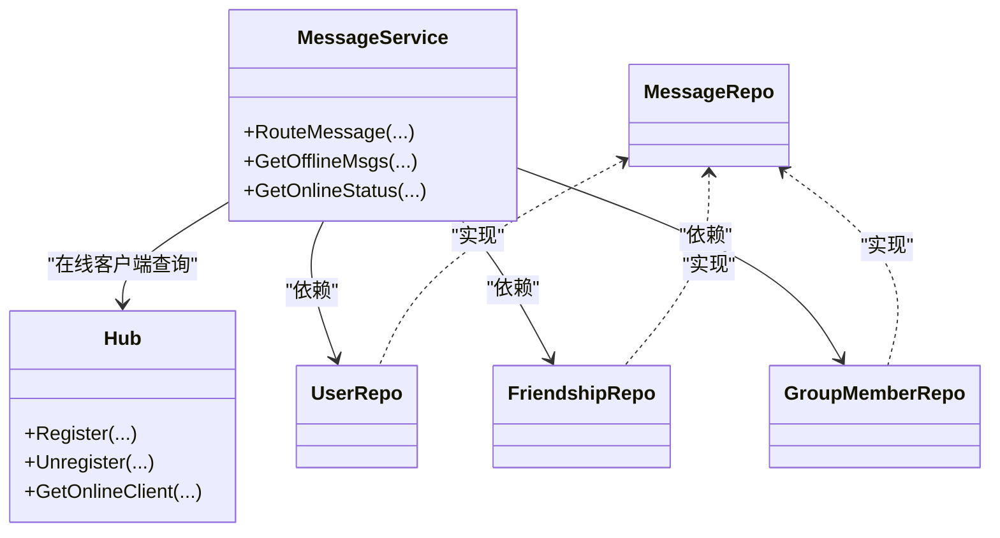

# 日志分析

<cite>
**本文引用的文件**
- [main.txt](file://main.txt)
- [message_handler.go](file://server/gateway/api/message_handler.go)
- [user_handler.go](file://server/gateway/api/user_handler.go)
- [ws_handler.go](file://server/gateway/api/ws_handler.go)
- [auth.go](file://server/gateway/auth/auth.go)
- [message_service.go](file://server/msgservice/message_service.go)
- [hub.go](file://server/msgservice/hub/hub.go)
- [client.go](file://server/msgservice/hub/client.go)
- [init.go](file://server/repository/postgres/init.go)
- [handler.go](file://server/repository/postgres/handler.go)
- [models.go](file://server/model/models.go)
- [interface.go（仓库接口）](file://server/repository/interface.go)
- [interface.go（消息队列接口）](file://server/mq/interface.go)
</cite>

## 目录
1. [引言](#引言)
2. [项目结构](#项目结构)
3. [核心组件](#核心组件)
4. [架构总览](#架构总览)
5. [详细组件分析](#详细组件分析)
6. [依赖分析](#依赖分析)
7. [性能考虑](#性能考虑)
8. [故障排查指南](#故障排查指南)
9. [结论](#结论)
10. [附录](#附录)

## 引言
本文件面向Go语言即时通讯项目的日志分析与运维实践，系统性梳理日志结构与级别划分，解释关键业务流程中的日志含义与解读方法，并提供基于grep、awk等工具的过滤与统计技巧，覆盖日志轮转、存储策略、聚合与可视化建议，以及常见问题的日志特征识别与定位方法。

## 项目结构
项目采用分层与功能模块化组织：网关层负责HTTP接口与WebSocket接入，服务层负责消息路由与在线状态管理，仓储层封装数据库访问，模型定义数据结构，消息队列接口预留扩展。

图表来源
- [message_handler.go:1-66](file://server/gateway/api/message_handler.go#L1-L66)
- [user_handler.go:1-206](file://server/gateway/api/user_handler.go#L1-L206)
- [ws_handler.go:1-69](file://server/gateway/api/ws_handler.go#L1-L69)
- [auth.go:1-91](file://server/gateway/auth/auth.go#L1-L91)
- [message_service.go:1-168](file://server/msgservice/message_service.go#L1-L168)
- [hub.go:1-61](file://server/msgservice/hub/hub.go#L1-L61)
- [client.go:1-88](file://server/msgservice/hub/client.go#L1-L88)
- [init.go:1-75](file://server/repository/postgres/init.go#L1-L75)
- [handler.go:1-585](file://server/repository/postgres/handler.go#L1-L585)
- [models.go:1-146](file://server/model/models.go#L1-L146)
- [interface.go（仓库接口）:1-74](file://server/repository/interface.go#L1-L74)
- [interface.go（消息队列接口）:1-7](file://server/mq/interface.go#L1-L7)

章节来源
- [message_handler.go:1-66](file://server/gateway/api/message_handler.go#L1-L66)
- [user_handler.go:1-206](file://server/gateway/api/user_handler.go#L1-L206)
- [ws_handler.go:1-69](file://server/gateway/api/ws_handler.go#L1-L69)
- [auth.go:1-91](file://server/gateway/auth/auth.go#L1-L91)
- [message_service.go:1-168](file://server/msgservice/message_service.go#L1-L168)
- [hub.go:1-61](file://server/msgservice/hub/hub.go#L1-L61)
- [client.go:1-88](file://server/msgservice/hub/client.go#L1-L88)
- [init.go:1-75](file://server/repository/postgres/init.go#L1-L75)
- [handler.go:1-585](file://server/repository/postgres/handler.go#L1-L585)
- [models.go:1-146](file://server/model/models.go#L1-L146)
- [interface.go（仓库接口）:1-74](file://server/repository/interface.go#L1-L74)
- [interface.go（消息队列接口）:1-7](file://server/mq/interface.go#L1-L7)

## 核心组件
- 网关层：HTTP API与WebSocket接入，负责请求解析、鉴权、错误响应与会话建立。
- 服务层：消息路由、离线缓存、在线状态查询；Hub维护在线客户端集合。
- 仓储层：GORM封装的用户、好友、群组、消息、请求等仓储操作，含数据库连接与迁移。
- 模型层：统一的数据结构与错误类型，支撑跨层契约。
- 消息队列接口：为后续异步解耦与削峰预留扩展点。

章节来源
- [message_handler.go:19-44](file://server/gateway/api/message_handler.go#L19-L44)
- [user_handler.go:21-61](file://server/gateway/api/user_handler.go#L21-L61)
- [ws_handler.go:39-68](file://server/gateway/api/ws_handler.go#L39-L68)
- [message_service.go:27-108](file://server/msgservice/message_service.go#L27-L108)
- [hub.go:10-61](file://server/msgservice/hub/hub.go#L10-L61)
- [init.go:42-65](file://server/repository/postgres/init.go#L42-L65)
- [handler.go:29-340](file://server/repository/postgres/handler.go#L29-L340)
- [models.go:23-146](file://server/model/models.go#L23-L146)
- [interface.go（仓库接口）:8-74](file://server/repository/interface.go#L8-L74)
- [interface.go（消息队列接口）:1-7](file://server/mq/interface.go#L1-L7)

## 架构总览
下图展示从HTTP到WebSocket、再到消息服务与数据库的关键交互路径，以及日志落点位置。

图表来源
- [message_handler.go:19-44](file://server/gateway/api/message_handler.go#L19-L44)
- [user_handler.go:21-61](file://server/gateway/api/user_handler.go#L21-L61)
- [ws_handler.go:39-68](file://server/gateway/api/ws_handler.go#L39-L68)
- [auth.go:37-60](file://server/gateway/auth/auth.go#L37-L60)
- [message_service.go:27-108](file://server/msgservice/message_service.go#L27-L108)
- [hub.go:44-60](file://server/msgservice/hub/hub.go#L44-L60)
- [client.go:27-87](file://server/msgservice/hub/client.go#L27-L87)
- [handler.go:335-340](file://server/repository/postgres/handler.go#L335-L340)
- [init.go:42-65](file://server/repository/postgres/init.go#L42-L65)

## 详细组件分析

### 日志结构与级别划分
- 调试日志（Debug）：用于开发期的变量值、流程分支、中间状态记录。当前代码中未显式使用logrus/zap等结构化日志库，多为标准库log输出，可按需引入结构化日志以增强可检索性。
- 信息日志（Info）：系统正常运行的关键事件，如数据库连接成功、迁移完成、Hub注册/注销、消息投递成功等。
- 警告日志（Warn）：潜在风险或异常但不中断流程的情况，如Origin校验失败、消息发送通道阻塞、部分成员投递失败等。
- 错误日志（Error）：导致功能失败或不可恢复的错误，如鉴权失败、数据库操作失败、路由未知消息类型等。

章节来源
- [init.go:63-63](file://server/repository/postgres/init.go#L63-L63)
- [init.go:68-68](file://server/repository/postgres/init.go#L68-L68)
- [ws_handler.go:23-23](file://server/gateway/api/ws_handler.go#L23-L23)
- [ws_handler.go:58-58](file://server/gateway/api/ws_handler.go#L58-L58)
- [client.go:46-46](file://server/msgservice/hub/client.go#L46-L46)
- [message_service.go:48-48](file://server/msgservice/message_service.go#L48-L48)
- [message_service.go:103-105](file://server/msgservice/message_service.go#L103-L105)

### 关键日志解读要点

- 连接建立
  - WS握手与Origin校验：当Origin不在允许列表时会记录错误日志，便于识别跨域或前端配置问题。
  - Hub注册/注销：记录在线人数变化，可用于监控峰值与异常断连。
  - 数据库连接：连接成功与迁移执行日志，确保服务启动后DB可用。

- 消息路由
  - 私聊路由：检查好友关系、在线投递、离线缓存；若部分成员投递失败，会汇总错误数量。
  - 群聊路由：遍历成员并分别处理在线/离线投递，最终返回聚合错误数。
  - 离线消息拉取：标记已读前会批量更新，便于核对“未读计数”。

- 数据库操作
  - 用户/好友/群组/消息/请求等仓储操作均带有明确的错误包装，便于在日志中定位SQL失败原因与上下文。

- 认证过程
  - Bearer Token解析：缺失或格式错误、签名方法不匹配、过期/签发时间无效、解析失败等情况均有相应错误返回，日志中体现为“no authorization”或具体错误类型。

章节来源
- [ws_handler.go:14-28](file://server/gateway/api/ws_handler.go#L14-L28)
- [hub.go:44-60](file://server/msgservice/hub/hub.go#L44-L60)
- [client.go:27-87](file://server/msgservice/hub/client.go#L27-L87)
- [init.go:42-65](file://server/repository/postgres/init.go#L42-L65)
- [handler.go:29-340](file://server/repository/postgres/handler.go#L29-L340)
- [auth.go:37-90](file://server/gateway/auth/auth.go#L37-L90)
- [message_service.go:27-108](file://server/msgservice/message_service.go#L27-L108)

### 日志过滤与统计（基于grep/awk）
以下示例以“标准库log输出”的常见模式为基础，假设日志包含时间戳、级别与上下文信息。实际使用时可根据部署环境调整格式。

- 过滤错误类日志
  - grep -E "(error|fail|err|wrong|invalid)" /var/log/im/app.log
- 统计每分钟错误数量
  - awk '/error|fail|err/ {print $1}' /var/log/im/app.log | sort | uniq -c
- 统计Origin校验失败次数
  - grep "wrong origin" /var/log/im/app.log | wc -l
- 统计消息路由失败次数
  - grep "some messages failed to deliver" /var/log/im/app.log | wc -l
- 统计离线消息写入失败
  - grep "failed to open database\|failed to get underlying sql.DB" /var/log/im/app.log | wc -l
- 统计鉴权失败
  - grep "no authorization\|missing token" /var/log/im/app.log | wc -l

提示：以上命令仅作为通用示例，具体字段与格式需结合实际日志输出与采集系统进行调整。

## 依赖分析
- 组件耦合
  - 网关层依赖鉴权中间件与消息服务；消息服务依赖Hub与仓储接口；仓储实现依赖GORM与数据库驱动。
- 外部依赖
  - Gin、Gorilla WebSocket、GORM、JWT等。
- 接口契约
  - 仓储接口定义了用户、好友、群组、消息、请求等操作契约，便于替换实现与测试。

图表来源
- [message_service.go:12-25](file://server/msgservice/message_service.go#L12-L25)
- [hub.go:10-15](file://server/msgservice/hub/hub.go#L10-L15)
- [interface.go（仓库接口）:8-74](file://server/repository/interface.go#L8-L74)
- [handler.go:21-333](file://server/repository/postgres/handler.go#L21-L333)

章节来源
- [message_service.go:12-25](file://server/msgservice/message_service.go#L12-L25)
- [hub.go:10-15](file://server/msgservice/hub/hub.go#L10-L15)
- [interface.go（仓库接口）:8-74](file://server/repository/interface.go#L8-L74)
- [handler.go:21-333](file://server/repository/postgres/handler.go#L21-L333)

## 性能考虑
- 日志量控制
  - 将Info/Warn/Error按需分级输出，避免在高并发场景下产生过多I/O。
  - 对重复性高频错误进行聚合上报，减少日志噪声。
- 结构化日志
  - 引入结构化日志库，统一字段（如trace_id、user_id、op、duration），提升检索效率。
- 异步写盘
  - 使用带缓冲与异步的Writer，降低阻塞概率。
- 日志轮转
  - 建议按大小与时间轮转，保留7-30天滚动日志，压缩旧日志，限制单文件大小。

## 故障排查指南

- WS Origin校验失败
  - 现象：日志出现“wrong origin”。
  - 排查：确认前端Origin是否在允许列表内；检查代理/反向代理是否正确透传Origin头。
  - 章节来源
    - [ws_handler.go:14-28](file://server/gateway/api/ws_handler.go#L14-L28)

- WS升级失败
  - 现象：日志出现“upgrader wrong ...”。
  - 排查：检查网络、超时设置、TLS配置；确认客户端版本兼容。
  - 章节来源
    - [ws_handler.go:56-60](file://server/gateway/api/ws_handler.go#L56-L60)

- 读取消息异常
  - 现象：日志出现“read error ...”。
  - 排查：关注客户端断开、协议错误、消息体解析失败；检查ping/pong心跳配置。
  - 章节来源
    - [client.go:31-60](file://server/msgservice/hub/client.go#L31-L60)

- 鉴权失败
  - 现象：日志出现“no authorization”、“missing token”。
  - 排查：确认Authorization头格式、Token签名算法、过期时间；检查Cookie传递。
  - 章节来源
    - [auth.go:37-60](file://server/gateway/auth/auth.go#L37-L60)

- 消息投递失败
  - 现象：日志出现“some messages failed to deliver: N errors”。
  - 排查：检查目标成员在线状态、通道阻塞、仓储写入失败；核对好友/群组关系。
  - 章节来源
    - [message_service.go:82-105](file://server/msgservice/message_service.go#L82-L105)

- 数据库连接/迁移失败
  - 现象：日志出现“failed to open database”、“failed to get underlying sql.DB”、“Running database migrations...”。
  - 排查：检查环境变量、连接串、DB可达性、权限；确认迁移脚本无冲突。
  - 章节来源
    - [init.go:42-65](file://server/repository/postgres/init.go#L42-L65)

- 离线消息拉取与标记
  - 现象：日志出现“get offline messages failed”、“mark messages as read failed”。
  - 排查：核对接收者ID、索引、事务一致性；检查批量更新影响行数。
  - 章节来源
    - [message_service.go:128-146](file://server/msgservice/message_service.go#L128-L146)

- 在线状态查询
  - 现象：日志出现“get friend ids failed”。
  - 排查：确认好友关系表状态、Hub是否初始化、并发读写锁。
  - 章节来源
    - [message_service.go:148-167](file://server/msgservice/message_service.go#L148-L167)

## 结论
通过对网关、服务、仓储与模型的全链路日志分析，可以有效定位连接、认证、消息路由、数据库等关键环节的问题。建议在现有标准库log基础上引入结构化日志与异步写盘，配合完善的日志轮转与聚合方案，持续优化可观测性与排障效率。

## 附录

### 日志聚合与可视化建议
- 聚合平台：ELK（Logstash/Filebeat+ES+Kibana）、Loki（Promtail+Grafana）。
- 字段建议：timestamp、level、module、operation、user_id、target_id、duration_ms、error_code、stack_trace。
- 可视化：接入率/错误率、延迟分布、Top错误、Origin来源分布、在线人数趋势、消息投递成功率。

### 日志轮转与存储策略
- 轮转：按大小（如100MB）与时间（每日）轮转；保留7-30天；压缩旧日志。
- 存储：热数据本地SSD，冷数据归档至对象存储；按月/季度分桶。
- 安全：脱敏敏感字段（如密码、Token），限制访问权限。