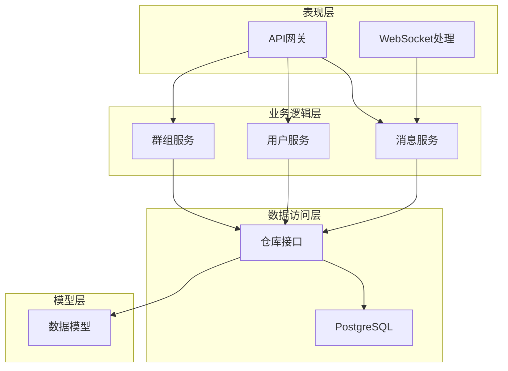
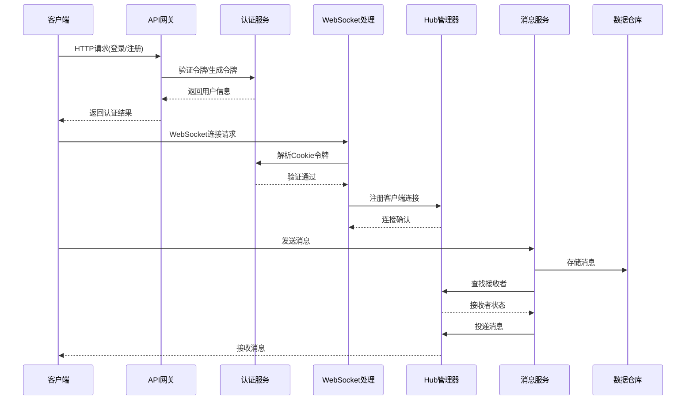
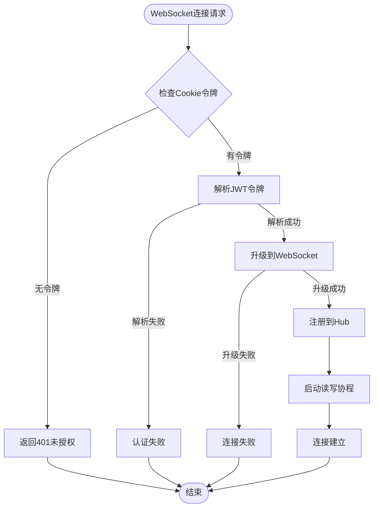
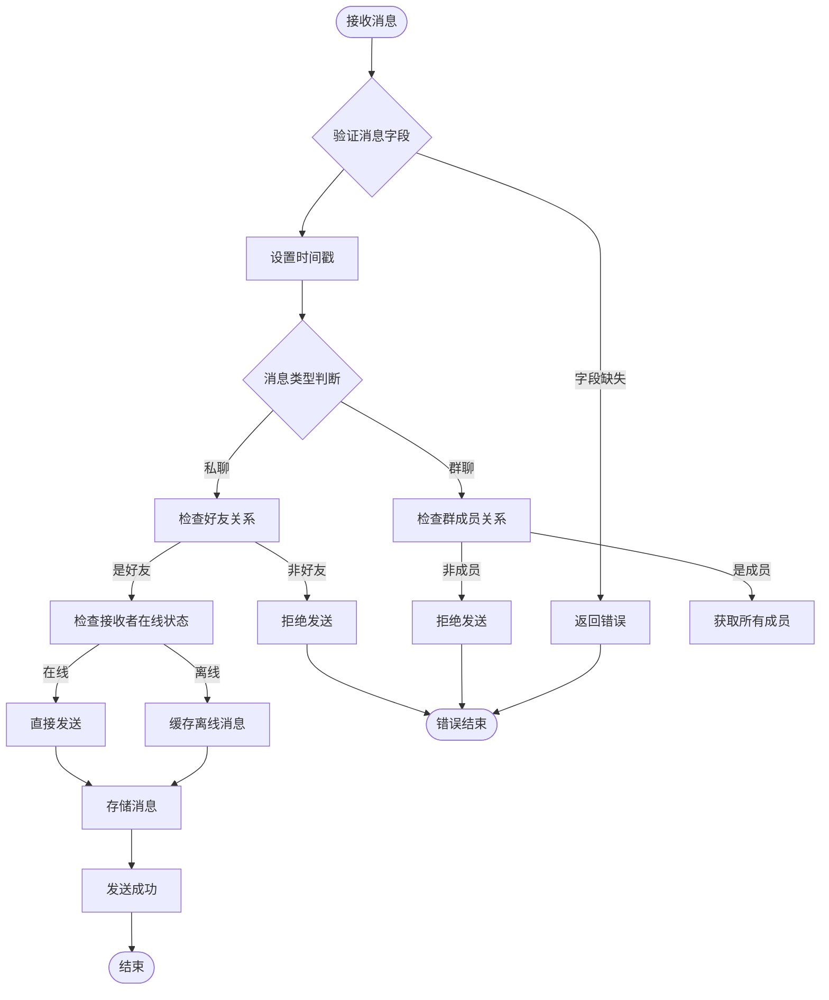
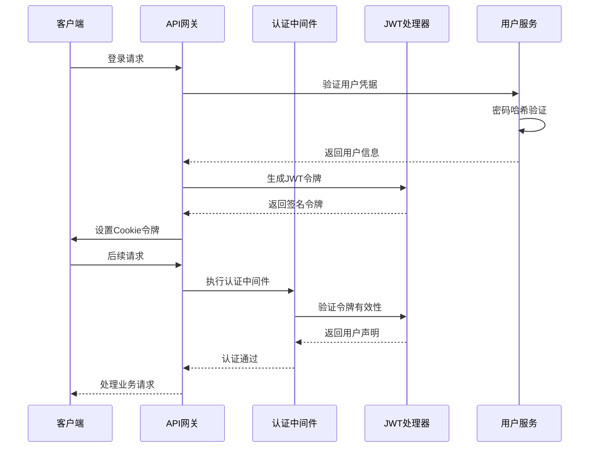
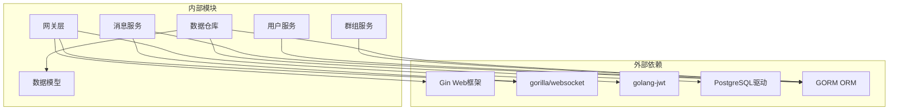
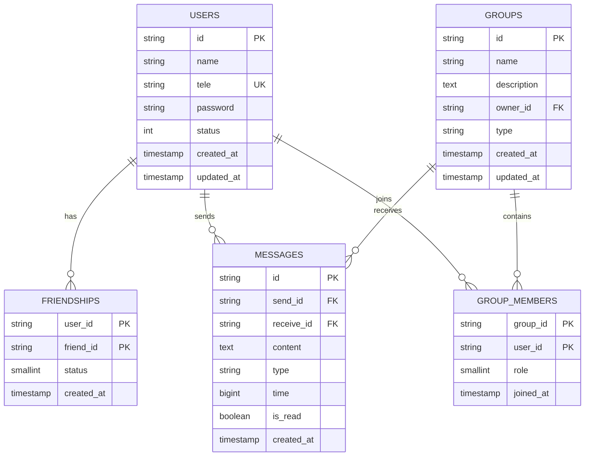

# 问题诊断

<cite>
**本文档引用的文件**
- [ws_handler.go](file://server/gateway/api/ws_handler.go)
- [message_handler.go](file://server/gateway/api/message_handler.go)
- [user_handler.go](file://server/gateway/api/user_handler.go)
- [auth.go](file://server/gateway/auth/auth.go)
- [hub.go](file://server/msgservice/hub/hub.go)
- [client.go](file://server/msgservice/hub/client.go)
- [message_service.go](file://server/msgservice/message_service.go)
- [init.go](file://server/repository/postgres/init.go)
- [handler.go](file://server/repository/postgres/handler.go)
- [models.go](file://server/model/models.go)
- [interface.go](file://server/repository/interface.go)
- [user_service.go](file://server/userservice/user_service.go)
- [group_service.go](file://server/userservice/group_service.go)
- [main.txt](file://main.txt)
</cite>

## 目录
1. [简介](#简介)
2. [项目结构](#项目结构)
3. [核心组件](#核心组件)
4. [架构概览](#架构概览)
5. [详细组件分析](#详细组件分析)
6. [依赖关系分析](#依赖关系分析)
7. [性能考虑](#性能考虑)
8. [故障排除指南](#故障排除指南)
9. [结论](#结论)

## 简介

本文件为Go语言即时通讯项目的完整问题诊断文档。该系统采用WebSocket实时通信技术，基于Gin框架构建REST API，并使用PostgreSQL作为数据存储。系统支持用户认证、消息路由、群组管理等功能。

## 项目结构

该项目采用分层架构设计，主要分为以下层次：



**图表来源**
- [ws_handler.go:1-69](file://server/gateway/api/ws_handler.go#L1-L69)
- [message_service.go:1-168](file://server/msgservice/message_service.go#L1-L168)
- [user_service.go:1-187](file://server/userservice/user_service.go#L1-L187)

**章节来源**
- [ws_handler.go:1-69](file://server/gateway/api/ws_handler.go#L1-L69)
- [message_handler.go:1-66](file://server/gateway/api/message_handler.go#L1-L66)
- [user_handler.go:1-206](file://server/gateway/api/user_handler.go#L1-L206)

## 核心组件

### WebSocket连接组件

系统的核心是基于gorilla/websocket的实时通信机制，包含以下关键组件：

- **Hub管理器**: 负责维护在线客户端连接状态
- **Client客户端**: 处理单个WebSocket连接的读写操作
- **Upgrader升级器**: 处理HTTP到WebSocket协议升级

### 消息路由组件

消息服务负责消息的路由、缓存和投递：

- **消息类型**: 支持私聊和群聊两种消息类型
- **路由策略**: 基于在线状态进行消息投递
- **离线缓存**: 自动缓存未送达的消息

### 认证授权组件

系统采用JWT令牌进行用户认证：

- **令牌生成**: 基于HS256算法的签名令牌
- **中间件验证**: 自动解析和验证请求头中的令牌
- **Cookie存储**: 登录成功后设置安全的HttpOnly Cookie

**章节来源**
- [hub.go:1-61](file://server/msgservice/hub/hub.go#L1-L61)
- [client.go:1-88](file://server/msgservice/hub/client.go#L1-L88)
- [auth.go:1-91](file://server/gateway/auth/auth.go#L1-L91)

## 架构概览



**图表来源**
- [ws_handler.go:39-68](file://server/gateway/api/ws_handler.go#L39-L68)
- [auth.go:37-61](file://server/gateway/auth/auth.go#L37-L61)
- [message_service.go:27-44](file://server/msgservice/message_service.go#L27-L44)

## 详细组件分析

### WebSocket连接处理流程



**图表来源**
- [ws_handler.go:39-68](file://server/gateway/api/ws_handler.go#L39-L68)
- [auth.go:48-52](file://server/gateway/auth/auth.go#L48-L52)

### 消息路由处理流程



**图表来源**
- [message_service.go:27-108](file://server/msgservice/message_service.go#L27-L108)
- [message_service.go:123-126](file://server/msgservice/message_service.go#L123-L126)

### 用户认证处理流程



**图表来源**
- [user_handler.go:39-61](file://server/gateway/api/user_handler.go#L39-L61)
- [auth.go:37-61](file://server/gateway/auth/auth.go#L37-L61)
- [user_service.go:56-67](file://server/userservice/user_service.go#L56-L67)

**章节来源**
- [client.go:27-87](file://server/msgservice/hub/client.go#L27-L87)
- [message_service.go:46-108](file://server/msgservice/message_service.go#L46-L108)
- [user_handler.go:39-61](file://server/gateway/api/user_handler.go#L39-L61)

## 依赖关系分析



**图表来源**
- [ws_handler.go:3-12](file://server/gateway/api/ws_handler.go#L3-L12)
- [auth.go:3-12](file://server/gateway/auth/auth.go#L3-L12)
- [init.go:10-12](file://server/repository/postgres/init.go#L10-L12)

### 数据模型关系



**图表来源**
- [models.go:23-105](file://server/model/models.go#L23-L105)

**章节来源**
- [interface.go:1-74](file://server/repository/interface.go#L1-L74)
- [models.go:1-146](file://server/model/models.go#L1-L146)

## 性能考虑

### 连接池配置

系统使用GORM连接池进行数据库连接管理：

- **最大空闲连接**: 10个
- **最大活跃连接**: 100个  
- **连接最大生命周期**: 1小时

### 缓冲区大小

WebSocket客户端消息缓冲区配置：

- **发送缓冲区**: 256条消息
- **读取缓冲区**: 1024字节
- **写入缓冲区**: 1024字节

### 心跳机制

- **读超时**: 60秒
- **心跳间隔**: 55秒
- **写超时**: 10秒

**章节来源**
- [init.go:59-64](file://server/repository/postgres/init.go#L59-L64)
- [client.go:20-25](file://server/msgservice/hub/client.go#L20-L25)
- [hub.go:17-25](file://server/msgservice/hub/hub.go#L17-L25)

## 故障排除指南

### WebSocket连接失败诊断

#### 常见症状
- 客户端无法建立WebSocket连接
- 服务器端出现"upgrader wrong"错误
- CORS跨域问题导致连接被拒绝

#### 诊断步骤
1. **检查令牌验证**
   - 确认客户端Cookie中包含有效的JWT令牌
   - 验证令牌格式是否正确（Bearer前缀）
   - 检查令牌是否过期或被篡改

2. **验证CORS配置**
   ```go
   // 检查允许的源列表
   allowed := []string{"http://localhost:8080"}
   ```

3. **网络连接测试**
   - 使用浏览器开发者工具查看WebSocket握手过程
   - 检查防火墙和代理设置
   - 验证服务器端口监听状态

#### 错误代码识别
- **401未授权**: 令牌缺失或无效
- **CORS错误**: 跨域请求被拒绝
- **升级失败**: 协议升级过程中断

**章节来源**
- [ws_handler.go:14-28](file://server/gateway/api/ws_handler.go#L14-L28)
- [ws_handler.go:40-52](file://server/gateway/api/ws_handler.go#L40-L52)

### 消息发送失败诊断

#### 常见症状
- 消息发送后立即返回错误
- 部分接收者收到消息，部分没有
- 离线消息缓存异常

#### 诊断步骤
1. **验证消息字段完整性**
   - 检查发送方ID、接收方ID、内容和类型
   - 确认消息时间戳设置

2. **检查权限验证**
   - 私聊：验证双方是否为好友
   - 群聊：验证发送方是否为群成员

3. **分析投递状态**
   ```go
   // 在线投递路径
   if client, online := hub.GetOnlineClient(rcID); online {
       select {
       case client.Send <- msg:
           // 直接投递成功
       default:
           // 发送队列满，缓存离线
       }
   }
   ```

#### 错误分类
- **认证错误**: 401未授权
- **业务逻辑错误**: 400错误参数
- **系统内部错误**: 500服务器错误

**章节来源**
- [message_service.go:27-44](file://server/msgservice/message_service.go#L27-L44)
- [message_service.go:46-108](file://server/msgservice/message_service.go#L46-L108)

### 用户认证错误诊断

#### 常见症状
- 登录失败返回"unknown user"
- 注册时返回"wrong register info"
- 令牌解析失败返回"no authorization"

#### 诊断步骤
1. **检查请求格式**
   - 验证JSON请求体结构
   - 确认必填字段存在

2. **验证密码哈希**
   ```go
   hashedPassword, err := bcrypt.GenerateFromPassword([]byte(password), bcrypt.DefaultCost)
   ```

3. **检查令牌签名**
   - 验证JWT密钥配置
   - 确认签名算法正确

#### 错误代码识别
- **400错误**: 请求格式不正确
- **401错误**: 凭据验证失败
- **500错误**: 服务器内部错误

**章节来源**
- [user_handler.go:21-37](file://server/gateway/api/user_handler.go#L21-L37)
- [user_handler.go:39-61](file://server/gateway/api/user_handler.go#L39-L61)
- [user_service.go:56-67](file://server/userservice/user_service.go#L56-L67)

### 客户端断线重连诊断

#### 常见症状
- 客户端频繁断开连接
- 重连后丢失历史消息
- 心跳检测失败

#### 诊断步骤
1. **检查心跳机制**
   ```go
   // 心跳配置
   const (
       pongWait   = 60 * time.Second
       pingTime   = 55 * time.Second
       writeWait  = 10 * time.Second
   )
   ```

2. **验证断线处理**
   - 检查客户端关闭时的清理逻辑
   - 验证Hub中的注销流程

3. **分析重连策略**
   - 实现指数退避重连算法
   - 添加最大重连次数限制

#### 错误识别
- **读取错误**: websocket.IsUnexpectedCloseError
- **写入失败**: 连接不可用
- **超时错误**: 心跳检测超时

**章节来源**
- [client.go:31-60](file://server/msgservice/hub/client.go#L31-L60)
- [client.go:61-87](file://server/msgservice/hub/client.go#L61-L87)

### 数据库连接异常诊断

#### 常见症状
- 数据库连接超时
- 连接池耗尽
- 查询执行失败

#### 诊断步骤
1. **检查连接配置**
   ```go
   dsn := fmt.Sprintf("host=%s port=%s user=%s password=%s dbname=%s sslmode=%s",
       cfg.DBHost, cfg.DBPort, cfg.DBUser, cfg.DBPassword, cfg.DBName, cfg.DBSSLMode)
   ```

2. **监控连接池状态**
   - 最大空闲连接数：10
   - 最大活跃连接数：100
   - 连接最大生命周期：1小时

3. **验证迁移执行**
   ```go
   AutoMigrate(
       &model.User{},
       &model.Group{},
       &model.Message{},
   )
   ```

#### 错误处理
- **连接失败**: 重新初始化数据库连接
- **查询超时**: 优化SQL查询和索引
- **事务冲突**: 实现重试机制

**章节来源**
- [init.go:42-65](file://server/repository/postgres/init.go#L42-L65)
- [init.go:67-75](file://server/repository/postgres/init.go#L67-L75)

### 网络连接问题诊断

#### 常见症状
- 请求超时
- 连接被拒绝
- DNS解析失败

#### 诊断步骤
1. **检查网络连通性**
   - 使用ping命令测试服务器可达性
   - 验证端口监听状态

2. **分析负载均衡**
   - 检查反向代理配置
   - 验证健康检查机制

3. **监控网络指标**
   - 连接数统计
   - 响应时间分布
   - 错误率监控

#### 诊断工具
- **netstat**: 检查端口占用
- **tcpdump**: 分析网络流量
- **curl**: 测试API接口

### 服务器资源不足诊断

#### 常见症状
- 内存使用率过高
- CPU使用率持续高位
- 文件描述符耗尽

#### 诊断步骤
1. **监控系统资源**
   - 使用top/htop查看进程资源使用
   - 检查内存泄漏情况

2. **分析连接状态**
   - 统计当前活跃连接数
   - 监控Hub中的客户端数量

3. **优化资源配置**
   - 调整连接池大小
   - 优化消息缓冲区配置

#### 性能优化建议
- 实施连接数限制
- 添加内存使用监控
- 优化数据库查询

### 日志和监控指标

#### 关键日志类型
1. **连接日志**
   ```
   log.Printf("user %s connect, online %d", client.Userinfo, len(h.Clients))
   log.Printf("user %s disconnect, online %d", client.Userinfo, len(h.Clients))
   ```

2. **错误日志**
   ```
   log.Println("read error [%s]: %v", c.UserID, err)
   log.Printf("wrong with webscoket ", err)
   ```

3. **业务日志**
   ```
   log.Printf("upgrader wrong", err)
   log.Printf("wrong origin:%s", origin)
   ```

#### 监控指标
- **连接指标**: 当前连接数、连接速率
- **消息指标**: 消息发送成功率、延迟
- **资源指标**: CPU使用率、内存使用量、数据库连接数

### 问题分类和优先级评估

#### 严重级别分类

| 级别 | 描述 | 影响范围 | 响应时间 |
|------|------|----------|----------|
| P0 | 系统完全不可用 | 全站服务中断 | 立即处理 |
| P1 | 核心功能失效 | 主要业务中断 | 1小时内 |
| P2 | 功能降级 | 部分功能受限 | 4小时内 |
| P3 | 性能问题 | 用户体验下降 | 24小时内 |

#### 诊断优先级

1. **P0级问题**
   - WebSocket连接完全失败
   - 数据库连接全部中断
   - 认证系统完全失效

2. **P1级问题**
   - 大量用户无法登录
   - 消息投递大面积失败
   - 服务器资源耗尽

3. **P2级问题**
   - 个别功能异常
   - 性能明显下降
   - 少量用户投诉

4. **P3级问题**
   - UI显示异常
   - 日志过多
   - 小功能缺陷

### 故障恢复策略

#### 快速恢复
1. **重启服务**: 对于临时性故障
2. **重载配置**: 更新配置文件后重载
3. **清理缓存**: 清除异常状态数据

#### 长期修复
1. **代码修复**: 修复bug和逻辑错误
2. **架构优化**: 改进系统设计
3. **监控完善**: 增强告警机制

#### 预防措施
1. **压力测试**: 定期进行性能测试
2. **备份策略**: 建立数据备份机制
3. **容灾方案**: 制定灾难恢复计划

**章节来源**
- [client.go:42-59](file://server/msgservice/hub/client.go#L42-L59)
- [init.go:42-65](file://server/repository/postgres/init.go#L42-L65)
- [auth.go:37-61](file://server/gateway/auth/auth.go#L37-L61)

## 结论

本诊断文档提供了Go语言即时通讯系统的完整故障排除指南。通过理解系统的架构设计、核心组件和关键流程，运维人员可以快速定位和解决各种技术问题。

### 关键要点

1. **分层架构清晰**: 网关层、业务层、数据层职责明确
2. **实时通信可靠**: WebSocket连接管理和消息路由机制完善
3. **认证安全**: JWT令牌和Cookie双重安全保障
4. **扩展性强**: 模块化设计便于功能扩展和维护

### 最佳实践

1. **监控预警**: 建立完善的监控和告警机制
2. **日志规范**: 标准化的日志记录和分析
3. **性能优化**: 持续优化系统性能和资源使用
4. **安全防护**: 定期进行安全审计和漏洞扫描

通过遵循本文档提供的诊断方法和最佳实践，可以有效提升系统的稳定性和可靠性，确保即时通讯服务的高质量运行。