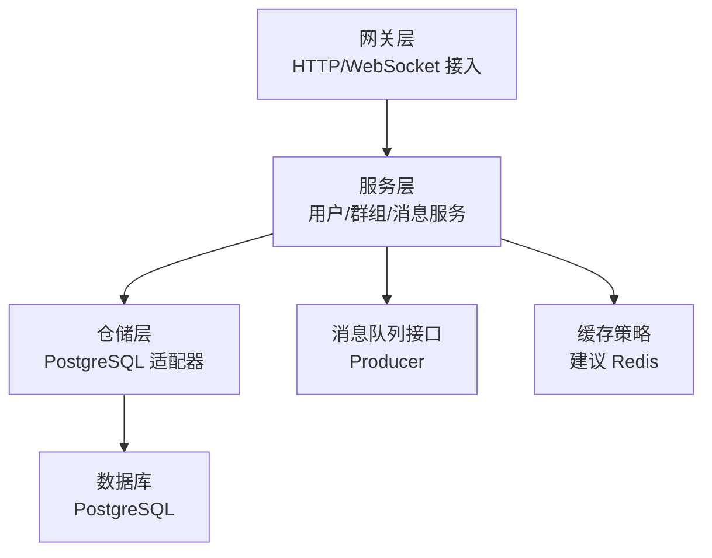
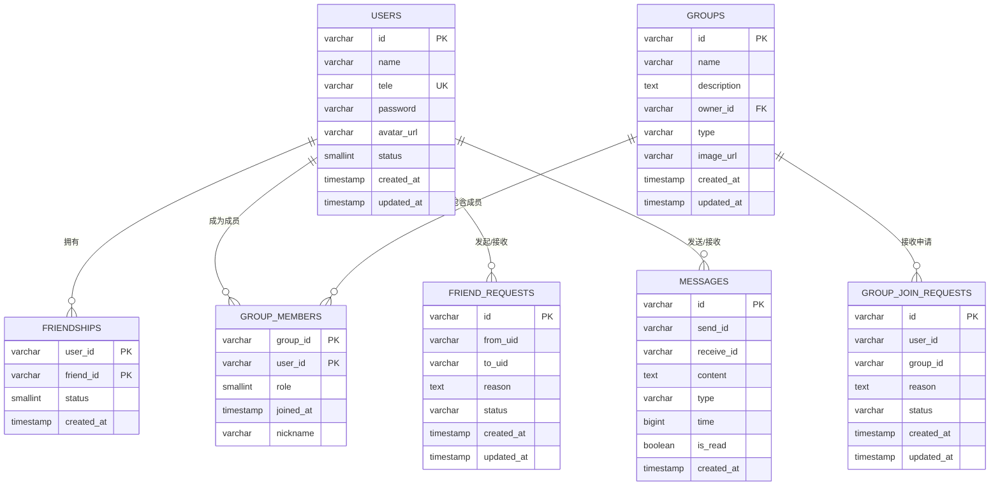
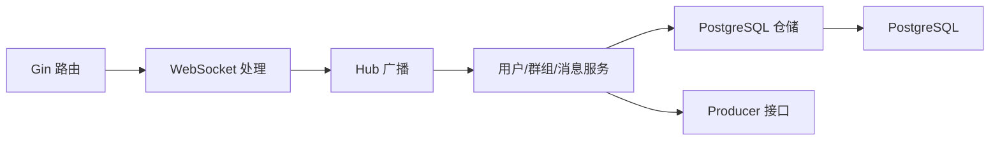
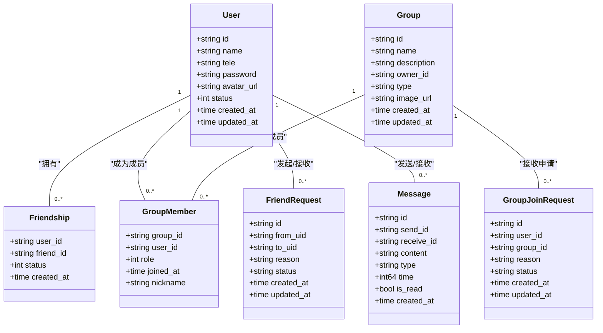

# 数据库设计

<cite>
**本文引用的文件**
- [models.go](file://server/model/models.go)
- [init.go](file://server/repository/postgres/init.go)
- [handler.go](file://server/repository/postgres/handler.go)
- [interface.go（仓库接口）](file://server/repository/interface.go)
- [user_service.go](file://server/userservice/user_service.go)
- [group_service.go](file://server/userservice/group_service.go)
- [interface.go（消息队列接口）](file://server/mq/interface.go)
- [main.txt](file://main.txt)
- [go.mod](file://go.mod)
</cite>

## 目录
1. [简介](#简介)
2. [项目结构](#项目结构)
3. [核心组件](#核心组件)
4. [架构总览](#架构总览)
5. [详细组件分析](#详细组件分析)
6. [依赖分析](#依赖分析)
7. [性能考虑](#性能考虑)
8. [故障排查指南](#故障排查指南)
9. [结论](#结论)
10. [附录](#附录)

## 简介
本文件面向 Go 语言即时通讯项目，提供数据库层面的完整设计文档。内容涵盖数据模型设计思路与实体关系、字段定义与约束、索引与性能优化策略、数据访问模式与缓存策略、数据生命周期与归档规则、数据迁移与版本管理方案，以及数据安全与隐私保护、访问控制的设计要点。本文所有技术细节均基于代码库中实际实现进行归纳总结。

## 项目结构
后端采用分层架构：Gateway 层负责接入与路由，Service 层封装业务逻辑，Repository 层负责数据持久化，Model 层定义数据结构与 GORM 映射，PostgreSQL 作为默认存储，使用 GORM 进行 ORM 操作与自动迁移。

图表来源
- [main.txt:159-175](file://main.txt#L159-L175)
- [user_service.go:13-25](file://server/userservice/user_service.go#L13-L25)
- [group_service.go:11-25](file://server/userservice/group_service.go#L11-L25)
- [handler.go:13-20](file://server/repository/postgres/handler.go#L13-L20)

章节来源
- [main.txt:159-175](file://main.txt#L159-L175)
- [go.mod:1-51](file://go.mod#L1-51)

## 核心组件
本项目的核心数据模型由以下实体构成：
- 用户 User：标识、名称、电话、密码哈希、头像、状态、时间戳
- 好友关系 Friendship：双向好友关系，含状态与创建时间
- 群组 Group：标识、名称、描述、群主、类型、图片、时间戳
- 群成员 GroupMember：群与成员的多对多关系，含角色与加入时间
- 好友请求 FriendRequest：发起方、接收方、原因、状态、时间戳
- 群组加入请求 GroupJoinRequest：申请人、目标群、原因、状态、时间戳
- 消息 Message：消息 ID、发送方、接收方、内容、类型、时间戳、已读标记、创建时间

章节来源
- [models.go:23-146](file://server/model/models.go#L23-L146)

## 架构总览
下图展示数据库层与上层服务的交互关系，以及各实体之间的关联。

图表来源
- [models.go:23-146](file://server/model/models.go#L23-L146)

## 详细组件分析

### 用户 User
- 字段与约束
  - 主键：id（varchar，长度上限 64）
  - 唯一索引：tele（手机号）
  - 普通索引：name
  - 默认值：status=1
  - 时间戳：created_at、updated_at（自动生成）
- 关联关系
  - 多对多：通过中间表 friendships 与自身建立好友关系
  - 多对多：通过中间表 group_members 与 Group 建立成员关系
- 业务规则
  - 注册时校验 tele 唯一性；登录时比对密码哈希
  - 好友关系状态含“正常/拉黑”两类
- 性能优化
  - 对 name、tele 建立索引，满足高频查询场景
  - 使用唯一索引保证电话号码唯一性，避免重复注册

章节来源
- [models.go:38-54](file://server/model/models.go#L38-L54)
- [user_service.go:27-67](file://server/userservice/user_service.go#L27-L67)

### 好友关系 Friendship
- 字段与约束
  - 复合主键：user_id、friend_id
  - 状态字段：smallint，默认 1（表示正常），可用于后续扩展（如拉黑）
  - 自动时间戳：created_at
- 查询模式
  - 支持按用户查询好友列表（JOIN users 表）
  - 支持按用户查询好友 ID 列表（Pluck）

章节来源
- [models.go:56-65](file://server/model/models.go#L56-L65)
- [handler.go:118-177](file://server/repository/postgres/handler.go#L118-L177)

### 群组 Group
- 字段与约束
  - 主键：id（varchar，长度上限 64）
  - 普通索引：name、owner_id
  - 默认值：type='normal'
  - 时间戳：created_at、updated_at
- 关联关系
  - 外键：owner_id 引用 users.id
  - 多对多：通过中间表 group_members 与 User 建立成员关系
- 业务规则
  - 创建群组时自动将创建者设为群主（role=3）
  - 群主可变更成员角色或移除成员
- 性能优化
  - owner_id 建有索引，便于“按用户查询其群组”场景

章节来源
- [models.go:67-83](file://server/model/models.go#L67-L83)
- [handler.go:179-237](file://server/repository/postgres/handler.go#L179-L237)
- [group_service.go:27-58](file://server/userservice/group_service.go#L27-L58)

### 群成员 GroupMember
- 字段与约束
  - 复合主键：group_id、user_id
  - 角色字段：smallint，默认 1（普通成员），支持 2（管理员）、3（群主）
  - 自动时间戳：joined_at
- 查询模式
  - 支持按群查询成员列表与成员 ID 列表
  - 支持查询某成员在指定群中的角色

章节来源
- [models.go:95-105](file://server/model/models.go#L95-L105)
- [handler.go:239-325](file://server/repository/postgres/handler.go#L239-L325)
- [group_service.go:172-216](file://server/userservice/group_service.go#L172-L216)

### 好友请求 FriendRequest
- 字段与约束
  - 主键：id（varchar，长度上限 64）
  - 普通索引：from_uid、to_uid、status
  - 状态枚举：pending/accepted/rejected（默认 pending）
- 查询模式
  - 支持按接收方查询待处理请求列表
  - 支持按状态计数与更新状态

章节来源
- [models.go:107-119](file://server/model/models.go#L107-L119)
- [handler.go:440-511](file://server/repository/postgres/handler.go#L440-L511)
- [user_service.go:77-182](file://server/userservice/user_service.go#L77-L182)

### 群组加入请求 GroupJoinRequest
- 字段与约束
  - 主键：id（varchar，长度上限 64）
  - 普通索引：user_id、group_id、status
  - 状态枚举：pending/accepted/rejected（默认 pending）
- 查询模式
  - 支持按群查询待处理请求列表
  - 支持按状态计数与更新状态

章节来源
- [models.go:127-139](file://server/model/models.go#L127-L139)
- [handler.go:513-584](file://server/repository/postgres/handler.go#L513-L584)
- [group_service.go:64-170](file://server/userservice/group_service.go#L64-L170)

### 消息 Message
- 字段与约束
  - 主键：id（varchar，长度上限 64）
  - 普通索引：send_id、receive_id、type、time、is_read
  - 内容：text 类型，支持长文本
  - 默认值：is_read=false
  - 时间戳：created_at（自动生成）
- 查询模式
  - 支持按消息 ID 查询
  - 支持按发送方/接收方分页查询
  - 支持离线消息查询（未读）
  - 支持批量标记已读

章节来源
- [models.go:23-36](file://server/model/models.go#L23-L36)
- [handler.go:327-438](file://server/repository/postgres/handler.go#L327-L438)

### 数据访问模式与缓存策略
- 访问模式
  - 仓储接口统一抽象，PostgreSQL 适配器实现具体 CRUD 与复杂查询
  - 服务层组合多个仓储，协调业务流程（如注册、加好友、建群、入群）
- 缓存策略
  - 建议在应用层引入缓存（如 Redis）：
    - 用户会话与令牌缓存
    - 好友列表与群组列表短期缓存
    - 热点查询结果缓存（如最近联系人、未读计数）
  - 缓存失效策略：写操作后主动失效相关键；设置合理过期时间

章节来源
- [interface.go（仓库接口）:8-74](file://server/repository/interface.go#L8-L74)
- [handler.go:13-20](file://server/repository/postgres/handler.go#L13-L20)
- [user_service.go:13-25](file://server/userservice/user_service.go#L13-L25)
- [group_service.go:11-25](file://server/userservice/group_service.go#L11-L25)

### 数据生命周期、保留策略与归档规则
- 生命周期
  - 用户：永久保留，删除需级联清理好友关系、群组成员、消息等
  - 群组：解散或删除时清理成员关系与请求
  - 消息：按业务需求设定保留周期（如 30/90/180 天），到期后归档至历史表或冷存储
- 归档规则
  - 按时间分区或按月/季度归档
  - 归档前执行数据去敏感化与压缩
- 清理策略
  - 定期任务扫描过期数据并删除
  - 提供软删除与恢复能力（如需要）

[本节为通用实践建议，不直接分析具体文件]

### 数据迁移路径与版本管理
- 当前迁移
  - 使用 GORM 的 AutoMigrate 自动创建/更新表结构
  - 初始化函数中调用 AutoMigrate，传入 User、Group、Message 等模型
- 版本管理
  - 建议引入数据库迁移工具（如 goose 或 gormigrate）管理版本
  - 迁移脚本记录：新增/修改/删除表、索引、默认值、约束
  - 回滚策略：针对破坏性变更提供回滚脚本

章节来源
- [init.go:67-74](file://server/repository/postgres/init.go#L67-L74)

### 数据安全、隐私要求与访问控制
- 密码安全
  - 登录时使用密码哈希比对，注册时生成哈希
- 隐私保护
  - 仅暴露必要字段；对敏感字段（如密码）进行脱敏
  - 支持用户注销与数据删除
- 访问控制
  - 群主权限校验：变更成员角色、移除成员需校验 owner_id
  - 请求处理权限校验：仅接收方可处理好友/入群请求
  - 读取权限：消息查询按 send_id/receive_id 限制可见范围

章节来源
- [user_service.go:27-67](file://server/userservice/user_service.go#L27-L67)
- [group_service.go:119-170](file://server/userservice/group_service.go#L119-L170)

## 依赖分析
- 存储依赖
  - PostgreSQL 作为默认数据库，GORM 负责 ORM 映射与迁移
- 外部依赖
  - Gin：HTTP 路由与网关
  - Gorilla WebSocket：实时通信
  - JWT：鉴权（用于后续接入鉴权）
  - 消息队列接口：Producer 接口预留，当前未实现具体实现
- 依赖关系可视化

图表来源
- [main.txt:159-175](file://main.txt#L159-L175)
- [handler.go:13-20](file://server/repository/postgres/handler.go#L13-L20)
- [interface.go（消息队列接口）:4-6](file://server/mq/interface.go#L4-L6)

章节来源
- [go.mod:5-12](file://go.mod#L5-L12)
- [main.txt:159-175](file://main.txt#L159-L175)

## 性能考虑
- 索引设计
  - 用户：tele（UK）、name（IX）
  - 好友关系：复合主键（user_id, friend_id），查询时注意双向条件
  - 群组：owner_id（IX）、name（IX）
  - 群成员：复合主键（group_id, user_id）
  - 消息：send_id、receive_id、type、time、is_read（IX）
- 连接池
  - 最大空闲连接：10
  - 最大打开连接：100
  - 连接最大生存时间：1 小时
- 查询优化
  - 分页查询：按 time 排序，limit/offset 控制
  - 批量查询：IN 条件查询用户列表
  - 聚合查询：未读计数、成员数量统计
- 缓存与异步
  - 热点数据缓存
  - 消息落库后可通过 Producer 发布到消息队列，异步处理（如推送通知）

章节来源
- [models.go:23-146](file://server/model/models.go#L23-L146)
- [init.go:59-61](file://server/repository/postgres/init.go#L59-L61)
- [handler.go:354-438](file://server/repository/postgres/handler.go#L354-L438)

## 故障排查指南
- 常见错误与定位
  - 用户不存在/已存在：注册时校验 tele 唯一性；查询失败返回特定错误
  - 密码无效：登录时比对哈希失败
  - 非好友/非群成员：执行跨表操作前先校验关系
  - 请求不存在/非法：处理请求时校验状态与权限
  - 消息不存在：按 ID 查询失败
- 日志与监控
  - 数据库连接日志、SQL 执行日志
  - 服务层错误包装，便于定位问题
- 修复建议
  - 检查索引是否缺失导致慢查询
  - 校验连接池参数是否合理
  - 核对业务前置校验是否遗漏

章节来源
- [models.go:8-21](file://server/model/models.go#L8-L21)
- [user_service.go:77-182](file://server/userservice/user_service.go#L77-L182)
- [group_service.go:64-170](file://server/userservice/group_service.go#L64-L170)
- [handler.go:327-438](file://server/repository/postgres/handler.go#L327-L438)

## 结论
本数据库设计方案以 GORM 映射为核心，围绕用户、好友、群组、成员、请求与消息六大实体构建清晰的 ER 模型，并结合索引、连接池与查询模式实现高效的数据访问。建议在现有基础上补充数据库迁移工具、缓存层与消息队列实现，进一步提升系统稳定性与扩展性。同时，完善数据生命周期与安全策略，确保合规与可用性。

## 附录
- 数据模型类图（映射到实际代码）

图表来源
- [models.go:23-146](file://server/model/models.go#L23-L146)