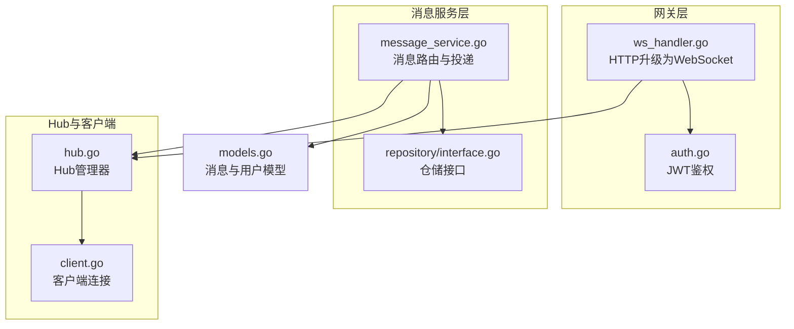
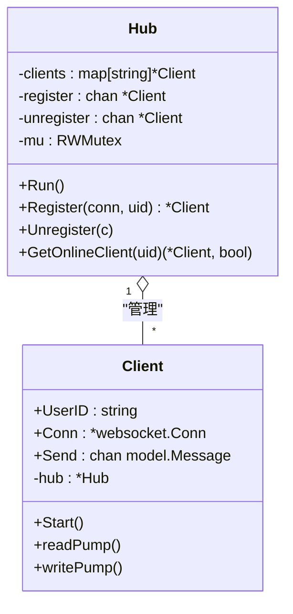
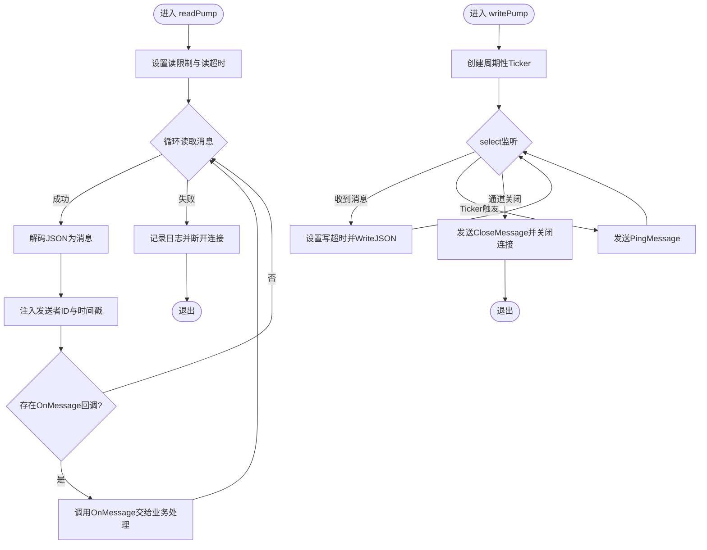
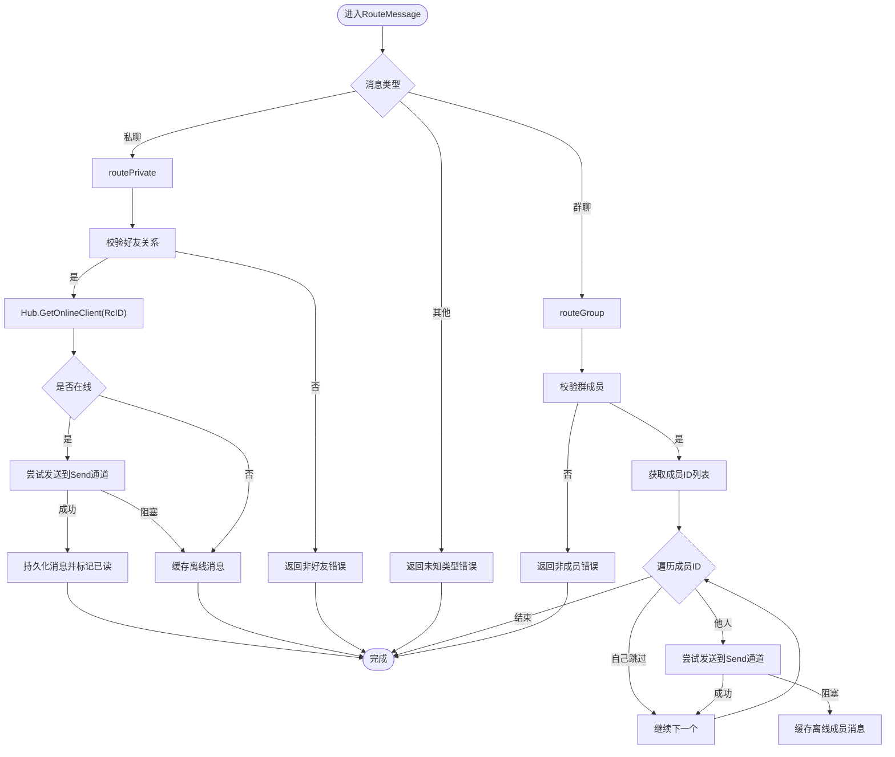
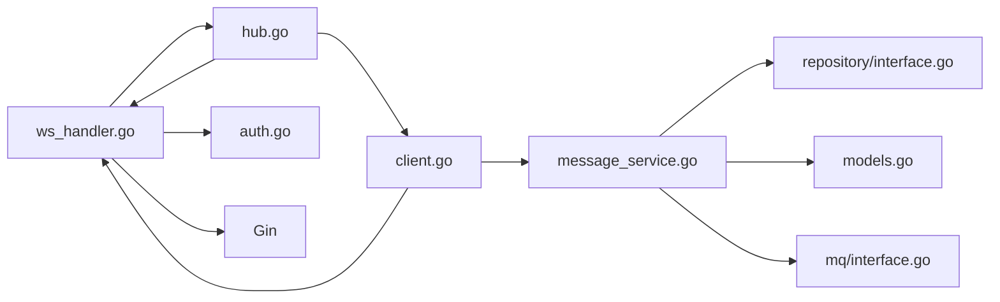

# WebSocket实时通信

<cite>
**本文引用的文件**
- [hub.go](file://server/msgservice/hub/hub.go)
- [client.go](file://server/msgservice/hub/client.go)
- [ws_handler.go](file://server/gateway/api/ws_handler.go)
- [message_service.go](file://server/msgservice/message_service.go)
- [models.go](file://server/model/models.go)
- [auth.go](file://server/gateway/auth/auth.go)
- [interface.go（仓库接口）](file://server/repository/interface.go)
- [interface.go（消息队列接口）](file://server/mq/interface.go)
- [main.txt（示例Hub）](file://main.txt)
</cite>

## 目录
1. [简介](#简介)
2. [项目结构](#项目结构)
3. [核心组件](#核心组件)
4. [架构总览](#架构总览)
5. [详细组件分析](#详细组件分析)
6. [依赖关系分析](#依赖关系分析)
7. [性能考量](#性能考量)
8. [故障排查指南](#故障排查指南)
9. [结论](#结论)
10. [附录](#附录)

## 简介
本技术文档围绕基于 Gorilla WebSocket 的实时通信模块展开，重点阐释 Hub 模式的设计理念与实现细节。内容涵盖：
- Hub 管理器的核心职责：客户端注册/注销、在线状态查询、并发安全控制
- 客户端连接生命周期：握手、读写泵、心跳保活、断线清理
- 消息路由与投递：私聊与群聊的投递策略、离线缓存与回放
- 并发编程最佳实践与内存管理策略
- 完整流程：连接建立、消息处理、断开连接

## 项目结构
该模块位于 server/msgservice/hub，配合网关层 ws_handler、消息服务 message_service、认证 auth 以及模型定义 model，形成端到端的实时通信链路。



图表来源
- [ws_handler.go:30-68](file://server/gateway/api/ws_handler.go#L30-L68)
- [auth.go:36-61](file://server/gateway/auth/auth.go#L36-L61)
- [message_service.go:12-25](file://server/msgservice/message_service.go#L12-L25)
- [hub.go:10-15](file://server/msgservice/hub/hub.go#L10-L15)
- [client.go:12-18](file://server/msgservice/hub/client.go#L12-L18)
- [models.go:23-32](file://server/model/models.go#L23-L32)

章节来源
- [ws_handler.go:30-68](file://server/gateway/api/ws_handler.go#L30-L68)
- [message_service.go:12-25](file://server/msgservice/message_service.go#L12-L25)
- [hub.go:10-15](file://server/msgservice/hub/hub.go#L10-L15)
- [client.go:12-18](file://server/msgservice/hub/client.go#L12-L18)
- [models.go:23-32](file://server/model/models.go#L23-L32)

## 核心组件
- Hub 管理器
  - 职责：维护在线客户端映射、接收注册/注销请求、提供在线查询
  - 关键字段：clients 映射表、register/unregister 通道、互斥锁
  - 关键方法：Run 事件循环、Register/Unregister 注册/注销、GetOnlineClient 查询
- Client 客户端
  - 组成：UserID、WebSocket 连接、发送通道 Send、Hub 引用、OnMessage 回调
  - 行为：Start 启动读写泵；readPump 负责读取与心跳；writePump 负责写入与心跳
- 消息服务
  - 路由：根据消息类型分派到私聊或群聊
  - 投递：优先投递给在线客户端；否则缓存至离线消息
  - 状态：查询在线好友列表

章节来源
- [hub.go:10-60](file://server/msgservice/hub/hub.go#L10-L60)
- [client.go:12-87](file://server/msgservice/hub/client.go#L12-L87)
- [message_service.go:27-108](file://server/msgservice/message_service.go#L27-L108)

## 架构总览
WebSocket 实时通信采用“Hub 中央管理 + 客户端读写泵”的模式。网关层负责鉴权与协议升级，Hub 负责连接管理，客户端负责读写与心跳，消息服务负责业务路由与投递。

```mermaid
sequenceDiagram
participant C as "客户端"
participant GW as "网关(ws_handler)"
participant AU as "认证(auth)"
participant HB as "Hub"
participant CL as "Client"
participant MS as "消息服务"
C->>GW : "HTTP 请求(携带token)"
GW->>AU : "解析JWT"
AU-->>GW : "用户标识(sub)"
GW->>GW : "升级为WebSocket"
GW->>HB : "Register(conn, uid)"
HB-->>CL : "构造Client并返回"
GW->>CL : "Start()"
CL->>CL : "启动readPump/writePump"
CL->>MS : "OnMessage(业务处理)"
MS-->>CL : "通过Send通道下发消息"
CL-->>C : "WriteJSON推送"
CL--/->HB : "断开时Unregister"
```

图表来源
- [ws_handler.go:39-67](file://server/gateway/api/ws_handler.go#L39-L67)
- [auth.go:64-89](file://server/gateway/auth/auth.go#L64-L89)
- [hub.go:44-54](file://server/msgservice/hub/hub.go#L44-L54)
- [client.go:27-30](file://server/msgservice/hub/client.go#L27-L30)
- [message_service.go:27-44](file://server/msgservice/message_service.go#L27-L44)

## 详细组件分析

### Hub 管理器设计与实现
- 结构体设计
  - clients：以用户ID为键的在线客户端映射
  - register/unregister：带缓冲的通道，用于异步注册/注销
  - mu：读写锁，保护 clients 映射的并发访问
- 核心方法
  - Run：事件循环，使用 select 在 register/unregister 间切换，保证并发安全
  - Register：创建 Client 并发送到 register 通道
  - Unregister：发送 Client 到 unregister 通道
  - GetOnlineClient：读锁查询在线客户端
- 并发安全
  - Hub 的事件循环仅在注册/注销路径加写锁，避免阻塞读取
  - GetOnlineClient 使用读锁，提升查询吞吐



图表来源
- [hub.go:10-15](file://server/msgservice/hub/hub.go#L10-L15)
- [client.go:12-18](file://server/msgservice/hub/client.go#L12-L18)

章节来源
- [hub.go:10-60](file://server/msgservice/hub/hub.go#L10-L60)

### Client 结构体与读写泵
- 字段
  - UserID：用户标识
  - Conn：底层 WebSocket 连接
  - Send：发送通道，容量为 256
  - hub：指向 Hub 的引用
  - OnMessage：消息回调，交由上层业务处理
- 行为
  - Start：并发启动读泵与写泵
  - readPump：设置读超时与 Pong 处理，解码消息后注入时间戳与发送者ID，触发 OnMessage
  - writePump：定时 Ping，按需写入消息；遇到错误或关闭信号则清理资源并发送 CloseMessage



图表来源
- [client.go:31-60](file://server/msgservice/hub/client.go#L31-L60)
- [client.go:61-87](file://server/msgservice/hub/client.go#L61-L87)

章节来源
- [client.go:12-87](file://server/msgservice/hub/client.go#L12-L87)

### 消息路由与投递
- 私聊路由
  - 校验双方好友关系
  - 若对方在线：尝试向其 Send 通道投递；默认阻塞时缓存离线
  - 若不在线：直接缓存离线消息
- 群聊路由
  - 校验发送者是否为群成员
  - 获取所有成员ID，逐个尝试投递；成员不包含自己
  - 成员在线则投递，否则缓存离线
- 离线消息
  - 提供查询与标记已读能力
- 在线状态
  - 基于 Hub 的在线表查询好友在线集合



图表来源
- [message_service.go:27-108](file://server/msgservice/message_service.go#L27-L108)
- [hub.go:55-60](file://server/msgservice/hub/hub.go#L55-L60)

章节来源
- [message_service.go:27-108](file://server/msgservice/message_service.go#L27-L108)
- [hub.go:55-60](file://server/msgservice/hub/hub.go#L55-L60)

### WebSocket 连接建立、消息处理与断开流程
- 连接建立
  - 网关层解析 Cookie 中的 token，鉴权通过后进行协议升级
  - 将连接与用户ID注册到 Hub，随后启动 Client 的读写泵
- 消息处理
  - 客户端读泵解码消息，注入发送者与时间戳，回调 OnMessage
  - 业务侧通过消息服务进行路由与投递
- 断开连接
  - 读泵检测到异常或正常关闭，关闭连接并触发 Hub 注销
  - 写泵在定时器或通道关闭时发送 CloseMessage 并清理

```mermaid
sequenceDiagram
participant G as "网关(ws_handler)"
participant A as "认证(auth)"
participant H as "Hub"
participant K as "Client"
participant S as "消息服务"
G->>A : "ParseToken(token)"
A-->>G : "claims(sub)"
G->>G : "Upgrader.Upgrade"
G->>H : "Register(conn, uid)"
H-->>K : "返回Client"
G->>K : "Start()"
K->>K : "readPump循环"
K->>S : "OnMessage(msg)"
S-->>K : "Send通道下发"
K-->>G : "WriteJSON推送"
K--/->H : "readPump异常->Unregister"
```

图表来源
- [ws_handler.go:39-67](file://server/gateway/api/ws_handler.go#L39-L67)
- [auth.go:64-89](file://server/gateway/auth/auth.go#L64-L89)
- [hub.go:44-54](file://server/msgservice/hub/hub.go#L44-L54)
- [client.go:27-30](file://server/msgservice/hub/client.go#L27-L30)
- [client.go:31-60](file://server/msgservice/hub/client.go#L31-L60)

章节来源
- [ws_handler.go:39-67](file://server/gateway/api/ws_handler.go#L39-L67)
- [client.go:31-60](file://server/msgservice/hub/client.go#L31-L60)

## 依赖关系分析
- 组件耦合
  - Hub 与 Client：Hub 管理 Client 生命周期，Client 通过 Hub 注销
  - Client 与消息服务：Client 的 OnMessage 回调交由消息服务处理
  - 消息服务与 Hub：通过在线查询实现精准投递
  - 网关与 Hub：网关负责鉴权与注册，Hub 负责连接管理
- 外部依赖
  - Gorilla WebSocket：提供协议升级与读写能力
  - Gin：提供 HTTP 路由与中间件
  - JWT：提供鉴权能力
  - GORM 仓储接口：抽象数据库操作



图表来源
- [ws_handler.go:30-37](file://server/gateway/api/ws_handler.go#L30-L37)
- [hub.go:10-15](file://server/msgservice/hub/hub.go#L10-L15)
- [client.go:12-18](file://server/msgservice/hub/client.go#L12-L18)
- [message_service.go:12-25](file://server/msgservice/message_service.go#L12-L25)
- [models.go:23-32](file://server/model/models.go#L23-L32)
- [interface.go（仓库接口）:46-55](file://server/repository/interface.go#L46-L55)
- [interface.go（消息队列接口）:4-6](file://server/mq/interface.go#L4-L6)

章节来源
- [ws_handler.go:30-37](file://server/gateway/api/ws_handler.go#L30-L37)
- [message_service.go:12-25](file://server/msgservice/message_service.go#L12-L25)
- [hub.go:10-15](file://server/msgservice/hub/hub.go#L10-L15)
- [client.go:12-18](file://server/msgservice/hub/client.go#L12-L18)
- [models.go:23-32](file://server/model/models.go#L23-L32)
- [interface.go（仓库接口）:46-55](file://server/repository/interface.go#L46-L55)
- [interface.go（消息队列接口）:4-6](file://server/mq/interface.go#L4-L6)

## 性能考量
- 通道缓冲
  - Hub 的 register/unregister 通道分别具备容量 10 与 5，可缓解突发注册/注销压力
  - Client 的 Send 通道容量为 256，减少阻塞概率，但需注意背压与内存占用
- 并发控制
  - Hub 使用读写锁，读多写少场景下提升查询性能
  - 事件循环仅在注册/注销路径加写锁，降低锁竞争
- 心跳与超时
  - 读超时与 Pong 处理确保空闲连接及时回收
  - 写超时与 Ping 定时器维持长连接健康
- 路由优化
  - 在线查询命中后直接投递，避免无效写操作
  - 群聊投递采用 select 默认分支进行非阻塞投递，必要时缓存离线

章节来源
- [hub.go:17-25](file://server/msgservice/hub/hub.go#L17-L25)
- [client.go:20-25](file://server/msgservice/hub/client.go#L20-L25)
- [message_service.go:55-101](file://server/msgservice/message_service.go#L55-L101)

## 故障排查指南
- 连接无法建立
  - 检查网关鉴权逻辑与 Origin 白名单
  - 确认协议升级是否成功
- 读取异常
  - 观察 readPump 日志输出，确认是否为预期关闭
  - 检查消息解码与 JSON 结构一致性
- 写入失败
  - 检查写超时设置与网络状况
  - 确认 Send 通道是否被关闭
- 在线状态异常
  - 确认 Hub 的注册/注销通道是否正常流转
  - 检查读泵退出路径是否正确触发 Unregister

章节来源
- [ws_handler.go:14-28](file://server/gateway/api/ws_handler.go#L14-L28)
- [client.go:31-60](file://server/msgservice/hub/client.go#L31-L60)
- [client.go:61-87](file://server/msgservice/hub/client.go#L61-L87)
- [hub.go:27-43](file://server/msgservice/hub/hub.go#L27-L43)

## 结论
本模块以 Hub 为中心，结合 Gorilla WebSocket 的读写泵与心跳机制，实现了高并发、低耦合的实时通信方案。通过通道与锁的合理运用，既保证了连接管理的稳定性，又提升了消息投递的效率。建议在生产环境中进一步完善：
- 全局 Hub 单例化与生命周期管理
- 发送通道背压监控与限流策略
- 离线消息的批量回放与幂等处理
- 更细粒度的指标采集与告警

## 附录
- 数据模型
  - Message：包含消息ID、发送者ID、接收者ID、内容、类型、时间戳、是否已读等字段
- 参考实现对比
  - main.txt 展示了另一种 Hub 设计（以 Client 为键），便于理解不同实现思路

章节来源
- [models.go:23-32](file://server/model/models.go#L23-L32)
- [main.txt:27-73](file://main.txt#L27-L73)