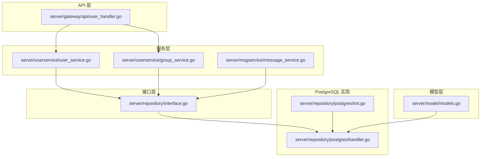
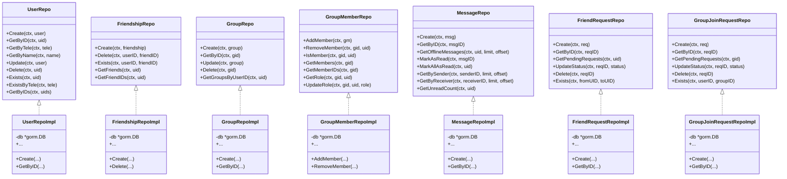
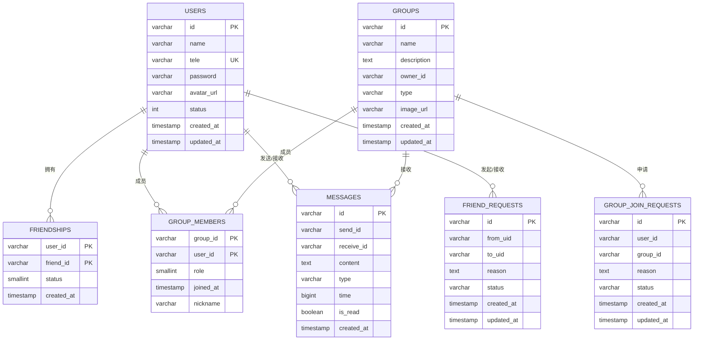
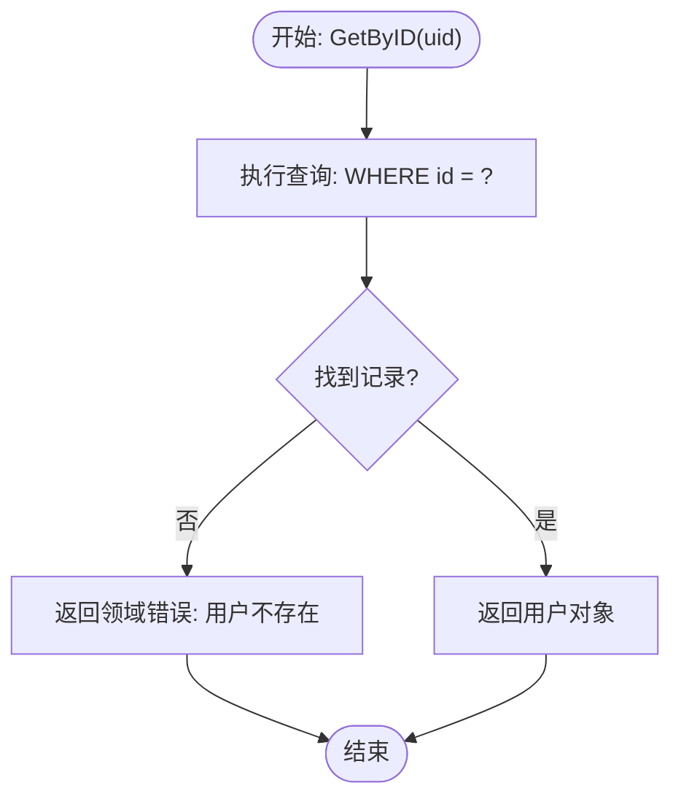
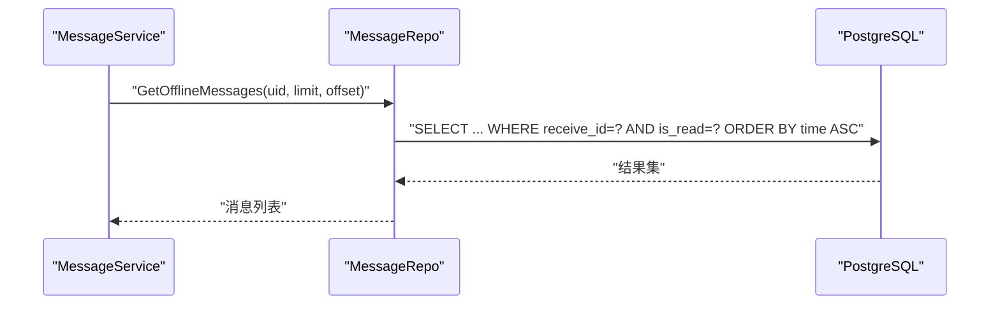
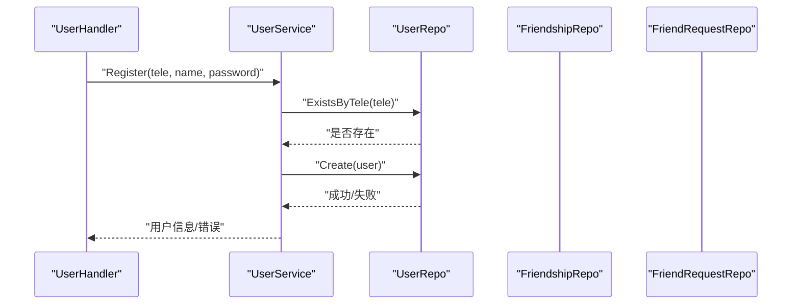
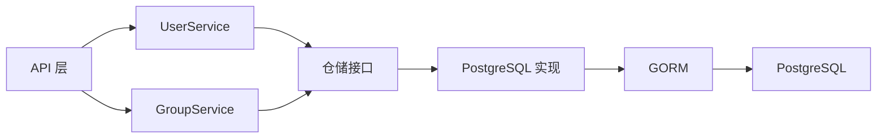

# 数据访问层

<cite>
**本文引用的文件**
- [server/repository/interface.go](file://server/repository/interface.go)
- [server/repository/postgres/init.go](file://server/repository/postgres/init.go)
- [server/repository/postgres/handler.go](file://server/repository/postgres/handler.go)
- [server/model/models.go](file://server/model/models.go)
- [server/userservice/user_service.go](file://server/userservice/user_service.go)
- [server/userservice/group_service.go](file://server/userservice/group_service.go)
- [server/msgservice/message_service.go](file://server/msgservice/message_service.go)
- [server/gateway/api/user_handler.go](file://server/gateway/api/user_handler.go)
- [go.mod](file://go.mod)
</cite>

## 目录
1. [引言](#引言)
2. [项目结构](#项目结构)
3. [核心组件](#核心组件)
4. [架构总览](#架构总览)
5. [详细组件分析](#详细组件分析)
6. [依赖分析](#依赖分析)
7. [性能考虑](#性能考虑)
8. [故障排查指南](#故障排查指南)
9. [结论](#结论)
10. [附录](#附录)

## 引言
本文件面向数据访问层（Repository）进行全面技术文档化，重点覆盖以下方面：
- 接口设计模式：Repository 接口抽象、依赖注入与可替换存储后端能力
- PostgreSQL 实现细节：连接管理、SQL 查询优化、事务处理与迁移策略
- 数据模型定义：User、Message、Group 等核心实体的关系与约束
- 访问方法实现：CRUD 操作、查询优化与批量处理
- 数据一致性、性能调优与扩展性设计
- 监控、备份与故障处理建议

## 项目结构
数据访问层位于 server/repository 目录，采用接口+实现分离的设计，并提供基于 GORM 的 PostgreSQL 实现。模型定义位于 server/model，业务服务位于 server/userservice 与 server/msgservice，API 层位于 server/gateway/api。

图表来源
- [server/repository/interface.go:1-74](file://server/repository/interface.go#L1-L74)
- [server/repository/postgres/init.go:1-75](file://server/repository/postgres/init.go#L1-L75)
- [server/repository/postgres/handler.go:1-585](file://server/repository/postgres/handler.go#L1-L585)
- [server/model/models.go:1-146](file://server/model/models.go#L1-L146)
- [server/userservice/user_service.go:1-187](file://server/userservice/user_service.go#L1-L187)
- [server/userservice/group_service.go:1-217](file://server/userservice/group_service.go#L1-L217)
- [server/msgservice/message_service.go:1-168](file://server/msgservice/message_service.go#L1-L168)
- [server/gateway/api/user_handler.go:1-206](file://server/gateway/api/user_handler.go#L1-L206)

章节来源
- [server/repository/interface.go:1-74](file://server/repository/interface.go#L1-L74)
- [server/repository/postgres/init.go:1-75](file://server/repository/postgres/init.go#L1-L75)
- [server/repository/postgres/handler.go:1-585](file://server/repository/postgres/handler.go#L1-L585)
- [server/model/models.go:1-146](file://server/model/models.go#L1-L146)
- [server/userservice/user_service.go:1-187](file://server/userservice/user_service.go#L1-L187)
- [server/userservice/group_service.go:1-217](file://server/userservice/group_service.go#L1-L217)
- [server/msgservice/message_service.go:1-168](file://server/msgservice/message_service.go#L1-L168)
- [server/gateway/api/user_handler.go:1-206](file://server/gateway/api/user_handler.go#L1-L206)

## 核心组件
- 接口层：定义用户、好友、群组、消息、请求等仓储接口，统一抽象数据访问能力
- PostgreSQL 实现：基于 GORM 提供具体实现，包含连接配置、连接池设置与自动迁移
- 模型层：定义 User、Group、Message、Friendship、GroupMember、FriendRequest、GroupJoinRequest 及其表名与索引
- 服务层：UserService、GroupService、MessageService 通过接口依赖进行数据访问
- API 层：UserHandler 将路由请求委派给服务层，间接使用仓储

章节来源
- [server/repository/interface.go:8-74](file://server/repository/interface.go#L8-L74)
- [server/repository/postgres/init.go:15-74](file://server/repository/postgres/init.go#L15-L74)
- [server/model/models.go:23-146](file://server/model/models.go#L23-L146)
- [server/userservice/user_service.go:13-25](file://server/userservice/user_service.go#L13-L25)
- [server/userservice/group_service.go:11-25](file://server/userservice/group_service.go#L11-L25)
- [server/msgservice/message_service.go:12-25](file://server/msgservice/message_service.go#L12-L25)
- [server/gateway/api/user_handler.go:12-19](file://server/gateway/api/user_handler.go#L12-L19)

## 架构总览
数据访问层采用“接口隔离 + 具体实现”的分层设计，接口层不依赖具体实现，便于未来替换为其他存储后端（如 MySQL、MongoDB）。PostgreSQL 实现通过 GORM 进行 ORM 映射与 SQL 执行，结合连接池参数控制并发与生命周期。

图表来源
- [server/repository/interface.go:8-74](file://server/repository/interface.go#L8-L74)
- [server/repository/postgres/handler.go:21-585](file://server/repository/postgres/handler.go#L21-L585)

## 详细组件分析

### 接口设计与依赖注入
- 接口职责清晰：按领域划分用户、好友、群组、消息、请求等仓储接口，每个接口仅暴露必要的数据访问方法
- 依赖注入：服务层构造函数接收接口类型，通过外部容器或手动组装注入具体实现，实现解耦与可测试性
- 多存储后端支持：接口层不变，只需新增实现即可切换到其他存储（例如通过适配器模式或工厂模式）

章节来源
- [server/userservice/user_service.go:19-25](file://server/userservice/user_service.go#L19-L25)
- [server/userservice/group_service.go:18-25](file://server/userservice/group_service.go#L18-L25)
- [server/msgservice/message_service.go:19-25](file://server/msgservice/message_service.go#L19-L25)

### PostgreSQL 连接与迁移
- 配置加载：从环境变量读取主机、端口、用户名、密码、数据库名与 SSL 模式，提供默认值
- 连接建立：使用 GORM 打开 PostgreSQL 连接，启用日志级别为 Info
- 连接池：设置最大空闲连接数、最大打开连接数与连接最大生命周期
- 自动迁移：对用户、群组、消息表执行 AutoMigrate，确保表结构与模型一致

章节来源
- [server/repository/postgres/init.go:24-65](file://server/repository/postgres/init.go#L24-L65)
- [server/repository/postgres/init.go:67-74](file://server/repository/postgres/init.go#L67-L74)

### 数据模型与关系
- 用户（User）：主键 ID，唯一索引电话 Tele，索引名称 Name；包含好友与群组的多对多关联
- 群组（Group）：主键 ID，索引名称 Name，拥有者 OwnerID；包含所有者与成员的多对多关联
- 好友关系（Friendship）：联合主键（用户ID、好友ID），状态字段，自动时间戳
- 群成员（GroupMember）：联合主键（群ID、用户ID），角色字段与加入时间
- 消息（Message）：主键 ID，发送方与接收方索引，内容、类型、时间戳、已读标记
- 好友请求（FriendRequest）：主键 ID，来源与目标用户索引，状态与时间戳
- 群组请求（GroupJoinRequest）：主键 ID，用户与群组索引，状态与时间戳

图表来源
- [server/model/models.go:23-146](file://server/model/models.go#L23-L146)

章节来源
- [server/model/models.go:23-146](file://server/model/models.go#L23-L146)

### 用户仓储实现（UserRepo）
- CRUD：Create、GetByID、GetByTele、GetByName、Update、Delete
- 存在性检查：Exists、ExistsByTele
- 批量查询：GetByIDs
- 错误处理：针对记录不存在返回领域错误，其他异常包装为带上下文的错误

图表来源
- [server/repository/postgres/handler.go:33-43](file://server/repository/postgres/handler.go#L33-L43)

章节来源
- [server/repository/postgres/handler.go:29-116](file://server/repository/postgres/handler.go#L29-L116)

### 好友关系仓储实现（FriendshipRepo）
- 创建与删除：Create、Delete（支持双向删除）
- 存在性检查：Exists（双向条件）
- 查询：GetFriends（通过 JOIN 获取好友）、GetFriendIDs（Pluck）

章节来源
- [server/repository/postgres/handler.go:126-177](file://server/repository/postgres/handler.go#L126-L177)

### 群组仓储实现（GroupRepo）
- CRUD：Create、GetByID、Update、Delete
- 查询：GetGroupsByUserID（通过 LEFT JOIN 与 OR 条件聚合拥有与成员身份）

章节来源
- [server/repository/postgres/handler.go:187-237](file://server/repository/postgres/handler.go#L187-L237)

### 群成员仓储实现（GroupMemberRepo）
- 成员管理：AddMember、RemoveMember、IsMember
- 查询：GetMembers、GetMemberIDs、GetRole、UpdateRole

章节来源
- [server/repository/postgres/handler.go:247-325](file://server/repository/postgres/handler.go#L247-L325)

### 消息仓储实现（MessageRepo）
- 创建：Create（若未指定 ID 则生成带时间戳的 ID）
- 查询：GetByID、GetOfflineMessages（按时间升序分页）、GetBySender、GetByReceiver（按时间降序分页）
- 标记：MarkAsRead、MarkAllAsRead
- 统计：GetUnreadCount

图表来源
- [server/repository/postgres/handler.go:354-372](file://server/repository/postgres/handler.go#L354-L372)
- [server/msgservice/message_service.go:128-146](file://server/msgservice/message_service.go#L128-L146)

章节来源
- [server/repository/postgres/handler.go:335-438](file://server/repository/postgres/handler.go#L335-L438)

### 请求仓储实现（FriendRequestRepo、GroupJoinRequestRepo）
- 创建、查询、更新状态、删除、存在性检查
- 状态常量：FriendRequestPending/Accepted/Rejected，GroupJoinRequestPending/Accepted/Rejected

章节来源
- [server/repository/postgres/handler.go:448-511](file://server/repository/postgres/handler.go#L448-L511)
- [server/repository/postgres/handler.go:521-584](file://server/repository/postgres/handler.go#L521-L584)
- [server/model/models.go:121-145](file://server/model/models.go#L121-L145)

### 服务层与仓储的协作
- UserService：注册、登录、好友增删、好友请求处理
- GroupService：群组创建、加入/离开、成员管理、角色变更
- MessageService：消息路由（私聊/群聊）、离线缓存、在线状态查询

图表来源
- [server/gateway/api/user_handler.go:21-37](file://server/gateway/api/user_handler.go#L21-L37)
- [server/userservice/user_service.go:27-54](file://server/userservice/user_service.go#L27-L54)
- [server/repository/postgres/handler.go:29-116](file://server/repository/postgres/handler.go#L29-L116)

章节来源
- [server/userservice/user_service.go:27-187](file://server/userservice/user_service.go#L27-L187)
- [server/userservice/group_service.go:27-217](file://server/userservice/group_service.go#L27-L217)
- [server/msgservice/message_service.go:27-168](file://server/msgservice/message_service.go#L27-L168)
- [server/gateway/api/user_handler.go:21-206](file://server/gateway/api/user_handler.go#L21-L206)

## 依赖分析
- 依赖方向：API 层 -> 服务层 -> 仓储接口 -> PostgreSQL 实现 -> GORM -> PostgreSQL
- 外部依赖：GORM、PostgreSQL 驱动、Gin、WebSocket、bcrypt
- 耦合度：接口层与实现层松耦合，服务层通过接口依赖，便于替换实现

图表来源
- [server/gateway/api/user_handler.go:12-19](file://server/gateway/api/user_handler.go#L12-L19)
- [server/userservice/user_service.go:13-25](file://server/userservice/user_service.go#L13-L25)
- [server/userservice/group_service.go:11-25](file://server/userservice/group_service.go#L11-L25)
- [server/repository/interface.go:8-74](file://server/repository/interface.go#L8-L74)
- [server/repository/postgres/handler.go:21-585](file://server/repository/postgres/handler.go#L21-L585)
- [go.mod:5-12](file://go.mod#L5-L12)

章节来源
- [go.mod:5-12](file://go.mod#L5-L12)
- [server/repository/postgres/handler.go:13-19](file://server/repository/postgres/handler.go#L13-L19)

## 性能考虑
- 连接池参数：最大空闲连接、最大打开连接、连接最大生命周期已在初始化中设置，有助于控制资源与并发
- 查询优化：
  - 使用索引列进行过滤（如用户 Tele、消息 receive_id/is_read/type/time 等）
  - 分页查询通过 Limit/Offset 控制结果规模
  - 批量查询使用 IN 条件（GetByIDs）
- 写入优化：消息创建时若未提供 ID，使用时间戳拼接生成 ID，避免额外查询
- 事务处理：当前实现未显式开启事务；对于需要强一致性的复合写入（如好友关系创建），建议在服务层封装事务以保证原子性

章节来源
- [server/repository/postgres/init.go:59-61](file://server/repository/postgres/init.go#L59-L61)
- [server/repository/postgres/handler.go:109-116](file://server/repository/postgres/handler.go#L109-L116)
- [server/repository/postgres/handler.go:354-372](file://server/repository/postgres/handler.go#L354-L372)
- [server/repository/postgres/handler.go:388-426](file://server/repository/postgres/handler.go#L388-L426)

## 故障排查指南
- 连接失败：检查环境变量 DB_HOST/DB_PORT/DB_USER/DB_PASSWORD/DB_NAME/DB_SSLMODE 是否正确；确认 PostgreSQL 服务可达
- 迁移失败：确认数据库具备 AutoMigrate 权限；检查模型字段与表结构差异
- 查询异常：关注错误包装信息，区分“记录不存在”与“其他数据库错误”
- 登录/注册失败：核对密码哈希流程与数据库中密码字段是否匹配
- 离线消息未读：确认消息 is_read 字段更新逻辑与查询条件

章节来源
- [server/repository/postgres/init.go:24-65](file://server/repository/postgres/init.go#L24-L65)
- [server/repository/postgres/init.go:67-74](file://server/repository/postgres/init.go#L67-L74)
- [server/repository/postgres/handler.go:374-386](file://server/repository/postgres/handler.go#L374-L386)
- [server/userservice/user_service.go:56-67](file://server/userservice/user_service.go#L56-L67)

## 结论
本数据访问层通过清晰的接口抽象与 GORM 的 PostgreSQL 实现，提供了稳定的数据持久化能力。接口与实现分离的设计便于未来扩展至其他存储后端；模型层面的索引与关系映射为查询优化奠定基础。建议在服务层引入事务以提升一致性，并持续优化查询与连接池参数以满足高并发场景。

## 附录
- 数据库初始化与迁移：在应用启动时加载配置并执行 AutoMigrate
- 环境变量：DB_HOST、DB_PORT、DB_USER、DB_PASSWORD、DB_NAME、DB_SSLMODE
- 依赖声明：GORM、PostgreSQL 驱动、Gin、WebSocket、bcrypt

章节来源
- [server/repository/postgres/init.go:24-74](file://server/repository/postgres/init.go#L24-L74)
- [go.mod:5-12](file://go.mod#L5-L12)