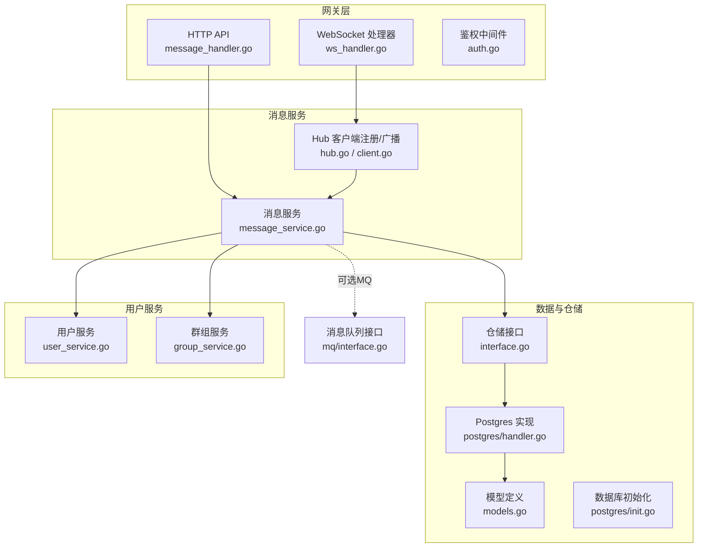
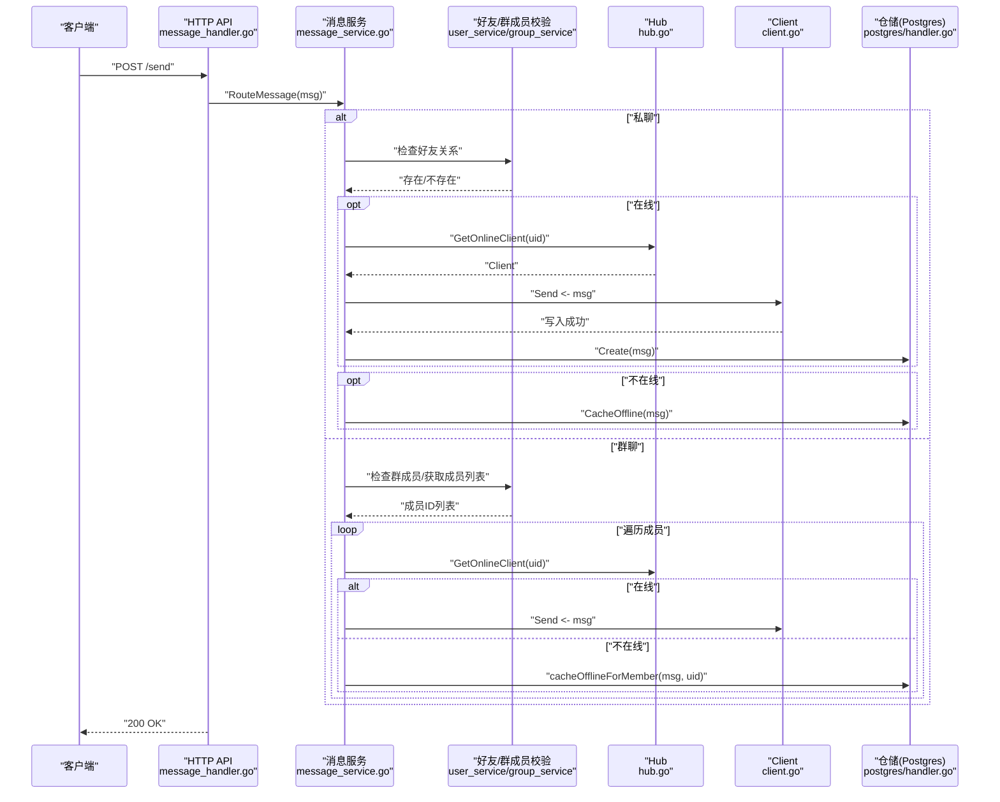
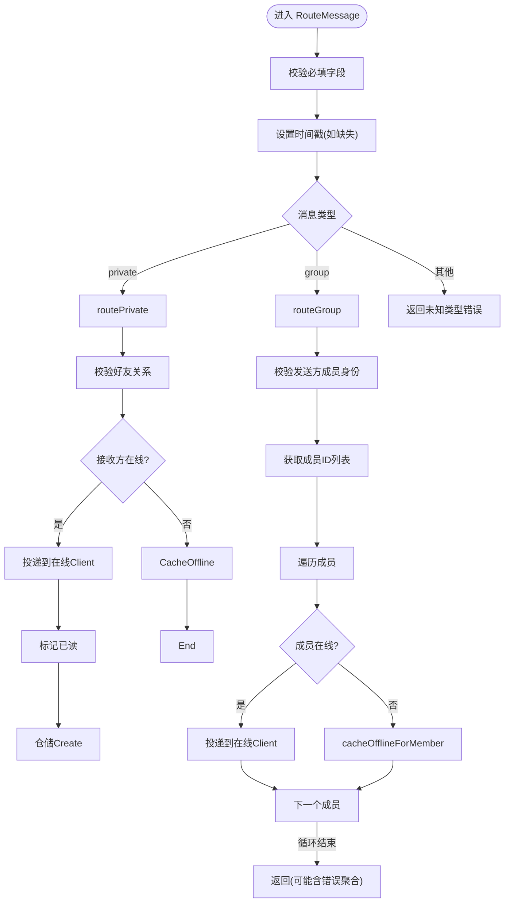
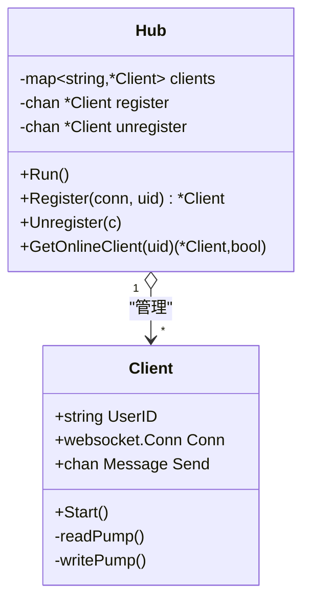
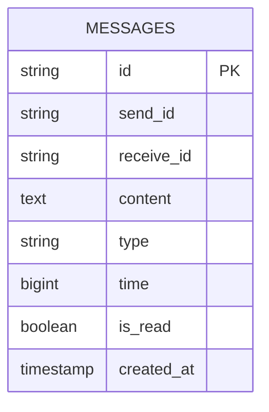
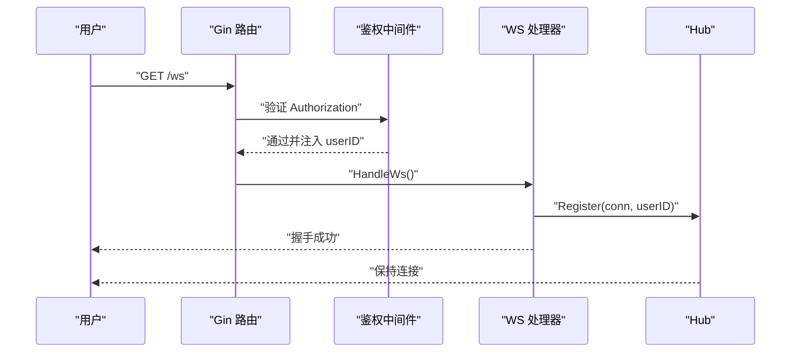
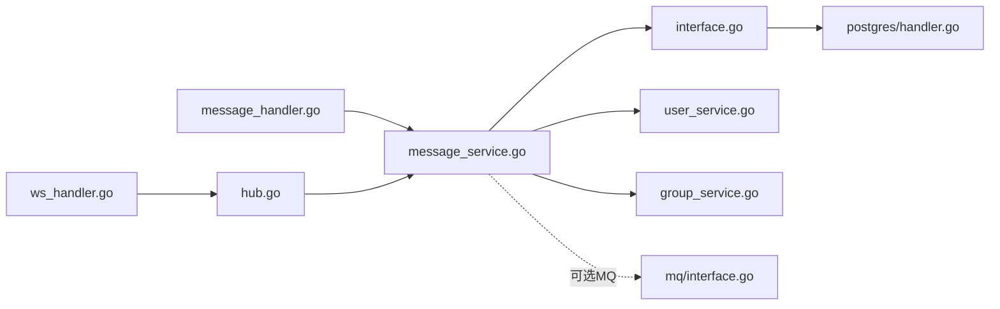

# 消息服务

<cite>
**本文引用的文件**
- [server/msgservice/message_service.go](file://server/msgservice/message_service.go)
- [server/msgservice/hub/hub.go](file://server/msgservice/hub/hub.go)
- [server/msgservice/hub/client.go](file://server/msgservice/hub/client.go)
- [server/model/models.go](file://server/model/models.go)
- [server/repository/interface.go](file://server/repository/interface.go)
- [server/repository/postgres/handler.go](file://server/repository/postgres/handler.go)
- [server/repository/postgres/init.go](file://server/repository/postgres/init.go)
- [server/mq/interface.go](file://server/mq/interface.go)
- [server/userservice/user_service.go](file://server/userservice/user_service.go)
- [server/userservice/group_service.go](file://server/userservice/group_service.go)
- [server/gateway/api/message_handler.go](file://server/gateway/api/message_handler.go)
- [server/gateway/api/ws_handler.go](file://server/gateway/api/ws_handler.go)
- [server/gateway/auth/auth.go](file://server/gateway/auth/auth.go)
</cite>

## 目录
1. [简介](#简介)
2. [项目结构](#项目结构)
3. [核心组件](#核心组件)
4. [架构总览](#架构总览)
5. [详细组件分析](#详细组件分析)
6. [依赖关系分析](#依赖关系分析)
7. [性能考量](#性能考量)
8. [故障排查指南](#故障排查指南)
9. [结论](#结论)
10. [附录](#附录)

## 简介
本技术文档围绕消息服务模块进行系统化梳理，重点阐释消息路由逻辑（私聊与群聊）、消息接收/路由/投递/存储全流程、消息格式与类型、消息状态管理、离线消息处理机制（缓存、推送策略、已读跟踪），以及消息处理器接口设计与实现细节。同时给出可靠性保障、性能优化与扩展性建议，并覆盖监控指标与故障恢复策略。

## 项目结构
消息服务位于 server/msgservice 目录，配合网关层 API、WebSocket 连接中枢 Hub、仓库层 Postgres 实现、用户服务与模型定义共同构成完整的消息子系统。

图示来源
- [server/gateway/api/message_handler.go:1-66](file://server/gateway/api/message_handler.go#L1-L66)
- [server/gateway/api/ws_handler.go:1-69](file://server/gateway/api/ws_handler.go#L1-L69)
- [server/gateway/auth/auth.go:1-91](file://server/gateway/auth/auth.go#L1-L91)
- [server/msgservice/message_service.go:1-168](file://server/msgservice/message_service.go#L1-L168)
- [server/msgservice/hub/hub.go:1-61](file://server/msgservice/hub/hub.go#L1-L61)
- [server/msgservice/hub/client.go:1-88](file://server/msgservice/hub/client.go#L1-L88)
- [server/model/models.go:1-146](file://server/model/models.go#L1-L146)
- [server/repository/interface.go:1-74](file://server/repository/interface.go#L1-L74)
- [server/repository/postgres/handler.go:1-585](file://server/repository/postgres/handler.go#L1-L585)
- [server/repository/postgres/init.go:1-75](file://server/repository/postgres/init.go#L1-L75)
- [server/userservice/user_service.go:1-187](file://server/userservice/user_service.go#L1-L187)
- [server/userservice/group_service.go:1-217](file://server/userservice/group_service.go#L1-L217)
- [server/mq/interface.go:1-7](file://server/mq/interface.go#L1-L7)

章节来源
- [server/msgservice/message_service.go:1-168](file://server/msgservice/message_service.go#L1-L168)
- [server/msgservice/hub/hub.go:1-61](file://server/msgservice/hub/hub.go#L1-L61)
- [server/msgservice/hub/client.go:1-88](file://server/msgservice/hub/client.go#L1-L88)
- [server/model/models.go:1-146](file://server/model/models.go#L1-L146)
- [server/repository/interface.go:1-74](file://server/repository/interface.go#L1-L74)
- [server/repository/postgres/handler.go:1-585](file://server/repository/postgres/handler.go#L1-L585)
- [server/repository/postgres/init.go:1-75](file://server/repository/postgres/init.go#L1-L75)
- [server/mq/interface.go:1-7](file://server/mq/interface.go#L1-L7)
- [server/userservice/user_service.go:1-187](file://server/userservice/user_service.go#L1-L187)
- [server/userservice/group_service.go:1-217](file://server/userservice/group_service.go#L1-L217)
- [server/gateway/api/message_handler.go:1-66](file://server/gateway/api/message_handler.go#L1-L66)
- [server/gateway/api/ws_handler.go:1-69](file://server/gateway/api/ws_handler.go#L1-L69)
- [server/gateway/auth/auth.go:1-91](file://server/gateway/auth/auth.go#L1-L91)

## 核心组件
- 消息服务 MessageService：负责消息路由、私聊/群聊分支、在线投递、离线缓存、离线消息拉取与已读标记、在线状态查询等。
- Hub 与 Client：维护在线客户端集合，负责读写循环、心跳保活、消息发送通道。
- 仓储层：抽象接口与 Postgres 实现，提供消息持久化、离线消息查询与批量已读标记、按条件查询等。
- 用户/群组服务：提供好友关系校验、群成员校验、成员列表等前置能力。
- 网关 API：HTTP 接口用于发送消息、拉取离线消息、查询在线状态；WebSocket 升级与连接注册到 Hub。
- 模型定义：统一的消息结构体及错误常量，确保跨层一致的数据契约。

章节来源
- [server/msgservice/message_service.go:12-25](file://server/msgservice/message_service.go#L12-L25)
- [server/msgservice/hub/hub.go:10-25](file://server/msgservice/hub/hub.go#L10-L25)
- [server/msgservice/hub/client.go:12-18](file://server/msgservice/hub/client.go#L12-L18)
- [server/repository/interface.go:46-55](file://server/repository/interface.go#L46-L55)
- [server/repository/postgres/handler.go:327-438](file://server/repository/postgres/handler.go#L327-L438)
- [server/model/models.go:23-36](file://server/model/models.go#L23-L36)

## 架构总览
消息从网关进入后，经鉴权与参数绑定，进入消息服务进行路由决策。私聊走好友关系校验与在线直发或离线缓存；群聊走成员校验与逐个成员投递或离线缓存。在线用户通过 Hub 的 Client 发送通道直接投递，离线用户由仓储层缓存并在上线或主动拉取时恢复。

图示来源
- [server/gateway/api/message_handler.go:19-44](file://server/gateway/api/message_handler.go#L19-L44)
- [server/msgservice/message_service.go:27-108](file://server/msgservice/message_service.go#L27-L108)
- [server/msgservice/hub/hub.go:55-60](file://server/msgservice/hub/hub.go#L55-L60)
- [server/msgservice/hub/client.go:71-86](file://server/msgservice/hub/client.go#L71-L86)
- [server/repository/postgres/handler.go:335-340](file://server/repository/postgres/handler.go#L335-L340)
- [server/userservice/user_service.go:184-186](file://server/userservice/user_service.go#L184-L186)
- [server/userservice/group_service.go:164-166](file://server/userservice/group_service.go#L164-L166)

## 详细组件分析

### 消息服务 MessageService
- 路由入口 RouteMessage：校验必填字段，设置时间戳，按消息类型分派至私聊或群聊分支。
- 私聊路由 routePrivate：校验好友关系，若接收方在线则直接投递并标记已读，否则缓存离线；若不在线也缓存离线。
- 群聊路由 routeGroup：校验发送方群成员身份，获取成员列表，逐个成员尝试在线投递，不在线则缓存离线；聚合投递失败统计。
- 离线缓存 CacheOffline 与 cacheOfflineForMember：统一写入仓储，生成带唯一ID的消息副本以区分不同成员。
- 离线消息拉取 GetOfflineMsgs：按接收人查询未读消息并批量标记已读。
- 在线状态查询 GetOnlineStatus：基于 Hub 查询好友在线集合。

图示来源
- [server/msgservice/message_service.go:27-108](file://server/msgservice/message_service.go#L27-L108)
- [server/msgservice/message_service.go:123-126](file://server/msgservice/message_service.go#L123-L126)
- [server/msgservice/message_service.go:110-121](file://server/msgservice/message_service.go#L110-L121)
- [server/msgservice/message_service.go:128-146](file://server/msgservice/message_service.go#L128-L146)
- [server/msgservice/message_service.go:148-167](file://server/msgservice/message_service.go#L148-L167)

章节来源
- [server/msgservice/message_service.go:27-167](file://server/msgservice/message_service.go#L27-L167)

### Hub 与 Client
- Hub：维护在线客户端映射，支持注册/注销通道，内部协程循环处理注册/注销事件。
- Client：读循环解析 JSON 消息、注入发送者ID与时间戳、回调业务处理；写循环定时 Ping、阻塞发送消息、超时控制。

图示来源
- [server/msgservice/hub/hub.go:10-60](file://server/msgservice/hub/hub.go#L10-L60)
- [server/msgservice/hub/client.go:12-87](file://server/msgservice/hub/client.go#L12-L87)

章节来源
- [server/msgservice/hub/hub.go:17-60](file://server/msgservice/hub/hub.go#L17-L60)
- [server/msgservice/hub/client.go:27-87](file://server/msgservice/hub/client.go#L27-L87)

### 仓储层与数据库
- 仓储接口：定义消息增删改查、离线消息查询与批量已读标记、按发送/接收方查询等。
- Postgres 实现：消息表自动迁移、消息创建、离线查询、批量已读、按发送/接收方查询、未读计数等。
- 数据模型：消息结构包含消息ID、发送者ID、接收者ID、内容、类型、时间戳、是否已读、创建时间等。

图示来源
- [server/model/models.go:23-36](file://server/model/models.go#L23-L36)
- [server/repository/postgres/handler.go:327-438](file://server/repository/postgres/handler.go#L327-L438)
- [server/repository/postgres/init.go:67-74](file://server/repository/postgres/init.go#L67-L74)

章节来源
- [server/repository/interface.go:46-55](file://server/repository/interface.go#L46-L55)
- [server/repository/postgres/handler.go:335-438](file://server/repository/postgres/handler.go#L335-L438)
- [server/model/models.go:23-36](file://server/model/models.go#L23-L36)

### 网关与鉴权
- HTTP API：发送消息、拉取离线消息、查询在线状态。
- WebSocket：升级连接、鉴权、注册到 Hub 并启动读写循环。
- 鉴权中间件：Bearer Token 校验，注入用户信息。

图示来源
- [server/gateway/api/ws_handler.go:39-68](file://server/gateway/api/ws_handler.go#L39-L68)
- [server/gateway/auth/auth.go:37-61](file://server/gateway/auth/auth.go#L37-L61)

章节来源
- [server/gateway/api/message_handler.go:19-65](file://server/gateway/api/message_handler.go#L19-L65)
- [server/gateway/api/ws_handler.go:39-68](file://server/gateway/api/ws_handler.go#L39-L68)
- [server/gateway/auth/auth.go:37-90](file://server/gateway/auth/auth.go#L37-L90)

### 消息格式、类型与状态
- 消息结构：包含消息ID、发送者ID、接收者ID、内容、类型、时间戳、是否已读、创建时间等。
- 类型：私聊("private")与群聊("group")两类；默认时间戳在路由阶段补齐。
- 状态：is_read 字段用于表示是否已读；离线消息默认未读，拉取后批量标记已读。

章节来源
- [server/model/models.go:23-36](file://server/model/models.go#L23-L36)
- [server/msgservice/message_service.go:36-44](file://server/msgservice/message_service.go#L36-L44)
- [server/msgservice/message_service.go:123-126](file://server/msgservice/message_service.go#L123-L126)
- [server/msgservice/message_service.go:128-146](file://server/msgservice/message_service.go#L128-L146)

### 离线消息处理机制
- 缓存策略：私聊与群聊均在无法在线投递时写入仓储；群聊为每个成员生成独立副本以区分接收人。
- 推送策略：上线后或主动拉取离线消息时触发；拉取后批量标记已读。
- 已读状态跟踪：仓储提供单条与批量已读标记接口，消息服务在拉取后执行批量标记。

章节来源
- [server/msgservice/message_service.go:110-121](file://server/msgservice/message_service.go#L110-L121)
- [server/msgservice/message_service.go:123-126](file://server/msgservice/message_service.go#L123-L126)
- [server/msgservice/message_service.go:128-146](file://server/msgservice/message_service.go#L128-L146)
- [server/repository/postgres/handler.go:354-386](file://server/repository/postgres/handler.go#L354-L386)

### 消息处理器接口设计
- HTTP 接口：发送消息、拉取离线消息、查询在线状态。
- WebSocket 接口：升级连接、鉴权、注册到 Hub。
- 业务处理：消息服务作为核心编排者，调用仓储与 Hub 完成路由与投递。

章节来源
- [server/gateway/api/message_handler.go:19-65](file://server/gateway/api/message_handler.go#L19-L65)
- [server/gateway/api/ws_handler.go:39-68](file://server/gateway/api/ws_handler.go#L39-L68)
- [server/msgservice/message_service.go:27-108](file://server/msgservice/message_service.go#L27-L108)

## 依赖关系分析
- 消息服务依赖仓储接口与 Hub；仓储接口由 Postgres 实现；用户/群组服务提供前置校验。
- 网关层依赖消息服务；WebSocket 通过 Hub 与消息服务解耦。
- MQ 接口预留扩展点，可接入异步消息队列以提升吞吐与削峰。

图示来源
- [server/gateway/api/message_handler.go:19-44](file://server/gateway/api/message_handler.go#L19-L44)
- [server/gateway/api/ws_handler.go:39-68](file://server/gateway/api/ws_handler.go#L39-L68)
- [server/msgservice/message_service.go:12-25](file://server/msgservice/message_service.go#L12-L25)
- [server/repository/interface.go:46-55](file://server/repository/interface.go#L46-L55)
- [server/repository/postgres/handler.go:327-438](file://server/repository/postgres/handler.go#L327-L438)
- [server/userservice/user_service.go:184-186](file://server/userservice/user_service.go#L184-L186)
- [server/userservice/group_service.go:164-166](file://server/userservice/group_service.go#L164-L166)
- [server/mq/interface.go:4-6](file://server/mq/interface.go#L4-L6)

章节来源
- [server/msgservice/message_service.go:12-25](file://server/msgservice/message_service.go#L12-L25)
- [server/repository/interface.go:46-55](file://server/repository/interface.go#L46-L55)
- [server/repository/postgres/handler.go:327-438](file://server/repository/postgres/handler.go#L327-L438)
- [server/userservice/user_service.go:184-186](file://server/userservice/user_service.go#L184-L186)
- [server/userservice/group_service.go:164-166](file://server/userservice/group_service.go#L164-L166)
- [server/mq/interface.go:4-6](file://server/mq/interface.go#L4-L6)

## 性能考量
- 通道背压与缓冲：Client.Send 使用带缓冲通道，避免阻塞写循环；Hub 注册/注销通道具备容量限制，防止内存膨胀。
- 批量操作：离线消息拉取后批量标记已读，减少多次写操作。
- 查询索引：消息表按发送者/接收者/时间/是否已读建立索引，支撑高频查询。
- 连接保活：WebSocket 写循环定时 Ping，读循环设置超时与 Pong 处理，降低僵尸连接占用。
- 数据库连接池：Postgres 初始化设置最大空闲/打开连接数与生命周期，提升并发稳定性。
- 可选异步队列：通过 MQ 接口引入消息队列，将路由与投递解耦，提升高并发下的吞吐与削峰能力。

章节来源
- [server/msgservice/hub/client.go:20-25](file://server/msgservice/hub/client.go#L20-L25)
- [server/msgservice/hub/hub.go:17-25](file://server/msgservice/hub/hub.go#L17-L25)
- [server/repository/postgres/handler.go:381-386](file://server/repository/postgres/handler.go#L381-L386)
- [server/repository/postgres/init.go:59-64](file://server/repository/postgres/init.go#L59-L64)
- [server/mq/interface.go:4-6](file://server/mq/interface.go#L4-L6)

## 故障排查指南
- 常见错误类型：用户/好友/群组/消息不存在、权限不足、未知消息类型、投递失败等。
- 私聊失败：检查好友关系是否存在、接收方是否在线、仓储写入是否成功。
- 群聊失败：检查发送方成员身份、成员列表获取、逐个成员投递结果聚合。
- 离线消息异常：确认仓储离线查询条件、批量已读标记是否执行。
- WebSocket 连接问题：检查鉴权中间件、Origin 白名单、Ping/Pong 超时配置。
- 数据库异常：核对 DSN、连接池配置、迁移是否完成。

章节来源
- [server/model/models.go:8-21](file://server/model/models.go#L8-L21)
- [server/msgservice/message_service.go:47-53](file://server/msgservice/message_service.go#L47-L53)
- [server/msgservice/message_service.go:69-75](file://server/msgservice/message_service.go#L69-L75)
- [server/msgservice/message_service.go:103-105](file://server/msgservice/message_service.go#L103-L105)
- [server/repository/postgres/handler.go:354-386](file://server/repository/postgres/handler.go#L354-L386)
- [server/gateway/api/ws_handler.go:14-28](file://server/gateway/api/ws_handler.go#L14-L28)
- [server/gateway/auth/auth.go:37-61](file://server/gateway/auth/auth.go#L37-L61)
- [server/repository/postgres/init.go:42-64](file://server/repository/postgres/init.go#L42-L64)

## 结论
消息服务通过清晰的路由分层（私聊/群聊）、严格的前置校验（好友/成员）、可靠的在线投递与离线缓存机制，实现了稳定的消息传递。结合仓储层的批量操作与索引优化、Hub 的连接保活与缓冲策略，以及可选的 MQ 异步入队，可在保证可靠性的同时满足性能与扩展需求。

## 附录
- 监控指标建议
  - 消息路由成功率（私聊/群聊）
  - 在线投递延迟与丢弃率
  - 离线消息缓存数量与拉取命中率
  - 仓储写入 QPS 与延迟
  - WebSocket 连接数与 Ping/Pong 失败率
  - 数据库连接池使用率与等待时间
- 故障恢复策略
  - 重试与退避：投递失败时进行有限重试并指数退避
  - 分片与限流：按接收人/群组维度限流，避免热点冲击
  - 备份与回放：离线消息持久化，支持离线回放与补偿
  - 健康检查：定期探测数据库与 MQ 可用性