# 用户认证系统

<cite>
**本文档引用的文件**
- [auth.go](file://server/gateway/auth/auth.go)
- [user_service.go](file://server/userservice/user_service.go)
- [models.go](file://server/model/models.go)
- [interface.go](file://server/repository/interface.go)
- [user_handler.go](file://server/gateway/api/user_handler.go)
- [init.go](file://server/repository/postgres/init.go)
- [handler.go](file://server/repository/postgres/handler.go)
- [group_service.go](file://server/userservice/group_service.go)
- [main.txt](file://main.txt)
</cite>

## 目录
1. [简介](#简介)
2. [项目结构](#项目结构)
3. [核心组件](#核心组件)
4. [架构概览](#架构概览)
5. [详细组件分析](#详细组件分析)
6. [依赖关系分析](#依赖关系分析)
7. [性能考虑](#性能考虑)
8. [故障排除指南](#故障排除指南)
9. [结论](#结论)

## 简介

本用户认证系统是一个基于Go语言构建的即时通讯平台的核心认证模块。系统采用分层架构设计，实现了完整的用户注册、登录验证、JWT令牌管理和会话控制功能。该系统支持用户身份验证、好友关系管理、群组管理和消息传递等核心功能。

## 项目结构

系统采用清晰的分层架构，主要分为以下层次：

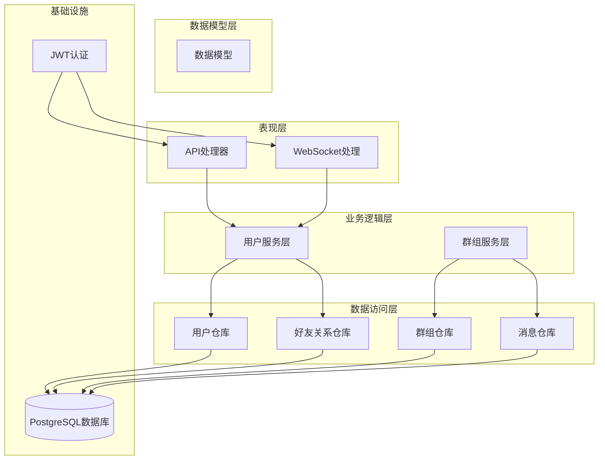

**图表来源**
- [auth.go:1-91](file://server/gateway/auth/auth.go#L1-L91)
- [user_service.go:1-187](file://server/userservice/user_service.go#L1-L187)
- [interface.go:1-74](file://server/repository/interface.go#L1-L74)

**章节来源**
- [auth.go:1-91](file://server/gateway/auth/auth.go#L1-L91)
- [user_service.go:1-187](file://server/userservice/user_service.go#L1-L187)
- [models.go:1-146](file://server/model/models.go#L1-L146)

## 核心组件

### JWT令牌机制

系统实现了基于JWT（JSON Web Token）的身份验证机制，提供安全的用户身份识别和授权控制。

#### 令牌生成流程

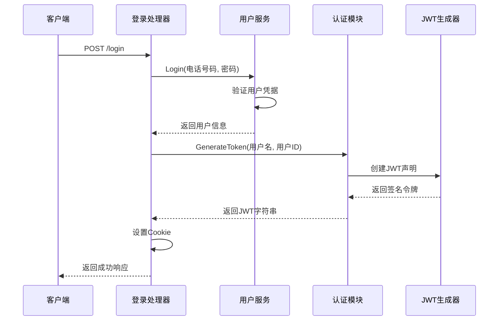

**图表来源**
- [user_handler.go:39-61](file://server/gateway/api/user_handler.go#L39-L61)
- [auth.go:22-34](file://server/gateway/auth/auth.go#L22-L34)

#### 令牌验证中间件

系统使用Gin框架的中间件机制实现请求拦截和令牌验证：

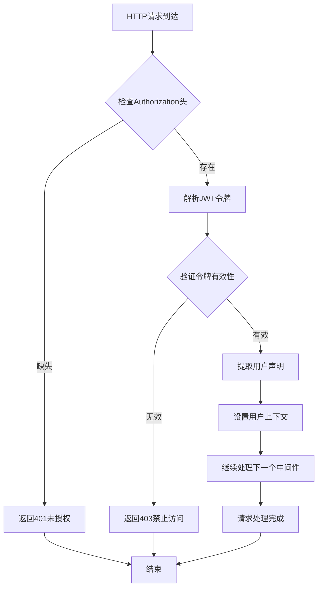

**图表来源**
- [auth.go:37-61](file://server/gateway/auth/auth.go#L37-L61)

### 用户注册流程

系统实现了完整的用户注册机制，包含输入验证、密码加密和数据库存储：

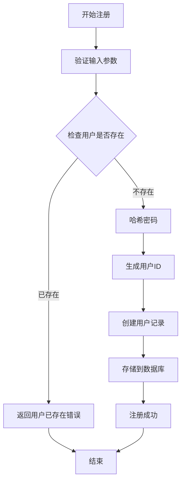

**图表来源**
- [user_service.go:27-54](file://server/userservice/user_service.go#L27-L54)

### 登录验证过程

系统提供了安全的用户登录验证机制：

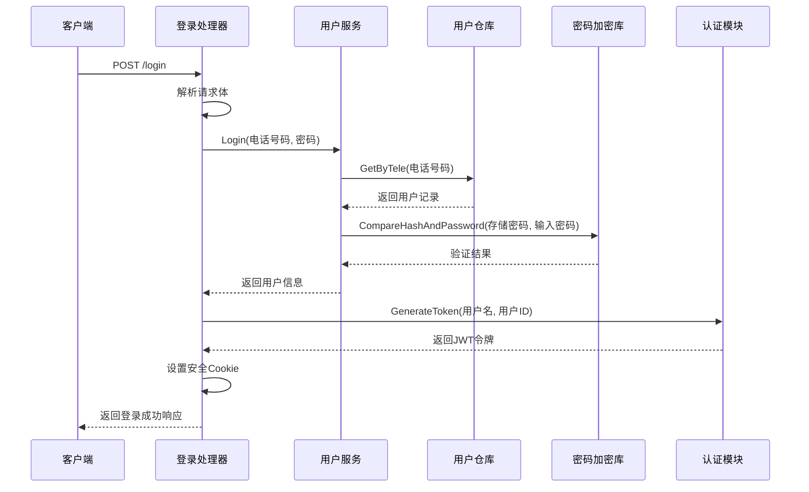

**图表来源**
- [user_handler.go:39-61](file://server/gateway/api/user_handler.go#L39-L61)
- [user_service.go:56-67](file://server/userservice/user_service.go#L56-L67)

**章节来源**
- [user_service.go:27-67](file://server/userservice/user_service.go#L27-L67)
- [user_handler.go:21-61](file://server/gateway/api/user_handler.go#L21-L61)

## 架构概览

系统采用经典的三层架构模式，实现了关注点分离和高内聚低耦合的设计原则：

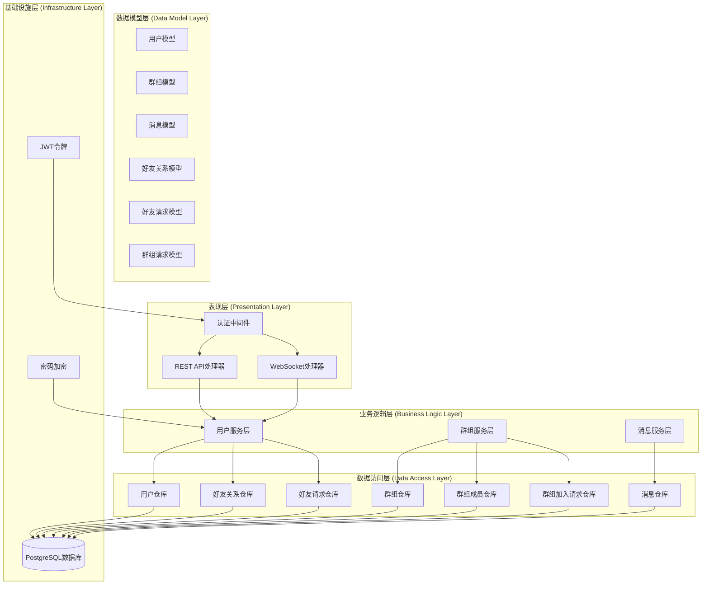

**图表来源**
- [interface.go:8-74](file://server/repository/interface.go#L8-L74)
- [models.go:38-146](file://server/model/models.go#L38-L146)

## 详细组件分析

### 认证中间件实现

认证中间件是系统安全控制的核心组件，负责拦截所有受保护的请求并验证用户身份：

#### 中间件工作原理

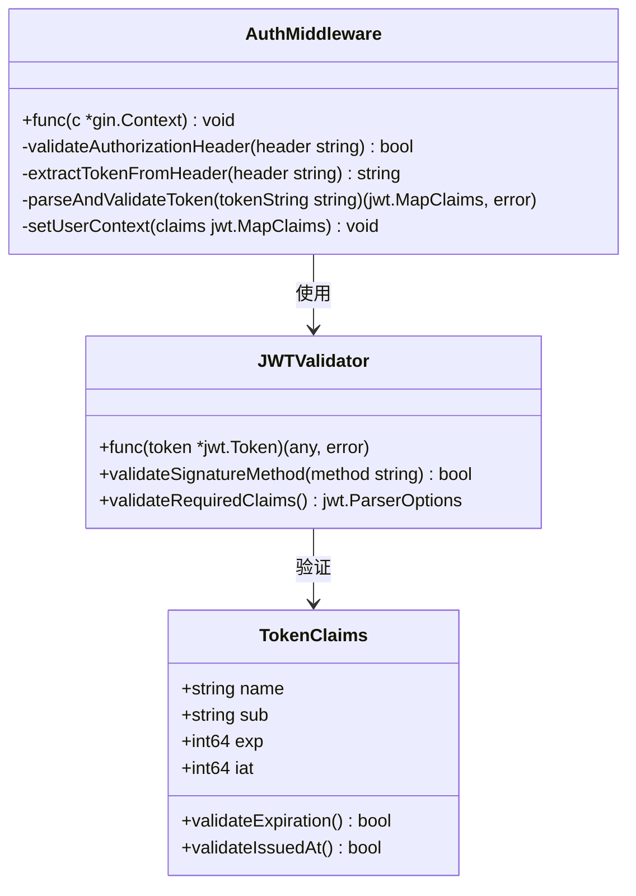

**图表来源**
- [auth.go:37-90](file://server/gateway/auth/auth.go#L37-L90)

#### 安全特性

系统在认证中间件中实现了多项安全措施：

1. **令牌格式验证**：确保Authorization头遵循"Bearer <token>"格式
2. **签名算法验证**：强制使用HS256签名算法
3. **过期时间检查**：自动验证令牌的过期时间
4. **声明类型验证**：确保令牌包含必需的用户声明
5. **上下文注入**：将用户信息注入到请求上下文中

**章节来源**
- [auth.go:37-90](file://server/gateway/auth/auth.go#L37-L90)

### 用户服务层设计

用户服务层是业务逻辑的核心，提供了完整的用户管理功能：

#### 服务接口设计

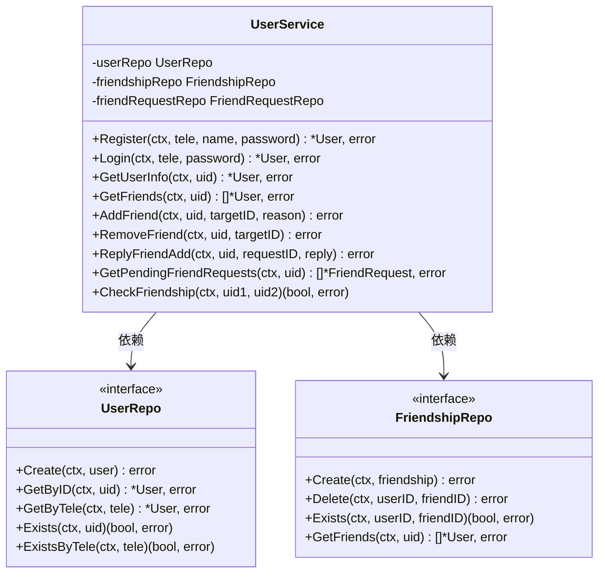

**图表来源**
- [user_service.go:13-25](file://server/userservice/user_service.go#L13-L25)
- [interface.go:8-26](file://server/repository/interface.go#L8-L26)

#### 错误处理策略

用户服务层实现了完善的错误处理机制：

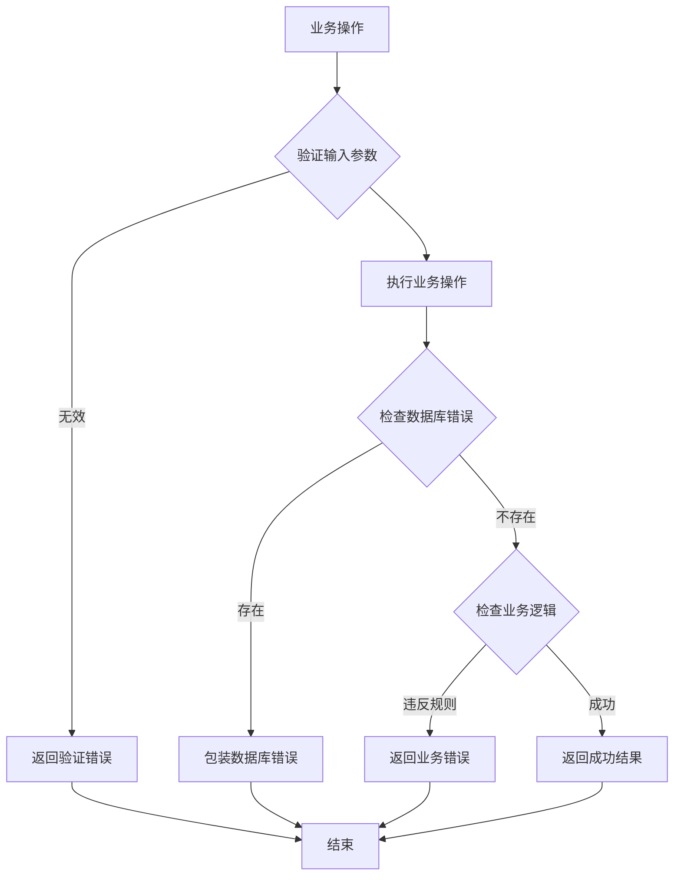

**图表来源**
- [user_service.go:27-187](file://server/userservice/user_service.go#L27-L187)

**章节来源**
- [user_service.go:13-187](file://server/userservice/user_service.go#L13-L187)
- [interface.go:8-74](file://server/repository/interface.go#L8-L74)

### 数据模型设计

系统使用GORM ORM框架实现数据持久化，定义了完整的关系型数据模型：

#### 核心数据模型

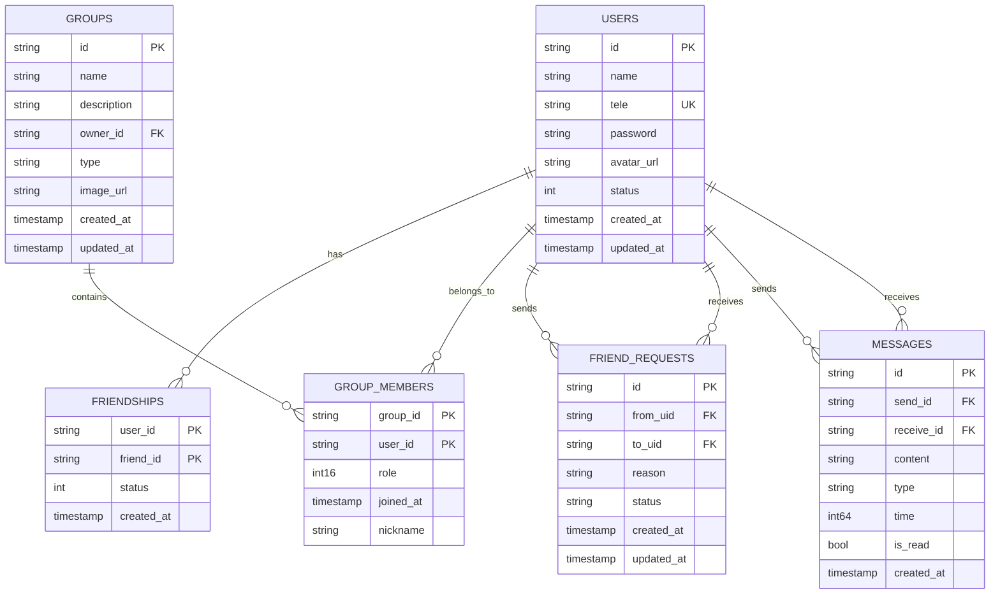

**图表来源**
- [models.go:38-146](file://server/model/models.go#L38-L146)

**章节来源**
- [models.go:1-146](file://server/model/models.go#L1-L146)

### 数据访问层实现

数据访问层通过接口抽象实现了数据持久化的具体实现：

#### 仓库模式实现

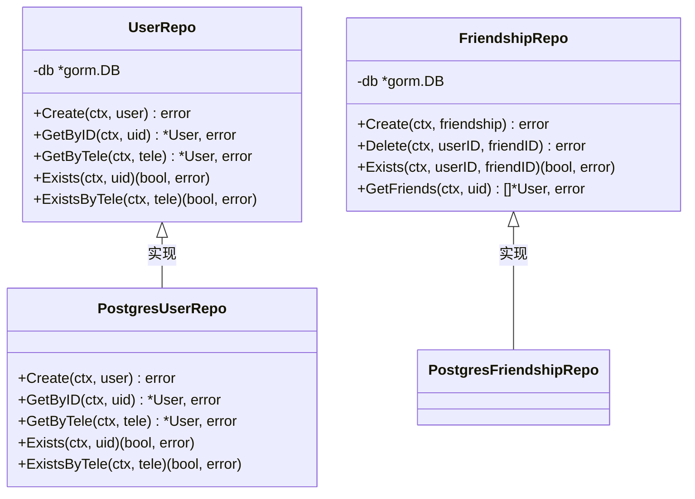

**图表来源**
- [handler.go:21-116](file://server/repository/postgres/handler.go#L21-L116)
- [interface.go:8-26](file://server/repository/interface.go#L8-L26)

**章节来源**
- [handler.go:21-585](file://server/repository/postgres/handler.go#L21-L585)
- [interface.go:1-74](file://server/repository/interface.go#L1-L74)

## 依赖关系分析

系统采用了清晰的依赖注入和接口抽象设计，实现了良好的可测试性和可扩展性：

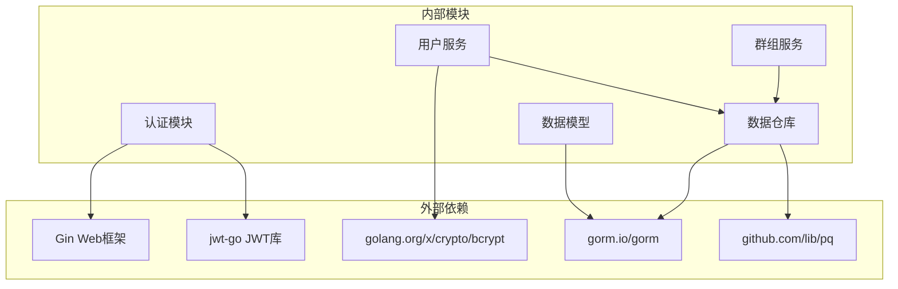

**图表来源**
- [auth.go:3-12](file://server/gateway/auth/auth.go#L3-L12)
- [user_service.go:3-11](file://server/userservice/user_service.go#L3-L11)
- [init.go:3-12](file://server/repository/postgres/init.go#L3-L12)

### 循环依赖检测

经过分析，系统没有发现循环依赖问题：
- 表现层不依赖业务逻辑层
- 业务逻辑层不依赖表现层
- 数据访问层独立于其他层
- 接口定义位于独立的包中

**章节来源**
- [auth.go:1-91](file://server/gateway/auth/auth.go#L1-L91)
- [user_service.go:1-187](file://server/userservice/user_service.go#L1-L187)
- [handler.go:1-585](file://server/repository/postgres/handler.go#L1-L585)

## 性能考虑

### 数据库连接池优化

系统配置了合理的数据库连接池参数以提高性能：

| 参数 | 值 | 说明 |
|------|-----|------|
| MaxOpenConns | 100 | 最大打开连接数 |
| MaxIdleConns | 10 | 最大空闲连接数 |
| ConnMaxLifetime | 1小时 | 连接最大生命周期 |

### 缓存策略

系统在消息传递过程中实现了智能的缓存机制：

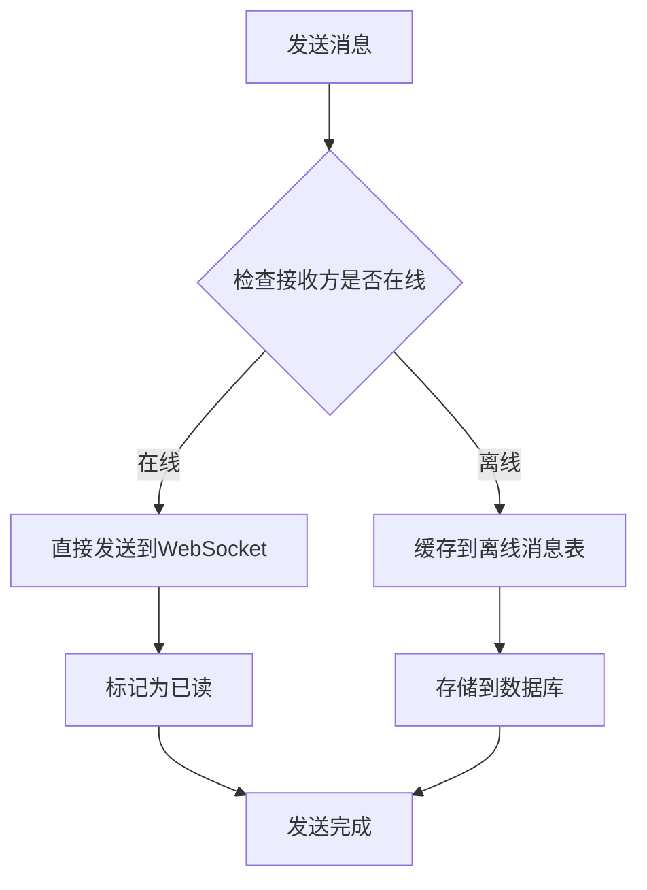

### 并发处理

系统使用Hub模式实现高效的并发消息处理：

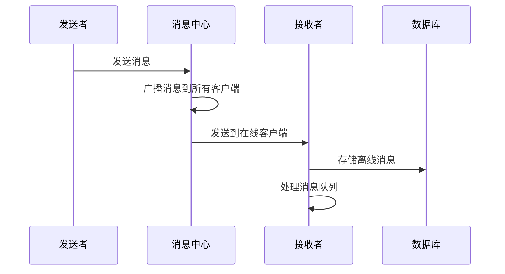

## 故障排除指南

### 常见认证问题

#### 令牌验证失败

**问题症状**：用户登录后无法访问受保护资源

**可能原因**：
1. Authorization头格式不正确
2. JWT签名密钥不匹配
3. 令牌过期
4. 签名算法不受支持

**解决方案**：
1. 确保使用正确的"Bearer <token>"格式
2. 检查服务器端JWT密钥配置
3. 验证令牌有效期
4. 确认使用HS256签名算法

#### 用户注册失败

**问题症状**：用户无法完成注册流程

**可能原因**：
1. 电话号码已被使用
2. 密码加密失败
3. 数据库连接异常
4. 输入参数验证失败

**解决方案**：
1. 检查用户是否已存在
2. 验证密码长度和复杂度
3. 确认数据库连接状态
4. 验证输入数据格式

#### 登录验证错误

**问题症状**：用户凭据正确但无法登录

**可能原因**：
1. 密码哈希不匹配
2. 用户不存在
3. 数据库查询异常

**解决方案**：
1. 检查用户密码哈希存储
2. 验证用户账户状态
3. 查看数据库日志

### 性能问题诊断

#### 数据库连接问题

**症状**：系统响应缓慢或超时

**诊断步骤**：
1. 检查数据库连接池状态
2. 监控数据库查询性能
3. 分析慢查询日志

**优化建议**：
1. 调整连接池参数
2. 添加适当的索引
3. 优化查询语句

#### 内存泄漏排查

**症状**：系统内存使用持续增长

**排查方法**：
1. 使用pprof工具分析内存使用
2. 检查WebSocket连接状态
3. 监控客户端连接数量

**解决方案**：
1. 确保及时关闭WebSocket连接
2. 实施连接超时机制
3. 优化消息队列大小

**章节来源**
- [auth.go:64-90](file://server/gateway/auth/auth.go#L64-L90)
- [user_service.go:27-67](file://server/userservice/user_service.go#L27-L67)
- [handler.go:29-116](file://server/repository/postgres/handler.go#L29-L116)

## 结论

本用户认证系统实现了完整的身份验证和授权功能，具有以下特点：

### 技术优势

1. **安全性**：采用JWT令牌机制和bcrypt密码加密
2. **可扩展性**：清晰的分层架构和接口抽象
3. **可靠性**：完善的错误处理和事务管理
4. **性能**：优化的数据库连接池和并发处理

### 改进建议

1. **配置管理**：将JWT密钥和数据库连接信息移至配置文件
2. **日志记录**：增强详细的审计日志和错误追踪
3. **监控指标**：添加系统性能监控和告警机制
4. **测试覆盖**：增加单元测试和集成测试覆盖率

### 安全最佳实践

1. **密钥管理**：使用环境变量存储敏感配置
2. **输入验证**：实施严格的输入验证和清理
3. **会话管理**：实现令牌刷新和撤销机制
4. **权限控制**：基于角色的访问控制(RBAC)

该系统为即时通讯平台提供了坚实的身份认证基础，具备良好的扩展性和维护性，能够满足生产环境的性能和安全要求。