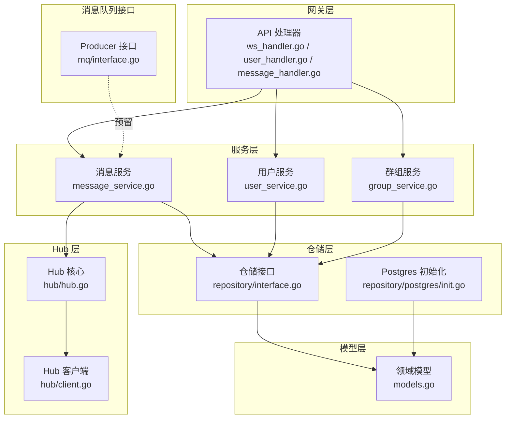
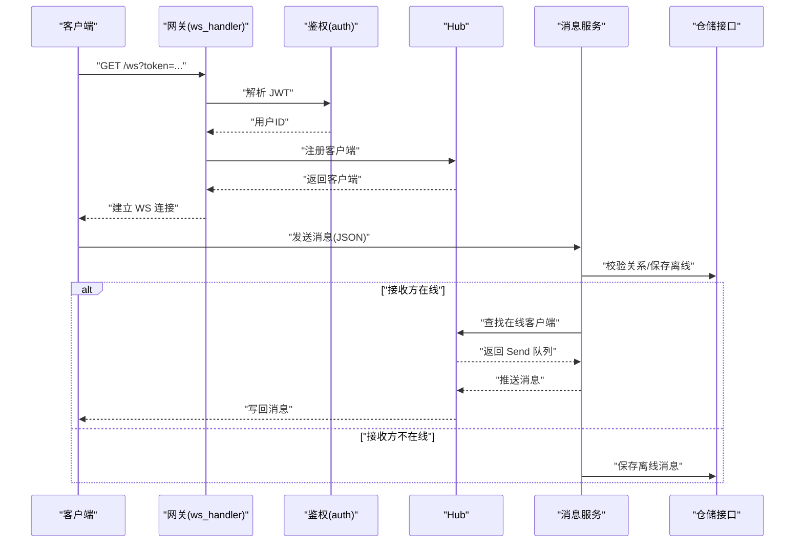
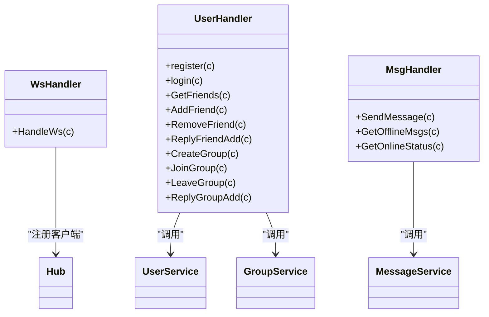
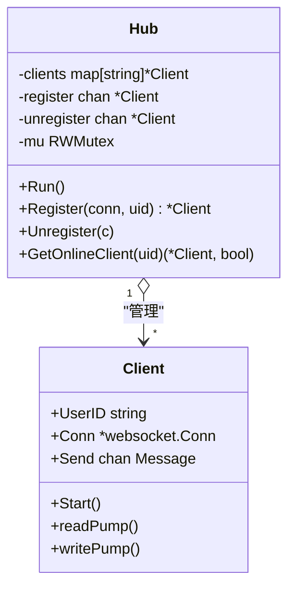
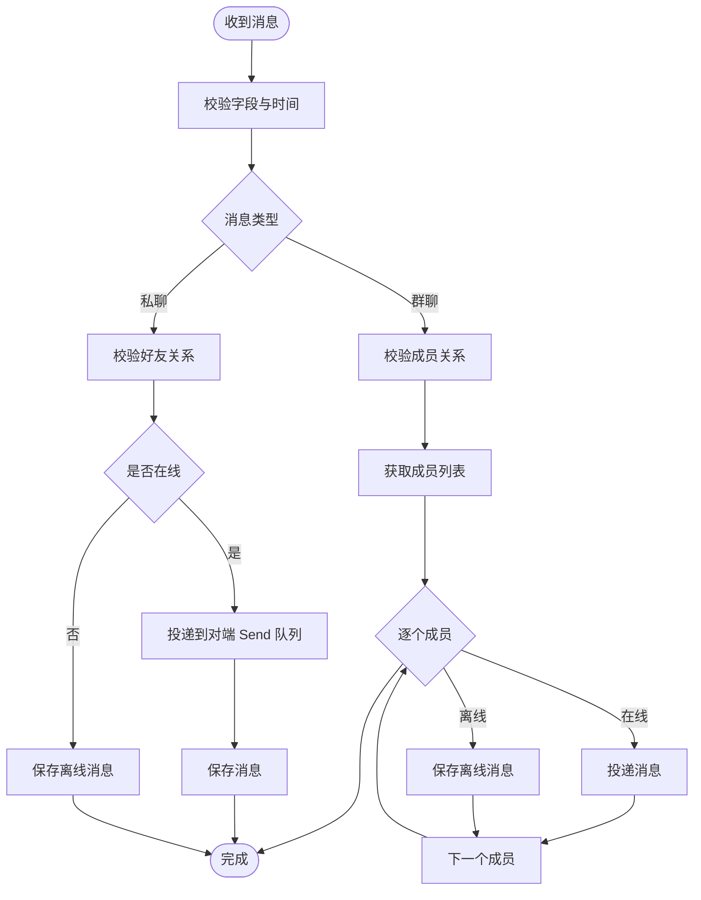
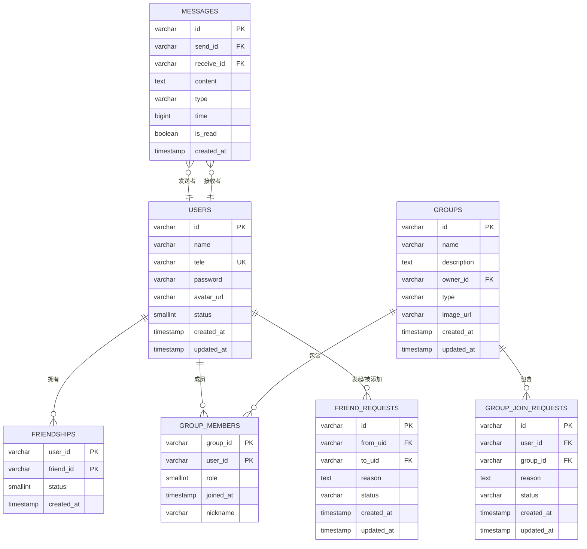
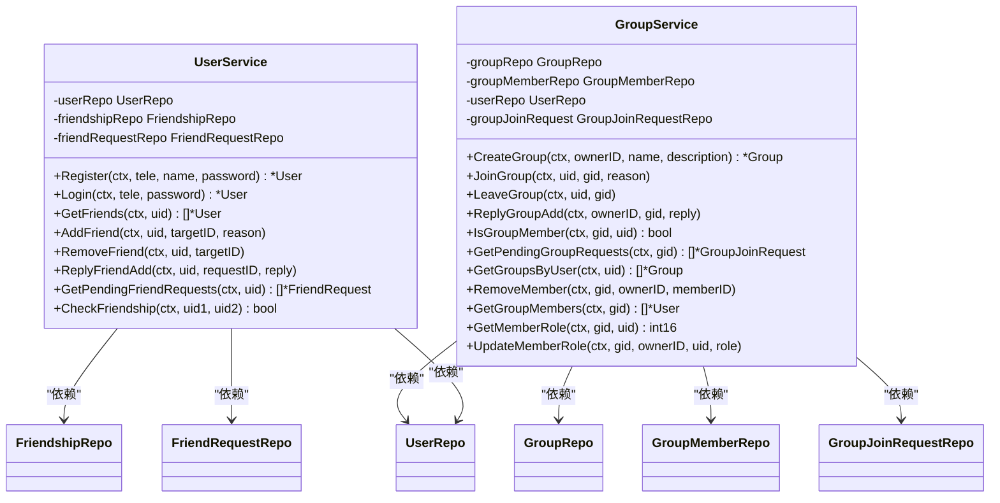
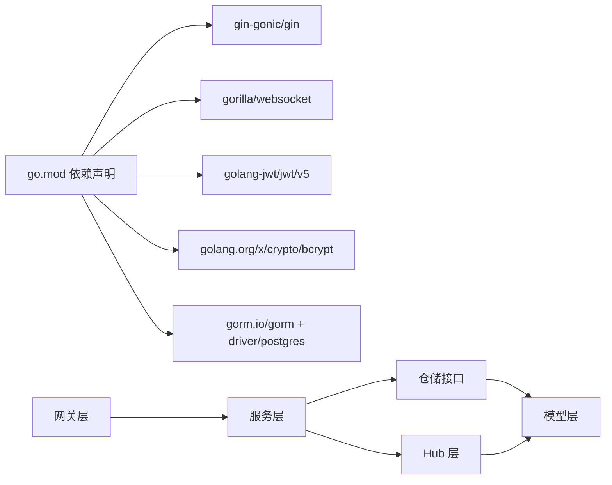

# 系统架构

<cite>
**本文引用的文件**
- [main.txt](file://main.txt)
- [go.mod](file://go.mod)
- [models.go](file://server/model/models.go)
- [interface.go（消息队列接口）](file://server/mq/interface.go)
- [hub.go（消息服务 Hub）](file://server/msgservice/hub/hub.go)
- [client.go（消息服务 Hub 客户端）](file://server/msgservice/hub/client.go)
- [message_service.go（消息服务）](file://server/msgservice/message_service.go)
- [interface.go（仓储接口）](file://server/repository/interface.go)
- [init.go（Postgres 初始化）](file://server/repository/postgres/init.go)
- [user_service.go（用户服务）](file://server/userservice/user_service.go)
- [group_service.go（群组服务）](file://server/userservice/group_service.go)
- [ws_handler.go（WebSocket 网关处理器）](file://server/gateway/api/ws_handler.go)
- [user_handler.go（用户网关处理器）](file://server/gateway/api/user_handler.go)
- [message_handler.go（消息网关处理器）](file://server/gateway/api/message_handler.go)
</cite>

## 目录
1. [引言](#引言)
2. [项目结构](#项目结构)
3. [核心组件](#核心组件)
4. [架构总览](#架构总览)
5. [详细组件分析](#详细组件分析)
6. [依赖分析](#依赖分析)
7. [性能考量](#性能考量)
8. [故障排查指南](#故障排查指南)
9. [结论](#结论)
10. [附录](#附录)

## 引言
本项目是一个基于 Go 的即时通讯系统，采用分层架构与 Hub 模式相结合的设计。系统通过 Gateway 层对外提供 HTTP/WebSocket 接口，Service 层负责业务逻辑编排，Repository 层封装数据访问，消息在在线场景通过 Hub 广播，离线消息持久化至数据库。系统支持私聊与群聊两种消息类型，具备好友关系与群组管理能力。

## 项目结构
项目采用按功能域分层的组织方式：
- server/gateway：HTTP/WebSocket 网关层，处理外部请求与协议升级
- server/userservice：用户与群组业务服务
- server/msgservice：消息路由与 Hub 在线广播
- server/repository：数据仓储抽象与 Postgres 实现
- server/model：领域模型与错误常量
- server/mq：消息队列接口（预留）
- main.txt：早期示例实现（演示 Hub 与 WebSocket）

**图表来源**
- [ws_handler.go:30-69](file://server/gateway/api/ws_handler.go#L30-L69)
- [user_handler.go:12-206](file://server/gateway/api/user_handler.go#L12-L206)
- [message_handler.go:12-66](file://server/gateway/api/message_handler.go#L12-L66)
- [message_service.go:12-168](file://server/msgservice/message_service.go#L12-L168)
- [hub.go:10-61](file://server/msgservice/hub/hub.go#L10-L61)
- [client.go:12-88](file://server/msgservice/hub/client.go#L12-L88)
- [interface.go（仓储接口）:1-74](file://server/repository/interface.go#L1-L74)
- [init.go（Postgres 初始化）:42-75](file://server/repository/postgres/init.go#L42-L75)
- [models.go:23-146](file://server/model/models.go#L23-L146)
- [interface.go（消息队列接口）:1-7](file://server/mq/interface.go#L1-L7)

**章节来源**
- [main.txt:1-175](file://main.txt#L1-L175)
- [go.mod:1-51](file://go.mod#L1-L51)

## 核心组件
- 网关层（Gateway）
  - HTTP API：用户注册/登录、好友/群组操作、离线消息查询
  - WebSocket 升级：基于 Gin 与 Gorilla WebSocket，鉴权后接入 Hub
- 服务层（Service）
  - 用户服务：注册、登录、好友关系维护、好友请求
  - 群组服务：建群、入群/退群、成员角色管理、群请求
  - 消息服务：消息路由（私聊/群聊）、在线广播、离线缓存
- Hub 层（Hub）
  - 维护在线用户映射，负责消息广播与心跳保活
- 仓储层（Repository）
  - 抽象接口：User/Friendship/Group/GroupMember/Message/FriendRequest/GroupJoinRequest
  - Postgres 实现：连接池配置、自动迁移
- 模型层（Model）
  - 领域对象与 GORM 映射，含错误常量

**章节来源**
- [ws_handler.go:30-69](file://server/gateway/api/ws_handler.go#L30-L69)
- [user_handler.go:12-206](file://server/gateway/api/user_handler.go#L12-L206)
- [message_handler.go:12-66](file://server/gateway/api/message_handler.go#L12-L66)
- [user_service.go:13-187](file://server/userservice/user_service.go#L13-L187)
- [group_service.go:11-217](file://server/userservice/group_service.go#L11-L217)
- [message_service.go:12-168](file://server/msgservice/message_service.go#L12-L168)
- [hub.go:10-61](file://server/msgservice/hub/hub.go#L10-L61)
- [client.go:12-88](file://server/msgservice/hub/client.go#L12-L88)
- [interface.go（仓储接口）:1-74](file://server/repository/interface.go#L1-L74)
- [init.go（Postgres 初始化）:42-75](file://server/repository/postgres/init.go#L42-L75)
- [models.go:23-146](file://server/model/models.go#L23-L146)

## 架构总览
系统采用“网关-服务-仓储-模型”的分层架构，结合 Hub 模式实现高并发在线消息广播。请求自网关进入，经服务层编排后，通过 Hub 进行在线投递，或通过仓储层持久化离线消息；数据库使用 Postgres，配合 GORM 进行 ORM 映射与迁移。

**图表来源**
- [ws_handler.go:39-68](file://server/gateway/api/ws_handler.go#L39-L68)
- [hub.go:44-54](file://server/msgservice/hub/hub.go#L44-L54)
- [message_service.go:27-108](file://server/msgservice/message_service.go#L27-L108)
- [interface.go（仓储接口）:1-74](file://server/repository/interface.go#L1-L74)

## 详细组件分析

### 网关层组件
- WebSocket 网关处理器
  - 负责跨域与缓冲区配置，鉴权后升级为 WebSocket
  - 将已认证用户 ID 注册到 Hub，启动读写泵
- 用户网关处理器
  - 提供注册、登录、好友/群组相关 API
  - 登录成功生成 JWT 并设置 Cookie
- 消息网关处理器
  - 接收消息请求，调用消息服务进行路由
  - 提供离线消息与在线状态查询

**图表来源**
- [ws_handler.go:30-69](file://server/gateway/api/ws_handler.go#L30-L69)
- [user_handler.go:12-206](file://server/gateway/api/user_handler.go#L12-L206)
- [message_handler.go:12-66](file://server/gateway/api/message_handler.go#L12-L66)

**章节来源**
- [ws_handler.go:30-69](file://server/gateway/api/ws_handler.go#L30-L69)
- [user_handler.go:12-206](file://server/gateway/api/user_handler.go#L12-L206)
- [message_handler.go:12-66](file://server/gateway/api/message_handler.go#L12-L66)

### Hub 组件
- Hub 核心
  - 维护在线用户映射，提供注册/注销/查询方法
  - 内置 goroutine 循环处理注册/注销事件
- Hub 客户端
  - 读泵：设置读超时与 PONG 处理，解码消息并回调 OnMessage
  - 写泵：定时 Ping、设置写超时，向客户端发送消息

**图表来源**
- [hub.go:10-61](file://server/msgservice/hub/hub.go#L10-L61)
- [client.go:12-88](file://server/msgservice/hub/client.go#L12-L88)

**章节来源**
- [hub.go:10-61](file://server/msgservice/hub/hub.go#L10-L61)
- [client.go:12-88](file://server/msgservice/hub/client.go#L12-L88)

### 消息服务组件
- 路由逻辑
  - 私聊：校验好友关系，若对方在线则直接投递，否则缓存离线
  - 群聊：校验成员身份，遍历成员在线状态分别投递或缓存
- 离线缓存
  - 统一通过仓储接口保存离线消息，支持批量标记已读
- 在线状态
  - 基于 Hub 查询好友在线列表

**图表来源**
- [message_service.go:27-108](file://server/msgservice/message_service.go#L27-L108)

**章节来源**
- [message_service.go:12-168](file://server/msgservice/message_service.go#L12-L168)

### 仓储与模型
- 仓储接口
  - 用户、好友关系、群组、群成员、消息、好友请求、群加入请求
- Postgres 初始化
  - 从环境变量加载配置，设置连接池参数，执行自动迁移
- 领域模型
  - 用户、群组、消息、关系与请求实体，含索引与关联映射

**图表来源**
- [models.go:23-146](file://server/model/models.go#L23-L146)

**章节来源**
- [interface.go（仓储接口）:1-74](file://server/repository/interface.go#L1-L74)
- [init.go（Postgres 初始化）:42-75](file://server/repository/postgres/init.go#L42-L75)
- [models.go:23-146](file://server/model/models.go#L23-L146)

### 用户与群组服务
- 用户服务
  - 注册：密码加密、唯一性检查、创建用户
  - 登录：凭手机号检索用户并比对密码
  - 好友：申请、同意/拒绝、删除、查询
- 群组服务
  - 创建：默认拥有者即为管理员
  - 入退群：请求管理、批量处理
  - 成员角色：查询/更新

**图表来源**
- [user_service.go:13-187](file://server/userservice/user_service.go#L13-L187)
- [group_service.go:11-217](file://server/userservice/group_service.go#L11-L217)

**章节来源**
- [user_service.go:13-187](file://server/userservice/user_service.go#L13-L187)
- [group_service.go:11-217](file://server/userservice/group_service.go#L11-L217)

## 依赖分析
- 外部依赖
  - Web 框架：Gin
  - WebSocket：Gorilla WebSocket
  - 加密：bcrypt
  - ORM：GORM + Postgres 驱动
  - JWT：github.com/golang-jwt/jwt/v5
- 内部依赖
  - 网关依赖服务层；服务层依赖仓储接口；仓储接口依赖模型层
  - Hub 依赖模型层的消息结构
  - 消息服务依赖 Hub 与仓储接口

**图表来源**
- [go.mod:5-12](file://go.mod#L5-L12)
- [ws_handler.go:30-69](file://server/gateway/api/ws_handler.go#L30-L69)
- [message_service.go:12-168](file://server/msgservice/message_service.go#L12-L168)
- [hub.go:10-61](file://server/msgservice/hub/hub.go#L10-L61)
- [interface.go（仓储接口）:1-74](file://server/repository/interface.go#L1-L74)
- [models.go:23-146](file://server/model/models.go#L23-L146)

**章节来源**
- [go.mod:1-51](file://go.mod#L1-L51)

## 性能考量
- Hub 广播
  - 使用带缓冲 Send 队列，避免阻塞写入；默认容量可按峰值 QPS 调整
  - 写超时与心跳保活减少僵尸连接占用
- 数据库
  - 连接池参数需结合实例规格与 QPS 调优；建议开启连接复用与合理空闲上限
  - 索引覆盖常见查询（发送者/接收者/时间/状态），降低查询延迟
- 缓存离线消息
  - 离线消息入库前可考虑内存队列或消息中间件，减轻数据库瞬时压力
- 服务拆分
  - 可将消息服务独立部署，按在线用户规模横向扩展 Hub 实例

## 故障排查指南
- WebSocket 升级失败
  - 检查 Origin 白名单与 Cookie 中 token 是否存在
  - 查看 upgrader 错误日志
- 鉴权失败
  - 确认 JWT 解析与 Claims 字段（如 sub、name）
- 消息未送达
  - 确认好友关系/群成员关系校验是否通过
  - 检查 Hub 在线表中是否存在目标用户
  - 核对离线消息入库与标记已读流程
- 数据库连接异常
  - 检查环境变量与 DSN 参数
  - 关注连接池上限与最大生命周期配置

**章节来源**
- [ws_handler.go:39-68](file://server/gateway/api/ws_handler.go#L39-L68)
- [message_service.go:27-108](file://server/msgservice/message_service.go#L27-L108)
- [init.go（Postgres 初始化）:42-75](file://server/repository/postgres/init.go#L42-L75)

## 结论
该系统以清晰的分层与 Hub 模式实现了高并发在线消息广播，结合仓储抽象与 GORM ORM，具备良好的可扩展性。建议后续引入消息队列用于离线消息削峰、完善监控与限流策略，并按业务增长拆分服务与数据库实例。

## 附录
- 系统边界
  - 网关层：HTTP REST 与 WebSocket 协议入口
  - 服务层：业务规则与流程编排
  - Hub 层：在线会话与广播
  - 仓储层：数据持久化与迁移
- 扩展点
  - 引入消息队列 Producer 接口，异步落库
  - 支持多租户、消息审计与富媒体内容
- 集成模式
  - JWT 鉴权 + Cookie 会话
  - GORM 自动迁移与连接池配置
  - Hub 与消息服务解耦，便于水平扩展