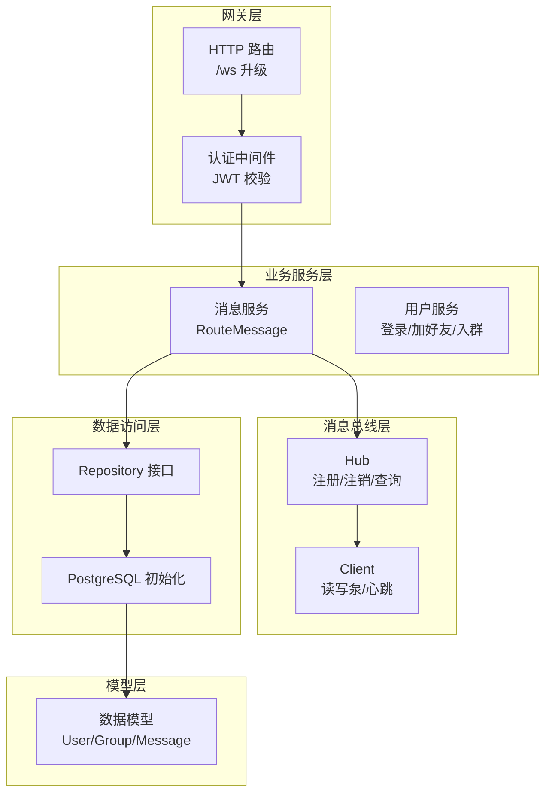
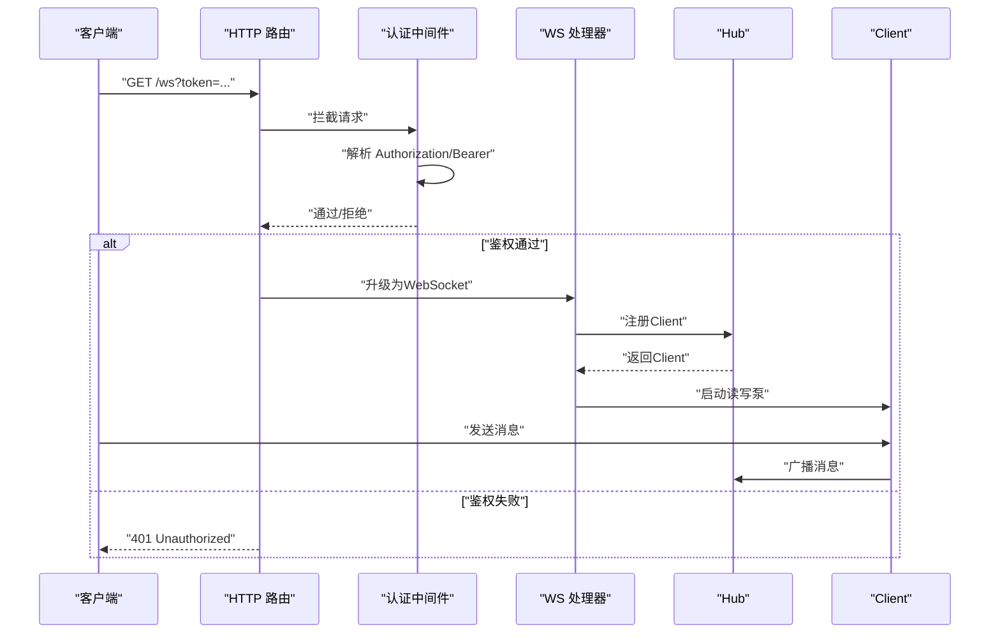
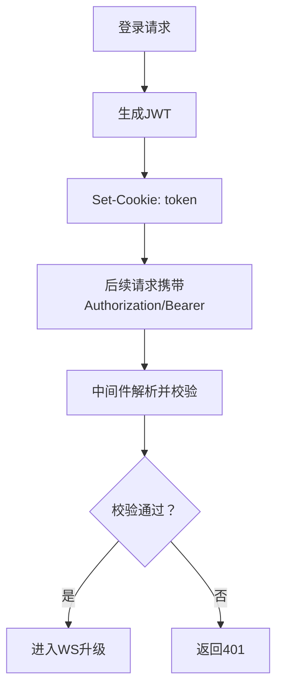
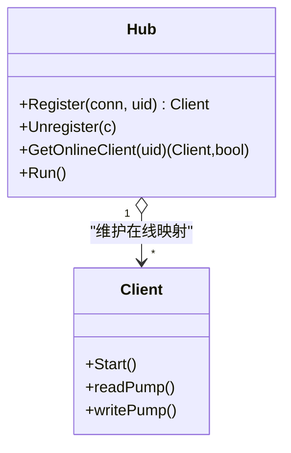
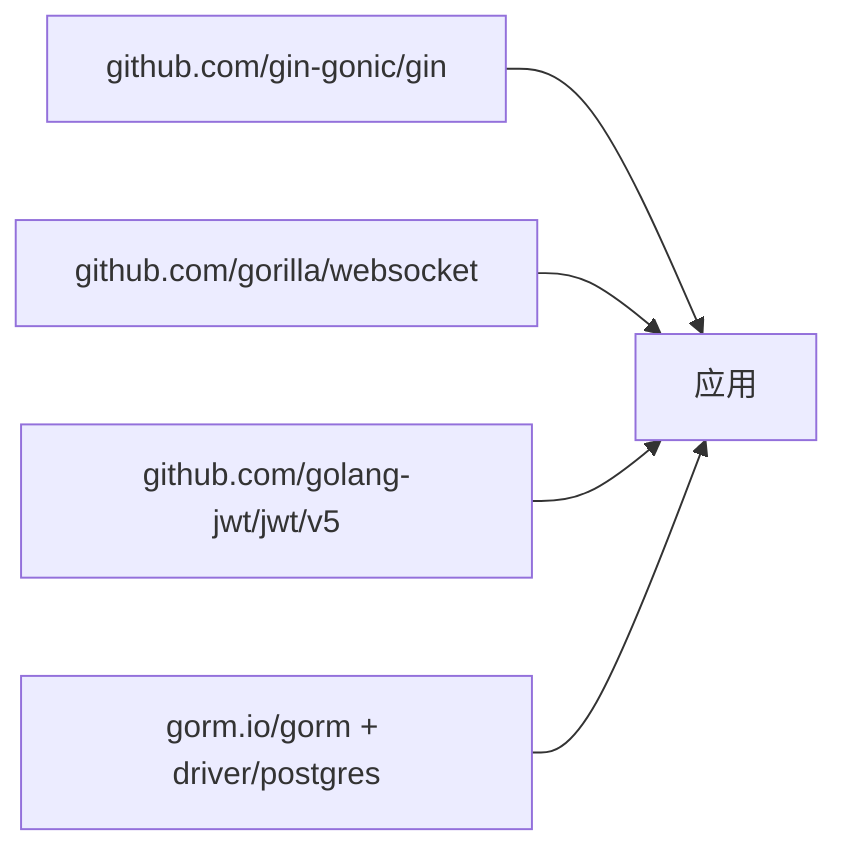

# 应用配置

<cite>
**本文引用的文件**
- [main.txt](file://main.txt)
- [ws_handler.go](file://server/gateway/api/ws_handler.go)
- [auth.go](file://server/gateway/auth/auth.go)
- [user_handler.go](file://server/gateway/api/user_handler.go)
- [message_service.go](file://server/msgservice/message_service.go)
- [hub.go](file://server/msgservice/hub/hub.go)
- [client.go](file://server/msgservice/hub/client.go)
- [models.go](file://server/model/models.go)
- [init.go](file://server/repository/postgres/init.go)
- [interface.go](file://server/repository/interface.go)
- [go.mod](file://go.mod)
</cite>

## 目录
1. [简介](#简介)
2. [项目结构](#项目结构)
3. [核心组件](#核心组件)
4. [架构总览](#架构总览)
5. [详细组件分析](#详细组件分析)
6. [依赖分析](#依赖分析)
7. [性能考虑](#性能考虑)
8. [故障排查指南](#故障排查指南)
9. [结论](#结论)
10. [附录](#附录)

## 简介
本文件面向Go语言即时通讯项目的运维与开发团队，提供系统化的应用配置说明。重点覆盖以下方面：
- JWT密钥配置与认证流程
- WebSocket连接参数与安全策略
- 日志级别与错误处理策略
- 健康检查端点建议
- 网络配置（端口绑定、超时、缓冲区）
- 数据库连接与池化配置
- 不同部署环境（开发、测试、生产）的配置差异
- 配置热更新与动态配置管理建议

## 项目结构
项目采用分层与功能模块结合的组织方式：
- 网关层：HTTP路由、WebSocket升级、认证中间件
- 业务服务层：消息路由、用户与群组操作
- 消息总线层：在线客户端注册、广播与心跳
- 数据访问层：接口抽象与PostgreSQL初始化
- 模型层：用户、群组、消息等数据模型

**图表来源**
- [ws_handler.go:39-68](file://server/gateway/api/ws_handler.go#L39-L68)
- [auth.go:37-61](file://server/gateway/auth/auth.go#L37-L61)
- [message_service.go:27-44](file://server/msgservice/message_service.go#L27-L44)
- [hub.go:44-60](file://server/msgservice/hub/hub.go#L44-L60)
- [client.go:27-87](file://server/msgservice/hub/client.go#L27-L87)
- [init.go:42-64](file://server/repository/postgres/init.go#L42-L64)
- [models.go:23-36](file://server/model/models.go#L23-L36)

**章节来源**
- [ws_handler.go:1-69](file://server/gateway/api/ws_handler.go#L1-L69)
- [auth.go:1-91](file://server/gateway/auth/auth.go#L1-L91)
- [message_service.go:1-168](file://server/msgservice/message_service.go#L1-L168)
- [hub.go:1-61](file://server/msgservice/hub/hub.go#L1-L61)
- [client.go:1-88](file://server/msgservice/hub/client.go#L1-L88)
- [init.go:1-75](file://server/repository/postgres/init.go#L1-L75)
- [models.go:1-146](file://server/model/models.go#L1-L146)

## 核心组件
本节聚焦于与配置直接相关的核心组件及其职责。

- 认证与JWT
  - 生成与解析：使用HS256签名算法，支持过期时间与签发时间校验
  - 中间件：从请求头Authorization提取Bearer Token并解析
  - 登录流程：成功后通过Cookie返回token

- WebSocket升级与鉴权
  - 从Cookie读取token进行鉴权
  - 仅允许白名单域名（默认本地回环）
  - 升级失败记录日志并返回

- 消息总线与客户端
  - Hub维护在线用户映射，支持注册/注销/查询
  - Client实现读写泵、心跳与超时控制

- 数据库连接
  - 支持通过环境变量配置主机、端口、用户、密码、数据库名与SSL模式
  - 设置连接池生命周期、最大空闲连接数与最大打开连接数

**章节来源**
- [auth.go:22-34](file://server/gateway/auth/auth.go#L22-L34)
- [auth.go:37-61](file://server/gateway/auth/auth.go#L37-L61)
- [auth.go:64-90](file://server/gateway/auth/auth.go#L64-L90)
- [user_handler.go:53-60](file://server/gateway/api/user_handler.go#L53-L60)
- [ws_handler.go:39-68](file://server/gateway/api/ws_handler.go#L39-L68)
- [hub.go:44-60](file://server/msgservice/hub/hub.go#L44-L60)
- [client.go:20-25](file://server/msgservice/hub/client.go#L20-L25)
- [client.go:31-60](file://server/msgservice/hub/client.go#L31-L60)
- [client.go:61-87](file://server/msgservice/hub/client.go#L61-L87)
- [init.go:24-33](file://server/repository/postgres/init.go#L24-L33)
- [init.go:42-64](file://server/repository/postgres/init.go#L42-L64)

## 架构总览
下图展示从HTTP到WebSocket再到消息总线的整体调用链路与鉴权位置。

**图表来源**
- [ws_handler.go:39-68](file://server/gateway/api/ws_handler.go#L39-L68)
- [auth.go:37-61](file://server/gateway/auth/auth.go#L37-L61)
- [hub.go:44-60](file://server/msgservice/hub/hub.go#L44-L60)
- [client.go:27-87](file://server/msgservice/hub/client.go#L27-L87)

## 详细组件分析

### JWT密钥与认证配置
- 密钥位置与强度
  - 当前实现使用固定密钥字节数组进行签名与验证
  - 建议在生产环境使用强随机生成的密钥并妥善保管，避免硬编码

- 认证流程
  - 登录接口生成JWT并写入Cookie
  - 中间件从Authorization头提取Bearer Token并解析
  - WS处理器从Cookie读取token进行二次鉴权

- 安全建议
  - 使用HTTPS传输，启用HttpOnly SameSite Cookie
  - 限制Token有效期，必要时引入刷新机制
  - 对Origin进行严格白名单校验

**图表来源**
- [user_handler.go:53-60](file://server/gateway/api/user_handler.go#L53-L60)
- [auth.go:37-61](file://server/gateway/auth/auth.go#L37-L61)
- [auth.go:64-90](file://server/gateway/auth/auth.go#L64-L90)

**章节来源**
- [auth.go:14](file://server/gateway/auth/auth.go#L14)
- [auth.go:22-34](file://server/gateway/auth/auth.go#L22-L34)
- [auth.go:37-61](file://server/gateway/auth/auth.go#L37-L61)
- [auth.go:64-90](file://server/gateway/auth/auth.go#L64-L90)
- [user_handler.go:53-60](file://server/gateway/api/user_handler.go#L53-L60)

### WebSocket连接参数与安全
- 升级与跨域
  - 默认仅允许特定Origin（示例为本地回环），可按需扩展白名单
  - 升级失败会记录日志

- 读写缓冲区
  - 读/写缓冲区大小在升级处定义
  - 客户端侧对消息大小、读写超时、心跳间隔有明确配置

- 心跳与保活
  - 读超时、写超时、Ping/Pong周期在客户端侧设定
  - Hub负责注册/注销在线用户

**图表来源**
- [hub.go:10-25](file://server/msgservice/hub/hub.go#L10-L25)
- [hub.go:44-60](file://server/msgservice/hub/hub.go#L44-L60)
- [client.go:12-18](file://server/msgservice/hub/client.go#L12-L18)
- [client.go:20-25](file://server/msgservice/hub/client.go#L20-L25)
- [client.go:27-87](file://server/msgservice/hub/client.go#L27-L87)

**章节来源**
- [ws_handler.go:14-28](file://server/gateway/api/ws_handler.go#L14-L28)
- [ws_handler.go:39-68](file://server/gateway/api/ws_handler.go#L39-L68)
- [hub.go:44-60](file://server/msgservice/hub/hub.go#L44-L60)
- [client.go:20-25](file://server/msgservice/hub/client.go#L20-L25)
- [client.go:31-60](file://server/msgservice/hub/client.go#L31-L60)
- [client.go:61-87](file://server/msgservice/hub/client.go#L61-L87)

### 日志级别与错误处理策略
- 日志输出
  - 认证与升级过程中的异常会打印日志
  - 数据库连接与迁移过程有明确日志提示

- 错误处理
  - 鉴权失败返回401
  - 请求参数不合法返回400
  - 业务错误统一返回5xx并包含错误信息
  - 客户端读写异常会触发清理与关闭

- 建议
  - 引入结构化日志（字段化）与日志级别（Debug/Info/Warn/Error）
  - 区分业务错误与系统错误，便于监控与告警

**章节来源**
- [ws_handler.go:40-52](file://server/gateway/api/ws_handler.go#L40-L52)
- [auth.go:37-61](file://server/gateway/auth/auth.go#L37-L61)
- [init.go:47-49](file://server/repository/postgres/init.go#L47-L49)
- [init.go:63-64](file://server/repository/postgres/init.go#L63-L64)

### 健康检查端点设置
- 建议新增
  - /health：检查服务进程状态
  - /db-health：检查数据库连接可用性
  - /ready：检查依赖资源就绪（如DB、缓存）

- 实现要点
  - 返回简洁的JSON或文本
  - 使用轻量级探针，避免阻塞主线程
  - 与容器编排平台的存活/就绪探针配合

[本节为通用实践建议，不直接分析具体文件，故无“章节来源”]

### 网络配置参数
- 端口绑定
  - HTTP服务器默认监听端口在入口处设置
  - 建议通过环境变量或配置文件统一管理

- 超时设置
  - 客户端侧设置读超时、写超时、心跳周期
  - 可根据网络质量调整

- 负载均衡
  - 建议使用反向代理（Nginx/Traefik）或云LB
  - WebSocket需支持长连接与粘性会话（可选）

**章节来源**
- [main.txt:171-173](file://main.txt#L171-L173)
- [client.go:20-25](file://server/msgservice/hub/client.go#L20-L25)

### 数据库配置与连接池
- 环境变量
  - DB_HOST、DB_PORT、DB_USER、DB_PASSWORD、DB_NAME、DB_SSLMODE
  - 建议在不同环境分别配置

- 连接池参数
  - 最大空闲连接数、最大打开连接数、连接最大生命周期
  - 有助于提升并发与稳定性

**章节来源**
- [init.go:15-33](file://server/repository/postgres/init.go#L15-L33)
- [init.go:42-64](file://server/repository/postgres/init.go#L42-L64)

### 不同部署环境的配置差异
- 开发环境
  - DB_SSLMODE: disable
  - 日志级别: Info
  - Origin白名单: localhost与前端地址
  - 端口: 8080

- 测试环境
  - DB_SSLMODE: require
  - 日志级别: Warn
  - Origin白名单: 测试域名集合

- 生产环境
  - DB_SSLMODE: require
  - 日志级别: Error
  - 启用HTTPS、Strict-Transport-Security
  - 严格的Origin白名单与CORS策略

**章节来源**
- [init.go:25-31](file://server/repository/postgres/init.go#L25-L31)
- [ws_handler.go:14-28](file://server/gateway/api/ws_handler.go#L14-L28)
- [main.txt:171-173](file://main.txt#L171-L173)

### 配置热更新与动态配置管理
- 建议方案
  - 使用环境变量与配置文件双路径，优先环境变量
  - 引入配置中心（如Consul/Nacos）与客户端SDK
  - 对敏感配置（JWT密钥、DB密码）使用密钥管理服务
  - 重启或信号触发重载（注意：JWT密钥变更需重新签发旧Token）

- 注意事项
  - WebSocket连接不会自动感知新配置，需滚动重启
  - 数据库连接池参数变更通常需要重启生效

[本节为通用实践建议，不直接分析具体文件，故无“章节来源”]

## 依赖分析
- 外部依赖
  - Web框架：Gin
  - WebSocket：gorilla/websocket
  - JWT：golang-jwt
  - ORM：gorm + postgres驱动
- 内部模块
  - 网关API、认证、消息服务、Hub、仓库接口、模型

**图表来源**
- [go.mod:5-12](file://go.mod#L5-L12)

**章节来源**
- [go.mod:1-41](file://go.mod#L1-L41)

## 性能考虑
- 连接池与并发
  - 合理设置最大连接数与空闲连接数，避免资源耗尽
  - 控制消息队列容量，防止内存膨胀

- 超时与心跳
  - 根据网络延迟调整读写超时与心跳周期
  - 在高延迟网络中适当增大超时值

- 日志开销
  - 生产环境降低日志级别，避免I/O瓶颈

[本节提供一般性指导，不直接分析具体文件，故无“章节来源”]

## 故障排查指南
- WebSocket无法升级
  - 检查Origin白名单与CORS设置
  - 确认Cookie中token存在且未过期

- 鉴权失败
  - 核对Authorization头格式与签名算法
  - 检查密钥一致性与过期时间

- 消息未送达
  - 查看Hub是否已注册该用户
  - 检查客户端Send通道是否阻塞

- 数据库连接问题
  - 校验环境变量与DSN
  - 关注连接池参数与最大连接数

**章节来源**
- [ws_handler.go:14-28](file://server/gateway/api/ws_handler.go#L14-L28)
- [ws_handler.go:39-68](file://server/gateway/api/ws_handler.go#L39-L68)
- [auth.go:37-61](file://server/gateway/auth/auth.go#L37-L61)
- [hub.go:44-60](file://server/msgservice/hub/hub.go#L44-L60)
- [init.go:42-64](file://server/repository/postgres/init.go#L42-L64)

## 结论
本配置文档梳理了JWT、WebSocket、日志、健康检查、网络与数据库等关键配置项，并给出了不同环境的差异与热更新建议。建议在生产环境中强化安全与可观测性，确保配置的可追溯与可审计。

## 附录

### 配置清单与环境变量
- 认证
  - JWT密钥：建议通过环境变量注入
  - 登录Cookie：SameSite、Secure、HttpOnly

- WebSocket
  - Origin白名单：按环境配置
  - 读写缓冲区：按消息大小与并发调优
  - 超时与心跳：根据网络质量调整

- HTTP服务
  - 监听端口：通过环境变量或配置文件
  - 日志级别：按环境设置

- 数据库
  - 主机、端口、用户、密码、数据库名、SSL模式
  - 连接池：最大空闲、最大打开、生命周期

**章节来源**
- [auth.go:14](file://server/gateway/auth/auth.go#L14)
- [user_handler.go:58-59](file://server/gateway/api/user_handler.go#L58-L59)
- [ws_handler.go:14-28](file://server/gateway/api/ws_handler.go#L14-L28)
- [client.go:20-25](file://server/msgservice/hub/client.go#L20-L25)
- [main.txt:171-173](file://main.txt#L171-L173)
- [init.go:25-31](file://server/repository/postgres/init.go#L25-L31)
- [init.go:42-64](file://server/repository/postgres/init.go#L42-L64)