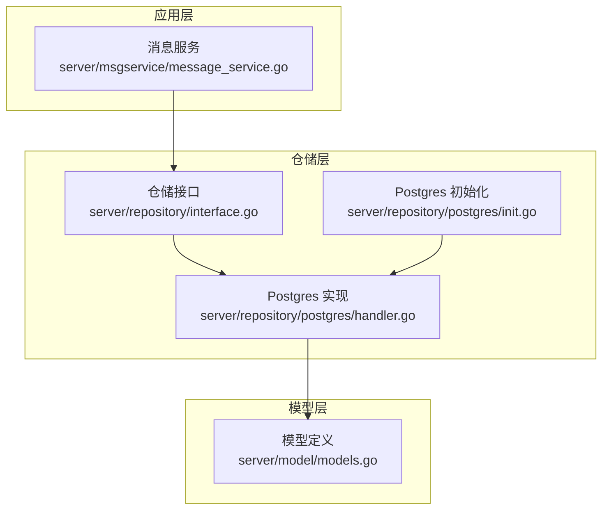
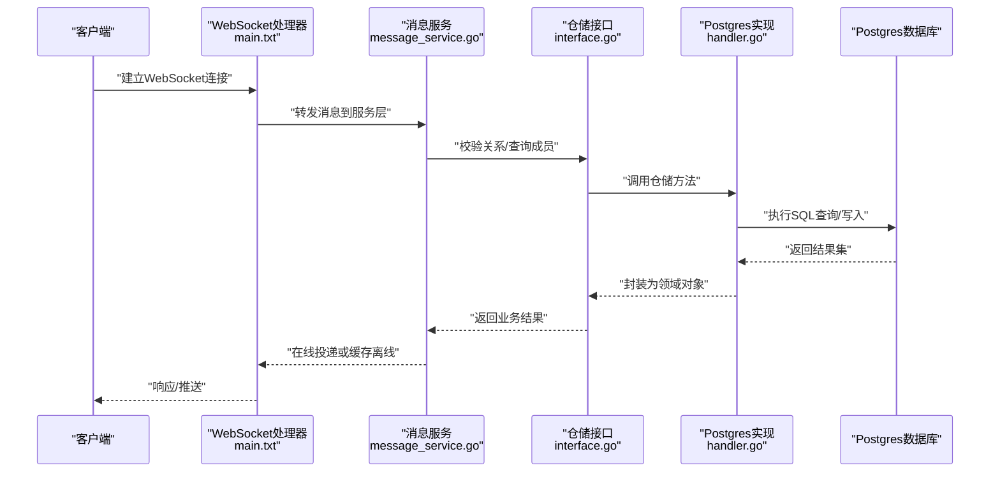
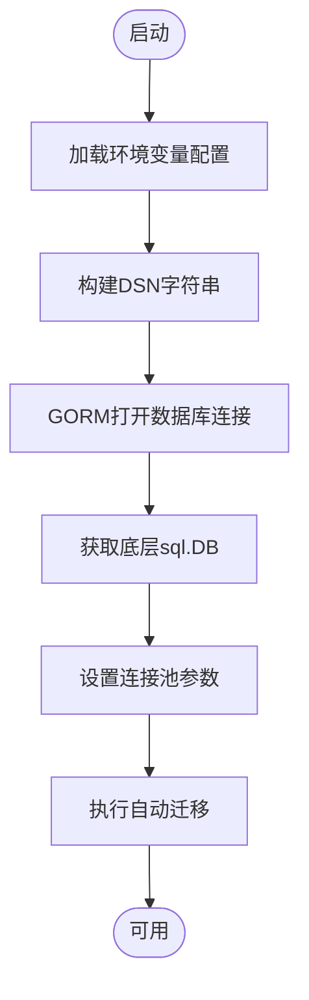
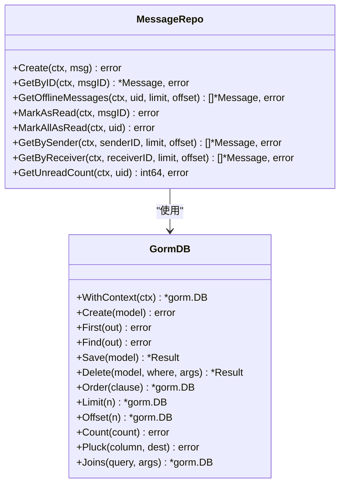
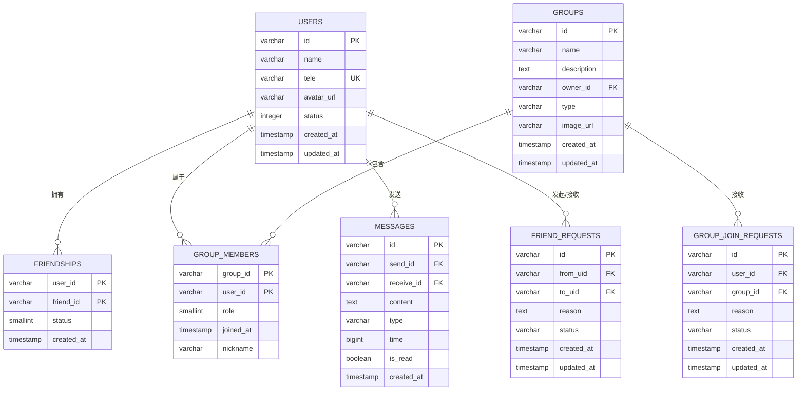
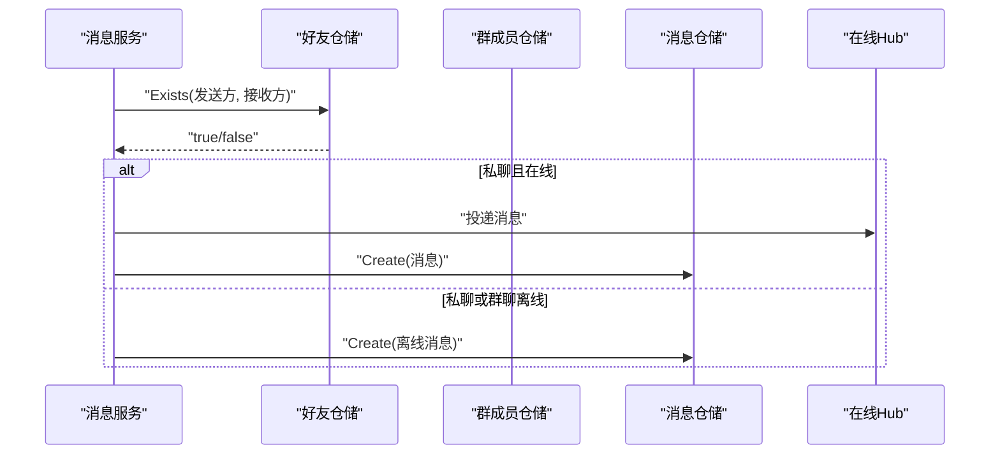
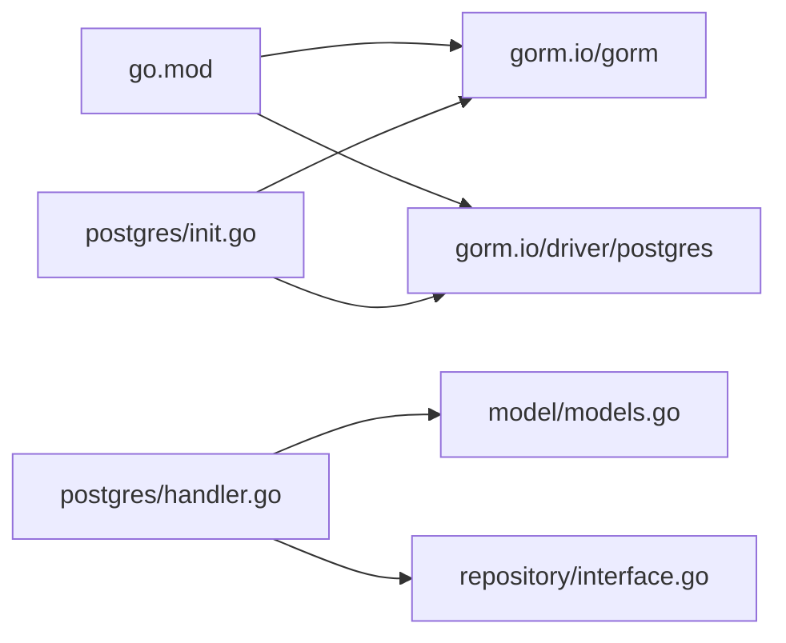

# 数据库配置

<cite>
**本文引用的文件**
- [server\repository\postgres\init.go](file://server/repository/postgres/init.go)
- [server\repository\postgres\handler.go](file://server/repository/postgres/handler.go)
- [server\model\models.go](file://server/model/models.go)
- [server\repository\interface.go](file://server/repository/interface.go)
- [go.mod](file://go.mod)
- [main.txt](file://main.txt)
- [server\msgservice\message_service.go](file://server/msgservice/message_service.go)
</cite>

## 目录
1. [简介](#简介)
2. [项目结构](#项目结构)
3. [核心组件](#核心组件)
4. [架构总览](#架构总览)
5. [详细组件分析](#详细组件分析)
6. [依赖关系分析](#依赖关系分析)
7. [性能考虑](#性能考虑)
8. [故障排查指南](#故障排查指南)
9. [结论](#结论)
10. [附录](#附录)

## 简介
本文件面向Go语言即时通讯项目，提供一套完整的数据库配置与运维指南，聚焦PostgreSQL数据库的安装与配置、连接池与并发控制、事务与隔离、安全（SSL、权限）、性能优化（索引、查询、缓存）以及数据迁移与版本升级策略。文档内容严格基于仓库中现有的数据库相关实现与依赖声明，确保可操作性与一致性。

## 项目结构
本项目采用分层与仓储模式组织数据库访问逻辑：
- 仓储层：通过PostgreSQL驱动实现具体的数据访问接口，负责CRUD与复杂查询。
- 模型层：定义业务实体及表结构映射。
- 接口层：抽象出用户、好友、群组、消息等仓储接口，便于替换实现。
- 应用服务层：消息路由与离线缓存逻辑在应用服务中调用仓储接口。

图表来源
- [server\repository\postgres\init.go:1-75](file://server/repository/postgres/init.go#L1-L75)
- [server\repository\postgres\handler.go:1-585](file://server/repository/postgres/handler.go#L1-L585)
- [server\repository\interface.go:1-74](file://server/repository/interface.go#L1-L74)
- [server\model\models.go:1-146](file://server/model/models.go#L1-L146)
- [server\msgservice\message_service.go:1-168](file://server/msgservice/message_service.go#L1-L168)

章节来源
- [server\repository\postgres\init.go:1-75](file://server/repository/postgres/init.go#L1-L75)
- [server\repository\postgres\handler.go:1-585](file://server/repository/postgres/handler.go#L1-L585)
- [server\repository\interface.go:1-74](file://server/repository/interface.go#L1-L74)
- [server\model\models.go:1-146](file://server/model/models.go#L1-L146)
- [server\msgservice\message_service.go:1-168](file://server/msgservice/message_service.go#L1-L168)

## 核心组件
- Postgres初始化与连接池
  - 从环境变量加载数据库配置，构造DSN并使用GORM打开连接。
  - 设置底层sql.DB的连接生命周期、最大空闲连接数与最大打开连接数。
  - 自动迁移指定模型表结构。
- 仓储接口与实现
  - 定义用户、好友、群组、消息、请求等仓储接口。
  - 提供基于GORM的Postgres实现，覆盖增删改查、批量查询、联表查询与条件聚合。
- 模型与表结构
  - 用户、群组、消息、好友关系、群成员、好友请求、群加入请求等模型。
  - 多对多关联（用户-好友、用户-群组）通过中间表实现。
- 应用服务中的数据库使用
  - 消息服务在路由私聊/群聊时调用仓储接口进行校验与持久化，支持离线消息缓存。

章节来源
- [server\repository\postgres\init.go:15-74](file://server/repository/postgres/init.go#L15-L74)
- [server\repository\postgres\handler.go:21-585](file://server/repository/postgres/handler.go#L21-L585)
- [server\repository\interface.go:8-74](file://server/repository/interface.go#L8-L74)
- [server\model\models.go:23-146](file://server/model/models.go#L23-L146)
- [server\msgservice\message_service.go:27-146](file://server/msgservice/message_service.go#L27-L146)

## 架构总览
下图展示从应用服务到仓储再到数据库的整体调用链路与数据流。

图表来源
- [main.txt:81-103](file://main.txt#L81-L103)
- [server\msgservice\message_service.go:27-108](file://server/msgservice/message_service.go#L27-L108)
- [server\repository\interface.go:46-55](file://server/repository/interface.go#L46-L55)
- [server\repository\postgres\handler.go:327-426](file://server/repository/postgres/handler.go#L327-L426)

## 详细组件分析

### 组件A：Postgres初始化与连接池
- 配置项
  - 主机、端口、用户名、密码、数据库名、SSL模式均来自环境变量。
  - 默认值：主机本地、端口5432、用户postgres、数据库im_db、SSL禁用。
- 连接池参数
  - 最大空闲连接：10
  - 最大打开连接：100
  - 连接最大生命周期：1小时
- 自动迁移
  - 对用户、群组、消息模型执行AutoMigrate，生成对应表结构。

图表来源
- [server\repository\postgres\init.go:24-74](file://server/repository/postgres/init.go#L24-L74)

章节来源
- [server\repository\postgres\init.go:24-74](file://server/repository/postgres/init.go#L24-L74)

### 组件B：仓储接口与实现（消息）
- 能力范围
  - 创建消息、按ID查询、离线消息查询、标记已读/全部已读、按发送方/接收方分页查询、未读计数。
- 查询特性
  - 支持按时间排序、限制条数与偏移量。
  - 使用GORM上下文与事务上下文，保证请求级隔离。
- 错误处理
  - 记录NotFound错误并转换为统一业务错误。

图表来源
- [server\repository\interface.go:46-55](file://server/repository/interface.go#L46-L55)
- [server\repository\postgres\handler.go:327-426](file://server/repository/postgres/handler.go#L327-L426)

章节来源
- [server\repository\interface.go:46-55](file://server/repository/interface.go#L46-L55)
- [server\repository\postgres\handler.go:327-426](file://server/repository/postgres/handler.go#L327-L426)

### 组件C：模型与表结构
- 关键实体
  - 用户：主键、名称、电话、头像、状态、时间戳；支持多对多好友与群组。
  - 群组：主键、名称、描述、所有者、类型、图片、时间戳；支持多对多成员。
  - 消息：主键、发送方、接收方、内容、类型、时间戳、是否已读、创建时间。
  - 好友关系：联合主键（用户ID、好友ID），状态字段。
  - 群成员：联合主键（群ID、用户ID），角色、加入时间、昵称。
  - 好友请求、群加入请求：主键、发起方/用户、目标方/群、原因、状态、时间戳。
- 索引与约束
  - 用户电话唯一索引、消息发送方/接收方/类型/时间/是否已读等索引。
  - 多对多中间表用于维护关系与属性。

图表来源
- [server\model\models.go:23-146](file://server/model/models.go#L23-L146)

章节来源
- [server\model\models.go:23-146](file://server/model/models.go#L23-L146)

### 组件D：应用服务中的数据库交互
- 私聊路由
  - 校验双方为好友，若接收方在线则直发并持久化；否则缓存离线消息。
- 群聊路由
  - 校验发送方为群成员，遍历成员列表投递；在线成员直接推送，离线成员缓存消息。
- 离线消息拉取
  - 读取未读消息并一次性标记为已读，避免重复投递。

图表来源
- [server\msgservice\message_service.go:46-108](file://server/msgservice/message_service.go#L46-L108)
- [server\repository\postgres\handler.go:118-177](file://server/repository/postgres/handler.go#L118-L177)
- [server\repository\postgres\handler.go:239-325](file://server/repository/postgres/handler.go#L239-L325)
- [server\repository\postgres\handler.go:327-438](file://server/repository/postgres/handler.go#L327-L438)

章节来源
- [server\msgservice\message_service.go:27-146](file://server/msgservice/message_service.go#L27-L146)
- [server\repository\postgres\handler.go:118-177](file://server/repository/postgres/handler.go#L118-L177)
- [server\repository\postgres\handler.go:239-325](file://server/repository/postgres/handler.go#L239-L325)
- [server\repository\postgres\handler.go:327-438](file://server/repository/postgres/handler.go#L327-L438)

## 依赖关系分析
- 数据库驱动与ORM
  - 使用GORM v1.x与Postgres驱动，版本在模块清单中声明。
- 依赖导入路径
  - 仓储实现位于server/repository/postgres，模型位于server/model，接口位于server/repository。
- 运行时入口
  - 当前仓库入口为main.txt（WebSocket演示），数据库初始化逻辑在Postgres初始化模块中。

图表来源
- [go.mod:10-11](file://go.mod#L10-L11)
- [server\repository\postgres\init.go:3-12](file://server/repository/postgres/init.go#L3-L12)
- [server\repository\postgres\handler.go:3-11](file://server/repository/postgres/handler.go#L3-L11)
- [server\model\models.go:1-6](file://server/model/models.go#L1-L6)
- [server\repository\interface.go:3-6](file://server/repository/interface.go#L3-L6)

章节来源
- [go.mod:10-11](file://go.mod#L10-L11)
- [server\repository\postgres\init.go:3-12](file://server/repository/postgres/init.go#L3-L12)
- [server\repository\postgres\handler.go:3-11](file://server/repository/postgres/handler.go#L3-L11)
- [server\model\models.go:1-6](file://server/model/models.go#L1-L6)
- [server\repository\interface.go:3-6](file://server/repository/interface.go#L3-L6)

## 性能考虑
- 连接池与并发
  - 当前设置：最大空闲10、最大打开100、连接最大生命周期1小时。适用于中低并发场景；高并发建议结合负载与延迟指标调整最大打开连接数。
- 查询优化
  - 已有索引：用户电话唯一索引、消息发送方/接收方/类型/时间/是否已读等复合索引，有助于高频查询。
  - 分页与排序：消息查询支持按时间排序并限制条数/偏移，建议配合合适的索引与LIMIT使用。
- 缓存策略
  - 在线直投优先，离线消息通过仓储持久化，减少数据库压力；可结合Redis等缓存进一步加速热点查询（需扩展实现）。
- 索引设计建议
  - 针对高频过滤字段（如消息接收方、时间范围）建立复合索引。
  - 对好友关系与群成员关系的联合主键查询已具备良好性能，保持现状即可。
- 事务与隔离
  - GORM默认使用事务包裹单次写操作；对于批量写入建议显式开启事务以提升吞吐并保证一致性。

章节来源
- [server\repository\postgres\init.go:59-61](file://server/repository/postgres/init.go#L59-L61)
- [server\model\models.go:23-36](file://server/model/models.go#L23-L36)
- [server\repository\postgres\handler.go:354-426](file://server/repository/postgres/handler.go#L354-L426)

## 故障排查指南
- 连接失败
  - 检查环境变量DB_HOST/DB_PORT/DB_USER/DB_PASSWORD/DB_NAME/DB_SSLMODE是否正确。
  - 确认PostgreSQL服务可达、认证方式与SSL模式匹配。
- 迁移失败
  - AutoMigrate会根据模型生成DDL；若字段冲突，请先备份数据库并评估迁移策略。
- 查询异常
  - NotFound错误会被转换为业务错误；确认查询条件与索引是否匹配。
- 连接池耗尽
  - 观察最大打开连接数是否达到瓶颈；适当提高MaxOpenConns或优化慢查询。
- 离线消息未读
  - 确认消息读取后标记逻辑是否执行；检查消息接收方ID与未读状态字段。

章节来源
- [server\repository\postgres\init.go:24-33](file://server/repository/postgres/init.go#L24-L33)
- [server\repository\postgres\handler.go:335-379](file://server/repository/postgres/handler.go#L335-L379)
- [server\repository\postgres\handler.go:428-438](file://server/repository/postgres/handler.go#L428-L438)

## 结论
本项目基于GORM与Postgres实现了清晰的仓储层与模型层，具备完善的连接池配置与自动迁移能力。建议在生产环境中结合业务流量与SLA，进一步优化连接池参数、索引与查询计划，并引入缓存与监控体系，以获得更稳健的性能表现。

## 附录

### A. PostgreSQL安装与基础配置要点
- 版本与兼容性
  - 项目使用GORM v1与Postgres驱动，建议使用PostgreSQL 12+以获得更好的兼容性与性能。
- 基础配置
  - 设置监听地址与端口、认证方式（本地建议trust，远程建议md5/scram）。
  - 合理设置共享内存、工作进程与WAL参数，满足并发与可靠性需求。
- SSL连接
  - 生产环境建议启用SSL；可通过DB_SSLMODE参数切换（当前默认disable，建议改为require或verify-full）。

章节来源
- [server\repository\postgres\init.go:24-32](file://server/repository/postgres/init.go#L24-L32)

### B. 数据库初始化脚本与表结构
- 初始化流程
  - 加载环境变量 → 构建DSN → 打开GORM连接 → 设置连接池 → 执行AutoMigrate。
- 表结构
  - 用户、群组、消息、好友关系、群成员、好友请求、群加入请求等。
- 索引
  - 用户电话唯一索引、消息多列索引（发送方/接收方/类型/时间/是否已读）。

章节来源
- [server\repository\postgres\init.go:42-74](file://server/repository/postgres/init.go#L42-L74)
- [server\model\models.go:23-146](file://server/model/models.go#L23-L146)

### C. 连接池与并发控制
- 参数说明
  - 最大空闲连接：10
  - 最大打开连接：100
  - 连接最大生命周期：1小时
- 调优建议
  - 根据QPS与平均响应时间动态调整最大打开连接数。
  - 合理设置空闲连接上限，避免过多空闲连接占用资源。

章节来源
- [server\repository\postgres\init.go:59-61](file://server/repository/postgres/init.go#L59-L61)

### D. 事务隔离与一致性
- 事务边界
  - 单次写操作由GORM自动包裹事务；批量写入建议显式开启事务。
- 隔离级别
  - 默认隔离级别由PostgreSQL决定；如需强一致，可在事务开始时显式设置。

章节来源
- [server\repository\postgres\handler.go:29-31](file://server/repository/postgres/handler.go#L29-L31)

### E. 安全配置（SSL、权限、备份）
- SSL连接
  - 通过DB_SSLMODE参数控制；生产环境建议使用require或verify-full。
- 用户权限
  - 为应用账号授予最小必要权限（仅限业务表的SELECT/INSERT/UPDATE/DELETE）。
- 备份策略
  - 建议采用定期逻辑备份（pg_dump）与增量备份（WAL归档）相结合的方式，确保可恢复点合理。

章节来源
- [server\repository\postgres\init.go:24-32](file://server/repository/postgres/init.go#L24-L32)

### F. 性能优化建议（索引、查询、缓存）
- 索引
  - 针对高频查询字段建立复合索引；定期分析统计信息并更新。
- 查询
  - 使用LIMIT与OFFSET分页；避免SELECT *；尽量命中索引。
- 缓存
  - 引入Redis缓存热点数据（如用户资料、好友列表快照），降低数据库压力。

章节来源
- [server\model\models.go:23-36](file://server/model/models.go#L23-L36)
- [server\repository\postgres\handler.go:354-426](file://server/repository/postgres/handler.go#L354-L426)

### G. 数据迁移与版本升级
- 迁移策略
  - 使用GORM AutoMigrate进行结构变更；对破坏性变更（如删除列）需编写回滚脚本。
- 版本管理
  - 建议引入数据库版本管理工具（如Flyway/liquibase），统一迁移脚本与发布流程。
- 回滚与验证
  - 迁移前后进行数据一致性校验与压测，确保升级无风险。

章节来源
- [server\repository\postgres\init.go:67-74](file://server/repository/postgres/init.go#L67-L74)