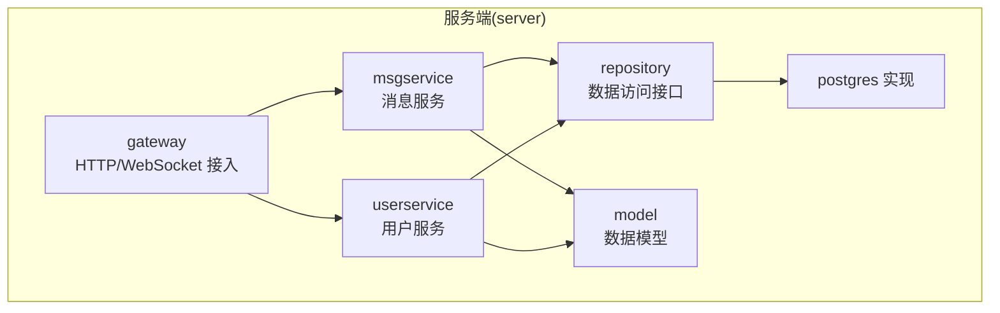
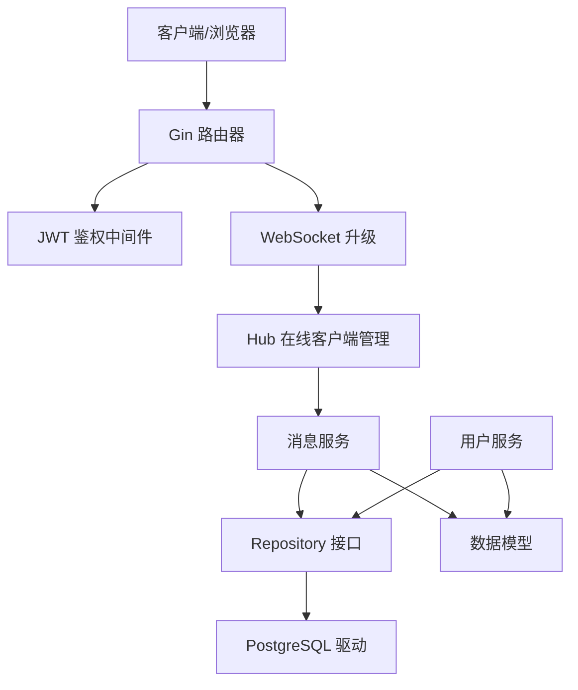
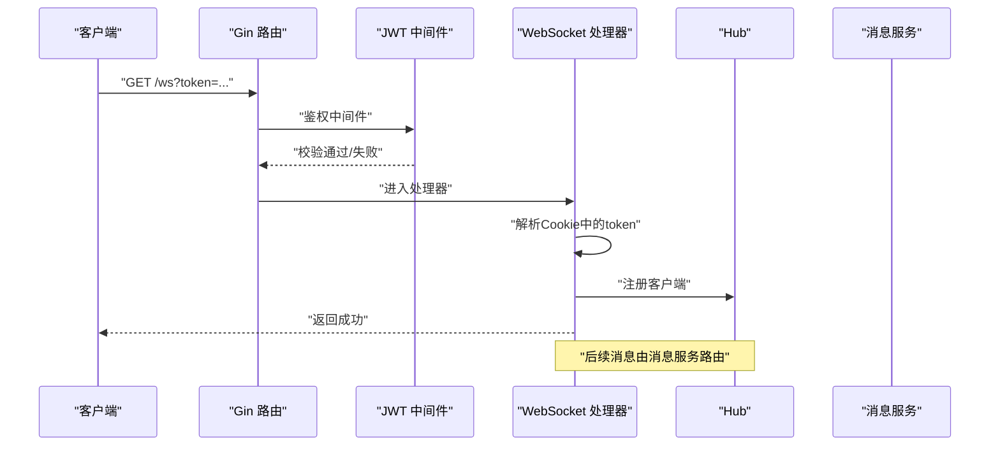
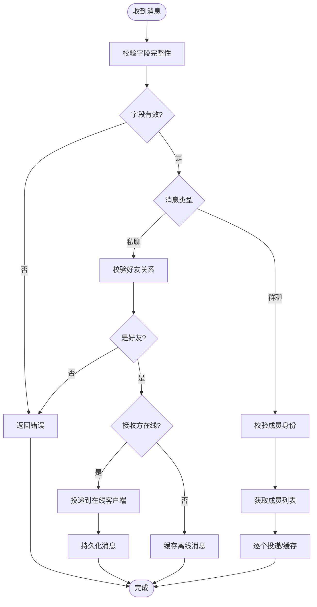
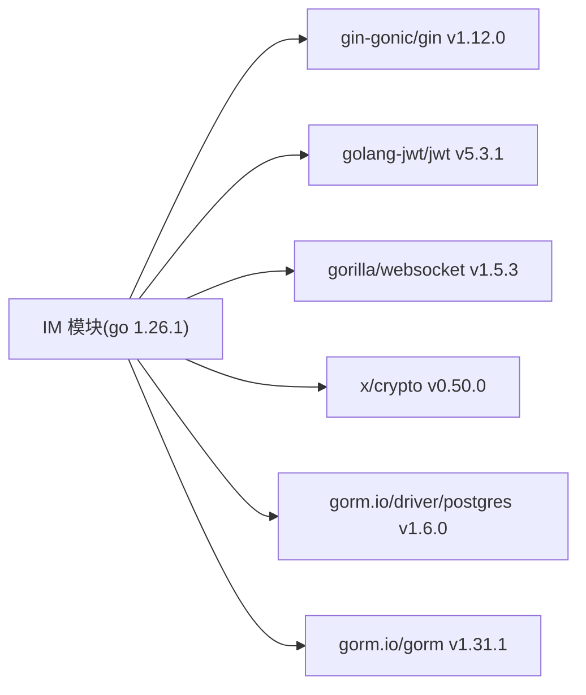
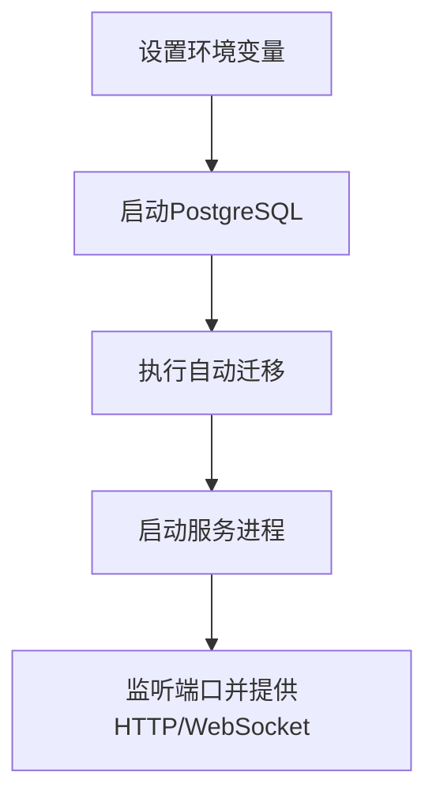

# 环境准备

<cite>
**本文引用的文件列表**
- [go.mod](file://go.mod)
- [go.sum](file://go.sum)
- [main.txt](file://main.txt)
- [server/model/models.go](file://server/model/models.go)
- [server/repository/postgres/init.go](file://server/repository/postgres/init.go)
- [server/gateway/api/ws_handler.go](file://server/gateway/api/ws_handler.go)
- [server/msgservice/hub/hub.go](file://server/msgservice/hub/hub.go)
- [server/userservice/user_service.go](file://server/userservice/user_service.go)
- [server/gateway/auth/auth.go](file://server/gateway/auth/auth.go)
- [server/msgservice/message_service.go](file://server/msgservice/message_service.go)
- [server/repository/interface.go](file://server/repository/interface.go)
</cite>

## 目录
1. [简介](#简介)
2. [项目结构](#项目结构)
3. [核心组件](#核心组件)
4. [架构总览](#架构总览)
5. [详细组件分析](#详细组件分析)
6. [依赖分析](#依赖分析)
7. [性能考虑](#性能考虑)
8. [故障排查指南](#故障排查指南)
9. [结论](#结论)
10. [附录](#附录)

## 简介
本文件面向Go语言即时通讯项目的环境准备与部署，覆盖以下内容：
- 操作系统兼容性（Windows、Linux、macOS）
- Go语言版本要求（1.26.1+）
- 编译工具链与开发工具推荐（VS Code、GoLand）
- 环境变量配置（数据库连接参数）
- 依赖包清单与版本要求
- 常见环境问题排查与解决方案

## 项目结构
该项目采用模块化分层设计，主要目录与职责如下：
- server：后端服务主体
  - gateway：HTTP网关与WebSocket接入层
  - model：数据模型定义
  - repository：数据访问接口与PostgreSQL实现
  - msgservice：消息路由与在线状态管理
  - userservice：用户、好友、群组业务逻辑
- client：前端或客户端示例（本仓库未包含具体实现）
- 根目录：模块定义与依赖声明

图表来源
- [server/gateway/api/ws_handler.go:1-69](file://server/gateway/api/ws_handler.go#L1-L69)
- [server/msgservice/message_service.go:1-168](file://server/msgservice/message_service.go#L1-L168)
- [server/userservice/user_service.go:1-187](file://server/userservice/user_service.go#L1-L187)
- [server/repository/interface.go:1-74](file://server/repository/interface.go#L1-L74)
- [server/repository/postgres/init.go:1-75](file://server/repository/postgres/init.go#L1-L75)
- [server/model/models.go:1-146](file://server/model/models.go#L1-L146)

章节来源
- [go.mod:1-51](file://go.mod#L1-L51)

## 核心组件
- HTTP与WebSocket接入层：负责升级HTTP请求为WebSocket，鉴权与连接注册。
- 消息服务：根据消息类型（私聊/群聊）进行路由与投递，支持离线缓存。
- 用户服务：用户注册、登录、好友关系与群组管理。
- 数据访问层：抽象接口与PostgreSQL实现，自动迁移表结构。
- 数据模型：用户、群组、消息、关系等实体及约束。

章节来源
- [server/gateway/api/ws_handler.go:1-69](file://server/gateway/api/ws_handler.go#L1-L69)
- [server/msgservice/message_service.go:1-168](file://server/msgservice/message_service.go#L1-L168)
- [server/userservice/user_service.go:1-187](file://server/userservice/user_service.go#L1-L187)
- [server/repository/interface.go:1-74](file://server/repository/interface.go#L1-L74)
- [server/repository/postgres/init.go:1-75](file://server/repository/postgres/init.go#L1-L75)
- [server/model/models.go:1-146](file://server/model/models.go#L1-L146)

## 架构总览
系统通过Gin提供REST与WebSocket入口，使用JWT进行鉴权，GORM驱动PostgreSQL存储，消息通过Hub在内存中广播与路由。

图表来源
- [server/gateway/api/ws_handler.go:1-69](file://server/gateway/api/ws_handler.go#L1-L69)
- [server/gateway/auth/auth.go:1-91](file://server/gateway/auth/auth.go#L1-L91)
- [server/msgservice/hub/hub.go:1-61](file://server/msgservice/hub/hub.go#L1-L61)
- [server/msgservice/message_service.go:1-168](file://server/msgservice/message_service.go#L1-L168)
- [server/repository/postgres/init.go:1-75](file://server/repository/postgres/init.go#L1-L75)
- [server/model/models.go:1-146](file://server/model/models.go#L1-L146)

## 详细组件分析

### 组件A：WebSocket接入与鉴权
- 功能要点
  - 限制来源域名，防止跨域滥用
  - 从Cookie读取token并解析，注入用户上下文
  - 升级HTTP为WebSocket并注册到Hub
- 关键流程

图表来源
- [server/gateway/api/ws_handler.go:1-69](file://server/gateway/api/ws_handler.go#L1-L69)
- [server/gateway/auth/auth.go:1-91](file://server/gateway/auth/auth.go#L1-L91)
- [server/msgservice/hub/hub.go:1-61](file://server/msgservice/hub/hub.go#L1-L61)

章节来源
- [server/gateway/api/ws_handler.go:1-69](file://server/gateway/api/ws_handler.go#L1-L69)
- [server/gateway/auth/auth.go:1-91](file://server/gateway/auth/auth.go#L1-L91)

### 组件B：消息路由与投递
- 功能要点
  - 私聊：校验好友关系，优先投递至在线客户端，否则缓存离线消息
  - 群聊：校验成员身份，向所有成员广播，分别缓存离线消息
  - 时间戳与消息ID策略
- 流程图

图表来源
- [server/msgservice/message_service.go:1-168](file://server/msgservice/message_service.go#L1-L168)

章节来源
- [server/msgservice/message_service.go:1-168](file://server/msgservice/message_service.go#L1-L168)

### 组件C：用户服务与密码加密
- 功能要点
  - 用户注册：去重检查、密码哈希、生成唯一ID
  - 登录：凭手机号查询用户并比对密码
  - 好友请求：发送、接受、拒绝、删除
  - 群组管理：成员增删、角色维护
- 复杂度与性能
  - 密码哈希成本可控，默认成本已平衡安全与性能
  - 查询与关系操作依赖数据库索引与事务

章节来源
- [server/userservice/user_service.go:1-187](file://server/userservice/user_service.go#L1-L187)

### 组件D：数据模型与自动迁移
- 数据模型
  - 用户、群组、消息、好友关系、群成员、好友请求、加群请求
  - 多对多关系：用户-好友、用户-群组
- 自动迁移
  - 启动时自动迁移指定表，确保Schema一致性

章节来源
- [server/model/models.go:1-146](file://server/model/models.go#L1-L146)
- [server/repository/postgres/init.go:67-75](file://server/repository/postgres/init.go#L67-L75)

## 依赖分析
- 模块与Go版本
  - 模块名：IM
  - Go版本：1.26.1
- 直接依赖（核心）
  - github.com/gin-gonic/gin v1.12.0
  - github.com/golang-jwt/jwt/v5 v5.3.1
  - github.com/gorilla/websocket v1.5.3
  - golang.org/x/crypto v0.50.0
  - gorm.io/driver/postgres v1.6.0
  - gorm.io/gorm v1.31.1
- 间接依赖（示例）
  - golang.org/x/net、golang.org/x/sys、google.golang.org/protobuf 等

图表来源
- [go.mod:5-12](file://go.mod#L5-L12)

章节来源
- [go.mod:1-51](file://go.mod#L1-L51)
- [go.sum:1-113](file://go.sum#L1-L113)

## 性能考虑
- 并发与锁
  - Hub使用读写锁保护在线客户端映射，降低竞争
- 缓冲与背压
  - 客户端Send通道容量为256，避免阻塞；默认丢弃溢出以保护系统
- 数据库连接池
  - 设置最大空闲/打开连接数与生命周期，提升吞吐
- 加密成本
  - bcrypt默认成本已平衡安全与性能，可根据硬件调整

章节来源
- [server/msgservice/hub/hub.go:1-61](file://server/msgservice/hub/hub.go#L1-L61)
- [server/repository/postgres/init.go:54-65](file://server/repository/postgres/init.go#L54-L65)
- [server/userservice/user_service.go:36-40](file://server/userservice/user_service.go#L36-L40)

## 故障排查指南
- 启动失败：找不到模块或依赖
  - 确认Go版本满足1.26.1+
  - 清理并重新下载依赖：go clean -modcache && go mod tidy
- WebSocket连接失败
  - 检查Origin白名单是否包含当前域名
  - 确认Cookie中存在token且格式正确
- 数据库连接失败
  - 检查环境变量：DB_HOST、DB_PORT、DB_USER、DB_PASSWORD、DB_NAME、DB_SSLMODE
  - 确认PostgreSQL服务运行且可访问
- 消息无法投递
  - 私聊需为好友；群聊需为成员
  - 在线客户端缓冲溢出会触发离线缓存，检查消息持久化
- JWT鉴权失败
  - 确认Authorization头格式为Bearer Token
  - 检查签名算法与过期时间

章节来源
- [server/gateway/api/ws_handler.go:14-28](file://server/gateway/api/ws_handler.go#L14-L28)
- [server/gateway/auth/auth.go:37-61](file://server/gateway/auth/auth.go#L37-L61)
- [server/repository/postgres/init.go:24-33](file://server/repository/postgres/init.go#L24-L33)

## 结论
本项目基于Go 1.26.1构建，采用清晰的分层架构与明确的依赖约束。按本文档准备环境、配置数据库与环境变量后，即可顺利启动服务并进行功能验证。建议在生产环境中进一步完善日志、监控与安全加固。

## 附录

### A. 操作系统与工具链
- 操作系统
  - Windows、Linux、macOS均支持，建议使用最新稳定版
- Go版本
  - 必须满足：1.26.1及以上
- 开发工具推荐
  - VS Code：配合Go扩展，支持调试、格式化、静态检查
  - GoLand：专业IDE，内置调试器与重构能力
- 编译工具链
  - go build、go run、go test、go mod tidy

章节来源
- [go.mod:3-3](file://go.mod#L3-L3)

### B. 环境变量配置
- 数据库连接参数（通过环境变量加载）
  - DB_HOST：数据库主机地址，默认localhost
  - DB_PORT：数据库端口，默认5432
  - DB_USER：数据库用户名，默认postgres
  - DB_PASSWORD：数据库密码，默认postgres
  - DB_NAME：数据库名称，默认im_db
  - DB_SSLMODE：SSL模式，默认disable

章节来源
- [server/repository/postgres/init.go:24-33](file://server/repository/postgres/init.go#L24-L33)

### C. 依赖包与版本要求
- 直接依赖
  - gin-gonic/gin v1.12.0
  - golang-jwt/jwt v5.3.1
  - gorilla/websocket v1.5.3
  - golang.org/x/crypto v0.50.0
  - gorm.io/driver/postgres v1.6.0
  - gorm.io/gorm v1.31.1
- 间接依赖（示例）
  - golang.org/x/net、golang.org/x/sys、google.golang.org/protobuf 等

章节来源
- [go.mod:5-12](file://go.mod#L5-L12)
- [go.sum:1-113](file://go.sum#L1-L113)

### D. 典型启动流程（概念）

[此图为概念流程，不直接对应具体源码文件]