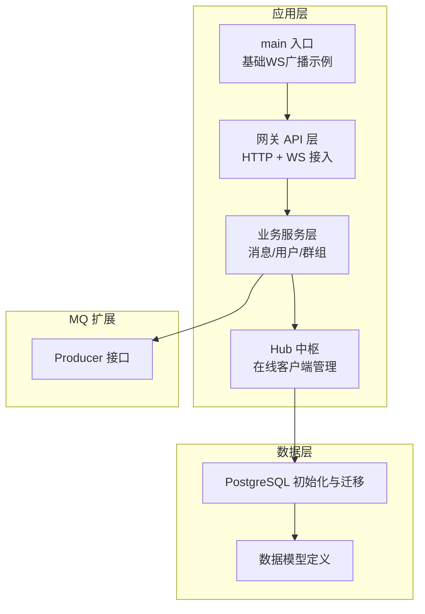
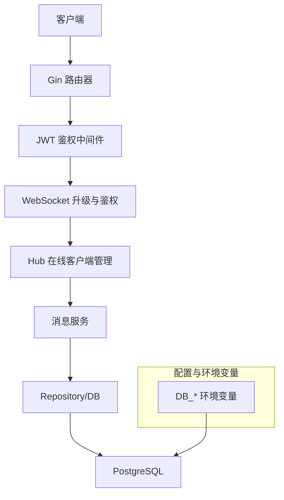
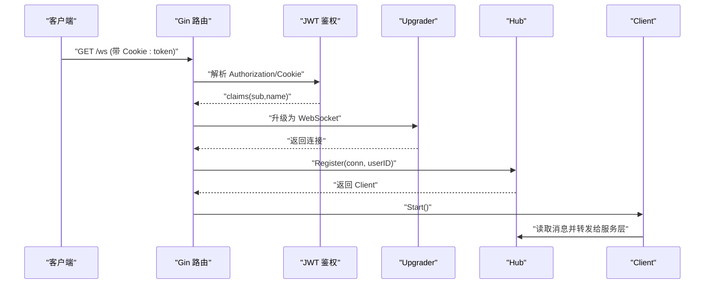
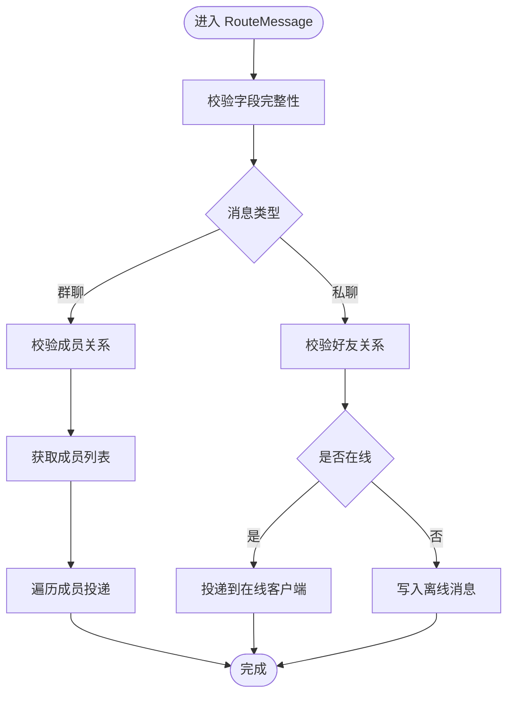
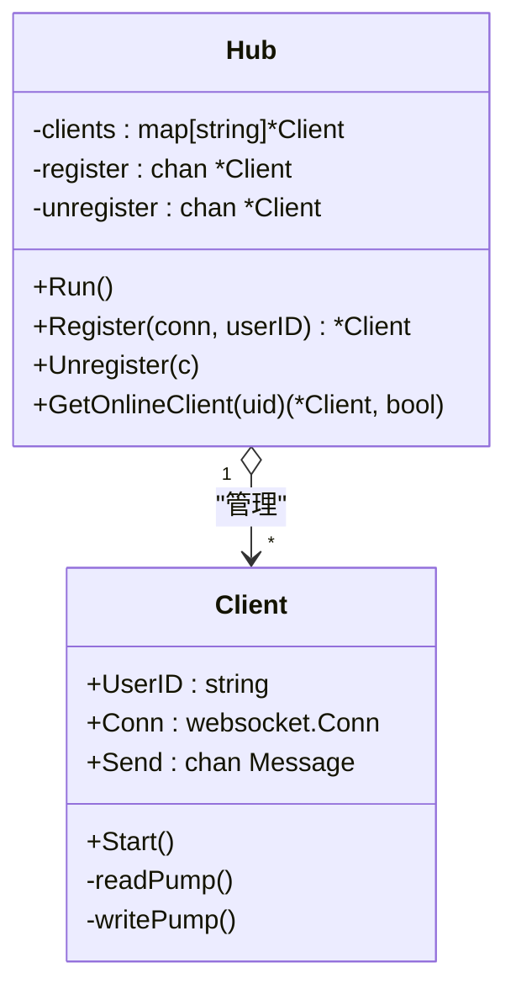
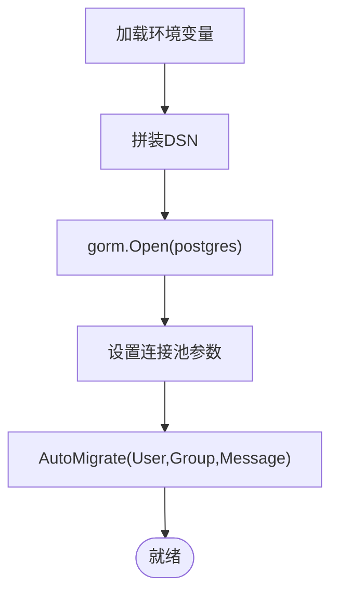
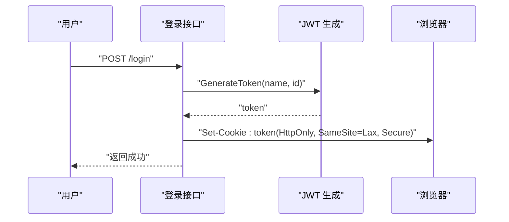
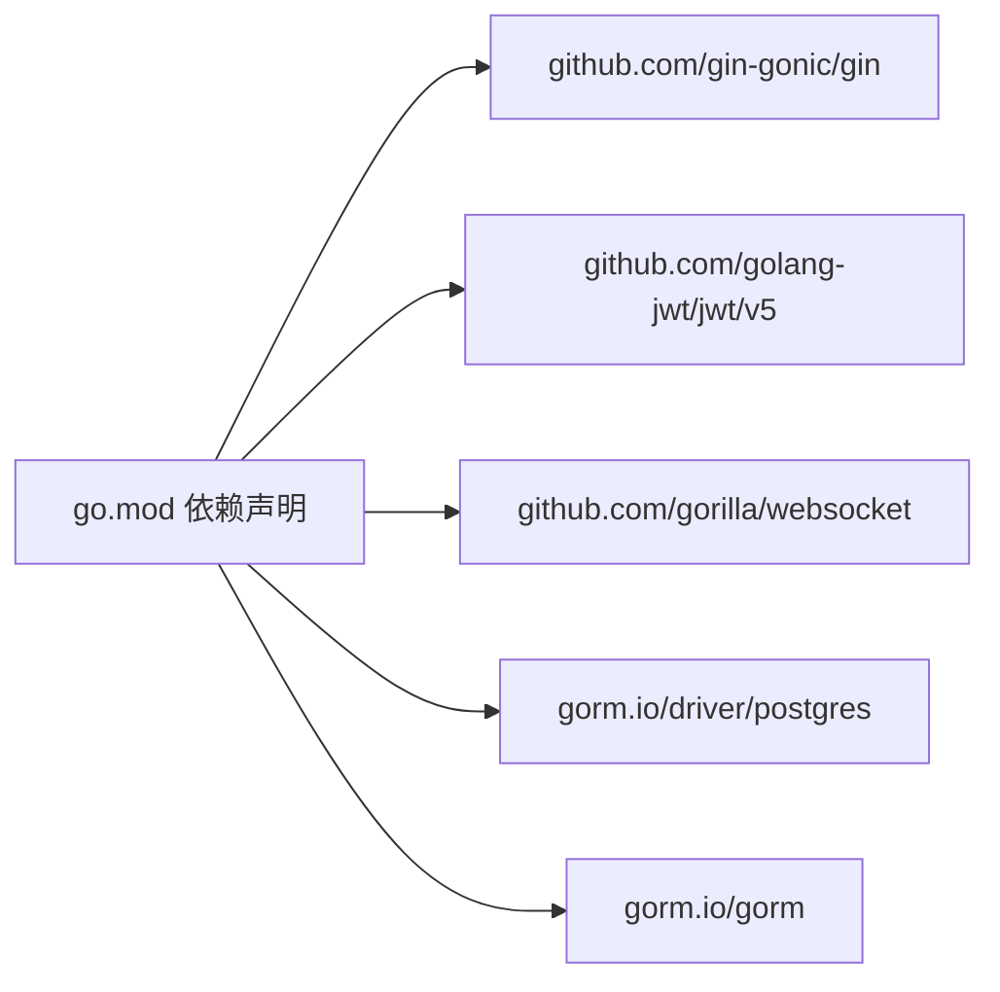

# 部署配置

<cite>
**本文引用的文件**
- [go.mod](file://go.mod)
- [main.txt](file://main.txt)
- [server/gateway/api/ws_handler.go](file://server/gateway/api/ws_handler.go)
- [server/gateway/auth/auth.go](file://server/gateway/auth/auth.go)
- [server/repository/postgres/init.go](file://server/repository/postgres/init.go)
- [server/msgservice/message_service.go](file://server/msgservice/message_service.go)
- [server/msgservice/hub/hub.go](file://server/msgservice/hub/hub.go)
- [server/msgservice/hub/client.go](file://server/msgservice/hub/client.go)
- [server/gateway/api/user_handler.go](file://server/gateway/api/user_handler.go)
- [server/gateway/api/message_handler.go](file://server/gateway/api/message_handler.go)
- [server/model/models.go](file://server/model/models.go)
- [server/mq/interface.go](file://server/mq/interface.go)
</cite>

## 目录
1. [简介](#简介)
2. [项目结构](#项目结构)
3. [核心组件](#核心组件)
4. [架构总览](#架构总览)
5. [详细组件分析](#详细组件分析)
6. [依赖关系分析](#依赖关系分析)
7. [性能与容量规划](#性能与容量规划)
8. [容器化与编排](#容器化与编排)
9. [负载均衡与高可用](#负载均衡与高可用)
10. [监控告警与日志管理](#监控告警与日志管理)
11. [备份恢复与灾难恢复](#备份恢复与灾难恢复)
12. [安全加固与合规](#安全加固与合规)
13. [故障排查指南](#故障排查指南)
14. [结论](#结论)

## 简介
本文件面向Go语言即时通讯项目的生产部署，覆盖操作系统与硬件要求、网络配置、数据库与JWT配置、WebSocket参数、容器化与Kubernetes部署、负载均衡与高可用、监控告警、日志管理、备份恢复与容灾、性能调优与容量规划、以及安全加固与合规检查。内容基于仓库中现有源码进行提炼与扩展，确保可操作性与可追溯性。

## 项目结构
项目采用分层与功能模块结合的组织方式：
- 顶层入口：main函数负责基础WebSocket广播示例（用于演示）
- 网关层：HTTP路由与WebSocket接入，鉴权与会话注册
- 业务服务层：消息路由、用户与群组服务接口
- 消息中枢：Hub负责在线客户端管理与消息分发
- 数据访问层：PostgreSQL初始化与迁移
- 模型层：用户、群组、消息等数据模型
- MQ接口：消息队列Producer接口定义（便于扩展）

**图表来源**
- [main.txt:159-174](file://main.txt#L159-L174)
- [server/gateway/api/ws_handler.go:39-68](file://server/gateway/api/ws_handler.go#L39-L68)
- [server/msgservice/message_service.go:12-25](file://server/msgservice/message_service.go#L12-L25)
- [server/msgservice/hub/hub.go:10-25](file://server/msgservice/hub/hub.go#L10-L25)
- [server/repository/postgres/init.go:42-74](file://server/repository/postgres/init.go#L42-L74)
- [server/model/models.go:23-105](file://server/model/models.go#L23-L105)
- [server/mq/interface.go:1-6](file://server/mq/interface.go#L1-L6)

**章节来源**
- [go.mod:1-51](file://go.mod#L1-L51)
- [main.txt:159-174](file://main.txt#L159-L174)

## 核心组件
- 应用入口与基础WS广播：用于本地演示，生产环境建议关闭或限制访问
- 网关API与WebSocket处理：负责鉴权、跨域控制、升级WS连接、注册到Hub
- JWT鉴权：生成与解析，支持中间件校验
- 消息服务：私聊/群聊路由、离线缓存、在线状态查询
- Hub中枢：按用户ID维护在线客户端，支持读写泵循环
- PostgreSQL初始化：DSN构造、连接池参数、自动迁移
- 数据模型：用户、群组、消息、关系表
- MQ接口：Producer接口预留，便于异步解耦

**章节来源**
- [main.txt:13-174](file://main.txt#L13-L174)
- [server/gateway/api/ws_handler.go:14-68](file://server/gateway/api/ws_handler.go#L14-L68)
- [server/gateway/auth/auth.go:14-90](file://server/gateway/auth/auth.go#L14-L90)
- [server/msgservice/message_service.go:12-168](file://server/msgservice/message_service.go#L12-L168)
- [server/msgservice/hub/hub.go:10-61](file://server/msgservice/hub/hub.go#L10-L61)
- [server/msgservice/hub/client.go:20-87](file://server/msgservice/hub/client.go#L20-L87)
- [server/repository/postgres/init.go:15-74](file://server/repository/postgres/init.go#L15-L74)
- [server/model/models.go:23-146](file://server/model/models.go#L23-L146)
- [server/mq/interface.go:1-6](file://server/mq/interface.go#L1-L6)

## 架构总览
系统采用“HTTP API + WebSocket”双栈，鉴权通过JWT实现；消息路由在服务层完成，Hub负责在线分发；数据库使用PostgreSQL并启用连接池与自动迁移。

**图表来源**
- [server/gateway/api/ws_handler.go:39-68](file://server/gateway/api/ws_handler.go#L39-L68)
- [server/gateway/auth/auth.go:37-61](file://server/gateway/auth/auth.go#L37-L61)
- [server/msgservice/hub/hub.go:27-42](file://server/msgservice/hub/hub.go#L27-L42)
- [server/msgservice/message_service.go:27-108](file://server/msgservice/message_service.go#L27-L108)
- [server/repository/postgres/init.go:42-65](file://server/repository/postgres/init.go#L42-L65)

## 详细组件分析

### 组件A：WebSocket接入与鉴权
- 跨域控制：白名单允许特定Origin，其他拒绝
- 鉴权：从Cookie读取token，解析后注入上下文
- 升级：成功后注册到Hub并启动读写泵
- 客户端参数：读写缓冲区、心跳与超时

**图表来源**
- [server/gateway/api/ws_handler.go:39-68](file://server/gateway/api/ws_handler.go#L39-L68)
- [server/gateway/auth/auth.go:48-54](file://server/gateway/auth/auth.go#L48-L54)
- [server/msgservice/hub/hub.go:44-51](file://server/msgservice/hub/hub.go#L44-L51)
- [server/msgservice/hub/client.go:27-60](file://server/msgservice/hub/client.go#L27-L60)

**章节来源**
- [server/gateway/api/ws_handler.go:14-28](file://server/gateway/api/ws_handler.go#L14-L28)
- [server/gateway/api/ws_handler.go:39-68](file://server/gateway/api/ws_handler.go#L39-L68)
- [server/msgservice/hub/client.go:20-25](file://server/msgservice/hub/client.go#L20-L25)

### 组件B：消息服务与路由
- 私聊：校验好友关系，若在线直接投递，否则落库离线
- 群聊：校验成员关系，遍历成员，逐个投递或离线缓存
- 离线消息：批量读取并标记已读
- 在线状态：查询好友在线列表

**图表来源**
- [server/msgservice/message_service.go:27-108](file://server/msgservice/message_service.go#L27-L108)

**章节来源**
- [server/msgservice/message_service.go:27-168](file://server/msgservice/message_service.go#L27-L168)

### 组件C：Hub与客户端读写泵
- Hub：以用户ID为键维护在线客户端，注册/注销通道
- Client：读泵解析消息并交给服务层；写泵定时Ping、限流与超时
- 心跳与超时：读/写超时、Ping周期、最大消息尺寸

**图表来源**
- [server/msgservice/hub/hub.go:10-61](file://server/msgservice/hub/hub.go#L10-L61)
- [server/msgservice/hub/client.go:12-87](file://server/msgservice/hub/client.go#L12-L87)

**章节来源**
- [server/msgservice/hub/hub.go:10-61](file://server/msgservice/hub/hub.go#L10-L61)
- [server/msgservice/hub/client.go:20-87](file://server/msgservice/hub/client.go#L20-L87)

### 组件D：数据库初始化与迁移
- 环境变量：DB_HOST、DB_PORT、DB_USER、DB_PASSWORD、DB_NAME、DB_SSLMODE
- 连接池：最大空闲/最大打开连接数、连接最长生命周期
- 自动迁移：User、Group、Message

**图表来源**
- [server/repository/postgres/init.go:24-74](file://server/repository/postgres/init.go#L24-L74)

**章节来源**
- [server/repository/postgres/init.go:15-74](file://server/repository/postgres/init.go#L15-L74)

### 组件E：JWT配置与中间件
- 密钥：当前为固定字节数组，生产需替换为强随机密钥
- 中间件：校验Authorization头格式与签名有效性
- 登录：生成token并设置HttpOnly SameSite Cookie

**图表来源**
- [server/gateway/auth/auth.go:22-34](file://server/gateway/auth/auth.go#L22-L34)
- [server/gateway/api/user_handler.go:53-60](file://server/gateway/api/user_handler.go#L53-L60)

**章节来源**
- [server/gateway/auth/auth.go:14-90](file://server/gateway/auth/auth.go#L14-L90)
- [server/gateway/api/user_handler.go:39-61](file://server/gateway/api/user_handler.go#L39-L61)

## 依赖关系分析
- 语言与框架：Go 1.26.1，Gin Web框架，Gorilla WebSocket，GORM PostgreSQL驱动
- 关键外部库：JWT、PostgreSQL驱动、GORM
- 内部模块：gateway、msgservice、repository、userservice、model、mq

**图表来源**
- [go.mod:5-12](file://go.mod#L5-L12)

**章节来源**
- [go.mod:1-51](file://go.mod#L1-L51)

## 性能与容量规划
- 连接池参数：建议根据峰值并发与数据库性能压测结果调整最大打开/空闲连接数与生命周期
- Hub通道容量：注册/注销通道容量与消息广播通道容量应与预期并发匹配
- 客户端缓冲：单连接发送队列容量（默认256）需结合消息吞吐评估
- 心跳与超时：读/写超时与Ping周期影响长连接稳定性与资源占用
- 离线消息：合理设置离线消息上限与清理策略，避免数据库膨胀
- 缓存与持久化：消息路由优先在线投递，离线走数据库，必要时引入Redis作为缓存层

[本节为通用指导，无需具体文件分析]

## 容器化与编排
- 基础镜像：建议使用官方Go镜像作为构建阶段，Alpine或Debian Slim作为运行时
- 构建步骤：下载依赖、编译二进制、复制至运行时镜像
- 端口暴露：对外暴露HTTP与WebSocket端口
- 环境变量：DB_*、JWT密钥（建议使用Secret/KeyVault）
- 健康检查：提供HTTP健康探针，探测WS连接数与DB连通性
- 配置管理：使用ConfigMap/Secret管理非敏感配置与敏感信息
- 横向扩展：多副本部署，注意共享状态与会话亲和性策略

[本节为通用指导，无需具体文件分析]

## 负载均衡与高可用
- L7负载均衡：将HTTP与WS请求分发至多个实例
- 会话保持：WS连接建议使用粘性会话或共享状态存储
- 数据库高可用：PostgreSQL主从/集群，读写分离
- 缓存高可用：Redis哨兵/集群，或云托管Redis
- MQ高可用：RabbitMQ/ActiveMQ/Kafka集群，确保消息不丢失
- 健康检查与熔断：结合LB与探针，异常实例摘除

[本节为通用指导，无需具体文件分析]

## 监控告警与日志管理
- 指标采集：连接数、消息吞吐、延迟、错误率、数据库连接池指标
- 日志分级：访问日志、业务日志、错误日志、审计日志
- 日志收集：集中式日志（如ELK/Fluentd/Loki），WS连接与鉴权失败需重点告警
- 告警策略：连接数异常、DB连接池耗尽、WS读写超时、JWT签名校验失败
- 链路追踪：为HTTP与WS请求建立Trace ID，定位慢调用

[本节为通用指导，无需具体文件分析]

## 备份恢复与灾难恢复
- 数据库备份：定期全量+增量备份，验证恢复流程
- 配置备份：Secret与ConfigMap纳入版本管理或备份
- 灾难演练：模拟节点/机房故障，验证切换与恢复时间
- 灾备站点：跨可用区/跨地域部署，确保RTO/RPO达标

[本节为通用指导，无需具体文件分析]

## 安全加固与合规
- JWT密钥：必须使用强随机密钥，定期轮换，严格权限控制
- CORS与Origin：生产环境仅允许受信域名，拒绝任意来源
- Cookie安全：Secure、HttpOnly、SameSite策略，HTTPS传输
- 输入校验：API输入参数严格校验，WS消息结构校验
- 审计日志：记录登录、鉴权、消息路由、离线读取等关键事件
- 依赖安全：定期扫描依赖漏洞，及时升级

**章节来源**
- [server/gateway/auth/auth.go:14](file://server/gateway/auth/auth.go#L14)
- [server/gateway/api/ws_handler.go:14-28](file://server/gateway/api/ws_handler.go#L14-L28)
- [server/gateway/api/user_handler.go:58-59](file://server/gateway/api/user_handler.go#L58-L59)

## 故障排查指南
- WebSocket无法升级：检查Origin白名单、CORS、证书与反向代理配置
- 鉴权失败：确认Cookie是否存在、token格式与签名有效、JWT密钥一致
- 消息未送达：检查Hub在线状态、客户端缓冲是否阻塞、数据库写入是否报错
- 数据库连接问题：核对DB_*环境变量、SSL模式、连接池参数、网络连通性
- 性能抖动：观察WS读写超时、Ping失败、连接数与DB连接池使用率

**章节来源**
- [server/gateway/api/ws_handler.go:39-68](file://server/gateway/api/ws_handler.go#L39-L68)
- [server/gateway/auth/auth.go:48-90](file://server/gateway/auth/auth.go#L48-L90)
- [server/msgservice/hub/client.go:36-87](file://server/msgservice/hub/client.go#L36-L87)
- [server/repository/postgres/init.go:42-65](file://server/repository/postgres/init.go#L42-L65)

## 结论
本部署配置文档基于仓库现有代码，给出了生产环境的关键配置项与最佳实践建议。建议在上线前完成密钥轮换、Origin白名单收敛、数据库高可用与监控告警体系搭建，并进行容量与压力测试，确保系统稳定与安全。