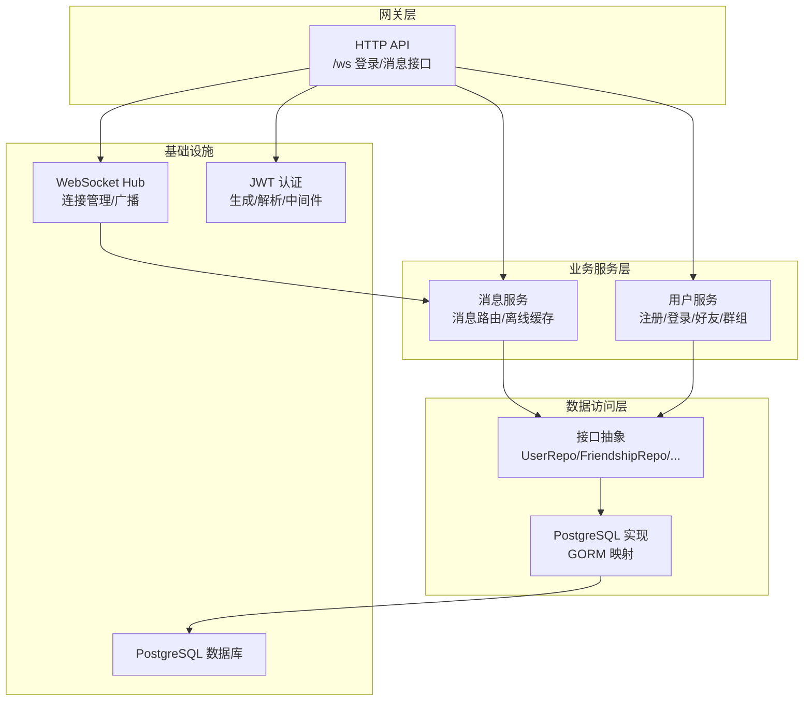
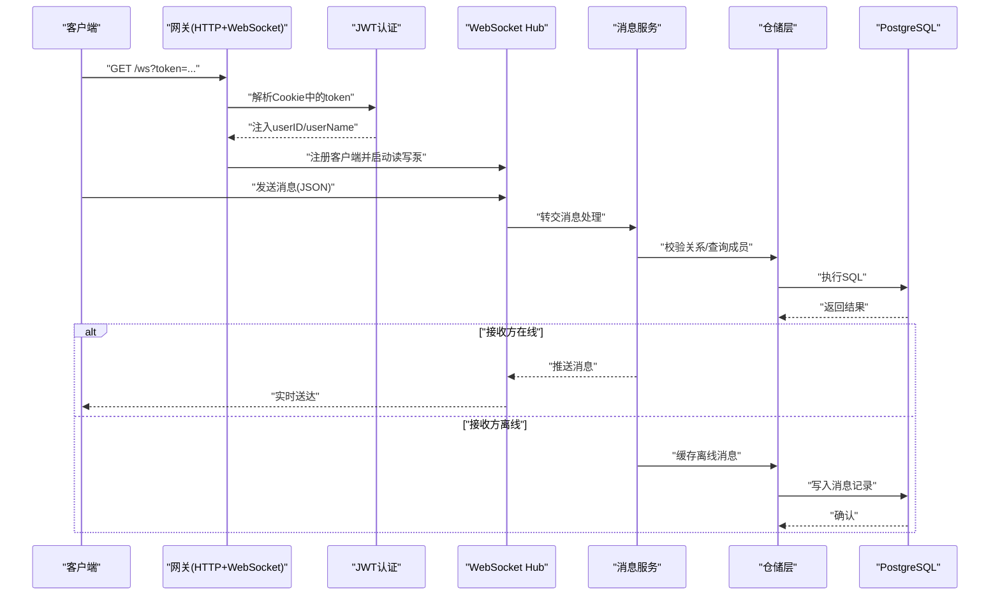
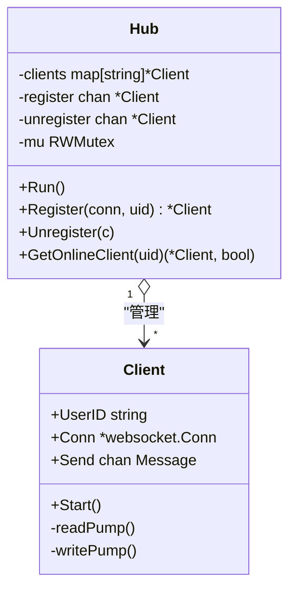
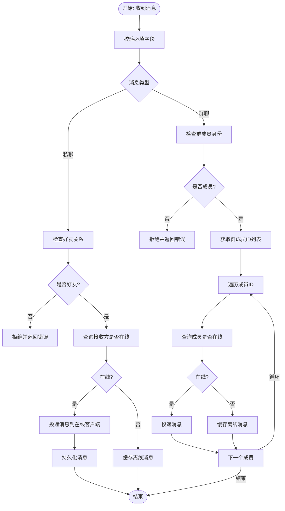
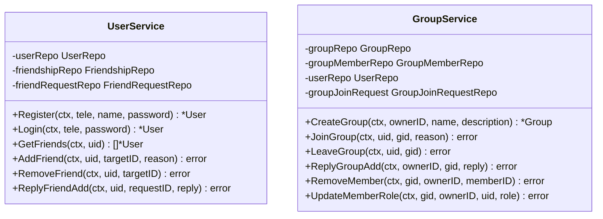
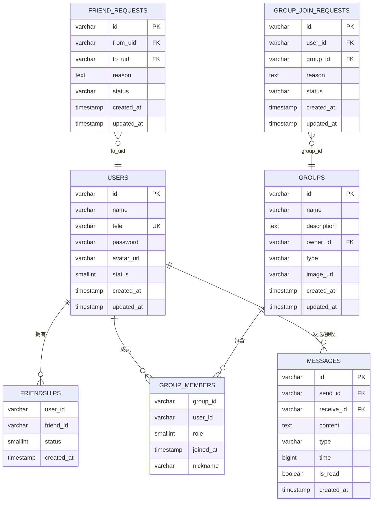
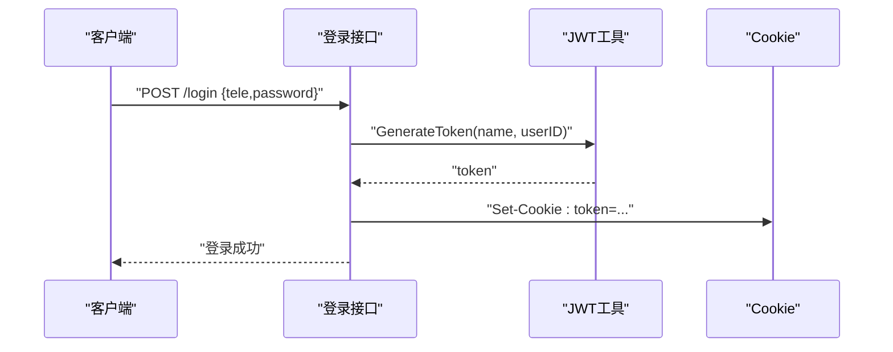
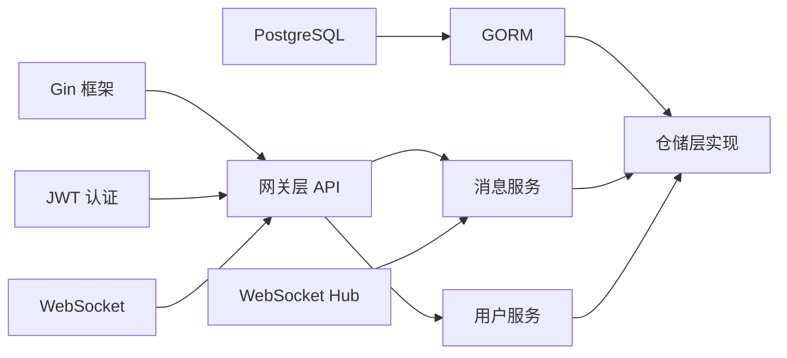

# 项目概述

<cite>
**本文档引用的文件**
- [main.txt](file://main.txt)
- [go.mod](file://go.mod)
- [server/gateway/api/ws_handler.go](file://server/gateway/api/ws_handler.go)
- [server/gateway/api/message_handler.go](file://server/gateway/api/message_handler.go)
- [server/gateway/api/user_handler.go](file://server/gateway/api/user_handler.go)
- [server/gateway/auth/auth.go](file://server/gateway/auth/auth.go)
- [server/model/models.go](file://server/model/models.go)
- [server/msgservice/hub/hub.go](file://server/msgservice/hub/hub.go)
- [server/msgservice/hub/client.go](file://server/msgservice/hub/client.go)
- [server/msgservice/message_service.go](file://server/msgservice/message_service.go)
- [server/userservice/user_service.go](file://server/userservice/user_service.go)
- [server/userservice/group_service.go](file://server/userservice/group_service.go)
- [server/repository/interface.go](file://server/repository/interface.go)
- [server/repository/postgres/init.go](file://server/repository/postgres/init.go)
- [server/repository/postgres/handler.go](file://server/repository/postgres/handler.go)
</cite>

## 目录
1. [引言](#引言)
2. [项目结构](#项目结构)
3. [核心组件](#核心组件)
4. [架构总览](#架构总览)
5. [详细组件分析](#详细组件分析)
6. [依赖关系分析](#依赖关系分析)
7. [性能考虑](#性能考虑)
8. [故障排除指南](#故障排除指南)
9. [结论](#结论)
10. [附录](#附录)

## 引言
本项目是一个基于 Go 语言的即时通讯（IM）系统，目标是提供实时双向通信能力，支持私聊与群聊、用户认证与授权、离线消息存储与投递、在线状态查询等核心功能。系统采用分层架构设计，结合 Gin Web 框架、WebSocket 实时通道、JWT 认证、GORM ORM 与 PostgreSQL 数据持久化，形成高内聚、低耦合的服务体系。

项目具备以下特性：
- 实时通信：通过 WebSocket 提供全双工通信，支持心跳保活与异常处理。
- 用户认证：基于 JWT 的 Cookie 令牌机制，配合 Gin 中间件实现统一鉴权。
- 消息路由：根据消息类型（私聊/群聊）进行精准路由，优先在线投递，失败则缓存至数据库。
- 数据模型：以 GORM 定义用户、好友、群组、消息及请求等实体，自动迁移与索引优化。
- 可扩展性：通过接口抽象仓储层，便于替换数据源或引入消息队列。

## 项目结构
项目采用按职责分层与按功能模块划分相结合的组织方式：
- server：后端服务主体
  - gateway：网关层，负责 HTTP 接口与 WebSocket 升级
  - model：领域模型与错误定义
  - msgservice：消息服务，负责消息路由、离线缓存与在线状态查询
  - userservice：用户服务，负责注册、登录、好友与群组管理
  - repository：数据访问层，提供接口与 PostgreSQL 实现
  - mq：消息队列接口（预留）
- client：前端或客户端示例（预留）
- go.mod/go.sum：依赖管理

图表来源
- [server/gateway/api/ws_handler.go:39-68](file://server/gateway/api/ws_handler.go#L39-L68)
- [server/gateway/api/message_handler.go:19-44](file://server/gateway/api/message_handler.go#L19-L44)
- [server/gateway/api/user_handler.go:39-61](file://server/gateway/api/user_handler.go#L39-L61)
- [server/msgservice/message_service.go:12-25](file://server/msgservice/message_service.go#L12-L25)
- [server/repository/interface.go:8-55](file://server/repository/interface.go#L8-L55)
- [server/repository/postgres/handler.go:13-19](file://server/repository/postgres/handler.go#L13-L19)
- [server/msgservice/hub/hub.go:10-25](file://server/msgservice/hub/hub.go#L10-L25)

章节来源
- [go.mod:1-51](file://go.mod#L1-L51)
- [server/gateway/api/ws_handler.go:1-69](file://server/gateway/api/ws_handler.go#L1-L69)
- [server/gateway/api/message_handler.go:1-66](file://server/gateway/api/message_handler.go#L1-L66)
- [server/gateway/api/user_handler.go:1-206](file://server/gateway/api/user_handler.go#L1-L206)
- [server/gateway/auth/auth.go:1-91](file://server/gateway/auth/auth.go#L1-L91)
- [server/model/models.go:1-146](file://server/model/models.go#L1-L146)
- [server/msgservice/hub/hub.go:1-61](file://server/msgservice/hub/hub.go#L1-L61)
- [server/msgservice/hub/client.go:1-88](file://server/msgservice/hub/client.go#L1-L88)
- [server/msgservice/message_service.go:1-168](file://server/msgservice/message_service.go#L1-L168)
- [server/userservice/user_service.go:1-187](file://server/userservice/user_service.go#L1-L187)
- [server/userservice/group_service.go:1-217](file://server/userservice/group_service.go#L1-L217)
- [server/repository/interface.go:1-74](file://server/repository/interface.go#L1-L74)
- [server/repository/postgres/init.go:1-75](file://server/repository/postgres/init.go#L1-L75)
- [server/repository/postgres/handler.go:1-585](file://server/repository/postgres/handler.go#L1-L585)

## 核心组件
- 网关层（Gateway）
  - WebSocket 升级与跨域控制：在网关层完成 WebSocket 协议升级与来源校验。
  - HTTP API：提供注册、登录、消息发送、离线消息查询、在线状态查询、好友与群组管理等接口。
  - JWT 鉴权：从 Cookie 读取 token，解析并注入用户信息到上下文。
- 消息服务（MessageService）
  - 路由逻辑：根据消息类型（私聊/群聊）进行路由；私聊需验证好友关系；群聊需验证成员身份。
  - 在线投递：优先向 Hub 中在线客户端投递；投递失败或客户端不在线则缓存至数据库。
  - 离线消息：提供查询与批量标记已读能力。
  - 在线状态：基于 Hub 查询好友在线列表。
- 用户服务（UserService/GroupService）
  - 用户：注册（密码哈希）、登录（密码校验）、好友关系维护、好友请求处理。
  - 群组：创建、加入/退出、成员角色管理、群组请求处理。
- 数据访问层（Repository）
  - 接口抽象：UserRepo、FriendshipRepo、GroupRepo、GroupMemberRepo、MessageRepo、FriendRequestRepo、GroupJoinRequestRepo。
  - PostgreSQL 实现：基于 GORM 的 CRUD、联表查询、批量操作与索引优化。
- 基础设施
  - WebSocket Hub：集中管理客户端连接，提供注册/注销与广播能力。
  - JWT 认证：生成与解析 token，中间件统一拦截校验。
  - 数据库初始化：加载环境变量配置，建立连接池，自动迁移模型。

章节来源
- [server/gateway/api/ws_handler.go:39-68](file://server/gateway/api/ws_handler.go#L39-L68)
- [server/gateway/api/message_handler.go:19-44](file://server/gateway/api/message_handler.go#L19-L44)
- [server/gateway/api/user_handler.go:39-61](file://server/gateway/api/user_handler.go#L39-L61)
- [server/gateway/auth/auth.go:22-61](file://server/gateway/auth/auth.go#L22-L61)
- [server/msgservice/message_service.go:27-108](file://server/msgservice/message_service.go#L27-L108)
- [server/msgservice/hub/hub.go:44-60](file://server/msgservice/hub/hub.go#L44-L60)
- [server/userservice/user_service.go:27-116](file://server/userservice/user_service.go#L27-L116)
- [server/userservice/group_service.go:27-96](file://server/userservice/group_service.go#L27-L96)
- [server/repository/interface.go:8-55](file://server/repository/interface.go#L8-L55)
- [server/repository/postgres/handler.go:29-107](file://server/repository/postgres/handler.go#L29-L107)

## 架构总览
系统采用“网关-服务-仓储-数据库”的分层架构，强调职责分离与可测试性。WebSocket Hub 作为实时通信中枢，消息服务负责业务路由与投递策略，用户服务处理社交关系与群组生命周期，仓储层屏蔽底层数据源差异。

图表来源
- [server/gateway/api/ws_handler.go:39-68](file://server/gateway/api/ws_handler.go#L39-L68)
- [server/gateway/auth/auth.go:37-61](file://server/gateway/auth/auth.go#L37-L61)
- [server/msgservice/hub/client.go:31-59](file://server/msgservice/hub/client.go#L31-L59)
- [server/msgservice/message_service.go:27-108](file://server/msgservice/message_service.go#L27-L108)
- [server/repository/postgres/handler.go:335-340](file://server/repository/postgres/handler.go#L335-L340)

## 详细组件分析

### WebSocket Hub 组件
- Hub：维护在线客户端映射，提供注册/注销与广播入口；内部使用互斥锁保证并发安全。
- Client：封装连接、发送通道与读写泵；内置心跳保活、异常关闭处理与消息解包。
- 关键流程：客户端连接后注册到 Hub，启动读写协程；读取到消息后交由上层服务处理；写入通道收到消息即推送。

图表来源
- [server/msgservice/hub/hub.go:10-61](file://server/msgservice/hub/hub.go#L10-L61)
- [server/msgservice/hub/client.go:12-88](file://server/msgservice/hub/client.go#L12-L88)

章节来源
- [server/msgservice/hub/hub.go:1-61](file://server/msgservice/hub/hub.go#L1-L61)
- [server/msgservice/hub/client.go:1-88](file://server/msgservice/hub/client.go#L1-L88)

### 消息服务组件
- 路由策略：私聊需验证双方为好友；群聊需验证发送者为群成员；否则拒绝投递。
- 投递优先级：在线直接推送，成功则标记已读并持久化；失败或离线则缓存离线消息。
- 离线消息：支持查询与批量标记已读，减少重复投递。
- 在线状态：基于 Hub 查询好友在线列表，用于 UI 展示。

图表来源
- [server/msgservice/message_service.go:27-108](file://server/msgservice/message_service.go#L27-L108)
- [server/msgservice/hub/hub.go:55-60](file://server/msgservice/hub/hub.go#L55-L60)

章节来源
- [server/msgservice/message_service.go:1-168](file://server/msgservice/message_service.go#L1-L168)

### 用户与群组服务组件
- 用户服务：注册（密码哈希）、登录（密码校验）、好友关系维护、好友请求处理（同意/拒绝）。
- 群组服务：创建群组（默认拥有者为创建者）、加入/退出群组、成员角色管理（普通/管理员/群主）、群组请求处理。

图表来源
- [server/userservice/user_service.go:13-25](file://server/userservice/user_service.go#L13-L25)
- [server/userservice/group_service.go:11-25](file://server/userservice/group_service.go#L11-L25)

章节来源
- [server/userservice/user_service.go:1-187](file://server/userservice/user_service.go#L1-L187)
- [server/userservice/group_service.go:1-217](file://server/userservice/group_service.go#L1-L217)

### 数据模型与仓储层
- 数据模型：定义用户、好友关系、群组、群成员、消息、好友请求、群组请求等实体，含索引与关联关系。
- 仓储接口：统一抽象 CRUD 与复杂查询，便于替换实现。
- PostgreSQL 实现：基于 GORM 的结构化映射、联表查询、批量操作与事务支持。

图表来源
- [server/model/models.go:23-146](file://server/model/models.go#L23-L146)
- [server/repository/postgres/handler.go:13-19](file://server/repository/postgres/handler.go#L13-L19)

章节来源
- [server/model/models.go:1-146](file://server/model/models.go#L1-L146)
- [server/repository/interface.go:1-74](file://server/repository/interface.go#L1-L74)
- [server/repository/postgres/handler.go:1-585](file://server/repository/postgres/handler.go#L1-L585)

### 认证与授权组件
- JWT 生成：设置过期时间、签发时间与声明，使用 HS256 签名。
- 中间件：从 Authorization 头解析 Bearer Token，校验签名与有效期，注入用户标识到上下文。
- Cookie 令牌：登录成功后设置 SameSite Cookie，用于后续 WebSocket 连接鉴权。

图表来源
- [server/gateway/api/user_handler.go:39-61](file://server/gateway/api/user_handler.go#L39-L61)
- [server/gateway/auth/auth.go:22-34](file://server/gateway/auth/auth.go#L22-L34)

章节来源
- [server/gateway/auth/auth.go:1-91](file://server/gateway/auth/auth.go#L1-L91)
- [server/gateway/api/user_handler.go:1-206](file://server/gateway/api/user_handler.go#L1-L206)

## 依赖关系分析
- 技术栈选择
  - Gin：高性能 Web 框架，提供路由、中间件与 JSON 响应能力，适配 REST API 场景。
  - WebSocket：gorilla/websocket 提供标准协议支持，配合 Hub 实现多路复用与心跳保活。
  - JWT：golang-jwt/jwt/v5 实现声明式认证，Cookie 传递，降低跨域与 CORS 复杂度。
  - GORM：提供 ORM 能力与 PostgreSQL 驱动，简化数据库建模与查询。
  - PostgreSQL：稳定的关系型数据库，支持事务与索引优化，满足消息与社交关系存储需求。
- 内部依赖
  - 网关层依赖认证与消息/用户服务；消息服务依赖仓储接口；仓储接口依赖 GORM 实现；Hub 与 WebSocket 协议集成。

图表来源
- [go.mod:5-12](file://go.mod#L5-L12)
- [server/gateway/api/ws_handler.go:3-12](file://server/gateway/api/ws_handler.go#L3-L12)
- [server/gateway/auth/auth.go:3-12](file://server/gateway/auth/auth.go#L3-L12)
- [server/repository/postgres/init.go:42-65](file://server/repository/postgres/init.go#L42-L65)

章节来源
- [go.mod:1-51](file://go.mod#L1-L51)
- [server/repository/postgres/init.go:1-75](file://server/repository/postgres/init.go#L1-L75)

## 性能考虑
- 连接管理
  - Hub 使用互斥锁保护客户端映射，避免并发读写冲突；建议在高并发场景下评估读写锁粒度与分区策略。
- 消息投递
  - 在线投递采用带缓冲的发送通道，避免阻塞；离线缓存采用批量写入，减少数据库压力。
- 数据库优化
  - 模型中为常用查询字段建立索引（如 send_id/receive_id/type/time），提升查询效率。
  - 连接池参数（最大空闲/活跃连接数、最大生命周期）需结合 QPS 调优。
- 网络与协议
  - WebSocket 心跳间隔与超时设置需平衡保活与资源消耗；建议启用压缩与限流策略。

## 故障排除指南
- WebSocket 升级失败
  - 检查来源校验与错误日志；确认客户端与服务端版本兼容。
- 认证失败
  - 核对 Cookie 是否正确设置与携带；确认 token 未过期且签名有效。
- 消息未送达
  - 确认接收方是否在线；若离线，检查离线消息是否成功写入数据库。
- 数据库连接问题
  - 校验环境变量配置与网络连通性；查看连接池状态与慢查询日志。

章节来源
- [server/gateway/api/ws_handler.go:14-28](file://server/gateway/api/ws_handler.go#L14-L28)
- [server/gateway/auth/auth.go:64-90](file://server/gateway/auth/auth.go#L64-L90)
- [server/repository/postgres/init.go:42-65](file://server/repository/postgres/init.go#L42-L65)

## 结论
本项目通过清晰的分层架构与模块化设计，实现了从认证、实时通信到消息路由与数据持久化的完整 IM 能力。依托 Gin、WebSocket、JWT、GORM 与 PostgreSQL 等成熟技术栈，系统具备良好的可维护性与扩展性。建议在生产环境中进一步完善监控、限流与安全加固，并根据业务规模调整数据库与 Hub 的并发策略。

## 附录
- 基本使用场景
  - 私聊：登录后通过 WebSocket 发送私聊消息，对方在线即时送达，离线则缓存。
  - 群聊：加入群组后，消息广播给所有成员，未读消息可事后查询。
  - 好友管理：发起添加好友请求，对方同意后建立好友关系，可查询在线状态。
  - 群组管理：创建群组并邀请成员，支持角色管理与请求审批。
- 应用价值
  - 为企业协作、客服系统、社交应用提供可靠的消息基础设施。
  - 通过模块化设计与接口抽象，便于快速迭代与二次开发。